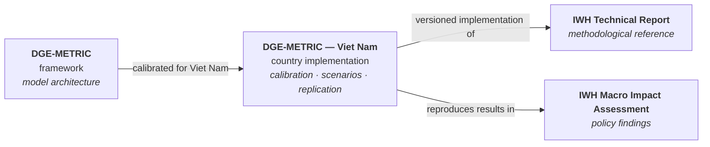
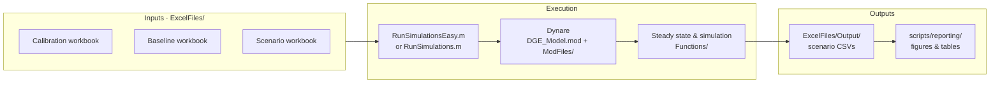

# DGE-METRIC — Viet Nam

**Dynamic General Equilibrium for Macroeconomic Energy Transition Incorporating Carbon Markets:
calibrated Viet Nam implementation**

[](LICENSE)
[](CITATION.cff)
[](docs/reference/running.md#requirements)
[](docs/reference/running.md#setup)
[](https://github.com/schultkr/DGE-METRIC-VietNam/actions/workflows/repository-checks.yml)

> **Part of the DGE-METRIC model family.**
> This repository is the **country implementation for Viet Nam**: calibrated inputs, scenarios,
> replication workflows, training material, and report-linked outputs.
> The common model architecture is maintained in the framework repository
> **[DGE-METRIC](https://github.com/schultkr/DGE-METRIC)** (currently private).

**[Quick start](#quick-start)** · **[Documentation](docs/index.md)** ·
**[Technical Report](docs/reports/IWH_Technical_Report.md)** ·
**[Reproduce a report figure](docs/reference/report_replication.md)** · **[Cite](#citation)**

DGE-METRIC is a five-sector, one-region dynamic general equilibrium model of Viet Nam's economy
(2026–2050). It simulates the macroeconomic and sectoral impacts of alternative climate and
energy-transition pathways, green-finance instruments, and carbon pricing. The model is written in
**Dynare** (`.mod`) and solved with **MATLAB** steady-state, calibration, and simulation routines
fed by curated **Excel** inputs.

## The DGE-METRIC model family

| Repository | Role |
|---|---|
| [**DGE-METRIC**](https://github.com/schultkr/DGE-METRIC) | Framework: common modelling architecture, reusable components, methodological implementation |
| **DGE-METRIC — Viet Nam** (this repository) | Country implementation: Viet Nam calibration, scenarios, replication workflows, training, report outputs |



This repository is the public, operational companion to two GIZ/IWH reports:

- **[IWH Technical Report](docs/reports/IWH_Technical_Report.md)**: model structure,
  calibration, data sources, solution method, and scenario design. This is the stable
  methodological reference.
- **[IWH Macro Impact Assessment](docs/reports/IWH_Report_Macro_Impact_Assessment.md)**:
  policy findings on energy efficiency, green finance, and carbon pricing.

## Quick start

**Requirements:** MATLAB R2020a or newer; Dynare 7.0 (preferred) or 6.1; Microsoft Excel on
Windows for the workbook-maintenance scripts. See
[Running the model](docs/reference/running.md) for details.

**1. First run: use `RunSimulationsEasy` (recommended).** Open MATLAB in the repository root:

```matlab
RunSimulationsEasy
```

It checks your MATLAB/Dynare environment and the input workbooks before running anything,
reports problems as actionable errors instead of a mid-run crash, and then runs `Baseline` and `NZ`.

**2. Full report reproduction.** Once the environment is confirmed:

```matlab
setup_paths
RunSimulations
```

`RunSimulations.m` runs the `ReportReplication` scenario group (18 scenarios) by default. This is a
long run. To run a subset, use the `DGE_SCENARIO_GROUPS` / `DGE_SCENARIO_NAMES` overrides
described in [Running the model](docs/reference/running.md#scenario-groups).

If Dynare is not installed under `C:\dynare\<version>`, set `DGE_DYNARE_PATH` to the folder
containing `dynare.m` before calling `setup_paths`. All `DGE_*` variables are listed in
[Running the model](docs/reference/running.md#environment-variables).

### How a run flows



## Reproducing the reports

- **[Report replication guide](docs/reference/report_replication.md)** maps every figure and
  table in both reports to the exact scenario, script, and output file that produces it.
- **[Reproducibility checklist](docs/reference/reproducibility_checklist.md)** is the
  run-validation template to fill in and archive with a reproduction run.

Record the repository commit (or release tag), the MATLAB and Dynare versions, and all `DGE_*`
environment variables with every archived run.

## Documentation

**New to the model?**
- [What is DGE-METRIC?](docs/overview.md): plain-language overview, agent structure, policy questions
- [Viet Nam energy transition context](docs/vietnam_context.md): PDP8, net-zero targets, financing gap
- [Scenarios at a glance](docs/scenarios_overview.md): all scenario families in one table

**Use cases with results:**
- [Energy Efficiency scenarios](docs/use_cases_ee.md): `EE_Dir10_full(_NoBESS)`, `EE_RTS_prerev_95GW`
- [Green Finance scenarios](docs/use_cases_finance.md): `GF_A/B/C`, WACC and GDP effects

**Technical reference** ([full index](docs/index.md)):
- [Model architecture](docs/reference/model.md) · [Scenario design](docs/reference/scenario.md) ·
  [Calibration](docs/reference/calibration.md) · [Running the model](docs/reference/running.md) ·
  [Data sources](docs/reference/data_sources.md)

## Repository structure

| Path | Contents |
|---|---|
| `RunSimulationsEasy.m` | **Recommended entry point**: guided run with environment checks |
| `RunSimulations.m`, `setup_paths.m` | Full scenario batch runner; MATLAB/Dynare path setup |
| `DGE_Model.mod`, `DGE_Model_steadystate.m` | Canonical Dynare model; steady-state dispatcher |
| `ModFiles/` | Hand-maintained Dynare declarations, parameters, and equations (`Equations/`, with a readable mirror in `Equations/Equations_display/`) |
| `Functions/` | MATLAB implementation: calibration and steady state, Excel I/O, model setup, diagnostics, plotting, welfare |
| `ExcelFiles/` | Calibration, baseline, and scenario workbooks and `ScenarioPathDefinition.xlsx`; `Output/` holds generated results |
| `scripts/` | `analysis/`, `maintenance/` (workbook rebuilds), `reporting/` (figures and tables), `ci/` (repository checks) |
| `docs/` | Documentation hub ([index](docs/index.md)); `reports/` holds both IWH reports; `maintenance/` holds repository–report alignment records |
| `Figures/` | Baseline validation charts from `scripts/reporting/display_baseline_energy.m` |
| `Training/` | Standalone teaching material (RBC replication, toy Dynare model); not on the production run path |

**Generated content is never hand-edited and not tracked:** `+DGE_Model/`, `DGE_Model/`,
`*_dynamic.m`, `*_static.m`, `DGE_Model.log`, `ExcelFiles/Output/`, `*.mat`. See
[REPO_STRUCTURE.md](REPO_STRUCTURE.md) for the source-vs-generated policy.

## Contributing and maintenance

Read [CONTRIBUTING.md](CONTRIBUTING.md) before changing anything. Every change is classified by its
**Technical Report impact**, and the
[repository–report consistency matrix](docs/maintenance/report_repository_consistency.md) records
where the code and the report must agree. Changes are listed in [CHANGELOG.md](CHANGELOG.md).

## Citation

See [CITATION.cff](CITATION.cff). Quick reference:

> Schult, C. (2026). *DGE-METRIC: Dynamic General Equilibrium for Macroeconomic Energy Transition
> Incorporating Carbon Markets*. Viet Nam implementation. Halle Institute for Economic Research
> (IWH). https://github.com/schultkr/DGE-METRIC-VietNam

Developed under a joint [GIZ](https://www.giz.de)–[IWH](https://www.iwh-halle.de) research project
supporting Viet Nam's energy and climate policy dialogue.

## License

[MIT License](LICENSE).
