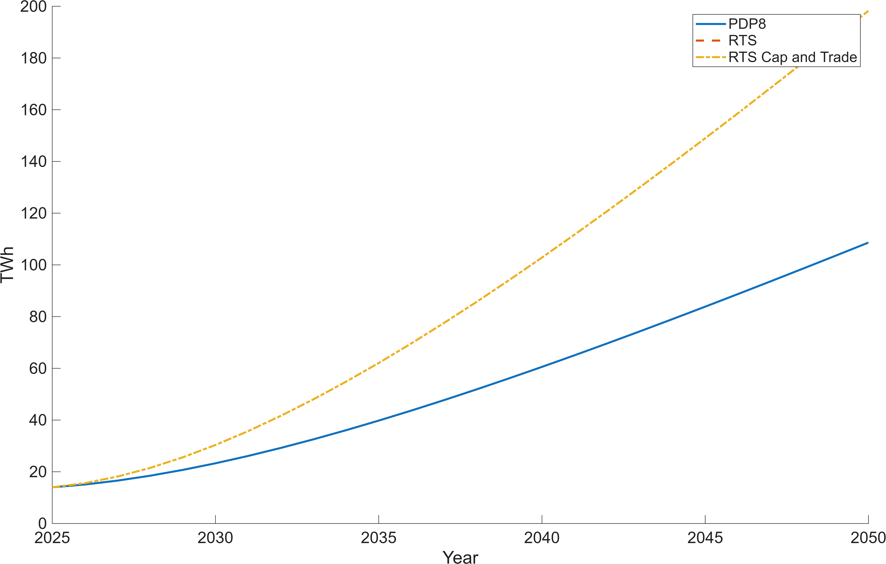
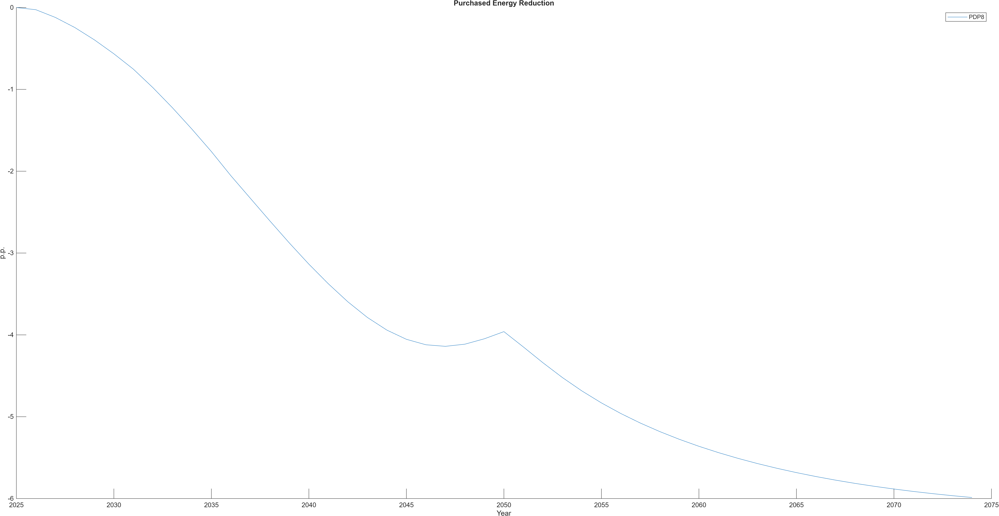
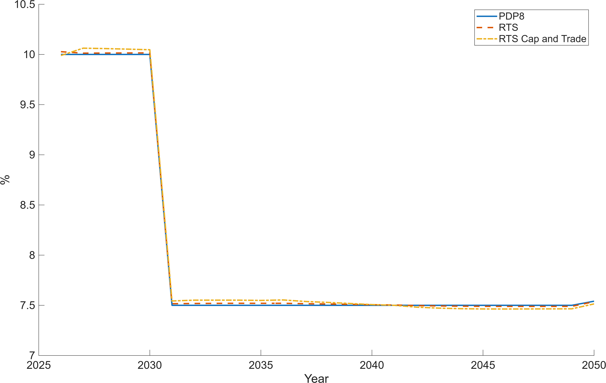
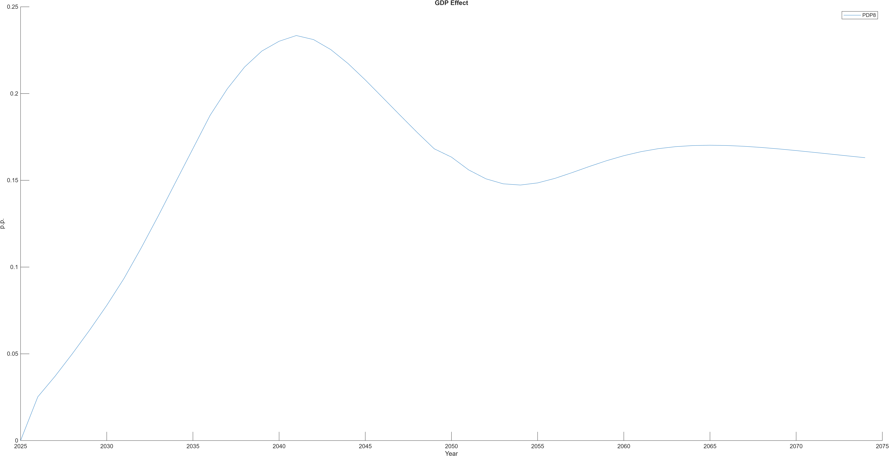
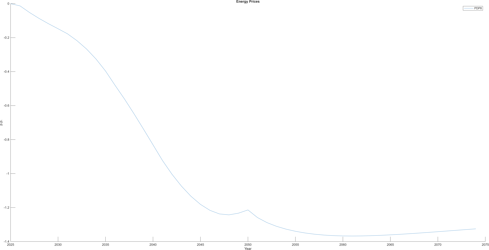

# Viet Nam – Rooftop PV and Grid Demand Reduction  
## Calibration Note for DGE Scenario Design

---

## 1. Rooftop PV today: contribution to final energy demand

Rooftop solar (RTS) photovoltaic systems already make a measurable contribution to Vietnam’s final energy demand by directly supplying electricity services behind the meter and thereby reducing grid purchases.

As of end-2024:

- **Installed rooftop PV capacity:** ~9.5 GW  
- Estimated annual generation: ~14 TWh  
- National electricity consumption (2023): 277.5 TWh  
- Total final energy consumption (TFEC): ~874 TWh (all fuels)

### Current contribution

| Indicator | Value | Interpretation |
|------------|--------|----------------|
| RTS generation | ~14 TWh/year | Electricity produced behind-the-meter |
| Share of electricity demand | ~5% | 14 / 277.5 |
| Share of total final energy demand | ~1.6% | 14 / 874 |

Thus, rooftop PV currently reduces **grid-supplied electricity demand by roughly 5% annually**, and accounts for approximately **1.6% of Vietnam’s total final energy consumption**.

In a DGE context, this implies that initial calibration should set rooftop PV to cover approximately **1.6% of final energy demand** in the base year.

---

## 2. Macroeconomic magnitude: value of installed rooftop solar panels

Instead of measuring RTS relative to GDP via annual electricity value, we approximate the **capital value of installed rooftop solar panels** and compare it to GDP and annual investment.

### Assumptions

- Installed RTS capacity: 9.5 GW  
- Investment cost per kW (all-in rooftop system cost): ~800 USD/kW  
  (Conservative estimate consistent with recent ASEAN residential/commercial PV costs)
  

  

- 
### Total capital value of installed rooftop PV

$9.5 \text{ GW} = 9.5 \times 10^6 \text{ kW}$

$9.5 \times 10^6 \times 800 \approx 7.6 \text{ billion USD}$

### Relative to GDP

Vietnam GDP ≈ 430 billion USD.

$7.6 / 430 \approx 1.8\%$

Thus, the installed rooftop PV capital stock corresponds to roughly:

> **~1.8% of GDP**

## 3. PDP8 expansion trajectory (10× rooftop PV)

Vietnam’s Power Development Plan 8 (PDP8) foresees a substantial expansion of rooftop solar capacity.

Relative to the current ~9.5 GW installed base, PDP8 implies approximately:

> **A tenfold increase in rooftop PV capacity**

This corresponds to:

- ~95 GW rooftop PV  
- ~140 TWh annual generation (at unchanged capacity factor)

At current electricity demand levels: $140 / 277.5 \approx 50\%$

Under this scaling, rooftop PV could offset roughly **half of today’s grid electricity demand** (abstracting from demand growth and curtailment).

## 3. Extended scenario: 20× rooftop PV expansion

For stress-testing energy transition pathways, we simulate an even more ambitious rollout:

> **20× expansion relative to today**

This implies:

- ~190 GW rooftop PV  
- ~280 TWh annual generation  

At current electricity demand levels: $280 / 277.5 \approx 100\%$

This scale would approximately match today’s entire electricity consumption on an annual basis.

## 5. Implications for DGE modeling

In the model, rooftop PV should:

1. Increase effective electricity services:
   $Q_E^{eff} = Q_E^{grid} + Q_{PV}$

2. Reduce grid demand one-for-one (annual accounting approximation):
   $Q_E^{grid} = Q_E^{eff} - Q_{PV}$

3. Enter as a capital stock in the economy:
   $K_{PV,t+1} = (1-\delta_{PV})K_{PV,t} + I_{PV,t}$

This ensures:
- Proper resource constraint treatment  
- Explicit capital accumulation  
- Transparent investment requirements for transition scenarios  

---

## 6. Simulation results: PDP8 vs. accelerated RTS rollout (2× faster)

We simulate two rooftop PV (RTS) deployment pathways:

- **PDP8 RTS pathway (baseline policy trajectory):** rooftop PV expands as implied by PDP8, i.e., approximately a **10× increase** relative to today’s installed base.
- **Accelerated RTS pathway (alternative):** rooftop PV expands **twice as fast as PDP8**. Operationally, this means the RTS capacity (or generation) path reaches each intermediate PDP8 milestone in **half the time**, and reaches **~20×** of today’s base by the end of the rollout horizon.

### 6.1 Scenario implementation in the model

In the model, rooftop PV enters as:
- a **capital stock** (panels) accumulated via investment `I_PV,t`,
- producing **behind-the-meter electricity** `Q_PV,t`,
- reducing **grid purchases** one-for-one for a given electricity-services demand:
  \[
  Q_E^{eff} = Q_E^{grid} + Q_{PV}
  \quad \Rightarrow \quad
  Q_E^{grid} = Q_E^{eff} - Q_{PV}
  \]

We implement the two scenarios by imposing **exogenous paths** for either:
- **RTS capacity** `K_PV,t` (preferred if you explicitly model PV capital), and deriving `Q_PV,t`, or
- **RTS generation** `Q_PV,t` directly (simpler calibration to TWh).

> **Recommendation:** Use `K_PV,t` (capital) as the state, and let `Q_PV,t = A_PV * K_PV,t` where `A_PV` is an effective utilization / productivity mapping calibrated to match the TWh numbers in Appendix A2.

---

### 6.2 Key outcomes to report

We report results as deviations from the baseline (no additional RTS rollout beyond current) and compare:

1. **Grid electricity output and demand**
   - Grid electricity production `Y_E`
   - Grid electricity purchases `Q_E^grid`
   - Effective electricity services `Q_E^eff`

2. **Investment and capital allocation**
   - RTS investment `I_PV`
   - Total investment `I`
   - Crowding-in/out effects on other sectoral investment

3. **Macroeconomic aggregates**
   - GDP (level or % deviation)
   - Consumption
   - Real wages / employment (if available)

4. **Prices and welfare (if modeled)**
   - Electricity price (grid)
   - CPI / inflation
   - Equivalent variation / welfare measure (optional)

---

### 6.3 Figures

Add the following plots to visually compare the two rollout paths:

- **Figure 1:** Rooftop PV generation `Q_PV` (TWh) — PDP8 vs Fast  
- **Figure 2:** Energy purchases `Q_E^Market` (TWh) — PDP8 vs Fast  
- **Figure 3:** RTS investment `I_PV` (% of GDP or bn USD) — PDP8 vs Fast  
- **Figure 4:** GDP deviation from baseline (%) — PDP8 vs Fast  
- **Figure 5:** Energy price deviation (%) — PDP8 vs Fast (if applicable)

> **Markdown placeholders for figures (replace file paths):**

- 
- 
- 
- 
- 

---

### 6.5 Interpretation (short narrative template)

**Grid demand effects.**  
Under PDP8, RTS reduces grid electricity purchases gradually as `Q_PV` ramps up. Under the accelerated RTS pathway, the reduction happens earlier and more strongly, shifting demand away from the grid faster.

**Macroeconomic effects.**  
The accelerated rollout increases near-term investment demand in PV capital, which can raise total investment and affect sectoral capital allocation. Depending on financing and adjustment costs, the model may show either short-run crowding-out or productivity-driven crowding-in effects.

**Electricity sector and prices.**  
Faster behind-the-meter supply reduces grid sales and can lower the equilibrium electricity price and grid output, with implications for generation investment, fiscal flows (if the grid is state-owned), and the transition dynamics of the power sector.

---

## Appendix extension: scenario path definition (optional)

If you implement “2× faster than PDP8” as a **time-compression** of the PDP8 path:

Let `Q_PV^{PDP8}(t)` be the PDP8 RTS generation path. Then define:

\[
Q_PV^{Fast}(t) = Q_PV^{PDP8}(2t)
\]

(with appropriate truncation at the terminal year, and optionally setting the terminal level to **20×** of today).

Alternatively, if you implement directly via terminal scaling:

- PDP8 terminal: `Q_PV(T) = 10 × Q_PV(0)`
- Fast terminal: `Q_PV(T) = 20 × Q_PV(0)`

and choose a steeper ramp (e.g., higher growth rate or shorter adjustment half-life).

# Appendix: Derivation of All Numbers

---

## A1. Converting TFEC to TWh

Given:
- TFEC (2023) = 75,122 ktoe  
- 1 toe = 11.63 MWh  
- 1 ktoe = 11.63 GWh  

\[
TFEC (TWh) = 75,122 \times 11.63 / 1000
\]

\[
\approx 874 \text{ TWh}
\]

---

## A2. Rooftop PV generation from installed capacity

Formula:

$E_{PV} = \text{Capacity (GW)} \times 8.76 \times CF$

Assume:
- Capacity factor CF = 0.17  

$1 \text{ GW} \rightarrow 8.76 \times 0.17 = 1.49 \text{ TWh/year}$

### Current:
$9.5 \times 1.49 \approx 14.1 \text{ TWh}$

---

## A3. Share calculations

Electricity demand:

$14 / 277.5 \approx 5.1\%$

Total final energy:

$14 / 874 \approx 1.6\%$

---

## A4. Capital stock valuation

$\text{Capital value} = \text{Capacity (kW)} \times \text{Cost per kW}$

$9.5 \times 10^6 \times 800 = 7.6 \text{ billion USD}$

---

## A5. 10× and 20× expansion

| Scenario | Capacity (GW) | TWh/year | Capital (bn USD) |
|------------|---------------|----------|-------------------|
| Today | 9.5 | 14 | 7.6 |
| 10× | 95 | 140 | 76 |
| 20× | 190 | 280 | 152 |

All generation calculated with CF = 0.17 and capital cost = 800 USD/kW.
