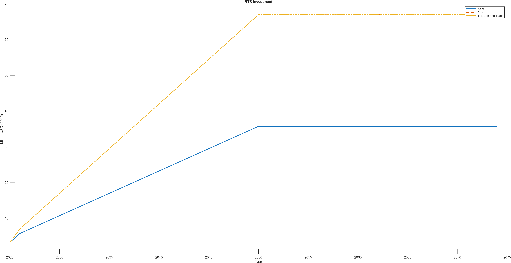
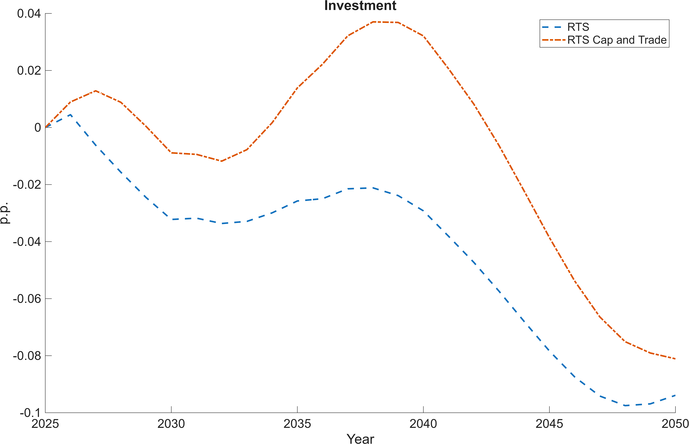
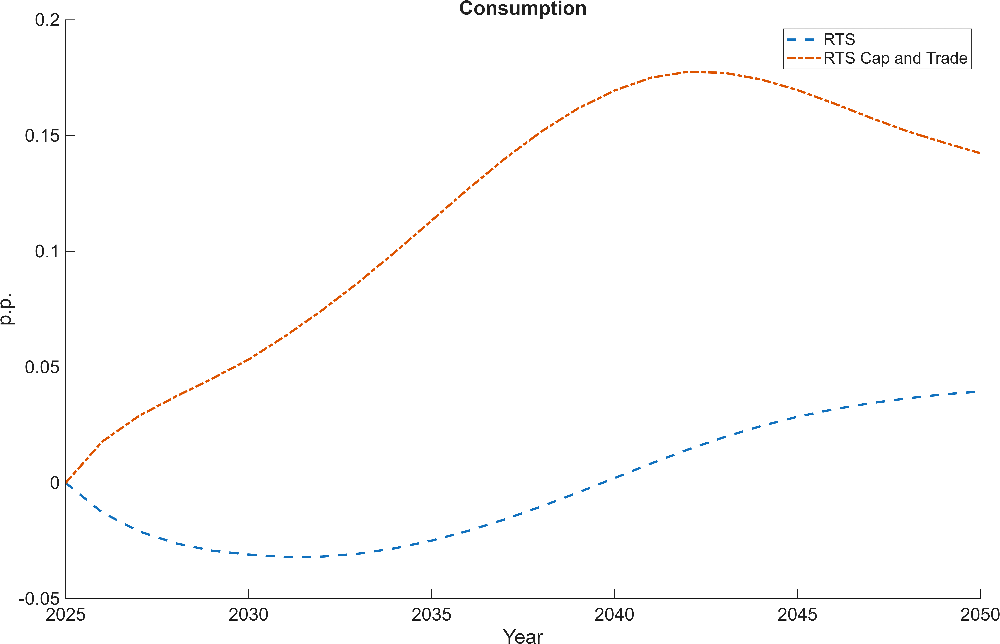
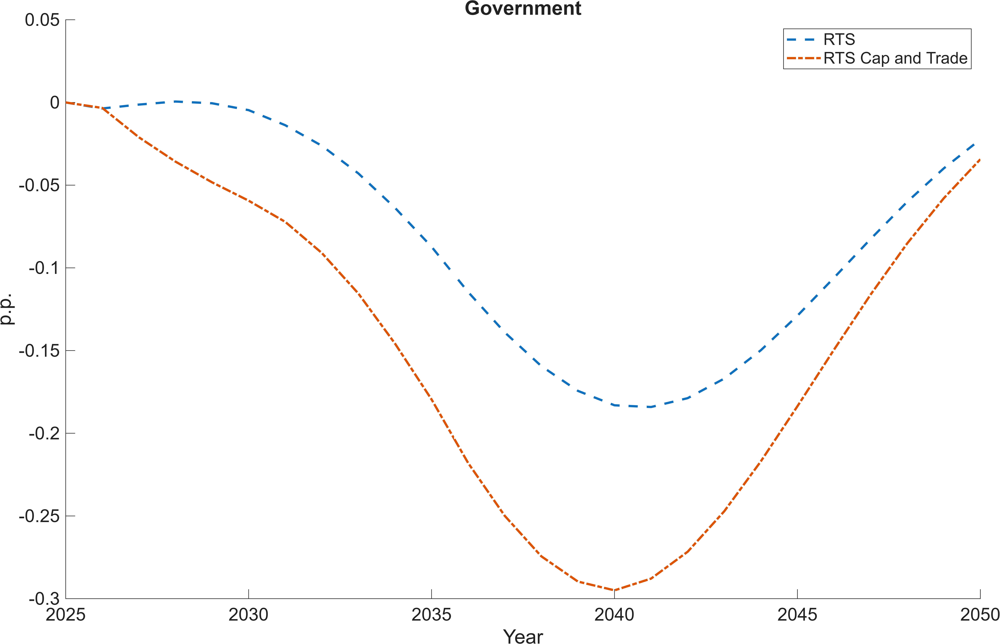
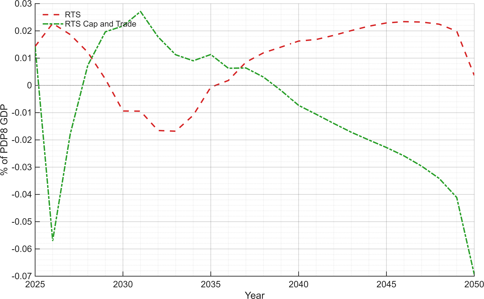
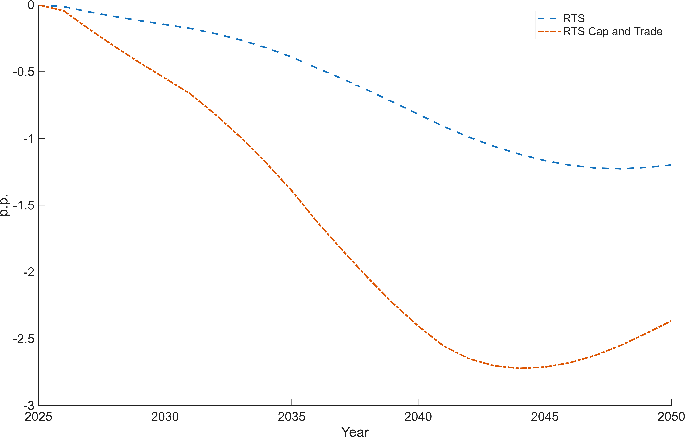
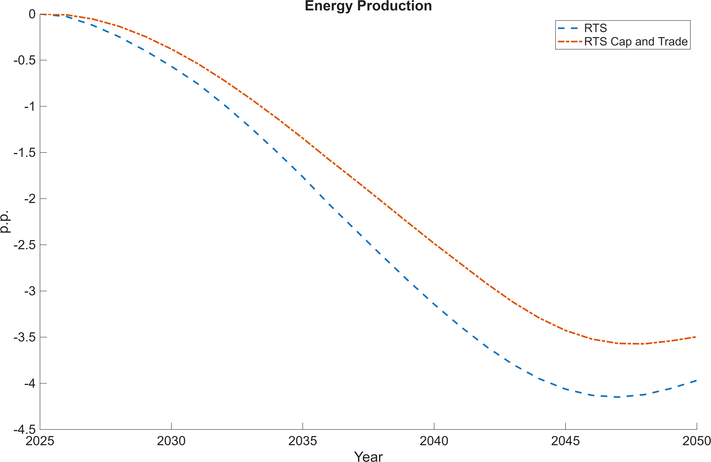
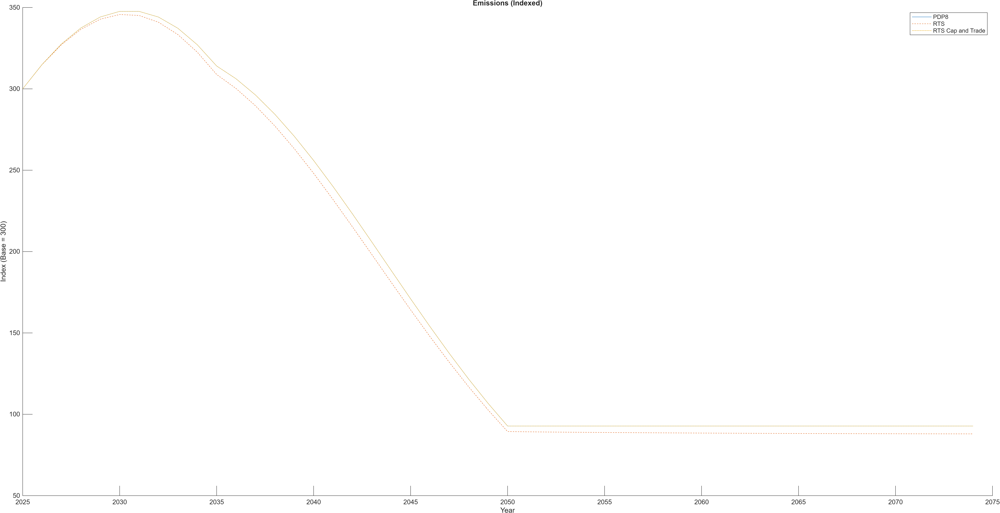

# Viet Nam Rooftop Solar Pathways
## Policy Summary for Grid Demand, Investment, and Growth

---

## Executive summary (for decision-makers)

- Rooftop solar is already material in Viet Nam: about **9.5 GW** installed and about **14 TWh/year** of generation.
- This currently offsets around **5% of electricity demand** and around **1.6% of total final energy demand**.
- Under the PDP8-type rooftop pathway (about **10×** scale-up), rooftop solar could reach about **140 TWh/year**.
- Under an accelerated pathway (about **20×** scale-up), rooftop solar could reach about **280 TWh/year**.
- Model results indicate **lower market energy purchases, lower energy prices, and a small positive GDP effect**, with stronger effects under **cap-and-trade** than under an **emissions tax** in these simulations.

---

## Why this matters

Rooftop solar helps Viet Nam on three policy goals at once:

1. **Energy security:** less dependence on centralized generation and fuel imports.
2. **Affordability:** lower pressure on grid electricity purchases and prices.
3. **Climate and growth:** lower emissions with modest positive macroeconomic effects.

---

## Baseline facts used in the model

| Indicator | Value | Policy interpretation |
|---|---:|---|
| Installed rooftop PV capacity (end-2024) | 9.5 GW | Significant distributed generation base already exists |
| Rooftop PV generation | ~14 TWh/year | Directly displaces grid purchases behind the meter |
| National electricity consumption (2023) | 277.5 TWh | Rooftop PV currently offsets ~5% |
| Total final energy consumption | ~874 TWh | Rooftop PV currently equals ~1.6% of final energy |
| Implied current rooftop PV capital stock | ~USD 7.6 bn | Around 1.8% of GDP (GDP ~USD 430 bn) |

For calibration in the DGE model, the base-year rooftop PV contribution is set to approximately **1.6% of final energy demand**.

---

## Scenarios compared

| Scenario | Carbon policy | Rooftop deployment | Intended use |
|---|---|---|---|
| PDP8 (revised) | Rooftop + emissions tax | Official PDP8 rooftop trajectory | Baseline policy pathway |
| Rooftop + cap-and-trade | Emissions cap with permit trading | Faster than PDP8 | Tests quantity-based carbon control with strong rooftop rollout |
| Rooftop + emissions tax | Carbon tax per unit emissions | Faster than PDP8 | Tests price-based carbon control with strong rooftop rollout |

**Conceptual distinction:**
- **Cap-and-trade** fixes emissions quantity; carbon price adjusts.
- **Emissions tax** fixes carbon price; emissions adjust.

---

## Main results in plain language

### 1) Rooftop generation scales rapidly
- From about **14 TWh today** to about **140 TWh (10×)** under PDP8-type scaling.
- Accelerated rollout reaches about **280 TWh (20×)** in the stress-test case.

<figure style="text-align:center; margin: 1.2rem 0;">
  <figcaption><em>Figure 1. Rooftop PV production increases strongly under both pathways, with a steeper profile under accelerated rollout.</em></figcaption>
  
</figure>

### 2) Investment needs rise significantly
- Annual rooftop-related investment increases from low initial levels to much higher levels in transition years.
- This is a large but manageable macroeconomic shift when spread over time and supported by policy design.

<figure style="text-align:center; margin: 1.2rem 0;">
  <figcaption><em>Figure 2. Faster rooftop deployment requires earlier and higher annual investment.</em></figcaption>
  
</figure>

### 3) GDP effects are positive but modest
- The model shows a **small positive effect on GDP growth**.
- In these simulations, gains are generally larger under **cap-and-trade** than under an **emissions tax**.
- **All GDP components shown below (GDP, investment, consumption, government expenditure, and trade balance) are expressed relative to PDP8 GDP.**

<figure style="text-align:center; margin: 1.2rem 0;">
  <figcaption><em>Figure 3. GDP impacts are positive but moderate; policy design influences magnitude.</em></figcaption>
  
</figure>

<figure style="text-align:center; margin: 1.2rem 0;">
  <figcaption><em>Figure 4. Investment increases initially and then declines.</em></figcaption>
  
</figure>

<figure style="text-align:center; margin: 1.2rem 0;">
  <figcaption><em>Figure 5. Consumption first declines and then increases.</em></figcaption>
  
</figure>

<figure style="text-align:center; margin: 1.2rem 0;">
  <figcaption><em>Figure 6. Government expenditures first decline and then increase.</em></figcaption>
  
</figure>

<figure style="text-align:center; margin: 1.2rem 0;">
  <figcaption><em>Figure 7. Trade balance impacts under different scenarios.</em></figcaption>
  
</figure>

### 4) Energy prices and market purchases decline
- Energy prices fall relative to PDP8 in the accelerated rooftop scenarios.
- Market energy purchases decline as behind-the-meter supply substitutes for grid demand.

<figure style="text-align:center; margin: 1.2rem 0;">
  <figcaption><em>Figure 8. Energy prices are lower than in the PDP8-only reference pathway.</em></figcaption>
  
</figure>

<figure style="text-align:center; margin: 1.2rem 0;">
  <figcaption><em>Figure 9. Market-purchased energy declines as rooftop generation expands.</em></figcaption>
  
</figure>

### 5) Emissions and prices for emissions
- Cap and Trade rules out effect on emissions, but lowers price pressure.
- A carbon tax allows price certainty and lowers emissions combined with RTS rollout.

<figure style="text-align:center; margin: 1.2rem 0;">
  <figcaption><em>Figure 10. Price for emissions.</em></figcaption>
  
</figure>

<figure style="text-align:center; margin: 1.2rem 0;">
  <figcaption><em>Figure 11. Emissions.</em></figcaption>
  
</figure>

---

## What policymakers can take away

- **Rooftop PV is already macro-relevant** and can scale to a system-level contributor.
- **Faster deployment brings earlier benefits**, especially for demand reduction and price relief.
- **Policy instrument choice matters**: cap-and-trade and emissions taxes can both support decarbonization, but transition dynamics differ.
- **Investment planning is central**: financing conditions and rollout pace determine near-term feasibility and distributional outcomes.

---

## DGE implementation note (technical, short)

In the model:

$$
Q_E^{eff} = Q_E^{grid} + Q_{PV},
\qquad
Q_E^{grid} = Q_E^{eff} - Q_{PV}
$$

$$
K_{PV,t+1} = (1-\delta_{PV})K_{PV,t} + I_{PV,t}
$$

Recommended implementation:
- Use rooftop PV capital $K_{PV,t}$ as the state variable.
- Map generation with $Q_{PV,t}=A_{PV}K_{PV,t}$ calibrated to match observed and scenario TWh targets.

---

## Annex: key assumptions and calculations

### A1. Energy conversion
- TFEC (2023): 75,122 ktoe.
- Conversion: $1$ ktoe $=11.63$ GWh.
- Total final energy: $75{,}122\times 11.63/1000\approx 874$ TWh.

### A2. Rooftop generation factor
- Formula: $E_{PV}=\text{Capacity (GW)}\times 8.76\times CF$.
- With $CF=0.17$, $1$ GW produces about $1.49$ TWh/year.
- Current estimate: $9.5\times 1.49\approx 14.1$ TWh/year.

### A3. Shares today
- Electricity share: $14/277.5\approx 5.1\%$.
- Final-energy share: $14/874\approx 1.6\%$.

### A4. Capital value
- Value $=\text{Capacity (kW)}\times\text{cost per kW}$.
- $9.5\times10^6\times800\approx$ USD 7.6 bn.

### A5. Scale-up orders of magnitude

| Scenario | Capacity (GW) | Generation (TWh/year) | Capital value (USD bn) |
|---|---:|---:|---:|
| Today | 9.5 | 14 | 7.6 |
| 10× pathway | 95 | 140 | 76 |
| 20× pathway | 190 | 280 | 152 |

All generation values use $CF=0.17$ and capital cost USD 800/kW.
