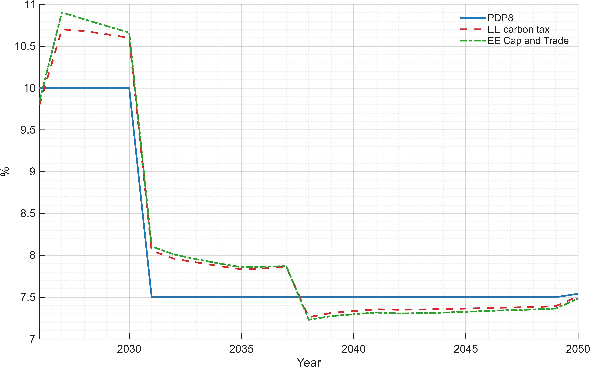
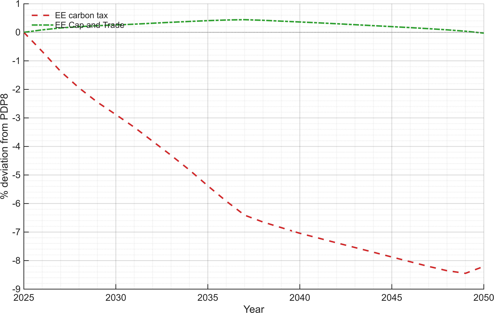
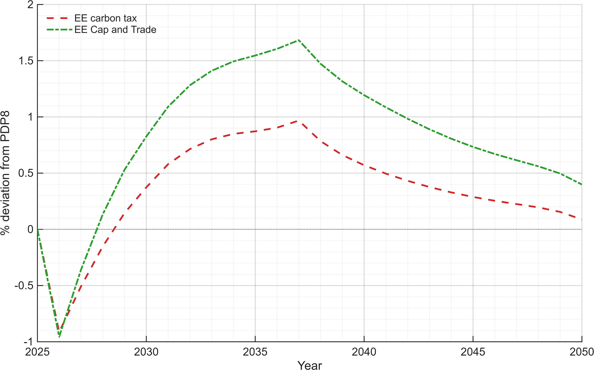
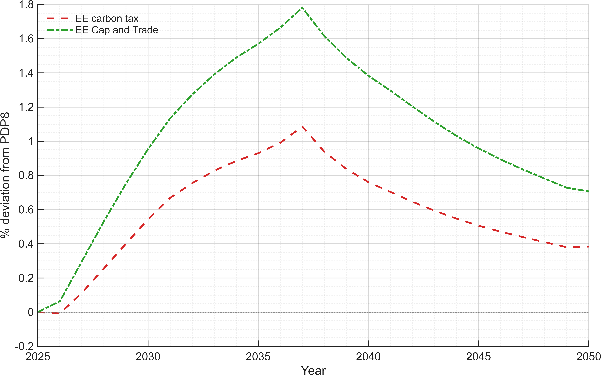

# Viet Nam Energy Demand Efficiency Pathways
## Policy Summary for Energy Use, Costs, and Growth

---

## Executive summary (for decision-makers)

- Based on the ETP Energy Efficiency Diagnostic (2018–2030), Viet Nam has sizeable efficiency potential in key demand sectors.
- Estimated 2030 savings potential is **7.4% in manufacturing**, **5.1% in services/commercial buildings**, and **11.6% in households**.
- Annual investment needs for these quantified sectors total about **USD 361 million/year**.
- Relative to 2024 GDP (USD 476.3 bn), this is about **0.076% of GDP per year**, indicating a fiscally manageable scale.
- In model terms, faster efficiency gains can reduce energy demand and emissions while supporting affordability and competitiveness.

---

## Why this matters

Energy efficiency supports three core policy goals:

1. **Energy security:** lower fuel needs and reduced import exposure.
2. **Affordability:** lower energy spending for firms and households.
3. **Climate and competitiveness:** lower emissions intensity with productivity gains.

---

## Baseline facts used in the model

| Indicator | Value | Policy interpretation |
|---|---:|---|
| National electricity consumption (2023) | 277.5 TWh | Main benchmark for power-side demand effects |
| Total final energy consumption (2023) | ~874 TWh | Economy-wide benchmark for efficiency impacts |
| GDP reference (2024) | USD 476.3 bn | Base for investment share calculations |
| Quantified annual efficiency investment need | USD 361 million/year | Around 0.076% of GDP |
| Baseline scenario | PDP8 (revised) | No additional efficiency policy shock beyond baseline assumptions |

For calibration in the DGE model, efficiency starts from observed base-year energy use and applies sector-specific improvements toward 2030 using ETP magnitudes.

---

## Sectoral Energy Efficiency Potential (by 2030) and Annual Investment Needs (Vietnam)

*Sources & notes:* Industry and services figures from the Energy Transition Partnership (ETP) Energy Efficiency Diagnostic; national EE targets from VNEEP3; agriculture estimate based on proxy energy use and policy emphasis.  
GDP used for % calculations ≈ USD 476.3 billion (2024 reference).

| **Sector** | **EE Savings Potential by 2030 (% of sectoral energy)** | **Annual Investment Need (USD million)** | **Annual Investment (% of GDP)** | **Core Measures Included** |
|-------------|:-------------------------------------------------------:|:----------------------------------------:|:--------------------------------:|-----------------------------|
| **Manufacturing / Industry** | ~7.4 % | 210 | ~0.044 % | Process heat efficiency (boilers, furnaces); cogeneration; motor systems (VSDs); facility EE including AC. :contentReference[oaicite:4]{index=4} |
| **Services / Commercial Buildings** | ~5.1 % | 47 | ~0.010 % | High-efficiency AC & lighting; water heating; thermostatic controls; building management systems. :contentReference[oaicite:5]{index=5} |
| **Households / Residential (supporting service demand context)** | ~11.6 % | 104 | ~0.022 % | Appliance efficiency (AC, refrigerators), efficient lighting & water heating. :contentReference[oaicite:6]{index=6} |
| **Agriculture (Irrigation + Agro-processing + Cold-chain)** | ~10 % (conservative proxy) | ~100* | ~0.021 % | Efficient irrigation pumps; variable speed drives; solar/electric dryers; cold-chain efficiency. *Assumed based on sector energy share and typical EE potential illustrations. |

**Total quantified annual investment (industry + services + households):**

$$
210 + 47 + 104 = 361 \text{ million USD/year}
$$

$$
\frac{361}{476{,}300} \times 100 \approx 0.076\%\;\text{of GDP per year}
$$

---

## Scenarios compared

| Scenario | Carbon policy | Efficiency deployment | Intended use |
|---|---|---|---|
| PDP8 (revised) | None | Baseline improvement trend | Reference policy pathway |
| Efficiency + cap-and-trade | Emissions cap with permit trading | Faster efficiency gains than PDP8 | Tests quantity-based carbon control with stronger demand-side response |
| Efficiency + emissions tax | Carbon tax per unit emissions | Faster efficiency gains than PDP8 | Tests price-based carbon control with stronger demand-side response |

**Conceptual distinction:**
- **Cap-and-trade** fixes emissions quantity; carbon price adjusts.
- **Emissions tax** fixes carbon price; emissions adjust.

---

## Main results

### 1) Energy intensity improves
- By 2030, energy savings potential is highest in **households (11.6%)**, followed by **industry (7.4%)** and **services (5.1%)**.
- This supports a scenario path where end-use demand falls progressively while preserving service delivery.

<figure style="text-align:center; margin: 1.2rem 0;">
  <figcaption><em>Figure 1. Energy intensity.</em></figcaption>
  
</figure>

### 2) Final energy demand declines relative to baseline
- Efficiency lowers purchased energy demand while maintaining energy services.
- With quantified sector measures, reductions are driven first by buildings and industry equipment upgrades.

<figure style="text-align:center; margin: 1.2rem 0;">
  <figcaption><em>Figure 2. Final energy demand.</em></figcaption>
  
</figure>

### 3) GDP effects are positive but modest
- Annual investment needs are modest in macro terms (about **0.076% of GDP** for quantified sectors).
- This supports positive but moderate GDP effects through lower energy intensity and productivity improvements.
- Energy-efficiency measures can help reach GDP growth targets in the near term by reducing energy costs and raising productivity.
- In the long run, GDP growth rates can moderate due to base effects, while GDP levels remain higher than baseline.
- **All GDP components shown below (GDP, investment, consumption, government expenditure, and trade balance) are expressed relative to PDP8 GDP.**

<figure style="text-align:center; margin: 1.2rem 0;">
  <figcaption><em>Figure 3. GDP growth.</em></figcaption>
  
</figure>

<figure style="text-align:center; margin: 1.2rem 0;">
  <figcaption><em>Figure 4. GDP.</em></figcaption>
  
</figure>

<figure style="text-align:center; margin: 1.2rem 0;">
  <figcaption><em>Figure 5. Investment.</em></figcaption>
  
</figure>

<figure style="text-align:center; margin: 1.2rem 0;">
  <figcaption><em>Figure 6. Consumption.</em></figcaption>
  
</figure>

<figure style="text-align:center; margin: 1.2rem 0;">
  <figcaption><em>Figure 7. Government expenditure.</em></figcaption>
  
</figure>

<figure style="text-align:center; margin: 1.2rem 0;">
  <figcaption><em>Figure 8. Trade balance.</em></figcaption>
  
</figure>

### 4) Energy prices and expenditures decline
- Lower demand pressure reduces energy price and expenditure growth versus baseline.
- Benefits are stronger when investment is implemented early in high-use sectors.

<figure style="text-align:center; margin: 1.2rem 0;">
  <figcaption><em>Figure 9. Energy prices.</em></figcaption>
  
</figure>

<figure style="text-align:center; margin: 1.2rem 0;">
  <figcaption><em>Figure 10. Energy expenditure.</em></figcaption>
  
</figure>

### 5) Emissions and carbon prices
- Efficiency reduces emissions directly through lower fuel use.
- Carbon policy determines whether adjustment is led more by quantity (cap) or price (tax).

<figure style="text-align:center; margin: 1.2rem 0;">
  <figcaption><em>Figure 11. Emission price.</em></figcaption>
  
</figure>

<figure style="text-align:center; margin: 1.2rem 0;">
  <figcaption><em>Figure 12. Emissions.</em></figcaption>
  
</figure>

### 6) Sector energy demand compared with baseline
- Sector-level profiles show where demand reduction is strongest relative to PDP8.
- Mechanism: higher efficiency first reduces required energy input for a given output level.
- As efficiency lowers system energy demand, equilibrium energy prices fall, which supports additional production and demand.
- A rebound effect is visible: stronger efficiency raises productivity and GDP, and this additional activity partly offsets direct energy savings.
- In this case, higher GDP growth dominates part of the direct efficiency effect on total sectoral energy demand.

<figure style="text-align:center; margin: 1.2rem 0;">
  <figcaption><em>Figure 13. Agriculture energy demand.</em></figcaption>
  
</figure>

<figure style="text-align:center; margin: 1.2rem 0;">
  <figcaption><em>Figure 14. Industry energy demand.</em></figcaption>
  
</figure>

<figure style="text-align:center; margin: 1.2rem 0;">
  <figcaption><em>Figure 15. Services energy demand.</em></figcaption>
  
</figure>

---

## What policymakers can take away

- **The required financing is relatively small at macro scale**: about 0.076% of GDP per year for quantified sectors.
- **Residential and industrial programs should be prioritized** because they carry the largest savings potential.
- **Policy packages should combine standards, incentives, and concessional finance** to accelerate uptake.
- **Agriculture needs a quantified pipeline** to close the current evidence gap in formal scenario calibration.

---

## DGE implementation note (technical, short)

The efficiency channel is implemented directly in intermediate input demand using the updated model wedge:

For subsector $u$, region $r$, and input sector $m$:

$$
A_{I,u,r,m}=\exp\!\left(A^{Eff}_{I,u,r,m}\right)\left(EE_r\right)^{\mathbb{1}\{m=i^{p}_{\text{Energy}}\}}
$$

Interpretation:
- $\exp(A^{Eff}_{I,u,r,m})$ is a multiplicative efficiency shifter in intermediate demand.
- $\left(EE_r\right)^{\mathbb{1}\{m=i^{p}_{\text{Energy}}\}}$ applies the regional efficiency factor only when the supplying sector is energy; otherwise the indicator is zero and the term equals 1.
- This means the policy shock targets the energy input margin rather than all intermediate inputs.

The sectoral intermediate-input demand condition is:

For subsector $u$, region $r$, and intermediate input $m$:

$$
P_{A,m,r} = \omega^{1/\eta^{IA}_u}_{u,r,m} \,A_{I,u,r,m}^{\frac{\eta^{IA}_u-1}{\eta^{IA}_u}} \left(\frac{Q_{I,u,r,m}}{Q_{I,u,r}}\right)^{-1/\eta^{IA}_u} P_{I,u,r}
$$

Interpretation of this demand equation:
- The left-hand side is the effective marginal cost of using input $m$, including the direct price term $P_{A,m,r}$ plus an emissions-cost component.
- The emissions-cost component scales with $\kappa^{EI}_{u,r,m}$, the exogenous intensity shifter $e^{\mathrm{exoEI}_{u,r,m}}$, fossil share $Q^{D}_{\mathrm{fossil},r}/Q^{A}_{\mathrm{energy},r}$, and permit price $PE_r$.
- The right-hand side is the CES demand condition: relative input demand responds to the efficiency-adjusted shifter $A_{I,u,r,m}$, substitution elasticity $\eta^{IA}_u$, and composite-input price $P_{I,u,r}$.
- When $A^{Eff}_{I,u,r,m}$ and $EE_r$ increase the energy-input efficiency term, the model requires less purchased energy input for a given production level (ceteris paribus), while price-mediated general-equilibrium effects can generate partial rebound.

Government investments that drive sector efficiency gains are represented as sector-specific public spending and capital accumulation:

$$
K^{A}_{u,r,t} = \text{exoGA}_{u,r,t}\,Y0_p
$$

$$
K^{A}_{u,r,t} = (1-\delta^{KA}_{u,r})K^{A}_{u,r,t-1} + G^{A}_{u,r,t}
$$

where $G^{A}_{u,r,t}$ is government expenditure for sector-specific adaptation/efficiency investment, and $K^{A}_{u,r,t}$ is the resulting sector capital stock.

Calibration logic:
- For a given substitution elasticity in the production nest, increase $A^{Eff}_{I,u,r,m}$ and $EE_r$ so that, ceteris paribus, firm energy demand declines to the target levels.
- Match target savings rates by 2030 (industry 7.4%, services 5.1%, households 11.6%).
- Use government efficiency investment paths (USD 361 million/year across quantified sectors) to discipline the time profile of $A^{Eff}_{I,u,r,m}$ and $EE_r$.
- Keep agriculture in sensitivity analysis until a quantified agriculture savings-investment mapping is available.

---

## Annex: key assumptions and calculations

### A1. Energy conversion benchmark
- TFEC (2023): 75,122 ktoe.
- Conversion: $1$ ktoe $= 11.63$ GWh.
- Total final energy: $75{,}122 \times 11.63 / 1000 \approx 874$ TWh.

### A2. Example intensity metric
- Energy intensity index: $EI_t = \frac{Q_E^{market}}{Y_t}$.
- Report scenario changes as percent deviation from PDP8.

### A3. ETP-based investment and GDP share check
- Total quantified annual investment: $210 + 47 + 104 = 361$ million USD/year.
- GDP reference: 476.3 billion USD/year.
- Share of GDP: $361/476{,}300 \times 100 \approx 0.076\%$.

### A4. Typical reporting indicators
- Final energy demand (TWh).
- Electricity demand (TWh).
- Emissions (MtCO$_2$).
- GDP and GDP components (% of PDP8 GDP for component charts).

### A5. Policy input summary used in this note

| Sector | Savings potential by 2030 | Investment need (USD mn/year) |
|---|---:|---:|
| Industry | 7.4% | 210 |
| Services | 5.1% | 47 |
| Households | 11.6% | 104 |

Agriculture is included qualitatively but not quantified in the cited ETP table.

### A6. Placeholder scenario scaling (to replace with model values)

| Scenario | Intensity improvement by horizon | Final energy impact vs PDP8 | Notes |
|---|---:|---:|---|
| PDP8 pathway | Baseline trend | 0% | Reference case |
| Accelerated efficiency | Faster improvement | Negative deviation | Earlier savings |
| Efficiency + cap-and-trade | Faster improvement + cap | Larger negative deviation | Stronger quantity control |
| Efficiency + emissions tax | Faster improvement + tax | Negative deviation | Stronger price signal |

Replace placeholder values with simulation outputs once scenario runs are finalized.
