# Viet Nam Energy Demand Efficiency Pathways
## Policy Summary for Energy Use, Costs, and Growth

---

## Executive summary (for decision-makers)

- Based on the ETP Energy Efficiency Diagnostic (2018–2030), Viet Nam has sizeable efficiency potential in key demand sectors.
- Estimated 2030 savings potential is **7.4% in manufacturing**, **5.1% in services/commercial buildings**, and **11.6% in households**.
- Annual investment needs for these quantified sectors total about **USD 361 million/year**.
- Relative to 2024 GDP (USD 476.3 bn), this is about **0.076% of GDP per year**, indicating a fiscally manageable scale.
- In model terms, faster efficiency gains can reduce energy demand and emissions while supporting affordability and competitiveness.

---

## Why this matters

Energy efficiency supports three core policy goals:

1. **Energy security:** lower fuel needs and reduced import exposure.
2. **Affordability:** lower energy spending for firms and households.
3. **Climate and competitiveness:** lower emissions intensity with productivity gains.

---

## Baseline facts used in the model

| Indicator | Value | Policy interpretation |
|---|---:|---|
| National electricity consumption (2023) | 277.5 TWh | Main benchmark for power-side demand effects |
| Total final energy consumption (2023) | ~874 TWh | Economy-wide benchmark for efficiency impacts |
| GDP reference (2024) | USD 476.3 bn | Base for investment share calculations |
| Quantified annual efficiency investment need | USD 361 million/year | Around 0.076% of GDP |
| Baseline scenario | PDP8 (revised) | No additional efficiency policy shock beyond baseline assumptions |

For calibration in the DGE model, efficiency starts from observed base-year energy use and applies sector-specific improvements toward 2030 using ETP magnitudes.

---

## Sector efficiency and investment inputs (ETP 2018–2030)

*Source: Energy Transition Partnership (ETP) Energy Efficiency Diagnostic (Vietnam), 2018–2030. GDP reference for % calculations: Vietnam GDP 2024 ≈ USD 476.3 bn.*

| Sector | Energy Efficiency Improvement by 2030 (% energy savings potential) | Annual Investment Need (USD million/year) | Annual Investment (% of GDP) | Key Measures Included |
|---|---:|---:|---:|---|
| **Manufacturing / Industry** | 7.4% | 210 | ~0.044% | Process heat efficiency (boilers, furnaces), cogeneration, motor systems (VSDs), industrial process optimization, facility efficiency (incl. AC) |
| **Services / Commercial Buildings** | 5.1% | 47 | ~0.010% | High-efficiency AC, lighting (LED), water heating, office equipment, building controls, solar water heating |
| **Households / Residential** | 11.6% | 104 | ~0.022% | Efficient appliances (AC, refrigerators), lighting, water heating, clean cooking, solar water heating |
| **Agriculture** | Not explicitly quantified in ETP table | — | — | Efficient irrigation pumps, agro-processing heat efficiency, cold-chain efficiency (addressed under VNEEP but without explicit quantified breakdown in PDP-8 documents) |

**Total quantified annual investment (industry + services + households):**

$$
210 + 47 + 104 = 361 \text{ million USD/year}
$$

$$
\frac{361}{476{,}300} \times 100 \approx 0.076\%\;\text{of GDP per year}
$$

---

## Scenarios compared

| Scenario | Carbon policy | Efficiency deployment | Intended use |
|---|---|---|---|
| PDP8 (revised) | None | Baseline improvement trend | Reference policy pathway |
| Efficiency + cap-and-trade | Emissions cap with permit trading | Faster efficiency gains than PDP8 | Tests quantity-based carbon control with stronger demand-side response |
| Efficiency + emissions tax | Carbon tax per unit emissions | Faster efficiency gains than PDP8 | Tests price-based carbon control with stronger demand-side response |

**Conceptual distinction:**
- **Cap-and-trade** fixes emissions quantity; carbon price adjusts.
- **Emissions tax** fixes carbon price; emissions adjust.

---

## Main results

### 1) Energy intensity improves
- By 2030, energy savings potential is highest in **households (11.6%)**, followed by **industry (7.4%)** and **services (5.1%)**.
- This supports a scenario path where end-use demand falls progressively while preserving service delivery.

<figure style="text-align:center; margin: 1.2rem 0;">
  <figcaption><em>Figure 1. Energy intensity.</em></figcaption>
  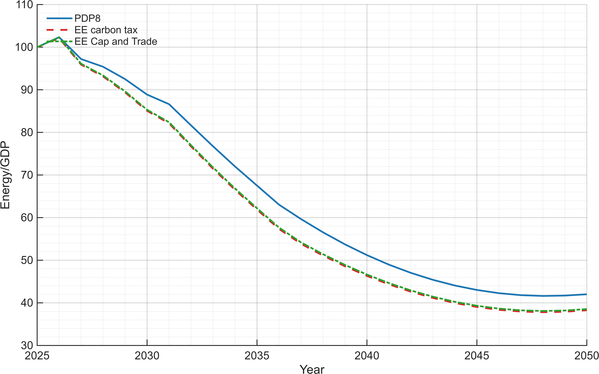
</figure>

### 2) Final energy demand declines relative to baseline
- Efficiency lowers purchased energy demand while maintaining energy services.
- With quantified sector measures, reductions are driven first by buildings and industry equipment upgrades.

<figure style="text-align:center; margin: 1.2rem 0;">
  <figcaption><em>Figure 2. Final energy demand.</em></figcaption>
  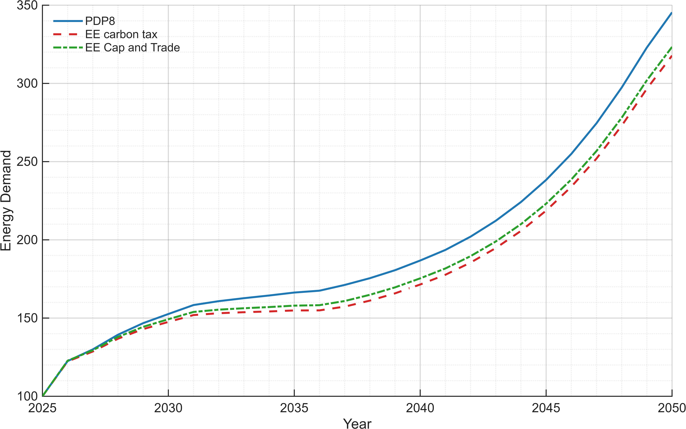
</figure>

### 3) GDP effects are positive but modest
- Annual investment needs are modest in macro terms (about **0.076% of GDP** for quantified sectors).
- This supports positive but moderate GDP effects through lower energy intensity and productivity improvements.
- **All GDP components shown below (GDP, investment, consumption, government expenditure, and trade balance) are expressed relative to PDP8 GDP.**

<figure style="text-align:center; margin: 1.2rem 0;">
  <figcaption><em>Figure 3. GDP.</em></figcaption>
  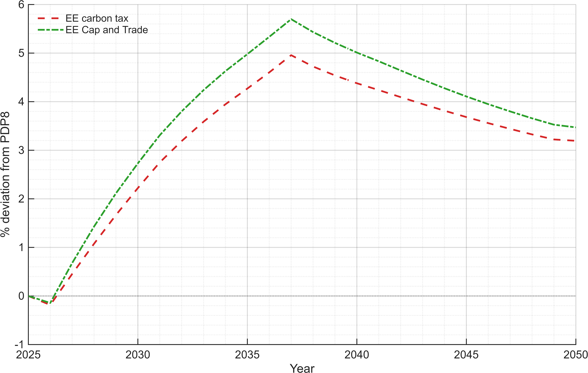
</figure>

<figure style="text-align:center; margin: 1.2rem 0;">
  <figcaption><em>Figure 4. Investment.</em></figcaption>
  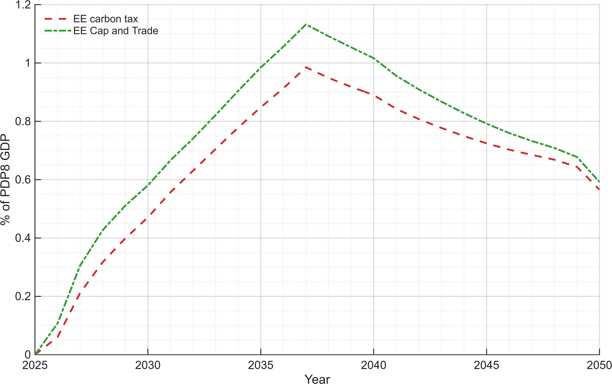
</figure>

<figure style="text-align:center; margin: 1.2rem 0;">
  <figcaption><em>Figure 5. Consumption.</em></figcaption>
  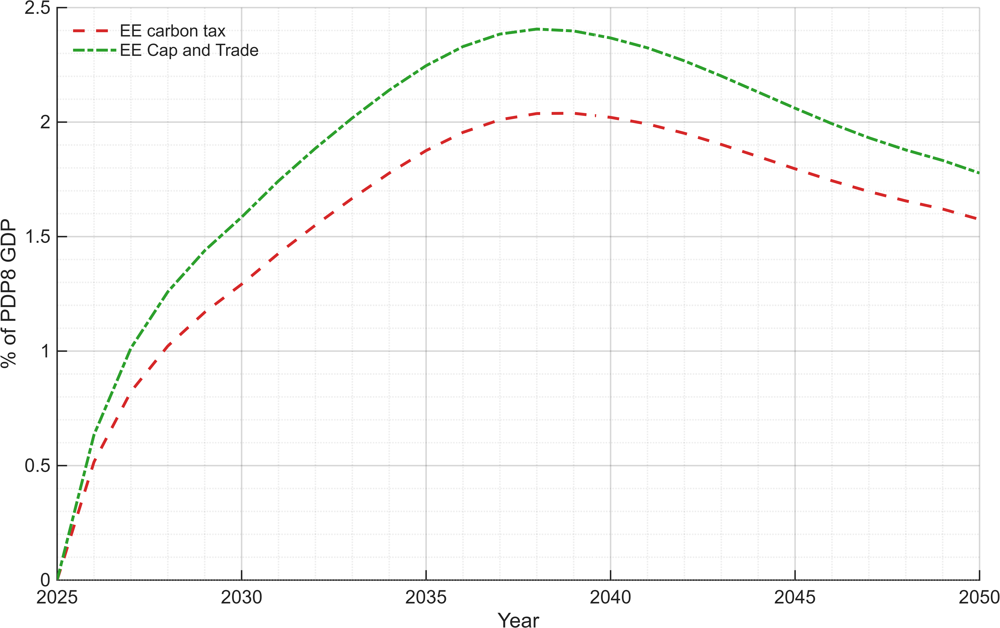
</figure>

<figure style="text-align:center; margin: 1.2rem 0;">
  <figcaption><em>Figure 6. Government expenditure.</em></figcaption>
  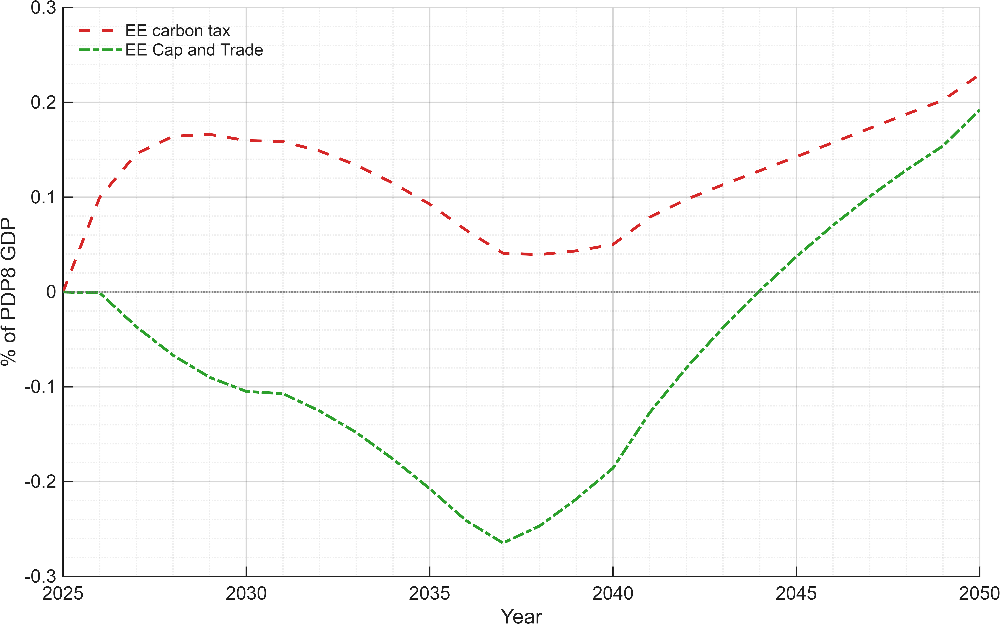
</figure>

<figure style="text-align:center; margin: 1.2rem 0;">
  <figcaption><em>Figure 7. Trade balance.</em></figcaption>
  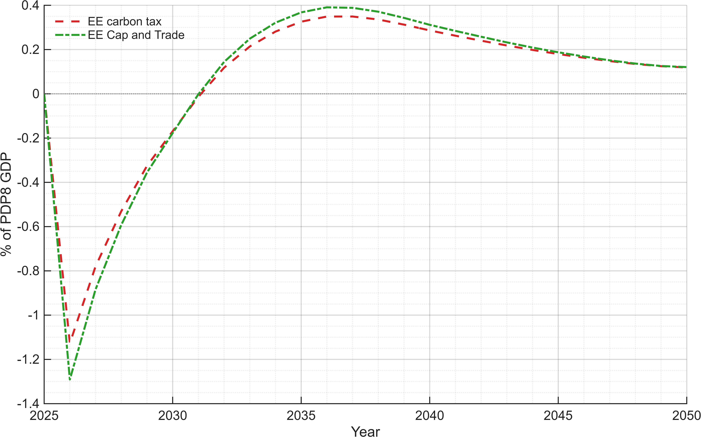
</figure>

### 4) Energy prices and expenditures decline
- Lower demand pressure reduces energy price and expenditure growth versus baseline.
- Benefits are stronger when investment is implemented early in high-use sectors.

<figure style="text-align:center; margin: 1.2rem 0;">
  <figcaption><em>Figure 8. Energy prices.</em></figcaption>
  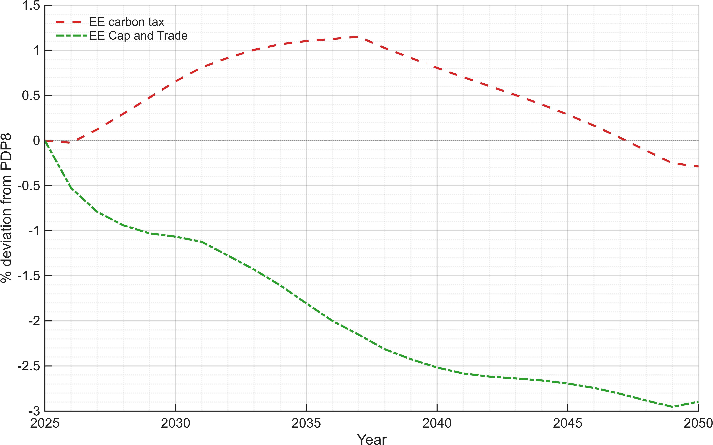
</figure>

<figure style="text-align:center; margin: 1.2rem 0;">
  <figcaption><em>Figure 9. Energy expenditure.</em></figcaption>
  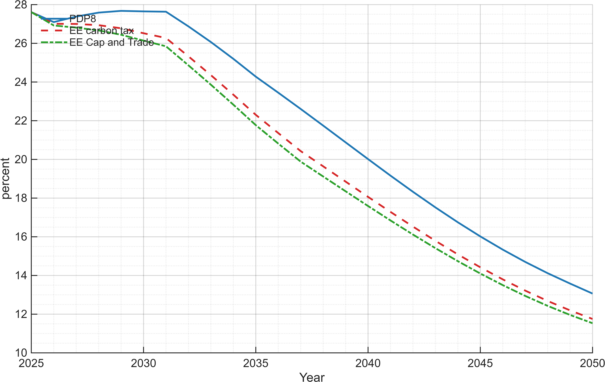
</figure>

### 5) Emissions and carbon prices
- Efficiency reduces emissions directly through lower fuel use.
- Carbon policy determines whether adjustment is led more by quantity (cap) or price (tax).

<figure style="text-align:center; margin: 1.2rem 0;">
  <figcaption><em>Figure 10. Emission price.</em></figcaption>
  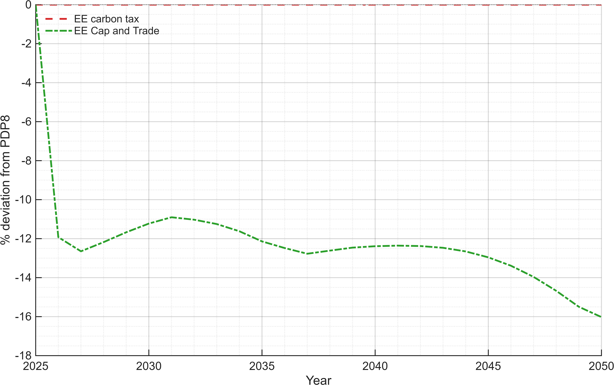
</figure>

<figure style="text-align:center; margin: 1.2rem 0;">
  <figcaption><em>Figure 11. Emissions.</em></figcaption>
  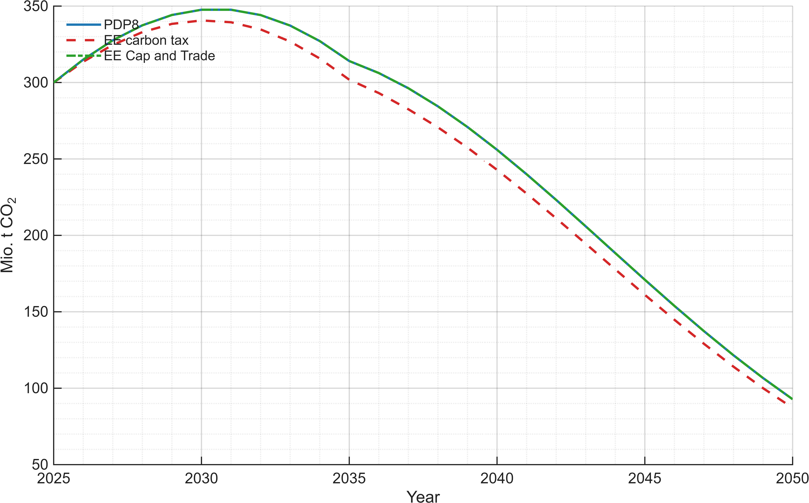
</figure>

---

## What policymakers can take away

- **The required financing is relatively small at macro scale**: about 0.076% of GDP per year for quantified sectors.
- **Residential and industrial programs should be prioritized** because they carry the largest savings potential.
- **Policy packages should combine standards, incentives, and concessional finance** to accelerate uptake.
- **Agriculture needs a quantified pipeline** to close the current evidence gap in formal scenario calibration.

---

## DGE implementation note (technical, short)

One practical representation is an energy-efficiency wedge that raises effective energy services per unit of purchased energy:

$$
Q_E^{eff} = \eta_t \cdot Q_E^{market}, \qquad \eta_t \uparrow
$$

Equivalent demand form:

$$
Q_E^{market} = \frac{Q_E^{eff}}{\eta_t}
$$

If efficiency capital is modeled explicitly:

$$
K_{EE,t+1} = (1-\delta_{EE})K_{EE,t} + I_{EE,t}, \qquad \eta_t = \eta(K_{EE,t})
$$

Recommended implementation:
- Calibrate sector wedges to match ETP 2030 savings rates (industry 7.4%, services 5.1%, households 11.6%).
- Map annual efficiency investment to the resource constraint using USD 361 million/year (quantified sectors).
- Keep agriculture as a separate sensitivity block until quantified investment and savings inputs are available.

---

## Annex: key assumptions and calculations

### A1. Energy conversion benchmark
- TFEC (2023): 75,122 ktoe.
- Conversion: $1$ ktoe $= 11.63$ GWh.
- Total final energy: $75{,}122 \times 11.63 / 1000 \approx 874$ TWh.

### A2. Example intensity metric
- Energy intensity index: $EI_t = \frac{Q_E^{market}}{Y_t}$.
- Report scenario changes as percent deviation from PDP8.

### A3. ETP-based investment and GDP share check
- Total quantified annual investment: $210 + 47 + 104 = 361$ million USD/year.
- GDP reference: 476.3 billion USD/year.
- Share of GDP: $361/476{,}300 \times 100 \approx 0.076\%$.

### A4. Typical reporting indicators
- Final energy demand (TWh).
- Electricity demand (TWh).
- Emissions (MtCO$_2$).
- GDP and GDP components (% of PDP8 GDP for component charts).

### A5. Policy input summary used in this note

| Sector | Savings potential by 2030 | Investment need (USD mn/year) |
|---|---:|---:|
| Industry | 7.4% | 210 |
| Services | 5.1% | 47 |
| Households | 11.6% | 104 |

Agriculture is included qualitatively but not quantified in the cited ETP table.

### A6. Placeholder scenario scaling (to replace with model values)

| Scenario | Intensity improvement by horizon | Final energy impact vs PDP8 | Notes |
|---|---:|---:|---|
| PDP8 pathway | Baseline trend | 0% | Reference case |
| Accelerated efficiency | Faster improvement | Negative deviation | Earlier savings |
| Efficiency + cap-and-trade | Faster improvement + cap | Larger negative deviation | Stronger quantity control |
| Efficiency + emissions tax | Faster improvement + tax | Negative deviation | Stronger price signal |

Replace placeholder values with simulation outputs once scenario runs are finalized.
