# EE Simulation Scenarios Results

Date: 2026-06-03

## Scope and data used

This note summarizes simulated outcomes from CSV outputs in `ExcelFiles/Output/` for:

- `EE_PDP8`
- `EE_Directive10`
- `EE_Directive10_NoBESS`
- `EE_PDP8_PV_BESS_NoBESS`

Requested-but-missing output files at the time of reporting:

- `EE_Directive10_PV_BESS.csv` (not found)
- `EE_PDP8_PV_BESS.csv` (not found)

## Metric definitions

- GDP growth: annual growth of `Y_1` in percent.
- GDP level: model level `Y_1` (reported relatively in comparison tables).
- Investment share: `I_1 / Y_1 * 100`.
- Consumption share: `C_1 / Y_1 * 100`.
- Energy intensity index: 
  `((Q_A_2_1 + Q_PV_1)/(Q_A_2_1(2026)+Q_PV_1(2026))) / (Y_1/Y_1(2026)) * 100`.
- Final energy demand index:
  `((Q_A_F_2_1 + Q_PV_1)/(Q_A_F_2_1(2026)+Q_PV_1(2026))) * 100`.
- Emissions index: `E_1 / E_1(2026) * 100`.

## Headline findings

1. `EE_Directive10` and `EE_Directive10_NoBESS` deliver slightly higher GDP levels than `EE_PDP8` throughout the horizon (about +0.44% to +0.58% by 2030-2050).
2. The two Directive10 variants are very close to each other in macro aggregates, indicating limited additional macro divergence from BESS in the available run set.
3. Energy intensity improves (lower index) in Directive10 variants relative to `EE_PDP8`.
4. Emissions are identical across the four available EE outputs at the key years and over the 2026-2050 cumulative index sum.

## EE simulation impact pathway (results-based)

The following figure is calibrated to this simulation run set and maps EE scenario shocks to the observed quantitative outcomes (Directive10 vs EE_PDP8, with NoBESS counterfactual interpretation).

This diagram is a compact visual summary of the same reported deltas used in the tables below.

## Key-year levels

### 2030

| Scenario | GDP growth (%) | Investment share (% GDP) | Consumption share (% GDP) | Energy intensity (index) | Final energy demand (index) | Emissions (index) |
|:--|--:|--:|--:|--:|--:|--:|
| EE_PDP8 | 9.972 | 36.290 | 52.233 | 80.135 | 222.938 | 111.416 |
| EE_Directive10 | 9.963 | 36.494 | 52.146 | 78.256 | 227.025 | 111.416 |
| EE_Directive10_NoBESS | 9.963 | 36.492 | 52.147 | 78.255 | 227.007 | 111.416 |
| EE_PDP8_PV_BESS_NoBESS | 9.971 | 36.388 | 52.187 | 79.200 | 224.930 | 111.416 |

### 2040

| Scenario | GDP growth (%) | Investment share (% GDP) | Consumption share (% GDP) | Energy intensity (index) | Final energy demand (index) | Emissions (index) |
|:--|--:|--:|--:|--:|--:|--:|
| EE_PDP8 | 7.503 | 35.597 | 45.843 | 53.952 | 256.037 | 62.988 |
| EE_Directive10 | 7.505 | 35.689 | 45.802 | 52.316 | 261.033 | 62.988 |
| EE_Directive10_NoBESS | 7.504 | 35.684 | 45.805 | 52.317 | 260.907 | 62.988 |
| EE_PDP8_PV_BESS_NoBESS | 7.501 | 35.636 | 45.827 | 53.204 | 258.204 | 62.988 |

### 2050

| Scenario | GDP growth (%) | Investment share (% GDP) | Consumption share (% GDP) | Energy intensity (index) | Final energy demand (index) | Emissions (index) |
|:--|--:|--:|--:|--:|--:|--:|
| EE_PDP8 | 7.553 | 44.870 | 39.579 | 21.915 | 203.112 | 25.000 |
| EE_Directive10 | 7.433 | 44.852 | 39.641 | 21.065 | 204.412 | 25.000 |
| EE_Directive10_NoBESS | 7.455 | 44.860 | 39.632 | 21.083 | 204.313 | 25.000 |
| EE_PDP8_PV_BESS_NoBESS | 7.508 | 44.865 | 39.604 | 21.540 | 203.639 | 25.000 |

## Differences vs EE_PDP8

### 2030 deltas (scenario minus EE_PDP8)

| Scenario | GDP growth (pp) | GDP level (%) | Investment share (pp GDP) | Consumption share (pp GDP) | Energy intensity (percentage points) | Final energy demand (percentage points) |
|:--|--:|--:|--:|--:|--:|--:|
| EE_Directive10 | -0.009 | +0.442 | +0.205 | -0.087 | -1.880 | +4.087 |
| EE_Directive10_NoBESS | -0.009 | +0.440 | +0.203 | -0.086 | -1.880 | +4.069 |
| EE_PDP8_PV_BESS_NoBESS | -0.001 | +0.219 | +0.098 | -0.046 | -0.936 | +1.992 |

### 2040 deltas (scenario minus EE_PDP8)

| Scenario | GDP growth (pp) | GDP level (%) | Investment share (pp GDP) | Consumption share (pp GDP) | Energy intensity (percentage points) | Final energy demand (percentage points) |
|:--|--:|--:|--:|--:|--:|--:|
| EE_Directive10 | +0.002 | +0.579 | +0.092 | -0.041 | -1.636 | +4.995 |
| EE_Directive10_NoBESS | +0.001 | +0.571 | +0.086 | -0.038 | -1.635 | +4.869 |
| EE_PDP8_PV_BESS_NoBESS | -0.001 | +0.262 | +0.038 | -0.016 | -0.748 | +2.166 |

### 2050 deltas (scenario minus EE_PDP8)

| Scenario | GDP growth (pp) | GDP level (%) | Investment share (pp GDP) | Consumption share (pp GDP) | Energy intensity (percentage points) | Final energy demand (percentage points) |
|:--|--:|--:|--:|--:|--:|--:|
| EE_Directive10 | -0.120 | +0.446 | -0.018 | +0.061 | -0.850 | +1.300 |
| EE_Directive10_NoBESS | -0.098 | +0.459 | -0.011 | +0.053 | -0.833 | +1.201 |
| EE_PDP8_PV_BESS_NoBESS | -0.044 | +0.207 | -0.005 | +0.025 | -0.376 | +0.527 |

## Aggregate indicators (2026-2050)

| Scenario | Average GDP growth (%) | Sum of emissions index |
|:--|--:|--:|
| EE_PDP8 | 8.015 | 1792.148 |
| EE_Directive10 | 8.035 | 1792.148 |
| EE_Directive10_NoBESS | 8.035 | 1792.148 |
| EE_PDP8_PV_BESS_NoBESS | 8.024 | 1792.148 |

## Plots

### GDP Growth Comparison with Baseline

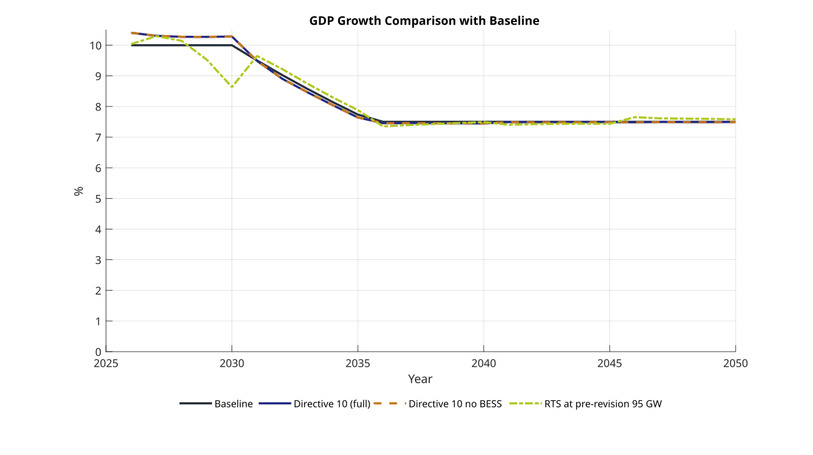

### GDP Growth

### Investment Share of GDP

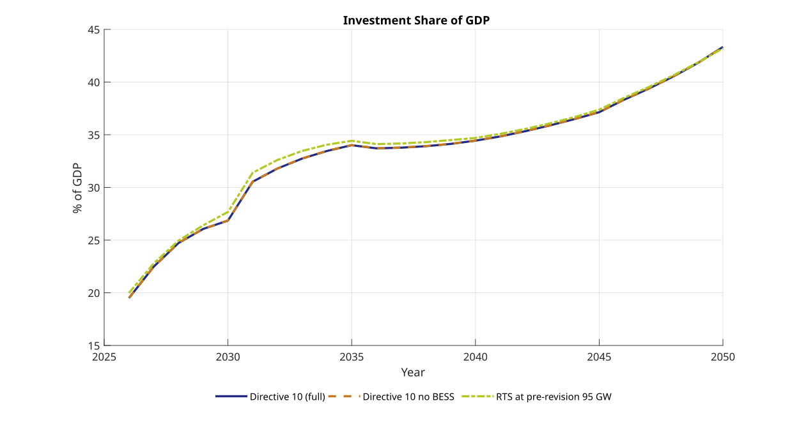

### Consumption Share of GDP

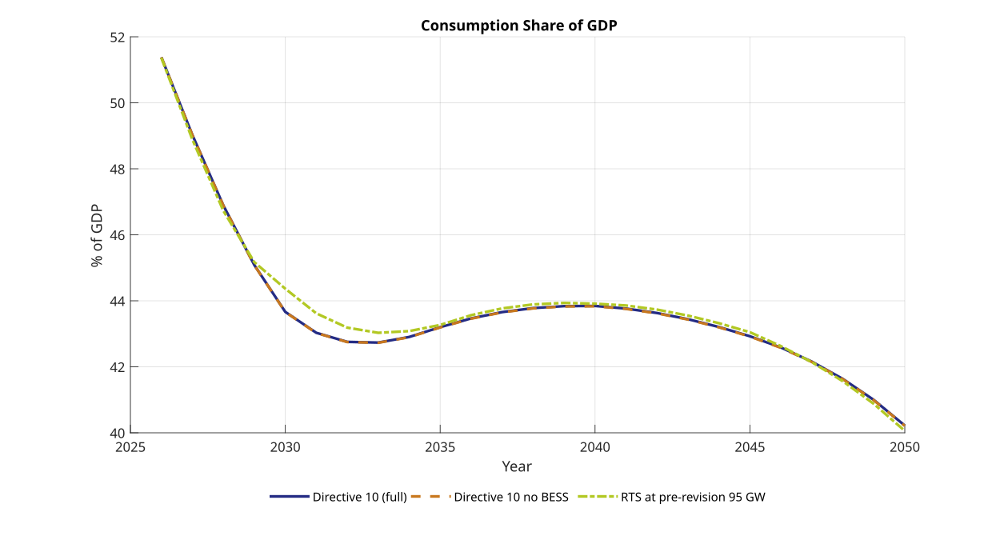

### Energy Intensity Index

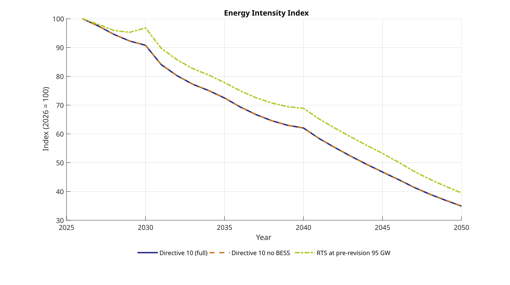

### Energy Prices Index

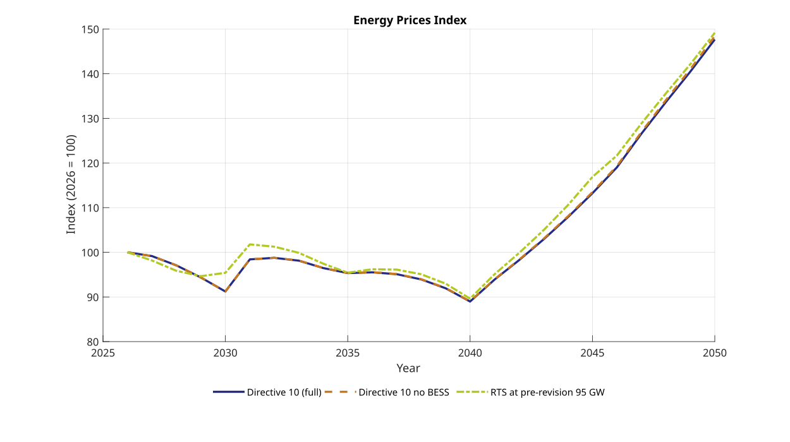

### Final Energy Demand Index

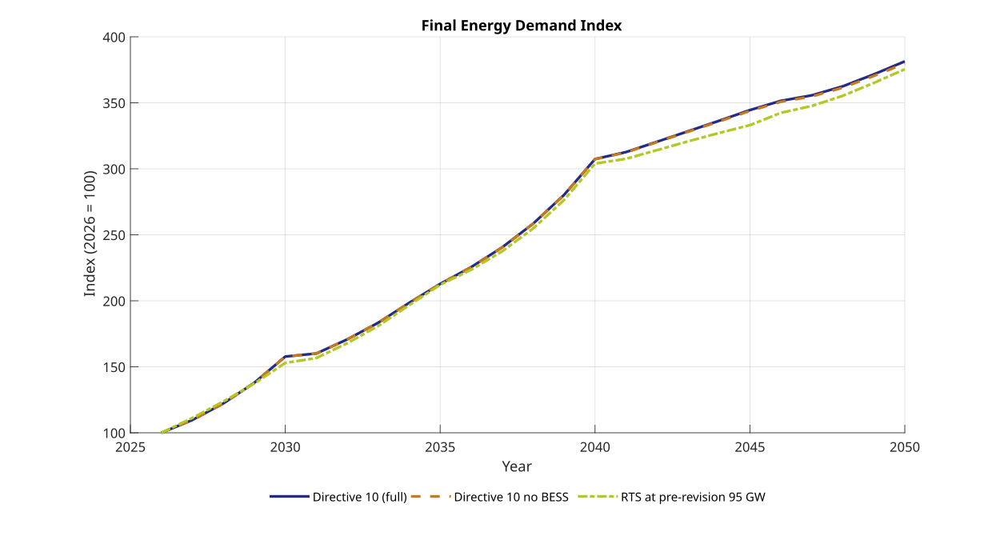

### Emissions Index

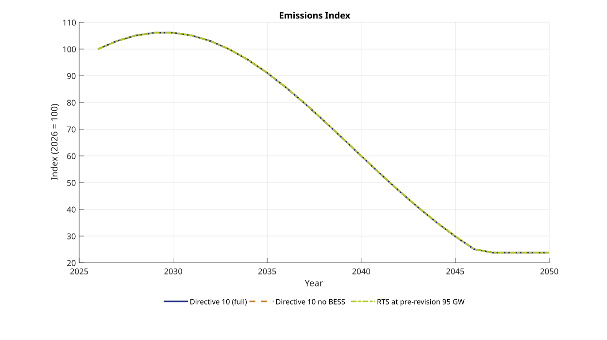

## Deviations from Baseline Plots

These charts show scenario differences relative to Baseline directly (zero line = same as Baseline).

### GDP Level Deviation from Baseline

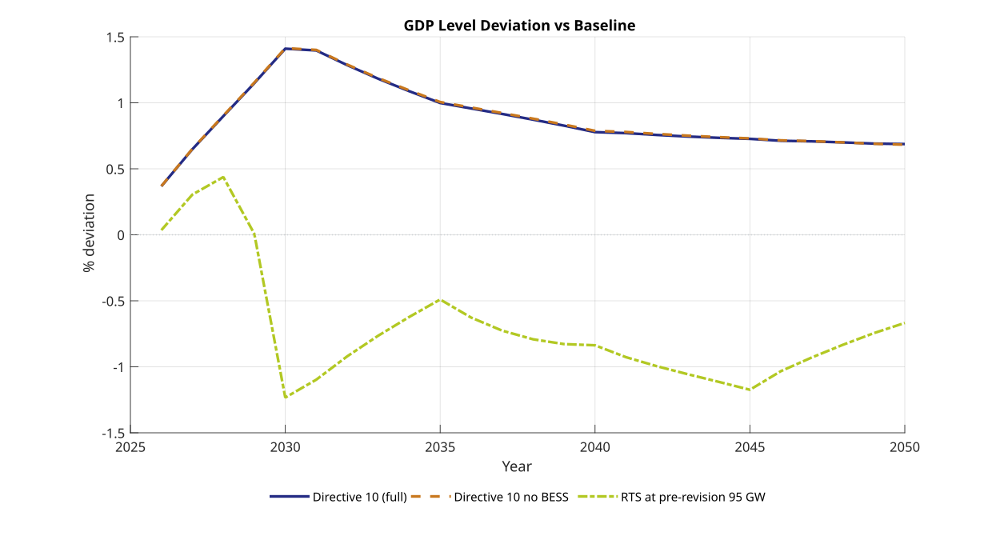

### Investment Share Deviation from Baseline

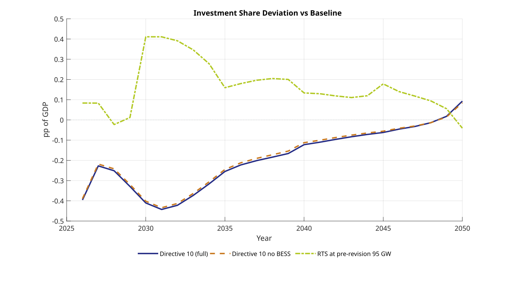

### Consumption Share Deviation from Baseline

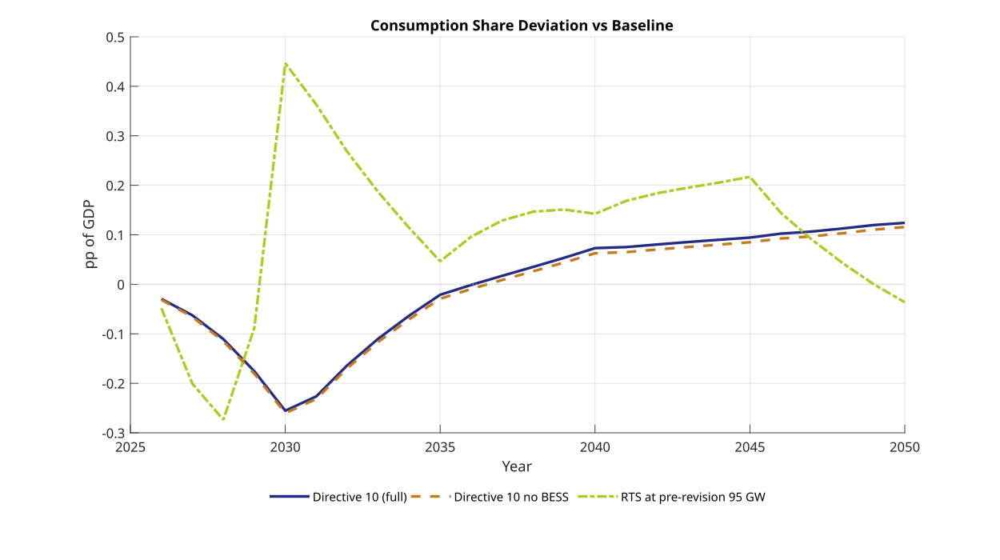

### Energy Intensity Deviation from Baseline

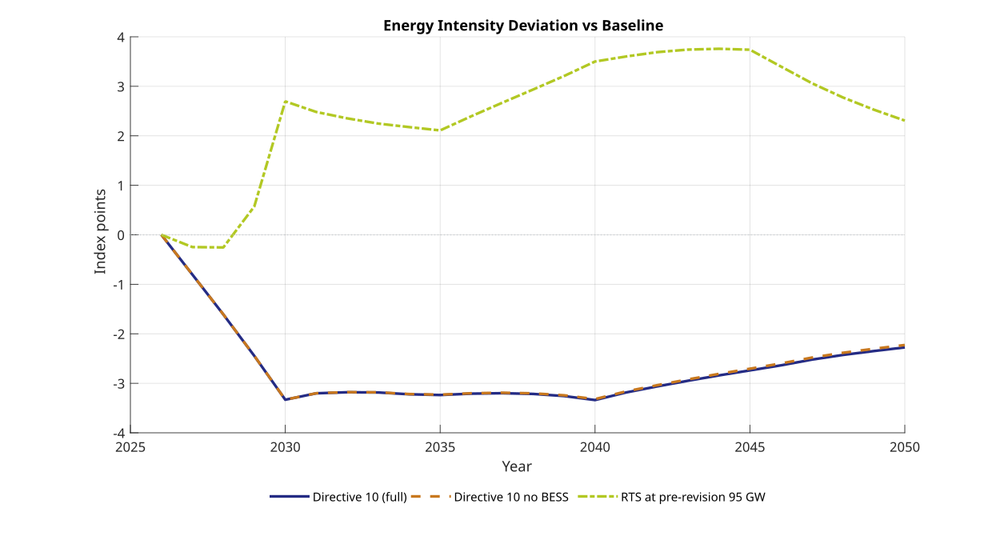

### Final Energy Demand Deviation from Baseline

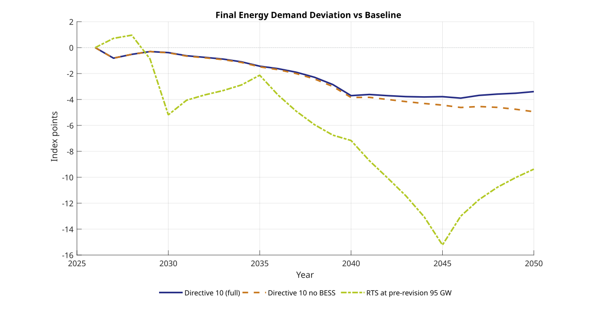

### Energy Prices Deviation from Baseline

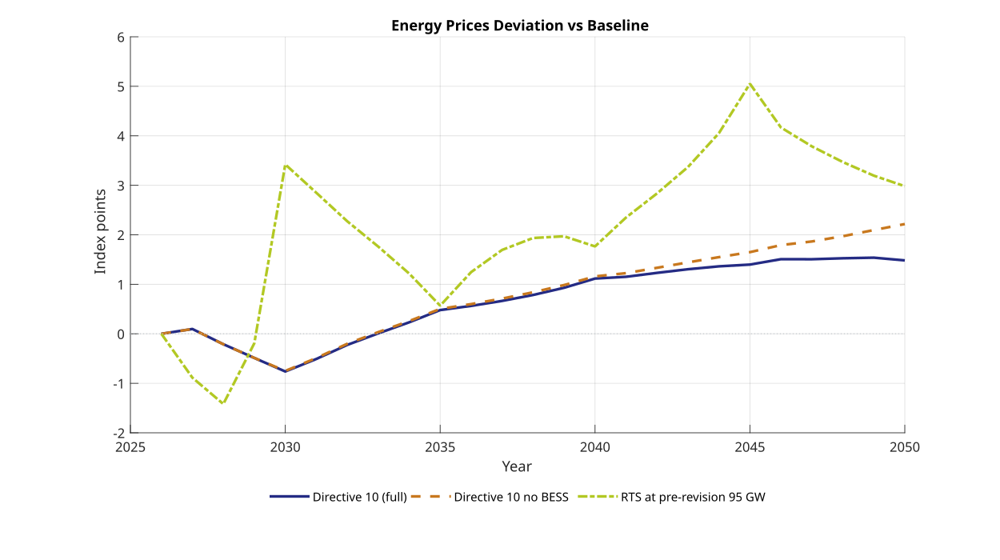

## Interpretation notes

- The near-zero gap between `EE_Directive10` and `EE_Directive10_NoBESS` in these outputs suggests BESS effects are modest for the selected macro aggregates under the current calibration/run settings.
- Identical emissions paths indicate either a shared binding constraint/policy path in these runs or scenario differences that primarily affect non-emissions channels.
- To complete the originally requested five-scenario comparison, generate and export the missing PV+BESS scenario outputs (`EE_Directive10_PV_BESS.csv` and/or `EE_PDP8_PV_BESS.csv`) and append them to this table set.