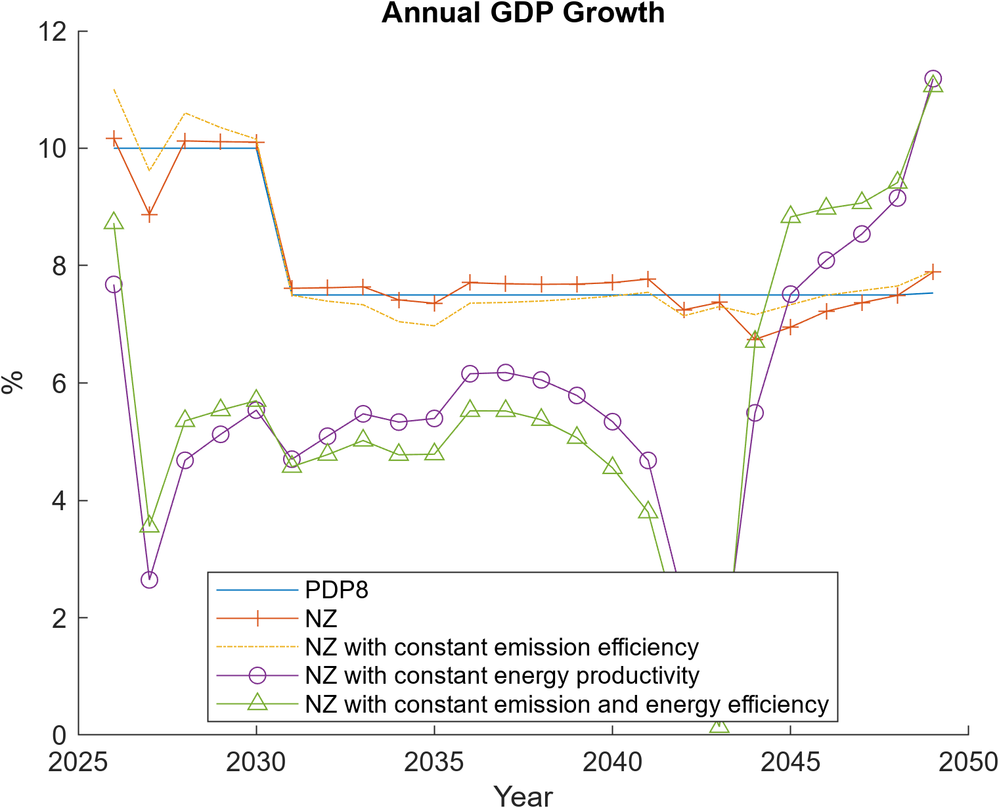

# DGE-METRIC

**DGE-METRIC** stands for **Dynamic General Equilibrium for Macroeconomic Energy Transition Incorporating Carbon Markets**.  
It is a dynamic, multi-sector macroeconomic model designed to assess the economy-wide impacts of energy transition pathways, climate risks, and carbon pricing policies.

The model builds on and extends the **DGE-CRED** framework [Dynamic General Equilibrium – Climate-Resilient Economic Development](https://github.github/schultkr/DGE-CRED "Repo: DGE-CRED")
 by explicitly incorporating:
- energy system transitions,
- emissions and carbon markets (ETS),
- and climate-related shocks to production and assets.

Welcome — this site documents the DGE implementation used to analyze macroeconomic and sectoral impacts of climate risks and energy-transition pathways.

---

## 📘 Documentation Overview

- **Project overview:** [Home](index.md)
- **Model structure & equations:** [Model documentation](model.md)
- **Scenario design & assumptions:** [Scenarios](scenario.md)
- **Calibration & data sources:** [Calibration](calibration.md)
- **How to run the model:** [Running the model](running.md)

## Where to start

- **Repository overview:** see the root `README.md`
- **Technical model description:** [Model documentation](model.md)
- **How to run scenarios:** [Running the model](running.md)

---

## What this model is for

I use the DGE-METRIC / DGE-CRED model to translate **scenario assumptions** into **economy-wide outcomes**. These assumptions may include:
- technology shifts in the energy system,
- renewable deployment and fossil phase-out pathways,
- carbon pricing and ETS design,
- climate hazard and productivity shocks,
- fiscal and policy closures.

The model produces internally consistent projections for:
- GDP, welfare, and aggregate economic activity,
- sectoral output, prices, and employment,
- investment dynamics and energy demand,
- trade balances and public finances,
- emissions and carbon-market revenues (where applicable).

---

## Repository map

- `DGE_CRED_Model/` – main scripts and Dynare integration  
- `ModFiles/` – Dynare `.mod` model files  
- `Functions/` – MATLAB helper functions  
  - steady-state computation  
  - aggregation and input–output blocks  
  - plotting and diagnostics  
- `ExcelFiles/` – input data, calibration sheets, and scenario assumptions  

---

## Suggested reading order

1. [Running the model](running.md) — how to execute simulations  
2. [Model documentation](model.md) — equations, agents, and model blocks
3. [Model calibration](calibration.md) — calibration of the model 
4. [Application](scenario.md) — interpretation and assumptions
