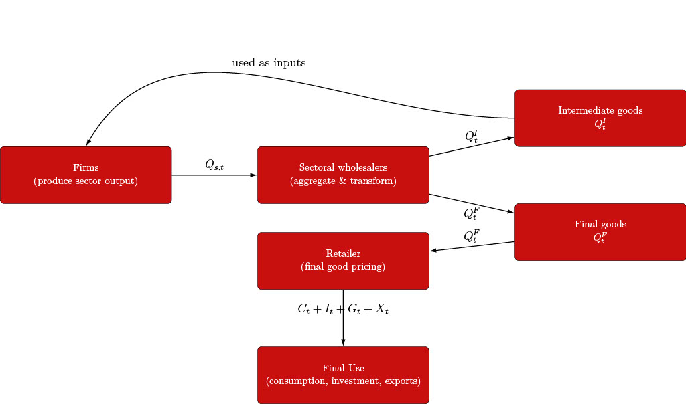

# Technical model documentation

## 📘 Documentation Overview

- **Project overview:** [Home](index.md)
- **Model structure & equations:** [Model documentation](model.md)
- **Scenario design & assumptions:** [Scenarios](scenario.md)
- **Calibration & data sources:** [Calibration](calibration.md)
- **How to run the model:** [Running the model](running.md)

---
## Core structure

- The economy consists of households, firms, a retail sector, wholesalers, a government, an emissions trading system (ETS), and the rest of the world.
- Agents interact through markets for goods, labor, capital, emissions permits, and international trade, subject to budget constraints and market-clearing conditions.

---

## Agents and blocks

### Household

A representative household derives utility from: 
- consumption $C_t$
- housing services $H_{t+1}$ and disutility from supplying labor $N_{s,t}$ in period $t$ across sectors $s \in \{1,\dots,S\}$.

$$
U(C_t, H_{t+1}, N_{s,t})
= \frac{\left(C_t^{1-\gamma} H_{t+1}^{\gamma} \right)^{ 1-\sigma^C}} {1-\sigma^C} - \sum_{s=1}^{S} A^L_{s,t} \, \phi^L_s \, \frac{ N_{s,t}^ {1+\sigma^{L} }} {1+\sigma^{L}}
$$

- Preference parameters and elasticities:

  - the preference weight of housing relative to consumption $\gamma$.
  - $\sigma^C$ determines the intertemporal elasticity of substitution in consumption.
  - $\sigma^L$ is the inverse Frisch elasticity governing the response of labor supply to real wages.
  - Labor disutility scales with sector-specific labor productivity $A^L_{s,t}$, reflecting human-capital requirements (Schultz, 1961; NBER w21381).
  - Sector-specific disutility parameters $\phi^L_s$ ensure realistic long-run labor shares across sectors.

- The household chooses the following decision variables:
  - consumption $C_t$,
  - sectoral labor supply $N_{s,t}$,
  - investment $I_{s,t}$,
  - next-period capital stocks $K_{s,t+1}$,
  - housing $H_{t+1}$,
  - and net foreign asset holdings $B_{t+1}$.

- The household maximizes discounted lifetime utility:

$$
\max \sum_{t=0}^{\infty} \beta^t U(C_t, H_{t+1}, N_{s,t})
$$ 

Subject to the following constraints:

- **Budget constraint**

$$
\text{Income}_t = \text{Expenditures}_t
$$

- **Sector-specific capital accumulation**

$$
K_{s,t+1} = (1-\delta)K_{s,t} + I_{s,t}\Gamma_{s,t} - D^K_{s,t}
$$

- **Housing accumulation**

$$
H_{t+1} = (1-\delta^H)H_t + I^H_t - D^H_t
$$

- Economic interpretation:
  - Expenditures include consumption, investment in capital and housing, and purchases of international bonds.
  - Capital accumulation depends on effective investment $I_{s,t}\Gamma_{s,t}$ and depreciates at rate $\delta$.
  - Housing depreciates at rate $\delta^H$ and increases through housing investment.
  - Both capital and housing stocks are subject to climate-related damages $D^K_{s,t}$ and $D^H_t$.

- Income sources:
  - rental income from sector-specific capital,
  - labor income across sectors,
  - returns on foreign bond holdings.
  - Foreign assets earn the world interest rate when net foreign assets are zero.
  - Borrowing costs increase with net foreign debt, while positive net foreign assets reduce effective interest rates.

### Firms

- In each sector $s$, firms choose intermediate inputs $Q^I_{s,k,t}$, labor $L_{s,t}$, and capital $K_{s,t}$ to maximize profits.

- The firm’s static profit maximization problem is:

$$ \max P^Q_{s,t} (1 - \kappa^E_{s,t} P_{E,t}) \, Q_{s,t} - \tilde{W}_{s,t} \, L_{s,t} - P^K_{s,t} \, K_{s,t} - \sum_{k=1}^{S} P^{D}_{k,t} \, Q^I_{s,k,t} $$

- Emission intensity $\kappa^E_{s,t}$ is sector specific, proportional to output $Q_{s,t}$ and can vary over time.
- Price for emissions $P_{E,t}$ are identical for each firm.  
---

### Production structure

- Final output in sector $s$ is produced from a CES aggregate of intermediate inputs $Q^I_{s,t}$ and value added $Y_{s,t}$:

$$ Q_{s,t} = \left[ (\omega^{I}_{s})^{\frac{1}{\eta^{I}_{s}}}
\left(Q^I_{s,t}\right)^{\rho^I_{s}} + (\omega^{Y}_{s})^{\frac{1}{\eta^{I}_{s}}}
\left(Y_{s,t}\right)^{\rho^I_{s}}\right]^{\frac{1}{\rho^I_{s}}}
\quad \text{for } \eta^{I}_{s} \neq 1 $$

- In the Cobb–Douglas case $\eta^{I}_{s} = 1$:

$$ Q_{s,t} = \left(A^I_{s,t} \, Q^I_{s,t}\right)^{\omega^{I}_{s}} \left(Y_{s,t}\right)^{\omega^{Y}_{s}} $$

---

### Value added

- Value added combines effective labor and capital:

$$ Y_{s,t} = A_{s,t} \left[ (\alpha^{L}_{s})^{\frac{1}{\eta^{NK}_{s}}} \left(\tilde{A}^{L}_{s,t} L_{s,t}\right)^{\rho^{NK}_{s}} + (\alpha^{K}_{s})^{\frac{1}{\eta^{NK}_{s}}} \left(K_{s,t}\right)^{\rho^{NK}_{s}} \right]^{\frac{1}{\rho^{NK}_{s}}} \quad \text{for } \eta^{NK}_{s} \neq 1 $$

- In the Cobb–Douglas case $\eta^{NK}_{s} = 1$:

$$ Y_{s,t} =
A_{s,t} \left(\tilde{A}^{L}_{s,t} L_{s,t}\right)^{\alpha^{L}_{s}}
\left(K_{s,t}\right)^{\alpha^{K}_{s}} $$

---

### Intermediate input aggregation

- The composite intermediate input is a CES aggregate of sectoral inputs:

$$ Q^I_{s,t} = \left[\sum_{k=1}^{S} (\omega^{Q}_{s,k})^{\frac{1}{\eta^{IA}_{s}}} \left(Q^I_{s,k,t}\right)^{\rho^{IA}_{s}} \right]^{\frac{1}{\rho^{IA}_{s}}} \quad \text{for } \eta^{IA}_{s} \neq 1 $$

- In the Cobb–Douglas case $\eta^{IA}_{s} = 1$:

$$ Q^I_{s,t} = \prod_{k=1}^{S} \left(Q^I_{s,k,t}\right)^{\omega^{Q}_{s,k}} $$

### Wholesaler

A representative wholesaler operates in each subsector and combines domestically produced goods with imported goods from the same subsector. These inputs are used to supply:
- intermediate goods to firms, $Q^I_{s,t}$, and
- final goods to retailers, $Q^F_{s,t}$.

The wholesaler chooses domestic inputs $Q^D_{s,t}$ and imported intermediate inputs $M^I_{s,t}$ to maximize profits:

$$ \max \; P^{D}_{s,t} Q^{D,U}_{s,t} - P^Q_{s,t} Q^D_{s,t} - P^M_{s,t} M^I_{s,t} $$

where domestically used sectoral output is defined as:

$$ Q^{D,U}_{s,t} \equiv Q^I_{s,t} + Q^F_{s,t} $$

Domestic use is a CES aggregate of domestic production and imported intermediates. For $\eta^Q_s \neq 1$:

$$ Q^{D,U}_{s,t} = \left[(\omega^{Q}_{s})^{\frac{1}{\eta^{Q}_{s}}}
(Q^{D}_{s,t})^{\frac{\eta^{Q}_{s}-1}{\eta^{Q}_{s}}} + (\omega^{M}_{s})^{\frac{1}{\eta^{Q}_{s}}}
(M^{I}_{s,t})^{\frac{\eta^{Q}_{s}-1}{\eta^{Q}_{s}}} \right]^{\frac{\eta^{Q}_{s}}{\eta^{Q}_{s}-1}} $$

In the Cobb–Douglas case $\eta^Q_s = 1$:

$$ Q^{D,U}_{s,t} = (Q^{D}_{s,t})^{\omega^{Q}_{s}} (M^{I}_{s,t})^{\omega^{M}_{s}} $$

The elasticity $\eta^Q_s$ governs substitution between domestic and imported inputs and is sector-specific. The parameters $\omega^Q_s$ and $\omega^M_s$ determine the home bias in each subsector.

Overall, the wholesaler acts as an intermediary, ensuring the appropriate mix of domestic and imported goods is available to meet downstream demand.

---

### Retailer

A representative retailer supplies final goods and services to households and the government. The retailer is a price taker and satisfies total final demand:

$$ D^F_t \equiv C_t + I_t + G_t, \quad \text{with } G_t = I^G_t + C^G_t .$$

To meet final demand, the retailer combines:
- imports for final use, $M^F_{s,t}$, and
- domestically produced goods for final use, $Q^{D,F}_{s,t}$.

We explicitly distinguish imports used for final demand ($M^F_{s,t}$) from imports used as intermediate inputs ($M^I_{s,t}$), consistent with input–output data and firms’ adaptive sourcing behavior.

The retailer maximizes profits:

$$ \max \; P_t D^F_t - \sum_s P^M_{s,t} M^F_{s,t} - \sum_s P^D_{s,t} Q^{D,F}_{s,t} $$

Final demand is a CES aggregate of total imports and domestic goods. For $\eta^F \neq 1$:

$$ D^F_t = \left[(\omega^F)^{\frac{1}{\eta^F}} (M^F_t)^{\rho^F} + (1-\omega^F)^{\frac{1}{\eta^F}} (Q^U_t)^{\rho^F} \right]^{\frac{1}{\rho^F}} $$

and for $\eta^F = 1$:

$$ D^F_t = (M^F_t)^{\omega^F} (Q^U_t)^{1-\omega^F} $$

Aggregate imports for final use are given by:

$$ M^F_t = \left[ \sum_{s=1}^S (\omega^{M,F}_s)^{\frac{1}{\eta^Q}}
(M^F_{s,t})^{\frac{\eta^Q-1}{\eta^Q}} \right]^{\frac{\eta^Q}{\eta^Q-1}}, \quad \eta^Q \neq 1 $$

and by a Cobb–Douglas aggregate if $\eta^Q = 1$:

$$ M^F_t = \prod_{s=1}^S (M^F_{s,t})^{\omega^{M,F}_s} $$

Domestic goods for final use are aggregated analogously:

$$ Q^U_t = \left[\sum_s (\omega^{D,F}_s)^{\frac{1}{\eta^Q}} (Q^{D,F}_{s,t})^{\frac{\eta^Q-1}{\eta^Q}} \right]^{\frac{\eta^Q}{\eta^Q-1}}, \quad \eta^Q \neq 1 $$

or, if $\eta^Q = 1$:

$$ Q^U_t = \prod_s (Q^{D,F}_{s,t})^{\omega^{D,F}_s} $$ 

The elasticity $\eta^F$ governs substitution between domestic and foreign final goods, while $\eta^Q$ determines substitution across subsectors. The parameters $\omega^F$, $\omega^{M,F}_s$, and $\omega^{D,F}_s$ define expenditure shares at equal prices.

---

### Exporter

The exporter aggregates subsectoral exports $X_{s,t}$ into a single export good $X_t$ sold to the rest of the world at price $P^Q_t$.

The exporter solves:

$$ \max \; P^Q_t X_t - \sum_s P^Q_{s,t} X_{s,t} $$

Exports are combined using a CES technology. For $\eta^X \neq 1$:

$$ X_t = \left[ \sum_{s=1}^S (\omega^X_s)^{\frac{1}{\eta^X}} (X_{s,t})^{\frac{\eta^X-1}{\eta^X}} \right]^{\frac{\eta^X}{\eta^X-1}} $$

and in the Cobb–Douglas case $\eta^X = 1$:

$$X_t = \prod_{s=1}^S (X_{s,t})^{\omega^X_s} $$

The exporter thus acts as the retailer for foreign markets, aggregating domestic production into a single export good independently of foreign production conditions.

## Government

Fiscal policy follows standard reduced-form rules for taxation and public borrowing, while government expenditure is determined by a budget constraint (see e.g. CMR 2014; Drygalla et al. 2020; Leeper 2010; Kliem 2014).

The government collects revenues from:
- consumption taxes, $\tau^C_t C_t$,
- labor income taxes paid by households and firms,
- capital income taxes,
- and revenues from the emissions trading system (ETS).

Labor income tax revenues are given by:

$$
\sum_{s=1}^S
(\tau^L_t + \tau^{L,F}_{s,t})
\, W_{s,t} \, N_{s,t} \, LF_t
$$

Capital income tax revenues are:

$$
\sum_{s=1}^S
(\tau^{K,H}_t + \tau^{K,F}_{s,t})
\, P_{s,t} \, r_{s,t} \, K_{s,t}
$$

Consumption tax revenues equal:

$$
\tau^C_t \, C_t
$$

### Emissions Trading System (ETS)

Under the ETS, firms are required to hold allowances for their emissions. Government revenues from the ETS are given by the value of auctioned permits:

$$ R^{ETS}_t = P^E_t \, \sum_s E_{s,t} = P^E_t \, \sum_s \kappa^E_{s,t} Q_{s,t}  $$

where $P^E_t$ denotes the carbon price and $E_t$ aggregate emissions covered by the ETS. Revenues from the ETS accrue fully to the government budget.

### Government borrowing

To finance expenditures, the government can borrow internationally. Government debt is denoted by $B^G_t$, with $B^G_{t+1} < 0$ indicating net borrowing. Outstanding debt is serviced at the world interest rate $r^f_t$, denominated in foreign currency and adjusted by the nominal exchange rate $\pi^S_t$. The interest rate faced by the government is identical to that faced by households.

### Government budget constraint

The government budget constraint is given by:

$$ G_t + Tr_t + B^G_{t+1} = \sum_{s=1}^S \Big[(\tau^{K,H}_t + \tau^{K,F}_{s,t}) \, P_{s,t} \, r_{s,t} \, K_{s,t} + (\tau^L_t + \tau^{L,F}_{s,t}) \, W_{s,t} \, N_{s,t} \, LF_t\Big] + \tau^C_t \, C_t + R^{ETS}_t + (1+r^f_t)\,\pi^S_t\,\phi^B_t\, B^G_t $$

where $G_t$ denotes government expenditures on goods and services, $Tr_t$ lump-sum transfers to households, and $\phi^B_t$ captures potential risk premia on government borrowing.

### Fiscal policy assumptions

In contrast to models with endogenous fiscal feedback rules, tax rates on consumption, labor, and capital are assumed to be constant over time. As a result, government financing does not respond endogenously to climate damages, economic fluctuations, or changes in emissions. Any variation in government revenues due to climate policy arises exclusively through changes in tax bases and ETS revenues.

### External sector

- Imports/exports, trade balance closure

- Exchange rate / numeraire conventions (document your choice)

