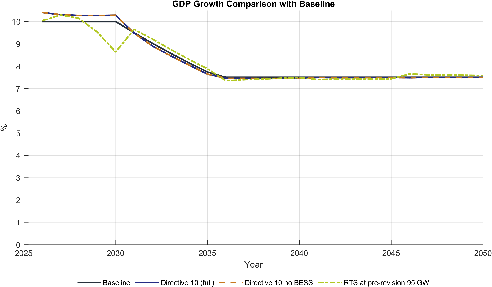
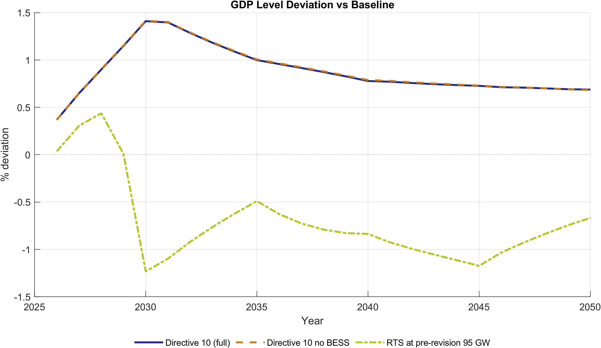
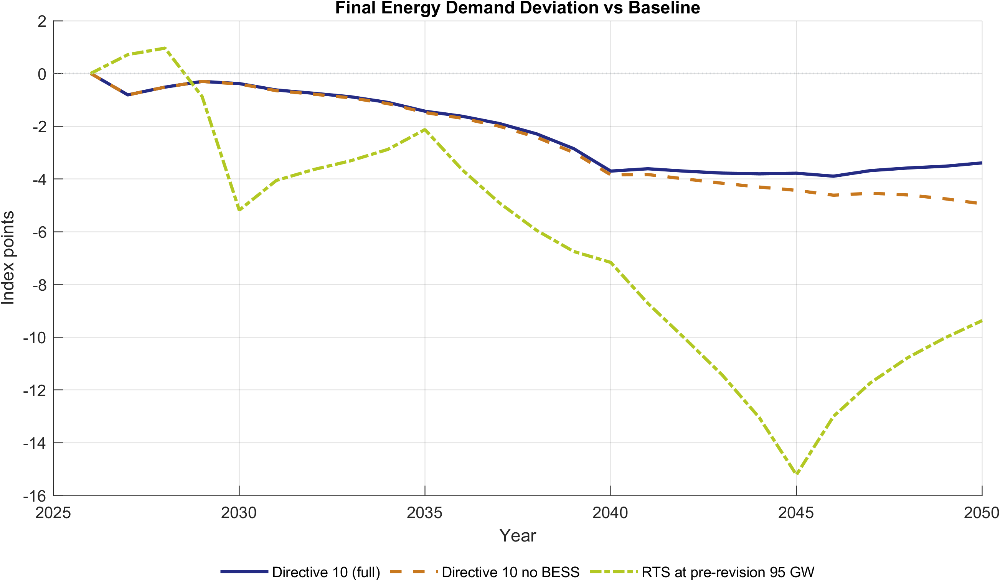
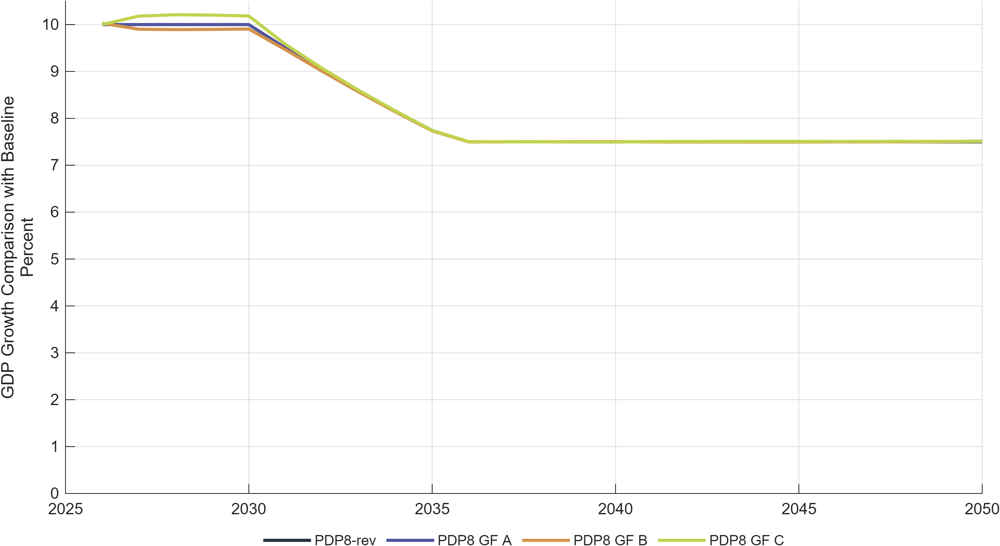
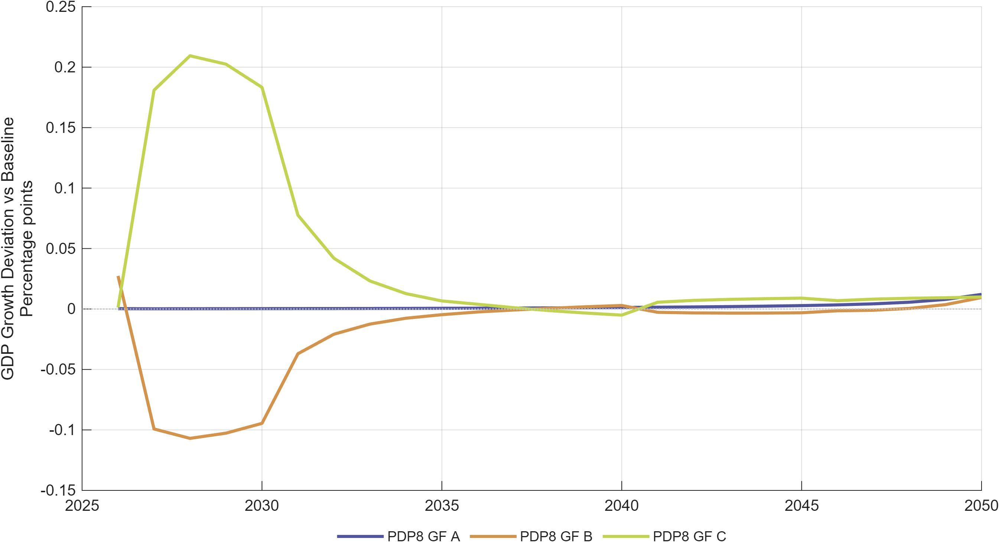
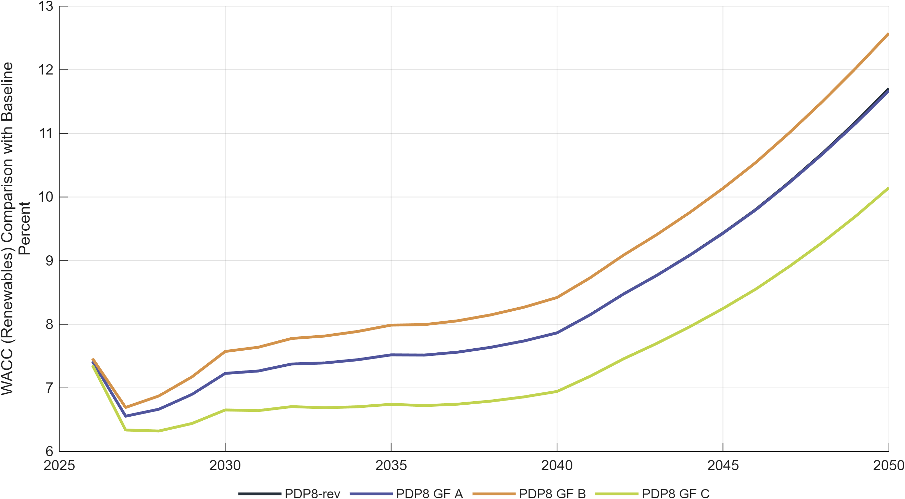
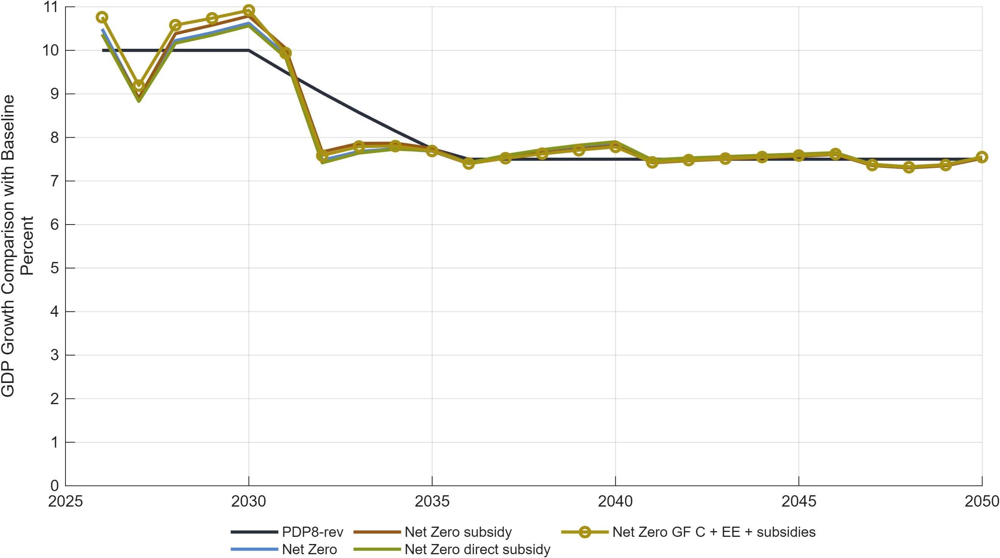
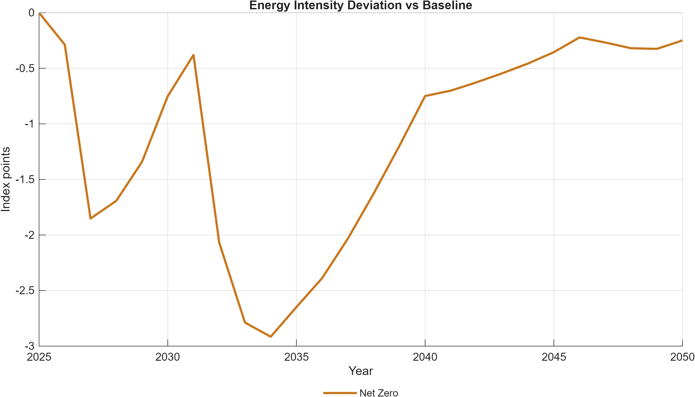

# Results Gallery

Key figures from DGE-METRIC scenario simulations. All figures are also embedded in the presentation slide decks:
[EE scenarios](../presentations/EE_Scenario_Presentation/README.md) | [Finance scenarios](../presentations/Finance_Scenario_Presentation/README.md) | [Net-Zero scenarios](../presentations/NZ_Scenario_Presentation/README.md)

For interpretation and policy takeaways, see the [Energy Efficiency use case](use_cases_ee.md) and the [Green Finance use case](use_cases_finance.md).

---

## Energy efficiency scenarios

### GDP growth: EE scenarios vs baseline

*Average GDP growth rates for EE_PDP8 and EE_Directive10 compared to the PDP8 baseline. Both scenarios deliver a small positive growth dividend; the higher-ambition Directive 10 target yields a larger return.*

---

### GDP level gain vs baseline

*Cumulative GDP level gain relative to the PDP8 baseline. EE_Directive10 reaches roughly 0.5 percentage points higher GDP by 2040 compared to EE_PDP8, for an additional investment cost of approximately USD 100–150 million per year.*

---

### Energy intensity

*Reduction in economy-wide energy intensity relative to the PDP8 baseline. Directive 10 delivers approximately 1.9 percentage points lower energy intensity by 2030, widening to about 1.6 percentage points by 2040.*

---

### Final energy demand

*Total final energy demand relative to the PDP8 baseline. Lower demand reduces the scale of the required energy build-out and eases the investment financing burden.*

---

### Emissions

*Emissions trajectories across EE scenarios. Without a binding carbon constraint, EE improvements lower energy intensity but do not directly reduce the emissions path — an active carbon market (the Net-Zero scenario) is required for the emissions benefit to materialise.*

---

## Green finance scenarios

### GDP growth: financing structures vs baseline

*GDP growth rates under three financing architectures (GF_A balanced, GF_B market-led, GF_C public-led) compared to the PDP8 baseline. Cheaper capital delivers a measurable growth premium that is largest in the pre-2035 investment-intensive window.*

---

### GDP growth deviation from baseline

*Year-by-year GDP growth premium (or penalty) relative to the PDP8 baseline under each financing scenario. Public-led concessional finance (GF_C, WACF 5.1%) consistently outperforms market-led finance (GF_B, WACF 7.4%).*

---

### Cost of capital for renewable investment

*Effective financing cost (WACC) for renewable energy investment under each scenario. The 2-percentage-point spread between GF_C and GF_B translates into approximately USD 3 billion per year in avoided annual financing costs at the USD 136 billion investment scale.*

---

## Net-Zero scenarios

### GDP growth: Net-Zero vs baseline

*GDP growth under the Net-Zero scenario (binding ETS cap to 2050) and decomposition variants compared to the PDP8 baseline. The net-zero constraint imposes a modest but persistent transition cost.*

---

### GDP level deviation: Net-Zero vs baseline

*Cumulative GDP level cost of the net-zero transition relative to the PDP8 baseline. Decomposition variants (constant efficiency, constant intensity) show how much of the cost is attributable to fuel-switching versus energy efficiency channels.*

---

### Emissions under Net-Zero

*Emissions trajectories for all Net-Zero scenario variants. The binding cap forces accelerated emissions decline; the decomposition shows the relative contribution of ETS pricing, fuel-switching, and efficiency improvements to the overall reduction.*

---

### Energy intensity under Net-Zero

*Economy-wide energy intensity relative to the PDP8 baseline under the Net-Zero path. The ETS carbon price accelerates efficiency investment beyond what PDP8 alone induces, amplifying the energy intensity decline.*

---

## Further reading

- [Use case: Energy Efficiency](use_cases_ee.md) — full results and policy takeaways
- [Use case: Green Finance](use_cases_finance.md) — full results and policy takeaways
- [Scenarios at a glance](scenarios_overview.md) — scenario descriptions and logic
