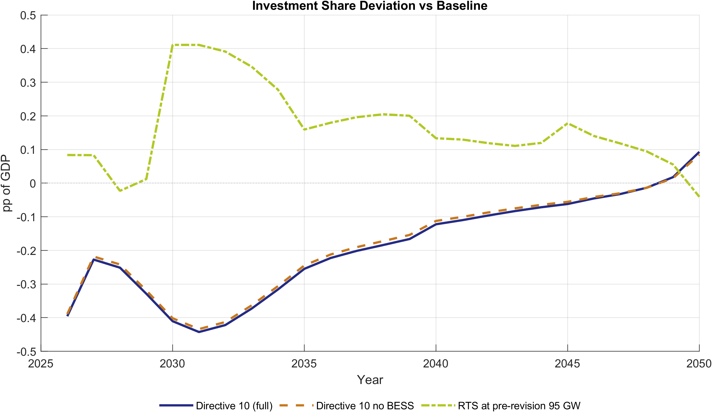
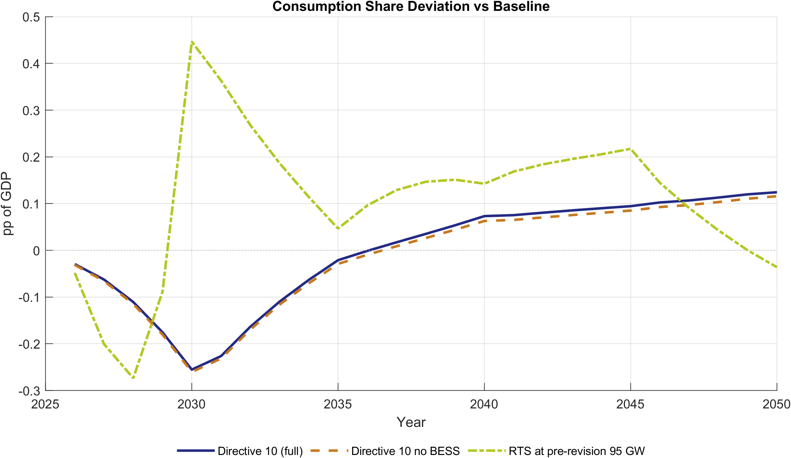
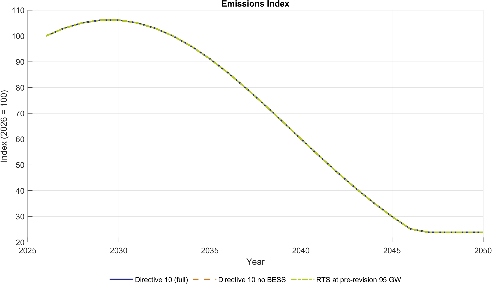

# Use Case: Energy Efficiency Scenarios

This page walks through the energy efficiency (EE) scenario family — what policy question it addresses, how the scenarios are constructed, and what the model results show.

---

## Policy question

> **If Vietnam accelerates energy efficiency in industry and services — beyond what PDP8 already assumes — what are the macroeconomic consequences?**

A secondary question is the role of battery energy storage systems (BESS):

> **How much of the efficiency gain is attributable specifically to BESS integration, and how much comes from direct efficiency improvements?**

---

## Scenarios in this family

| Scenario | Ambition level | BESS included? |
|---|---|---|
| `EE_PDP8` | PDP8 efficiency targets (moderate) | Yes |
| `EE_Directive10` | PM Directive 10/CT-TTg (high) | Yes |
| `EE_PDP8_PV_BESS_NoBESS` | PDP8 efficiency targets | No (BESS channels reset to baseline) |
| `EE_Directive10_NoBESS` | PM Directive 10/CT-TTg | No |

All four scenarios run on the PDP8 policy baseline — no binding carbon constraint is active. They are compared to each other and to the Baseline.

---

## How efficiency enters the model

Efficiency improvements are represented through two channels:

**1. Energy productivity shock** (`exo_AI`): Firms in industry (sector 4) and services (sector 5) produce the same output with less energy input. Formally, a rising `exo_AI_s` reduces the energy intensity of output — less fossil and renewable grid energy is needed per unit of value-added.

The mapping from expert inputs uses:

```
dAI = ln(1 / (1 - saving_pct / 100))
```

For example, a 7.4% industry saving translates to a log-increment of approximately 0.077 added to the baseline AI path.

**2. Adaptation capital cost channel** (`exo_GA`): EE and rooftop solar (RTS) investments require upfront capital expenditure that is not fully reflected in standard sectoral investment. This creates a cost that temporarily reduces consumption-available resources before the efficiency gains materialize.

The NoBESS counterfactual resets BESS-specific GA contributions to baseline while keeping the EE productivity gains. The difference (Full − NoBESS) therefore isolates the BESS contribution to investment cost and energy supply.

---

## Expert inputs (PDP8 EE targets)

Source: `ExcelFiles/PDP8/Vietnam_EnergyExpert_ScenarioInputs - Adjust_2505.xlsx`

| Sector | Reported saving by 2030 | Annual EE investment |
|---|---|---|
| Industry | ~7.4% of sectoral energy | ~USD 248m/year |
| Services | ~5.1% of sectoral energy | ~USD 113m/year |
| Households | ~11.6% (modeled via GA channel) | — |
| **Total** | — | **~USD 361m/year (≈0.076% of GDP)** |

The Directive 10 scenario uses higher saving percentages calibrated to Vietnam's own Prime Minister Directive 10/CT-TTg targets, resulting in a steeper AI path and larger investment cost in the early period.

---

## Key results

### EE simulation impact pathway (results-based)

This pathway diagram is aligned to the EE simulation outputs and summarizes how EE shocks propagate to the reported macro and energy outcomes.


### GDP level

EE scenarios deliver a **modest positive GDP effect** throughout the horizon. More efficient energy use frees resources for productive investment and consumption. The effect is larger for Directive 10 than PDP8.

| Scenario vs. EE_PDP8 | GDP level gain 2030 | GDP level gain 2040 | GDP level gain 2050 |
|---|---|---|---|
| EE_Directive10 | +0.44% | +0.58% | +0.45% |
| EE_Directive10_NoBESS | +0.44% | +0.57% | +0.46% |
| EE_PDP8_PV_BESS_NoBESS | +0.22% | +0.26% | +0.21% |

Average GDP growth across 2026–2050 is slightly higher for Directive 10 variants (8.04%) vs EE_PDP8 (8.02%), indicating a small but consistent efficiency dividend.

### Investment share of GDP

Higher-ambition EE scenarios raise the investment share modestly in the near term (additional EE capital), and converge toward the PDP8 path by mid-horizon. By 2050 the differences are negligible (under 0.02 pp).



### Consumption share of GDP

Consumption share is slightly lower in high-EE scenarios in the near term (investment crowds out consumption) and slightly higher by mid-horizon as the efficiency gains reduce energy costs. The magnitude is small: at most −0.09 pp in 2030, recovering by 2040.



### Energy intensity

The most visible EE effect is on energy intensity. Directive 10 delivers a roughly **1.9 pp lower energy intensity index** by 2030 compared to EE_PDP8, widening to about 1.6 pp by 2040.


### Emissions

Emissions are **identical across all four EE scenarios** at all key years (2030, 2040, 2050). This is a crucial finding: the EE scenarios do not model a binding carbon constraint. Higher efficiency reduces energy intensity and final energy demand, but the baseline emissions path is governed by exogenous emission coefficients, not a cap. To see the emissions reduction from EE, these scenarios must be combined with the Net-Zero (NZ) scenario or interpreted alongside a carbon-market scenario.



### BESS contribution

The difference between `EE_Directive10` and `EE_Directive10_NoBESS` is small in macro aggregates (GDP level gap ≤0.013 pp by 2050), suggesting that **BESS contributes primarily through energy supply reliability and grid stability** rather than through aggregate GDP effects. The investment cost difference is also small (under 0.01 pp of GDP share).

---

## Key takeaways for policymakers

1. **EE is a low-cost GDP positive lever.** Under both PDP8 and Directive 10 ambition, energy efficiency improvements increase GDP levels throughout the horizon with only a small near-term investment-consumption trade-off.

2. **Scaling up ambition (Directive 10) raises the return further.** Moving from PDP8 to Directive 10 targets increases the GDP gain by roughly one percentage point at key years, for an additional investment cost of approximately USD 100–150m/year.

3. **EE alone does not reduce emissions under PDP8.** Emissions paths are identical across EE variants on the PDP8 baseline. EE's emissions benefit requires an active carbon constraint (the NZ scenario) to materialize in model results.

4. **BESS matters for grid reliability, less for aggregate macro outcomes.** The NoBESS counterfactuals show that removing BESS from the scenario has negligible macro effects, which means the case for BESS investment rests on energy system reliability, not on aggregate GDP effects.

---

## Figures from the slide deck

The Beamer presentation for EE scenarios (compiled from `docs/EE_Scenario_Presentation/`) includes:

- GDP growth comparison across all four EE variants vs Baseline
- Investment and consumption share paths
- Energy intensity and final energy demand indices
- 5-year average deviation charts for a smoother visual

To recompile: see [EE Scenario Presentation README](../presentations/EE_Scenario_Presentation/README.md).

---

## Further reading

- [Scenarios at a glance](scenarios_overview.md)
- [EE scenario design (implementation)](../scenario_notes/ee_scenario_design.md) — variable mapping, BESS channel construction
- [EE scenario results data (dated)](../implementation_plans/ee_simulation_scenarios_results.md) — full tables and figure references
- [EE workbook comparison (dated)](../implementation_plans/ee_scenarios_workbook_comparison.md) — workbook structure and named ranges
- [Use case: Green Finance](use_cases_finance.md) — the complementary financing scenario family
