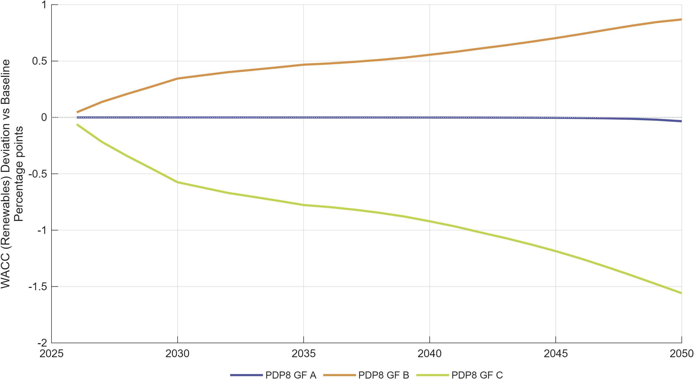

# Use Case: Green Finance Scenarios

This page walks through the green finance scenario family — the policy question, how financing structures are modeled, and what the results show.

---

## Policy question

> **Does the architecture of green finance — who provides capital, at what cost — materially change the macroeconomic trajectory of Vietnam's energy transition?**

More specifically:
- Is a 1–2 percentage point difference in the Weighted Average Cost of Finance (WACF) economically significant at the scale of PDP8 investment?
- Does cheaper concessional/public-led finance generate a measurable GDP or investment dividend?
- How does financing structure interact with a binding carbon constraint (Net-Zero)?

---

## Background: the green finance gap

Vietnam's PDP8 investment program requires approximately **USD 136 billion** in energy sector capital between 2026 and 2050. The source and cost of this capital varies substantially across financing architectures:

| Instrument type | Typical cost | Provider |
|---|---|---|
| ODA/MDB concessional loans | 2–4% | World Bank, ADB, bilateral |
| Blended public-private tranches | 4–6% | Development banks + commercial |
| Sovereign/quasi-sovereign green bonds | 5–7% | Government, SOEs |
| Corporate green bonds | 6–8% | Private energy companies |
| Commercial bank credit | 8–10% | Domestic/international banks |

Currently, Vietnam's energy project financing is dominated by commercial and domestic credit at the higher end of this range. Scaling up concessional and blended instruments could reduce the effective WACF by 1–2 percentage points — which at USD 136 billion translates to USD 1–3 billion per year in reduced annual financing costs.

Source: IWH Financial Assessment (2025); GIZ finance instruments analysis (`ExcelFiles/PDP8/Vietnam_Green_Finance_Scenarios_April2026.xlsx`).

---

## The three financing scenarios

| Scenario | Short name | Structure | WACF | Annual cost difference vs GF_B |
|---|---|---|---|---|
| Balanced finance | `GF_A` | ODA/MDB + blended + green bonds in equal shares | 6.43% | −USD 1.28bn/year |
| Market-led finance | `GF_B` | Predominantly commercial/private capital | 7.37% | Baseline for comparison |
| Public-led finance | `GF_C` | ODA and concessional dominant | 5.07% | −USD 3.13bn/year |

Each scenario runs on **both the PDP8 baseline and the Net-Zero path**, giving six finance runs in total:

- `PDP8_GF_A`, `PDP8_GF_B`, `PDP8_GF_C`
- `NZ_GF_A`, `NZ_GF_B`, `NZ_GF_C`

---

## How financing enters the model

Finance instruments are not modeled as named balance-sheet items. Instead they enter as **reduced-form cost-of-capital and investment-price shocks** on specific channels:

| Finance channel | Model variable | Economic interpretation |
|---|---|---|
| Public/concessional rate | `exo_r_G_s` | Cost of government-intermediated capital for energy investment |
| FDI/foreign finance rate | `exo_r_FDI_s` | Cost of international private capital flows |
| Investment price/friction | `exo_P_K_s` | Effective purchase price of new energy capital goods |
| Public capital volume | `exo_K_G_s`, `exo_s_G_s` | Scale of public and semi-public investment in the sector |

A lower WACF is mapped into lower values on the relevant rate channel(s). The model then solves for the endogenous investment, consumption, and GDP response to this rate change across the 25-year horizon.

**Limitation:** The model cannot distinguish the institutional source of financing (which specific instrument or window). The scenario effect is the aggregate macro consequence of lower effective capital costs — not a tool-by-tool breakdown.

---

## Key results

### WACC for renewables

The most direct effect of financing architecture is on the cost of renewable energy investment. Lower WACF → lower WACC for renewables → higher renewable capital formation.

The GF_C (public-led) scenario sustains the largest reduction in renewable WACC throughout the horizon. GF_B (market-led) remains closest to the no-intervention baseline.

### GDP growth

GDP growth responds to financing architecture, but the effect is moderate in magnitude.

The channel runs as follows: lower WACF → lower investment cost → higher investment in renewables → higher productive capital stock → higher output over the medium term. The near-term effect can be slightly negative (higher investment displaces consumption in the near term) with the payoff coming after capital comes online.

**5-year average view:** The 5-year smoothed deviation shows that the GF_C advantage over GF_B builds through the 2030s as the lower-cost capital stock accumulates.

---

## Interaction with Net-Zero

When the financing scenarios are run on the NZ baseline (NZ_GF_A/B/C), the financing effect is amplified. Under NZ, investment requirements are larger (binding carbon cap forces faster renewable build-out) and the cost of capital is more binding. A 2 pp reduction in WACF therefore has a larger absolute effect on investment and GDP under NZ than under PDP8.

This interaction has an important policy implication: **the value of concessional finance is higher under more ambitious climate policy, not lower**. Instruments that reduce financing costs are complementary to, not substitutes for, carbon pricing.

---

## Key takeaways for policymakers

1. **Financing architecture is not secondary.** A shift from market-led to public-led financing (GF_B to GF_C) reduces annual financing costs by approximately USD 3 billion, which compounds into a measurable GDP gain over the transition horizon.

2. **The concessional finance premium grows under climate ambition.** Running GF_C under Net-Zero generates larger GDP dividends than running it under PDP8 alone. This means development partners and MDBs have higher impact in more ambitious policy environments.

3. **Volume matters alongside price.** The model shows that simply lowering the cost-of-capital rate is not sufficient if investment volumes do not materialize. Scenarios that combine low WACF with capital-volume targets (e.g., public capital path shocks) outperform rate-only scenarios.

4. **Reduced-form vs instrument design.** The model results can be interpreted as the *upper bound* of what financing instruments achieve if fully deployed. Whether blended finance structures, green bond markets, or guarantee programs can reliably produce the assumed cost reductions at scale requires institutional feasibility analysis beyond the model's scope.

---

## Scenario implementation status

The scenario names and switch logic for `PDP8_GF_A/B/C` and `NZ_GF_A/B/C` are
fully wired in `RunSimulations.m` (`scenarioGroups.GF_PDP8`,
`scenarioGroups.GF_NZ`) — the figures in this page were produced by a run
with those groups included in `activeScenarioGroups` (they are not part of
the default `{'Reference'}` set, so a plain `RunSimulations` call will not
reproduce them). Before re-running or extending these scenarios, confirm:

1. Whether `ExcelFiles/ModelScenarios5Sectorsand1Regions.xlsx` already carries
   the WACF-derived shock paths, or whether they still need to be translated
   from `Vietnam_Green_Finance_Scenarios_April2026.xlsx`.
2. That `activeScenarioGroups` (or `DGE_SCENARIO_GROUPS`) includes `GF_PDP8`
   and/or `GF_NZ` for the run that regenerates these figures.
3. Regenerate figures with `scripts/reporting/generate_finance_simulation_results_figures.m`.

See [Finance instruments feasibility](../scenario_notes/finance_instruments_comments_feasibility.md) for the full comment-by-comment implementation assessment.

---

## Figures from the slide deck

The Beamer presentation for finance scenarios is in `docs/Finance_Scenario_Presentation/finance_instruments_presentation.tex`. It includes:

- WACC comparison across GF scenarios
- GDP growth deviations from baseline
- Scenario narrative framing for each of the three financing architectures

To recompile figures: `scripts/reporting/generate_finance_simulation_results_figures.m`
To recompile slides: see [Finance Scenario Presentation README](../presentations/Finance_Scenario_Presentation/README.md).

---

## Further reading

- [Scenarios at a glance](scenarios_overview.md)
- [Finance instruments feasibility](../scenario_notes/finance_instruments_comments_feasibility.md)
- [Vietnam context: the financing gap](vietnam_context.md)
- [Use case: Energy Efficiency](use_cases_ee.md) — demand-side complement to this supply-side financing story
