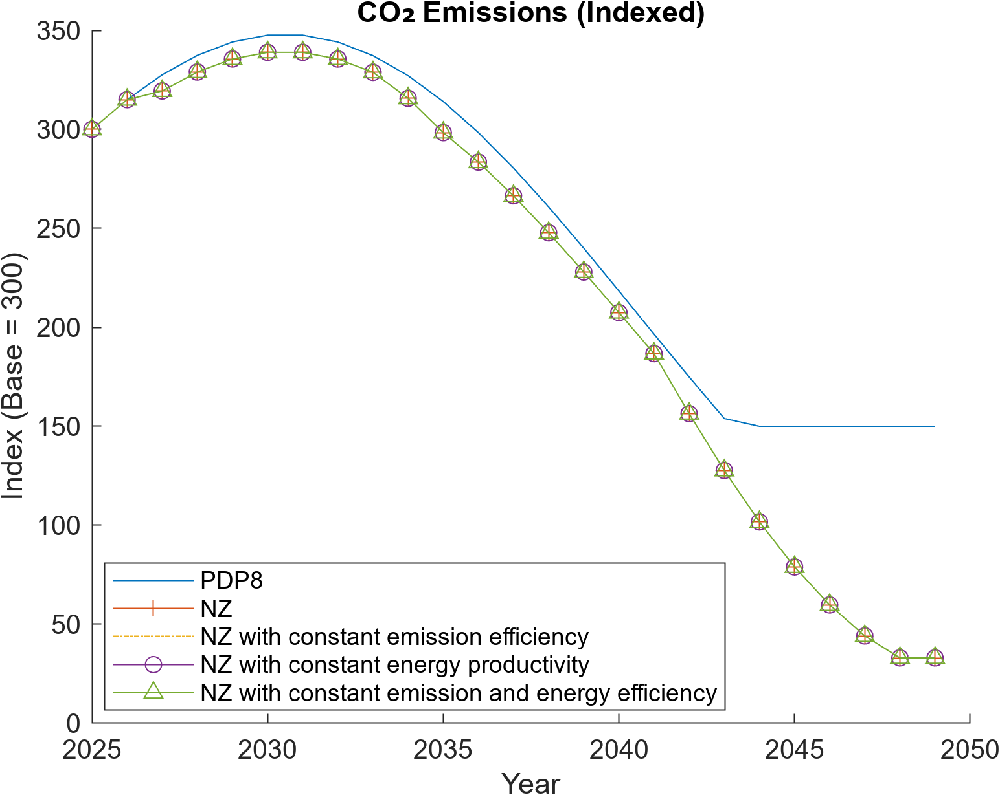
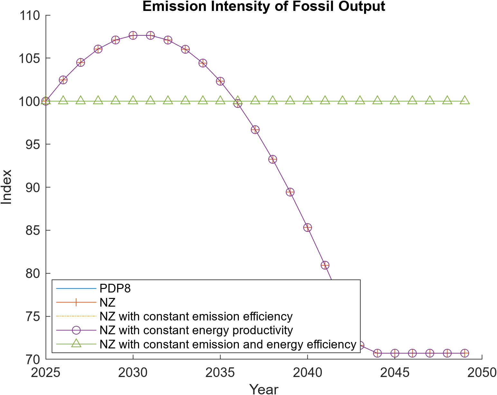
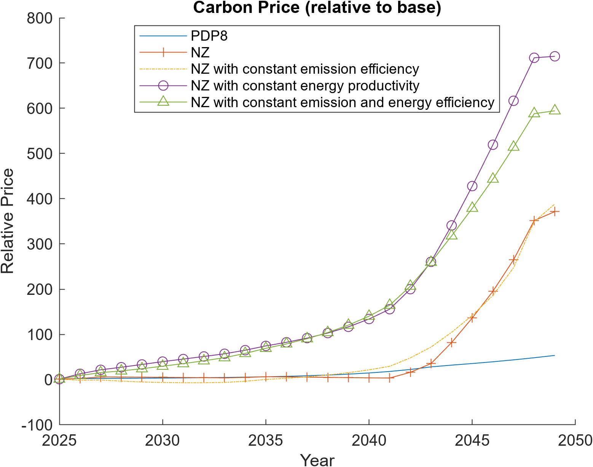
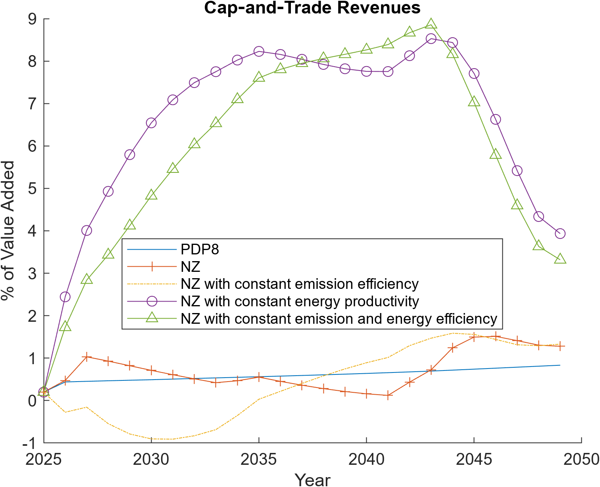

# Scenario Design and Implementation

This document describes the design, implementation, and interpretation of the policy scenarios simulated with the **DGE-METRIC / DGE-CRED** model. The scenarios are constructed to isolate the macroeconomic and sectoral roles of energy transition drivers such as carbon pricing, energy efficiency, and emission intensity improvements.

All scenarios are simulated over a medium-term horizon (25 years) and are solved as deterministic transition paths from a common baseline calibration.

---
## 📘 Documentation Overview

- **Project overview:** [Home](../index.md)
- **Model structure & equations:** [Model documentation](model.md)
- **Scenario design & assumptions:** [Scenarios](scenario.md)
- **Calibration & data sources:** [Calibration](calibration.md)
- **How to run the model:** [Running the model](running.md)


## Overview of Scenario Logic

The scenario set follows a **nested counterfactual design**:

1. Start from a **policy-consistent baseline** aligned with current planning assumptions.
2. Introduce a **Net-Zero (NZ)** transition via carbon pricing and structural change.
3. Sequentially **shut down individual adjustment channels** (energy efficiency, emission intensity) to identify their contribution to aggregate outcomes.

This design allows a transparent decomposition of emissions reductions, investment dynamics, and macroeconomic adjustment mechanisms.

---

## Scenario Set

The following scenarios are implemented and compared:

### 1. Baseline (PDP8)

- Represents a continuation of current energy and climate policies.
- No binding net-zero constraint.
- Carbon prices remain low and do not induce strong structural change.
- Energy efficiency and emission intensity follow exogenous baseline trends.

This scenario serves as the reference path for all indexed comparisons.

---

### 2. Net-Zero (NZ)

- Imposes a binding long-run emissions reduction consistent with net-zero targets.
- Achieved through an **economy-wide emissions trading system (ETS)**.
- Endogenous carbon prices rise to ensure compliance with the emissions path.
- Firms and households adjust via:
  - reduced fossil energy use,
  - higher renewable investment,
  - improvements in energy efficiency,
  - changes in sectoral composition.

This scenario captures the full adjustment potential of the economy.

---

### 3. NZ with Constant Emission Efficiency (`NZ_constInt`)

- Identical to the NZ scenario, **except**:
  - emission intensity of fossil energy is held constant over time.
- No endogenous improvement in emission coefficients (e.g. fuel switching within fossil technologies).

Purpose:
- Isolate the role of **emission-intensity reductions** in achieving emissions targets.
- Forces stronger reliance on activity reduction, energy substitution, and carbon prices.

---

### 4. NZ with Constant Energy Productivity (`NZ_constEE`)

- Identical to the NZ scenario, **except**:
  - economy-wide energy efficiency is fixed at its base-year level.
- No endogenous reduction in energy demand per unit of output.

Purpose:
- Quantify the contribution of **energy efficiency gains** to macroeconomic adjustment.
- Leads to higher energy demand, stronger price responses, and higher transition costs.

---

### 5. NZ with Constant Energy and Emission Efficiency (`NZ_constEEInt`)

- Combines the restrictions of scenarios 3 and 4:
  - no improvement in energy efficiency,
  - no improvement in emission intensity.
- Emissions targets must be met almost exclusively via:
  - carbon pricing,
  - sectoral reallocation,
  - reduced fossil output,
  - accelerated renewable deployment.

Purpose:
- Represents a **worst-case transition** with limited technological learning.
- Provides an upper bound on carbon prices and adjustment costs.

---

## Implementation Details

### Scenario Switching

Scenarios are implemented by modifying:
- paths of exogenous efficiency parameters,
- constraints on emission coefficients,
- ETS policy rules.

Each scenario is solved from the same initial steady state to ensure comparability.

---

### Output Handling

- Model results are written to scenario-specific CSV files.
- A common plotting script reads these files and produces indexed or percentage-based comparisons.
- Key indicators include:
  - CO₂ emissions,
  - carbon prices and ETS revenues,
  - GDP growth,
  - energy productivity and efficiency,
  - investment and capital stocks by sector,
  - employment and value-added shares.

All figures shown in the *SimulationResults* document are generated from this common output structure.

---

## Interpretation Strategy

Comparisons across scenarios allow the following insights:

- Differences between **Baseline and NZ** quantify the overall cost and structure of the energy transition.
- Differences between **NZ and constrained NZ variants** isolate:
  - the role of energy efficiency,
  - the role of emission-intensity improvements.
- The most constrained scenario highlights risks associated with delayed innovation or policy bottlenecks.

This layered design supports policy-relevant statements on:
- investment needs,
- carbon price trajectories,
- sectoral employment shifts,
- fiscal implications via ETS revenues.

---

## Emissions and Carbon Markets









**Interpretation.**  
These figures illustrate how emissions decline under Net Zero scenarios, the implied carbon price trajectory, and the resulting ETS revenues as a share of value added.

---

## Energy Efficiency Scenarios

These scenarios add demand-side energy efficiency shocks on top of the PDP8 baseline. No binding carbon constraint is active — they are not NZ scenarios.

### EE_PDP8

- Energy productivity improvements in industry (sector 4) and services (sector 5) consistent with Vietnam's PDP8 efficiency targets.
- Annual EE investment of approximately USD 361 million/year for combined industry and services.
- Reported sectoral savings by 2030: Industry ~7.4%, Services ~5.1%, Households ~11.6%.

### EE_Directive10

- Higher EE ambition calibrated to Vietnam's Prime Minister Directive 10/CT-TTg targets.
- Steeper energy productivity path and higher investment cost in the near term.
- Delivers ~0.44% higher GDP level vs EE_PDP8 by 2030, persisting through the horizon.

### NoBESS counterfactuals

- `EE_PDP8_PV_BESS_NoBESS` and `EE_Directive10_NoBESS` reset BESS-specific channels (`exo_GA` components from battery storage) to baseline while retaining the EE productivity gains.
- Difference (Full − NoBESS) isolates the BESS contribution.
- Result: BESS contributes negligibly to macro aggregates; its value is primarily in grid reliability.

**Note on emissions:** Emissions paths are identical across all EE scenarios. EE reduces energy intensity but does not impose a binding cap. Emissions reductions from EE require combining these scenarios with the NZ path.

**Implementation:** `scripts/maintenance/create_ee_scenarios_from_expert_inputs.m` reads expert input workbook and writes EE scenario sheets to `ModelScenarios5Sectorsand1Regions.xlsx`. See [EE scenario design](../scenario_notes/ee_scenario_design.md) for variable mapping details.

---

## Green Finance Scenarios

These scenarios modify the cost of capital for energy transition investment. They run on **both** the PDP8 baseline and the Net-Zero path.

### Financing structures

Three WACF levels correspond to different blends of financing instruments:

| Scenario suffix | Structure | WACF |
|---|---|---|
| `GF_A` | Balanced: ODA/MDB + blended + green bonds | 6.43% |
| `GF_B` | Market-led: predominantly commercial capital | 7.37% |
| `GF_C` | Public-led: concessional and ODA dominant | 5.07% |

Each runs on both `PDP8` (→ `PDP8_GF_A/B/C`) and `NZ` (→ `NZ_GF_A/B/C`).

### Model channels

Finance scenarios operate through cost-of-capital and investment-price shock paths:

- `exo_r_G_s`: public finance rate by sector
- `exo_r_FDI_s`: foreign/international finance rate
- `exo_P_K_s`: effective investment goods price
- `exo_K_G_s`, `exo_s_G_s`: public capital volume channels

These are reduced-form representations. Named instruments (green bonds, guarantees, KfW loans) are not modeled as balance-sheet items but as equivalent cost or investment-volume shocks.

**Source workbook:** `ExcelFiles/PDP8/Vietnam_Green_Finance_Scenarios_April2026.xlsx` — contains WACF by instrument category, annual financing costs, and public/private allocation shares.

**Implementation status (as of 2026-07-14):** `RunSimulations.m` fully defines
and routes the `PDP8_GF_A/B/C` and `NZ_GF_A/B/C` scenario names — the
scenario-switch logic that maps each name to its baseline/`CapAndTrade`
setting is wired and uncommented. What is *not* on by default:

- these two groups (`scenarioGroups.GF_PDP8`, `scenarioGroups.GF_NZ`) are not
  included in the default `activeScenarioGroups = {'Reference'}`, so a plain
  `RunSimulations` run does not execute them — see
  [Running the model](running.md#scenario-groups) for how to activate them;
  and
- whether `ModelScenarios5Sectorsand1Regions.xlsx` already contains the WACF
  shock data these sheets need is unconfirmed (the source WACF workbook,
  `Vietnam_Green_Finance_Scenarios_April2026.xlsx`, is a standalone
  calculator not yet confirmed wired into the scenario workbook the model
  reads).

Treat any GF_A/B/C figures cited elsewhere in the docs as produced by a
specific non-default `activeScenarioGroups` run — check
`Figures/`/`docs/figures/` generation dates against the workbook state before
re-citing them. See [Finance instruments feasibility](../scenario_notes/finance_instruments_comments_feasibility.md)
for the full instrument-by-instrument feasibility assessment.

---

## Reproducibility

**A defined scenario is not necessarily an executed scenario.** In the
baseline-only repository configuration, `activeScenarioGroups` contains only
`Reference`, and only `Baseline` is enabled within that group. Consequently,
NZ, EE, Green Finance, and sensitivity scenarios do not run merely because
their equations, workbook sheets, or names exist.

There are two independent choices: enable individual names inside each
`scenarioGroups.<group>` block, then select the required groups through
`activeScenarioGroups`. A nonempty `DGE_SCENARIO_GROUPS` value overrides the
latter selection. For example, from MATLAB:

```matlab
setenv('DGE_SCENARIO_GROUPS', ...
    'Reference,EE,GF_PDP8,GF_NZ,NZ_Sensitivity');
RunSimulations
```

This selects groups but still skips any scenario name commented out inside
those groups. The Green Finance groups are fully routed through the scenario
switches, but are excluded from the baseline-only active set. Several EE and
`NZ_Sensitivity` members are also individually disabled in that configuration.
To compare `NZ_GF_*` or `NZ_Sensitivity` results with `NZ`, enable `NZ` inside
`scenarioGroups.Reference` as well.

To reproduce a given scenario configuration:

1. Check out the commit that produced the result.
2. Enable the required individual names in their `scenarioGroups` blocks.
3. Set `activeScenarioGroups`, or set and record `DGE_SCENARIO_GROUPS`.
4. Verify the resolved `casScenarioNames` before the simulation loop.
5. Record the workbook/version, run the model, and then generate comparisons.

Without the exact group selection, enabled group members, and workbook state,
a published result cannot be assumed reproducible from a plain
`RunSimulations` call. See [Running the model](running.md#scenario-groups) for
worked configurations and environment-variable precedence.

---

## Further reading

- [Scenarios at a glance](../policy/scenarios_overview.md) — all scenario families with one-sentence summaries
- [Use case: Energy Efficiency](../policy/use_cases_ee.md)
- [Use case: Green Finance](../policy/use_cases_finance.md)
- [EE scenario design](../scenario_notes/ee_scenario_design.md)
- [Finance instruments feasibility](../scenario_notes/finance_instruments_comments_feasibility.md)
