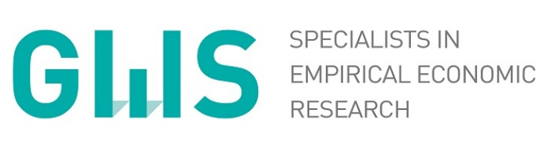

> Macroeconomic Modelling for Energy Investments in Vietnam
>
> Report on Macroeconomic Impact Assessment
>
> Katja Heinisch, Ulrike Lehr, Christian Lutz, Huyen Nguyen, Christoph Schult

**Imprint**

> **Contact**
>
> Dr Katja Heinisch
>
> Tel +49 345 77 53 836
>
> E-mail: katja.heinisch@iwh-halle.de
>
> **Authors**
>
> Katja Heinischa
>
> Ulrike Lehrb
>
> Christian Lutzb
>
> Huyen Nguyena,c
>
> Christoph Schulta
>
> a Halle Institute for Economic Research (IWH)\
> b GWS – Gesellschaft für Wirtschaftliche Strukturforschung (GWS) mbH\
> c King’s College London
>
> **Issuer**
>
> Halle Institute for Economic Research (IWH) – Member of the Leibniz Association
>
> **Executive Board**
>
> Professor Reint E. Gropp, PhD
>
> Professor Dr Oliver Holtemöller
>
> Professor Michael Koetter, PhD
>
> Dr Tankred Schuhmann
>
> **Address**
>
> Kleine Märkerstraße 8
>
> D-06108 Halle (Saale), Germany
>
> Postal Address
>
> P.O. Box 11 03 61
>
> D-06017 Halle (Saale), Germany
>
> Tel +49 345 7753 60
>
> [www.iwh-halle.de](http://www.iwh-halle.de)
>
> All rights reserved.
>
> Macroeconomic Modelling for Energy Investments in Vietnam
>
> Report on Macroeconomic Impact Assessment
>
> Katja Heinisch, Ulrike Lehr, Christian Lutz, Huyen Nguyen, Christoph Schult
>
> Halle (Saale), 30.09.2026

# Table of Contents

Table of Contents [4](#table-of-contents)

List of Figures [5](#list-of-figures)

List of Tables [5](#list-of-tables)

Abbreviations [6](#abbreviations)

Executive Summary [8](#executive-summary)

1 Introduction [10](#introduction)

1.1 The implementation challenge [10](#the-implementation-challenge)

1.2 Policy questions [11](#policy-questions)

1.3 Purpose of this report [12](#purpose-of-this-report)

2 Policy Areas Assessed [13](#policy-areas-assessed)

2.1 Energy efficiency [13](#energy-efficiency)

2.2 Green finance (GF) architecture [18](#green-finance-gf-architecture)

2.3 Carbon pricing and the Net Zero pathway [24](#carbon-pricing-and-the-net-zero-pathway)

3 Cross-Cutting Findings [28](#cross-cutting-findings)

3.1 Energy efficiency reduces the overall cost of the transition [28](#energy-efficiency-reduces-the-overall-cost-of-the-transition)

3.2 Financing conditions determine the pace of investment [28](#financing-conditions-determine-the-pace-of-investment)

3.3 The economic effects of carbon pricing depend on complementary measures [29](#the-economic-effects-of-carbon-pricing-depend-on-complementary-measures)

3.4 Structural adjustment is concentrated in fossil-energy activities [29](#structural-adjustment-is-concentrated-in-fossil-energy-activities)

3.5 Carbon pricing has important fiscal implications [30](#carbon-pricing-has-important-fiscal-implications)

3.6 Policy areas are complementary rather than substitutable [30](#policy-areas-are-complementary-rather-than-substitutable)

4 Policy Recommendations [31](#policy-recommendations)

5 Conclusion [34](#conclusion)

Annex: Methodology Summary [36](#annex-methodology-summary)

References [38](#references)

**\**

# List of Figures

[Figure 1: Impact of Energy Efficiency Measures on GDP. [16](#_Ref236059137)](#_Ref236059137)

[Figure 2: Energy-intensity reductions relative to the PDP8-rev Baseline. [17](#_Ref236302895)](#_Ref236302895)

[Figure 3: Impact of Energy Efficiency Measures on GDP and Energy intensity under Net Zero. [18](#_Ref240041185)](#_Ref240041185)

[Figure 4: Five-year average GDP-level deviations across green-finance architectures. [23](#_Ref236302951)](#_Ref236302951)

[Figure 5: Renewable-energy financing costs across green-finance architectures. [23](#_Ref240043175)](#_Ref240043175)

[Figure 6: Renewable-energy financing costs and GDP effects for Net Zero. [24](#_Ref236146263)](#_Ref236146263)

[Figure 7: Cumulative emissions trading system revenues. [26](#_Ref236152615)](#_Ref236152615)

[Figure 8: Average deviations in ETS revenue as a share of GDP from the PDP8-rev Baseline. [27](#_Ref236152676)](#_Ref236152676)

[Figure 9: GDP level deviation from the PDP8-rev Baseline. [27](#_Ref236152628)](#_Ref236152628)

[Figure 10: Policy Recommendations. [33](#_Ref240454974)](#_Ref240454974)

# List of Tables

[Table 1: Overview of Energy Efficiency Scenarios [14](#_Ref240286263)](#_Ref240286263)

[Table 2: Financing instruments: indicative terms, providers, and model treatment [20](#_Ref239954640)](#_Ref239954640)

[Table 3: Portfolio allocation and resulting financing cost by architecture [21](#_Ref240286354)](#_Ref240286354)

**\**

# Abbreviations

ADB Asian Development Bank

AFD Agence française de développement

BESS Battery Energy Storage System

BIDV Joint Stock Commercial Bank for Investment and Development of Vietnam

CASE Clean, Affordable and Secure Energy for Southeast Asia

CBAM Carbon Border Adjustment Mechanism

COâ‚‚ Carbon Dioxide

COP26 26th United Nations Climate Change Conference of the Parties

CT-TTg Prime Minister’s Directive

DGE Dynamic General Equilibrium

DGE-METRIC Dynamic General Equilibrium for Macroeconomic Energy Transition Incorporating Carbon Markets

DFI Development Finance Institution

DOIT Department of Industry and Trade

DPPA Direct Power Purchase Agreement

EE Energy Efficiency

ESCO Energy Service Company

ESG Environmental, Social and Governance

ETS Emissions Trading System

EU European Union

EVN Vietnam Electricity

FDI Foreign Direct Investment

FX Foreign Exchange

GCF Green Climate Fund

GDP Gross Domestic Product

GF Green finance

GHG Greenhouse Gas

GIZ Deutsche Gesellschaft für Internationale Zusammenarbeit

GW Gigawatt

GWS Gesellschaft für Wirtschaftliche Strukturforschung

HS Harmonized Commodity Description and Coding System

IBRD International Bank for Reconstruction and Development

IDA International Development Association

IWH Halle Institute for Economic Research

JETP Just Energy Transition Partnership

JICA Japan International Cooperation Agency

KfW Kreditanstalt für Wiederaufbau

MDB Multilateral Development Bank

MOIT Ministry of Industry and Trade

MRV Measurement, reporting and verification

NDC Nationally Determined Contribution

NĐ-CP Government Decree

NZ Net Zero

ODA Official Development Assistance

OCR Ordinary Capital Resources

PDP8 Power Development Plan VIII

PDP8-rev Revised Power Development Plan VIII

PM Prime Minister

Pp Percentage points

PPA Power Purchase Agreement

PV Photovoltaic

QĐ-BCT Ministry of Industry and Trade Decision

QĐ-TTg Prime Minister’s Decision

RTS Rooftop solar

SOE State-Owned Enterprise

tCOâ‚‚e Tonnes of carbon dioxide equivalent

UN United Nations

USD United States dollar

WACC Weighted Average Cost of Capital

WACF Weighted Average Cost of Finance

WITS World Integrated Trade Solution

# Executive Summary

Vietnam's commitment to achieve Net Zero greenhouse gas emissions by 2050 alongside its target of at least 10 percent annual economic growth over 2026–2030 and above 7.5 percent thereafter to 2050, requires an unprecedented transformation of its energy system. The revised Power Development Plan VIII (PDP8-rev) provides the strategic framework for this transition. Its successful implementation depends on expanding renewable energy capacity and improving energy efficiency, enabled by mobilising affordable finance to meet the investment needs of one trillion USD (Heinisch et al. 2026b) and establishing effective carbon pricing mechanisms — the three policy areas this report evaluates. These policy choices will shape Vietnam's emissions trajectory, its long-term economic growth, investment, and competitiveness.

This report assesses the macroeconomic implications of three key policy areas using **DGE-METRIC** (**D**ynamic **G**eneral **E**quilibrium for **M**acroeconomic **E**nergy **T**ransition **I**ncorporating **C**arbon markets), a dynamic general equilibrium model with 5 sectors calibrated to the Vietnamese economy. The analysis compares alternative energy-efficiency pathways, green-finance architectures, and carbon-pricing scenarios over the period 2026–2050 to evaluate how different policy packages affect economic performance and the cost of the energy transition.

The analysis leads to **five principal findings**:

1)  *Energy efficiency delivers economic gains while supporting the energy transition.*

Accelerating energy-efficiency improvements increases economic output with only modest additional investment requirements. Both the revised PDP8 (PDP8-rev), serving as the Baseline scenario, and more ambitious efficiency targets under PM Directive 10/CT-TTg[^1] (our EE Directive 10 scenario; see Scenarios below) raise GDP levels throughout the 2026–2050 horizon, with only a small near-term investment-consumption trade-off (see Schult 2026). The modelled Directive 10 efficiency pathway raises GDP by approximately 0.8 percent on average over 2026–2050 relative to the PDP8-rev Baseline, for assumed additional annual efficiency investment equivalent to approximately 0.08 percent of GDP in the report’s calibration—less than USD 400 million per year. The GDP gain peaks at around 1 percent in 2031–2035. These investment figures exclude separate expenditure on battery energy storage.

2)  *Affordable green finance substantially lowers the cost of the transition.*

**Affordable green finance supports renewable investment and raises long-term GDP.** In the model, greater use of concessional and publicly supported finance raises GDP by approximately **0.9 percent in 2046–2050** relative to the revised PDP8 Baseline. By contrast, greater reliance on higher-cost market financing leaves GDP around **0.4 percent below the Baseline**. Lower financing costs enable more investment in renewable energy, with economic benefits building over time as new capacity is installed.

3)  *Carbon pricing is most effective when combined with complementary policies.*

In the standalone Net Zero scenario, the tighter emissions cap increases production costs in emissions-intensive activities and reduces GDP relative to the PDP8-rev Baseline when additional ETS revenues are not recycled through the modelled support channels. The economic adjustment depends on the availability of efficiency improvements, low-carbon technologies and affordable finance.

The Net Zero pathway generates approximately **USD 250 billion in cumulative ETS revenues over 2026–2050**, conditional on the model’s economy-wide energy-related emissions coverage and full auctioning. This is a scenario-dependent revenue estimate, not a guaranteed financing envelope. The integrated policy package produces lower ETS revenues than standalone Net Zero because complementary measures reduce the carbon price required to meet the emissions constraint.

4)  *Policy areas reinforce one another.*

Recycling ETS revenues into support for non-fossil investment reduces the GDP shortfall relative to standalone Net Zero. Direct household transfers do not reduce that shortfall in the reported simulations. These comparisons concern aggregate output; they do not establish the relative household-welfare or distributional outcomes of the different revenue uses.

The scenario combining the Net Zero emissions cap with GF C financing, Directive 10 efficiency and investment-oriented revenue recycling raises GDP above the PDP8-rev Baseline in every five-year period. This result illustrates the interaction between the measures: efficiency reduces energy requirements, financing conditions affect capital formation, and revenue recycling changes the cost of investment outside fossil-energy activities. The GDP effect of the combined package is therefore distinct from the effect of tightening the emissions cap alone.

5)  *Early action delivers the greatest economic benefits.*

The investment-needs assessment, as summarised in this report, identifies a significant financing gap during the investment-intensive period before 2035. This window includes the peak efficiency-related GDP gain in 2031–2035 and an increase in the modelled Net Zero carbon price from approximately USD 10/tCO₂e in 2026–2030 to USD 47/tCO₂e in 2031–2035. The benefits of lower financing costs continue to build beyond this period as investment accumulates. These timing patterns inform the sequencing discussion, although the scenarios do not determine an optimal allocation of a fixed concessional-finance budget between earlier and later years.

Overall, the simulations show that the GDP implications of a Net Zero pathway depend not only on the emissions constraint, but also on energy efficiency, financing conditions and the use of carbon revenues. They provide evidence for assessing these elements together, while leaving instrument-specific fiscal costs, household compensation and regional adjustment to complementary analysis. DGE-METRIC also does not capture hourly electricity-system operation: the near-zero additional GDP effect of battery storage reflects this limitation and should not be interpreted as an assessment of its reliability or renewable-integration value.

# Introduction

Vietnam is one of Southeast Asia's fastest-growing economies, with electricity demand having approximately doubled every decade over the past two decades. This rapid growth has been supported by coal-fired power generation, making the decarbonisation of the energy sector one of the country's most significant economic and policy challenges. To address this challenge, Vietnam has adopted a set of ambitious climate and energy commitments, including:

- **Net Zero greenhouse gas emissions by 2050**, announced at COP26 and reaffirmed in recent key strategies and policies, which Vietnam has stated it will achieve with the support of international partners;

- **No new coal-fired power capacity after 2030**, a central pillar of the PDP8-rev, and as agreed in the Just Energy Transition Partnership (JETP).

These commitments represent Vietnam’s ambitious climate and energy transition targets.. Throughout this report, the revised PDP8 (PDP8-rev) serves as the **Baseline scenario** (reference), representing the development path under currently announced energy and climate policies. The baseline assumes a rapid expansion of renewable electricity generation, storage technologies, and transmission infrastructure, together with a gradual phase-down of coal-fired power and continued economic growth of approximately 10 percent per year until 2030 and above 7.5 percent between 2030 and 2050, reflecting a high level of ambition for investment mobilisation, institutional capacity, and policy execution. This growth path is DGE-METRIC's Baseline modelling assumption, calibrated to Vietnam's medium-term ambition rather than an independent forecast.

## The implementation challenge

Successful implementation moreover will need to face a threefold challenge: the mere scale of the investment needed, an emerging **financing gap** hinging on borrowing conditions, and the impacts from the newly introduced **carbon pricing** mechanism.

**Investment scale.** Achieving the objectives of PDP8-rev requires an unprecedented mobilisation of capital. The accompanying Investment Needs Assessment (Heinisch et al. 2026b) estimates cumulative investment needs of approximately **USD 1 trillion over 2026–2050**, excluding replacement investment required to offset depreciation and maintain the existing capital stock**.** The estimate covers the deployment of renewable power-generation capacity, transmission-network expansion and grid reinforcement, energy-efficiency improvements, and climate-adaptation measures. The implementation challenge is therefore not only to mobilise sufficient investment, but also to understand how its scale, financing cost and timing affect the wider economy. For policymakers and development partners, this raises a practical question: **how can limited public and concessional resources help reduce investment requirements, lower financing costs and enable private investment?** Addressing this question requires examining both the resources needed for the transition and the economic consequences of alternative ways of financing and implementing it.

**The financing gap.** Financing conditions represent one of the principal constraints to this transition. The accompanying Investment Needs Assessment (Heinisch et al. 2026b) identifies a significant financing gap during the investment-intensive period before 2035, driven by large upfront infrastructure costs, comparatively high commercial borrowing costs for private energy projects, a limited domestic institutional investor base, and uncertainty regarding future carbon-market revenues.

Different green finance instruments can address these constraints through complementary channels (see Heinisch et al. 2026a). Concessional loans reduce borrowing costs, blended finance lowers project risk and mobilises private capital, green bonds expand access to long-term infrastructure finance, and development-bank facilities ease investment constraints during the transition. Together, these instruments can lower the effective cost of capital and support higher levels of private investment.

**Carbon market development.** At the same time, Vietnam is implementing a pilot domestic emissions trading system under Decree No. 06/2022/NĐ-CP, as amended by Decree No. 119/2025/NĐ-CP, with the domestic carbon exchange governed by Decree No. 29/2026/NĐ-CP and Decree No. 83/2026/NĐ-CP. The macroeconomic impacts of this emerging carbon-pricing mechanism operate mainly through two channels: rising energy costs for carbon-intensive sectors and households, which raise adjustment costs during the transition unless offset by revenue recycling; and the price signal itself, which redirects investment toward lower-emission technologies as the emissions cap tightens over time. Because the pilot ETS's sector coverage and allocation method (free versus auctioned permits) are still being finalised, the scale of these impacts remains more uncertain than for the energy-efficiency and green-finance policy areas assessed elsewhere in this report. Together, financing conditions and carbon pricing will play a central role in determining both the pace and the macroeconomic cost of the energy transition.

## Policy questions

Against this background, the report examines three questions about the economic implications of Vietnam’s energy transition. The revised PDP8 serves as the Baseline against which alternative efficiency, financing and carbon-pricing scenarios are assessed over 2026–2050.

- **Energy efficiency. How do additional efficiency improvements affect energy demand and GDP, and how much additional investment do they require?** The analysis compares the modelled Directive 10 efficiency pathway with the revised PDP8 Baseline and examines the same efficiency improvements under a Net Zero emissions constraint. A separate comparison assesses the economic consequences of rooftop-solar deployment falling below the pathway already assumed in the Baseline.

- **Green finance. How do financing costs affect renewable investment and GDP?** The analysis compares financing arrangements with different combinations of public and private capital. It examines how the resulting financing conditions affect investment and economic output over time, both under the revised PDP8 pathway and under the more stringent Net Zero emissions constraint. The focus is on the economic consequences of financing conditions, rather than on selecting individual financial instruments.

- **Carbon pricing. How do the economic effects of a Net Zero emissions constraint depend on the use of carbon revenues and complementary measures?** The analysis compares a standalone Net Zero pathway with scenarios that recycle ETS revenues into non-fossil investment support or household transfers. It also examines a combined package of carbon pricing, stronger energy efficiency, affordable finance and investment-oriented revenue recycling.

Taken together, these comparisons examine how reducing energy requirements, changing financing conditions and using carbon revenues affect the economic cost of the transition. They also show how the effects develop over time, providing evidence for the discussion of implementation and sequencing, including during the investment-intensive period before 2035. The individual and combined scenarios allow the interactions between the three policy areas to be assessed rather than assuming that their effects are independent.

## Purpose of this report

This report complements the accompanying Investment Needs Assessment and Financial Assessment by examining the economy-wide consequences of alternative approaches to Vietnam’s energy transition. The Investment Needs Assessment sets out the scale and timing of investment requirements, while the Financial Assessment examines financing instruments and conditions. This report connects those assessments to their macroeconomic implications: how changes in energy efficiency, financing costs and the use of carbon revenues affect investment, GDP, energy demand and public revenues over 2026–2050.

The report is written for Vietnamese policymakers and development partners. It provides quantitative evidence on the implications of additional efficiency investment, alternative financing conditions and different uses of ETS revenues, both individually and in combination. These comparisons provide the basis for the policy discussion in Section 4. The link between findings and recommendations is made through the size and timing of the estimated effects, the economic mechanisms that explain them, and the assumptions under which they arise. Measures that depend on additional technical, institutional or distributional evidence are distinguished from conclusions directly supported by the macroeconomic simulations.

This report evaluates the macroeconomic implications of alternative policy pathways using **DGE-METRIC** (**D**ynamic **G**eneral **E**quilibrium for **M**acroeconomic **E**nergy **T**ransition **I**ncorporating **C**arbon markets), a dynamic general equilibrium model calibrated to the Vietnamese economy. The model captures interactions between households, firms, government, international trade, and the energy sector, allowing alternative policy scenarios to be evaluated within a consistent macroeconomic framework. Rather than forecasting Vietnam's future economy, the model compares internally consistent policy scenarios to identify the economic consequences of different policy choices and the mechanisms through which they affect long-term development.

The remainder of this report is organised as follows. Section 2 presents the macroeconomic assessment of the three policy areas, covering energy efficiency, green finance, and carbon pricing. Section 3 synthesises the cross-cutting findings and discusses their policy implications. Section 4 presents recommendations for policymakers and development partners, while Section 5 concludes. A concise description of the modelling framework is provided in the Annex, with additional methodological details available in the accompanying technical report.

# Policy Areas Assessed

This section evaluates three complementary policy areas that address different dimensions of Vietnam's energy transition. While each instrument can influence macroeconomic outcomes individually, the greatest benefits arise when they are implemented as part of a coherent policy package. The analysis therefore examines the effects of energy-efficiency improvements, alternative green-finance architectures, and carbon pricing under a common modelling framework, allowing their individual and combined macroeconomic impacts to be assessed.

## Energy efficiency

*Policy context.* Improving energy efficiency is widely recognised as one of the **most cost-effective measures** for reducing future energy demand while supporting economic growth. Vietnam's PDP8-rev already incorporates significant efficiency improvements across industry and services, while Decision No. 280/QĐ-TTg approving the National Energy Efficiency Programme (VNEEP3) provides the overarching legal framework for energy efficiency in Vietnam. Prime Minister Directive 09/CT-TTg on strengthening energy saving and efficient use, together with Prime Minister Directive 10/CT-TTg of 30 March 2026 calls for a more ambitious acceleration of energy-saving measures and rooftop solar (RTS). A key policy question is whether increasing energy-efficiency ambition generates sufficient macroeconomic benefits to justify the additional investment required. Battery energy storage systems (BESS) are also assessed as part of the analysis to distinguish their contribution to system performance from their aggregate macroeconomic effects.

*Scenarios.* Directive No. 10/CT-TTg places electricity saving and demand-side management at the centre of Vietnam's response to rapid demand growth and emerging risks to security of supply. It calls for stronger electricity savings, lower peak demand, more efficient equipment and production processes, and greater use of self-consumption rooftop solar combined, where appropriate, with battery energy storage. The EE Directive 10 scenario translates this policy direction into an economy-wide pathway and is evaluated against the more moderate revised PDP8-rev (our Baseline scenario, defined above). The Directive 10 pathway assumes sector-specific energy savings by 2030 of approximately **7.4% in industry and 5.1% in services**, supported by efficiency investment of less than **USD 400 million** per year, equivalent to approximately **0.08%** of GDP. These values are expert-calibrated modelling assumptions translating the Directive's higher efficiency ambition into model variables; they are not quantitative targets stated verbatim in the Directive.[^2] The Baseline and EE Directive 10 scenarios follow the emissions trajectory given by the carbon cap, so that differences in outcomes capture the macroeconomic effects of stronger energy efficiency.

| Scenario | Policy interpretation | What it shocks vs. Baseline | Key modelling constraint |
|----|----|----|----|
| Directive 10 (full) | Directive 10 ambition: stronger industry/services efficiency + RTS rollout to 135 GW (as in the revised PDP8 high case and already in the Baseline, so no additional RTS shock) + PV–battery (BESS) integration | Sector energy-productivity gains (≈7.4% industry, ≈5.1% services by 2030) | Emissions held to the Baseline ETS cap; BESS/RTS deployment and cost paths are assumed, not optimised |
| Directive 10 (no BESS) | Same package, storage-specific contribution removed | As Directive 10 (full), but grid BESS reset to Baseline | Isolates the macro contribution of BESS |
| RTS at pre-revision 95 GW | Rooftop solar under-delivers — reaches only the pre-revision ≈95 GW instead of the ≈135 GW now in the Baseline | Rooftop-PV capacity and its efficiency/investment channels rewound to the 95 GW path; no retrofit EE, no BESS | Downside counterfactual: quantifies the RTS contribution by removing it |

Table 1: Overview of Energy Efficiency Scenarios

Note: RTS = rooftop solar; BESS = battery energy storage system; ETS = emissions trading scheme. All three scenarios are built on top of the Baseline and isolate the contribution of specific policy levers described in Directive 10: Directive 10 (full) applies the complete package of industrial/services efficiency gains and BESS deployment, with rooftop solar at the Baseline's 135 GW path; Directive 10 (no BESS) removes only the storage-specific contribution to isolate BESS's macro impact; and RTS at pre-revision 95 GW tests a downside counterfactual in which rooftop-PV capacity underperforms and reverts to the pre-revision ≈95 GW target instead of the ≈135 GW assumed in the Baseline. Sector energy-productivity gains and BESS investment costs are model inputs (not optimised outcomes), and emissions in all scenarios are capped at Baseline ETS levels.

To test how the same efficiency ambition performs once the economy is on a binding decarbonisation path, Directive 10 is run on top of the Net Zero emissions cap rather than the Baseline (see [Figure 3](#_Ref240041185)). Three scenarios share the identical Net Zero cap, so that differences in outcomes isolate the contribution of energy efficiency and rooftop solar/BESS while holding the pace of decarbonisation fixed: **Net Zero** (the standalone decarbonisation pathway, no additional efficiency package), **Net Zero and Directive 10 (full)** (Net Zero combined with the complete Directive 10 package — stronger industry/services efficiency, rooftop solar (RTS) at the Baseline’s ≈135 GW by 2050, and battery storage (BESS)), and **Net Zero and Directive 10 (no BESS)** (the same package with the storage‑specific contribution removed).

*Results.* The simulations produce six principal findings ([Figure 1](#_Ref236059137) to [Figure 3](#_Ref240041185)).

- **Higher energy efficiency improves economic performance.** Efficiency scenarios increase GDP relative to the PDP8-rev Baseline; Directive 10 raises **GDP by roughly 0.8 percent** on average over 2026–2050, **peaking at 1 percent in 2031–2035**, for an incremental efficiency investment of less than 0.1% of GDP (less than USD 400 million per year), plus about USD 800 million per year for BESS, which has no measurable GDP effect ([Figure 1](#_Ref236059137)).

- **The additional investment requirement is modest.** Achieving higher efficiency requires less than USD 400 million per year for efficiency measures and about USD 800 million per year for BESS — together a limited increase in investment expenditure relative to GDP — while the temporary reduction in consumption is small and largely offset by stronger long-term economic growth and lower energy costs in the future (see Schult 2026).

- **Energy demand declines, while covered emissions remain unchanged under the common binding cap.** Directive-10 is run against the same ETS cap trajectory as Baseline, so differences between the two scenarios isolate the macroeconomic effect of energy efficiency. Efficiency directly lowers energy demand at given prices; because less carbon-price pressure is then needed to hit the same cap, the equilibrium carbon price falls relative to Baseline. That lower price both shifts the generation mix toward higher carbon intensity and induces some rebound in energy demand, and the two together restore emissions to the fixed cap. The net effect is unchanged covered emissions, a lower carbon price than Baseline, and reduced cost pressure on energy-intensive industry.

- **Due to model design, battery energy storage (BESS) shows only limited macroeconomic effects.** Removing battery storage has a negligible impact on aggregate GDP (≈0 pp by 2050). This should not be read as evidence that BESS has little value. DGE-METRIC operates at annual resolution with no hourly dispatch, so the channels through which storage actually creates value — curtailment avoidance, peak shaving, and reduced fossil back-up capacity — cannot be priced in this framework by design. The near-zero GDP effect therefore reflects a structural model limitation, not an economic assessment of storage. The reliability and renewable-integration benefits of BESS are real but sit outside what an annual general-equilibrium model can quantify.

- **R Under-delivering the Baseline rooftop-solar pathway reduces GDP.** The separate counterfactual with approximately 95 GW rather than 135 GW of rooftop solar by 2050 produces GDP losses of approximately 0.6–1.0 percent from 2031 onward. This measures the consequences of lower rooftop-solar deployment relative to the Baseline, rather than an additional contribution to the Directive 10 efficiency gain. Mechanically, this works through a specific modelled channel: self-consumed rooftop generation displaces grid-purchased electricity, which lowers the effective cost of energy inputs to production, rather than reflecting a general preference for rooftop solar over utility-scale renewables or grid investment. Accelerating its deployment therefore appears to be one of the most promising measures for reducing demand for centrally-supplied electricity, easing pressure on the power system. The model can not capture potential side effects on grid stability, congestion, or balancing needs — those require network- and dispatch-resolution analysis that lies outside this annual general-equilibrium model.

- **Energy efficiency also lowers the cost of decarbonisation.** Repeating the Directive 10 package on top of a binding Net Zero emissions cap shows the same effect holds under stronger climate ambition: Net Zero combined with **Directive 10** delivers roughly **0.7–1.0** percentage points higher GDP than the standalone Net Zero pathway across 2026–2050, narrowing the transition cost of decarbonisation rather than adding to it. As under the Baseline, BESS makes little additional difference, the full and no‑BESS variants are nearly identical ([Figure 3](#_Ref240041185)).

*Policy implication.* The modelled efficiency pathway combines additional annual efficiency investment equivalent to approximately 0.08 percent of GDP in the calibration with GDP levels averaging around 0.8 percent above the revised PDP8 Baseline over 2026–2050. The gain peaks at approximately 1 percent in 2031–2035. Under the Net Zero emissions constraint, the same efficiency measures improve the GDP outcome by approximately 0.7–1.0 percentage points relative to standalone Net Zero. These comparisons provide the quantitative basis for the discussion of efficiency investment and implementation timing in Section 4. Because the compared scenarios share a binding emissions cap, the efficiency improvements reduce the economic cost of meeting that cap rather than producing additional reductions in covered emissions.

<figure>
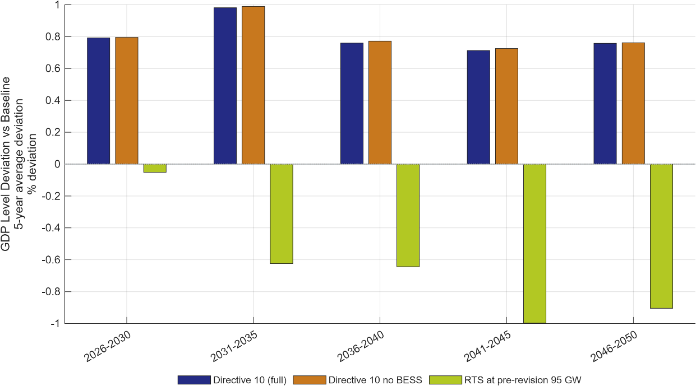
<figcaption>
Figure 1: Impact of Energy Efficiency Measures on GDP.
</figcaption>
</figure>

Note: Five-year-average deviation of GDP level from the PDP8-rev Baseline (percent), 2026–2050, with the ETS emissions cap held constant across scenarios. Directive 10 (full): stronger industry/services efficiency + rooftop solar (RTS) at the Baseline’s ≈135 GW by 2050 + battery storage (BESS). Directive 10 no BESS: same, storage removed. RTS at pre-revision 95 GW: rooftop solar limited to the original ≈95 GW target, no extra efficiency retrofit, no BESS. Directive 10 raises GDP by about 0.7–1.0%; the two variants are near-identical; missing the 135 GW rooftop target costs 0.6–1.0% of GDP from 2031 onward.

Source: Authors’ calculations using the DGE-METRIC model.

<figure>
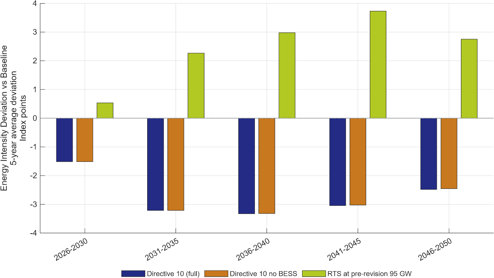
<figcaption>
Figure 2: Energy-intensity reductions relative to the PDP8-rev Baseline.
</figcaption>
</figure>

Note: Five-year-average deviation of the energy-intensity index (final energy per unit GDP, 2026 = 100) from the PDP8-rev Baseline, in index points; negative = lower energy intensity (more efficient). The two Directive 10 variants cut energy intensity and are near-identical (BESS adds nothing). Under RTS at pre-revision 95 GW, weaker rooftop-solar deployment raises reliance on grid electricity, pushing energy intensity above Baseline.

Source: Authors’ calculations using the DGE-METRIC model.

1)  **Impact on GDP**

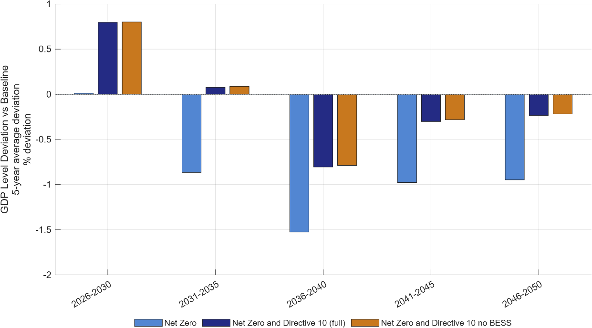

2)  **Impact on Energy Intensity**

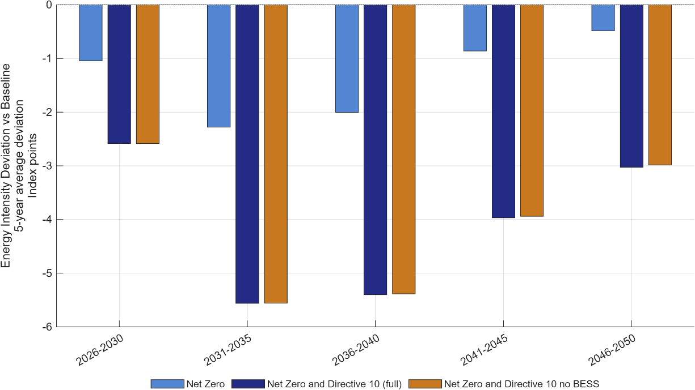

Figure 3: Impact of Energy Efficiency Measures on GDP and Energy intensity under Net Zero.

Note: Five‑year average deviation of GDP level (Panel A) and energy intensity (Panel B) from the PDP8‑rev Baseline, 2026–2050. The ETS emissions cap is held at the binding Net Zero trajectory across all three scenarios, so differences in outcomes isolate the contribution of energy efficiency on top of decarbonisation rather than a different climate‑policy stance. Net Zero: standalone decarbonisation pathway, no additional efficiency measures. Net Zero and Directive 10 (full): Net Zero combined with the complete Directive 10 package (industry/services efficiency + rooftop solar (RTS) at the Baseline’s ≈135 GW by 2050 + battery storage (BESS)). Net Zero and Directive 10 (no BESS): as above with the storage‑specific contribution removed. Adding Directive 10 energy efficiency narrows the GDP shortfall relative to standalone Net Zero and further reduces energy intensity; the full and no‑BESS variants are nearly identical, indicating BESS has little additional macroeconomic effect within the Net Zero pathway.

Source: Authors’ calculations using the DGE-METRIC model.

## Green finance (GF) architecture

*Policy context*. Mobilizing investment at the scale required by the PDP8-rev will depend not only on the availability of capital but also on its cost. Renewable energy projects are characterized by high upfront investment costs and relatively low operating costs, making financing conditions a key determinant of project viability. Reducing the cost of capital through concessional finance, blended finance, green bonds, green credit, and other financial instruments can therefore accelerate renewable energy deployment while lowering the overall economic cost of the transition.

*Scenarios.* Three financing architectures are compared. Each is a portfolio of seven instruments — bilateral and multilateral concessional loans, the public and private tranches of blended finance, sovereign and corporate green bonds, and commercial green credit ([Table 2](#_Ref239954640)) — whose allocation shares differ across the architectures (Table 3). These instruments group into the three types of capital DGE-METRIC distinguishes: public capital (ODA and multilateral concessional loans, the public tranche of blended finance, and sovereign green bonds), foreign or credit-enhanced private capital (the private tranche of blended finance and corporate green bonds)[^3], and domestic private and household capital (commercial green credit, which is the residual).

Each instrument carries an indicative all-in cost drawn from observed 2025–26 terms: bilateral and multilateral concessional windows at roughly 1–1.5%, the public first-loss tranche of blended structures at about 1%, sovereign and quasi-sovereign green bonds at 3.6–4.3% (close to Vietnam's ten-year government yield of about 4.4%), the credit-enhanced private tranche of blended structures at 6.0–6.5%, corporate green bonds at 6.0–7.0%, and commercial green credit at 7.0–8.0% — against a baseline commercial borrowing cost of 8–10% for private energy projects (Heinisch et al. 2026a).

The scenario allocation shares (Table 4) are applied to these rates, and the weighted average cost of finance is the sum of each share multiplied by its rate. For the balanced architecture this is 0.04×1.5% + 0.04×1.0% + 0.01×1.0% + 0.10×4.0% + 0.04×6.0% + 0.10×6.5% + 0.67×7.5% = **6.43%**; the same calculation gives **7.37%** for the market-led and **5.07%** for the public-led architecture. Public capital is charged the share-weighted average cost of its four instruments (2.68 / 2.82 / 2.22%); foreign capital is charged the share-weighted average of its two instruments (6.36 / 6.90 / 6.00%); and the return on domestic private and household capital is determined within the model by the household saving-and-investment decision rather than imposed by the scenario. The dollar figures in the last rows of [Table 3](#_Ref240286354) are illustrative only: they apply each architecture's weighted-average cost to the power-sector investment requirement of about USD 136 billion for 2026–2030 estimated in the Investment Needs Assessment (Heinisch et al. 2026b), to indicate the scale of the financing bill. They are not inputs to DGE-METRIC, which works with the cost-of-capital rates and allocation shares and derives the investment path from the PDP8 build-out.

The public and foreign capital shares are fixed in each architecture and are not free for the model to expand: public capital finances a set fraction of renewable investment (19.0% under GF A, 9.6% under GF B, 36.5% under GF C), and foreign capital likewise. Only the domestic private and household share adjusts endogenously. The analysis therefore does not assume an unlimited public balance sheet — even the public-led GF C architecture assumes that public capital finances 36.5 percent of renewable investment, consistent with the narrowing concessional envelope as Vietnam graduates from lower-middle-income status and loses access to the softest ODA and IDA terms (Heinisch et al. 2026a). A larger public share would require the corresponding assumption that additional ODA, multilateral, and JETP capital can in fact be mobilised at that scale.

| Instrument | Loan rate p.a. | Tenor | Typical providers | Model category |
|----|----|----|----|----|
| ODA / bilateral concessional | ≈0.8–1.5% | 20–40 yr | JICA, KfW, AFD, ADB | Public capital |
| Multilateral (MDB) concessional | ≈0.9–1.5% | 15–30 yr | World Bank IBRD/IDA, ADB OCR | Public capital |
| Blended finance — public first-loss tranche | ≈0–1.5% | 10–20 yr | GCF, JETP partners, DFI subordinated debt/equity | Public capital |
| Green bonds — sovereign / quasi-sovereign | ≈3.6–4.3% | 5–15 yr | State Treasury, state-owned enterprises | Public capital |
| Blended finance — private co-investment tranche | ≈6.0–6.5% | 10–20 yr | Credit-enhanced commercial co-investors | Foreign / credit-enhanced private capital |
| Green bonds — corporate | ≈6.0–7.0% | 3–15 yr | BIDV, Vietcombank, HDBank, SeABank | Foreign / credit-enhanced private capital |
| Green credit — commercial banks | ≈7.0–8.0% | 1–10 yr | BIDV, VietinBank, Vietcombank | Domestic private / household capital — the **residual**; its return is determined by the model, not set as an assumption |

Table 2: Financing instruments: indicative terms, providers, and model treatment

Notes: Baseline commercial borrowing cost for private energy projects is 8–10% (Heinisch et al. 2026a); the concessional, blended, and sovereign-bond instruments are the levers that pull the portfolio average below that range. Rates reflect 2025–26 conditions and do **not** yet embed the 2% ESG interest-rate subsidy under Resolution 198/2025/QH15 (National Assembly of Viet Nam 2025) or a green-collateral framework.

<table>
<caption>
Table 3: Portfolio allocation and resulting financing cost by architecture
</caption>
<colgroup>
<col style="width: 23%" />
<col style="width: 16%" />
<col style="width: 20%" />
<col style="width: 20%" />
<col style="width: 20%" />
</colgroup>
<thead>
<tr>
<th>Instrument</th>
<th>Model channel</th>
<th>GF A — balanced (PDP8 revised)</th>
<th>GF B — market-led</th>
<th>GF C — public-led</th>
</tr>
</thead>
<tbody>
<tr>
<td>ODA / bilateral concessional</td>
<td>Public</td>
<td>4.0% @ 1.5%</td>
<td>2.0% @ 1.5%</td>
<td>8.0% @ 1.0%</td>
</tr>
<tr>
<td>Multilateral (MDB) concessional</td>
<td>Public</td>
<td>4.0% @ 1.0%</td>
<td>2.0% @ 1.0%</td>
<td>8.0% @ 0.9%</td>
</tr>
<tr>
<td>Blended finance — public tranche</td>
<td>Public</td>
<td>1.0% @ 1.0%</td>
<td>0.6% @ 1.0%</td>
<td>3.0% @ 1.0%</td>
</tr>
<tr>
<td>Green bonds — sovereign</td>
<td>Public</td>
<td>10.0% @ 4.0%</td>
<td>5.0% @ 4.3%</td>
<td>17.5% @ 3.6%</td>
</tr>
<tr>
<td>Public capital — subtotal</td>
<td>Public</td>
<td>19.0%</td>
<td>9.6%</td>
<td>36.5%</td>
</tr>
<tr>
<td>Blended finance — private tranche</td>
<td>Foreign / cr.-enh. private</td>
<td>4.0% @ 6.0%</td>
<td>2.4% @ 6.5%</td>
<td>12.0% @ 6.0%</td>
</tr>
<tr>
<td>Green bonds — corporate</td>
<td>Foreign / cr.-enh. private</td>
<td>10.0% @ 6.5%</td>
<td>10.0% @ 7.0%</td>
<td>7.0% @ 6.0%</td>
</tr>
<tr>
<td>Foreign / credit-enhanced private — subtotal</td>
<td>Foreign</td>
<td>14.0%</td>
<td>12.4%</td>
<td>19.0%</td>
</tr>
<tr>
<td>Green credit — commercial banks</td>
<td>Domestic private / household</td>
<td>67.0% @ 7.5%</td>
<td>78.0% @ 8.0%</td>
<td>44.5% @ 7.0%</td>
</tr>
<tr>
<td>Total</td>
<td></td>
<td>100%</td>
<td>100%</td>
<td>100%</td>
</tr>
<tr>
<td>Weighted average cost of finance (WACF) = Σ(share × rate)</td>
<td></td>
<td>6.43%</td>
<td>7.37%</td>
<td>5.07%</td>
</tr>
<tr>
<td>Cost applied to public capital (share-weighted average of its four instruments)</td>
<td></td>
<td>2.68%</td>
<td>2.82%</td>
<td>2.22%</td>
</tr>
<tr>
<td>Cost applied to foreign capital (share-weighted average of its two instruments)</td>
<td></td>
<td>6.36%</td>
<td>6.90%</td>
<td>6.00%</td>
</tr>
<tr>
<td>Cost of domestic private/household capital</td>
<td></td>
<td colspan="3">determined by the model</td>
</tr>
<tr>
<td><em>Illustrative</em> annual financing cost — WACF × USD 136 bn (see note)</td>
<td></td>
<td>USD 8.74 bn</td>
<td>USD 10.02 bn</td>
<td>USD 6.89 bn</td>
</tr>
<tr>
<td><em>Illustrative</em> saving vs GF B</td>
<td></td>
<td>−USD 1.28 bn/yr</td>
<td></td>
<td>−USD 3.13 bn/yr</td>
</tr>
</tbody>
</table>

*Note on the last two rows.* These are **not** model inputs or outputs. They apply each architecture's weighted average cost of finance to the Investment Needs Assessment’s estimate (Heinisch et al. 2026b) of the power-sector investment requirement for 2026–2030 (USD 136 bn, 4.0% of GDP), purely to give a sense of the dollar stakes. DGE-METRIC works with the cost-of-capital rates and allocation shares above, not with this dollar figure; the investment need in the model is determined by the PDP8 build-out path, not by this line.

*\*

*Results.* The simulations produce four principal findings ([Figure 4](#_Ref236302951) - [Figure 6](#_Ref236146263)):

- **Lower financing costs stimulate investment.** Reducing the cost of capital increases investment in renewable energy and accelerates capital accumulation. Relative to the balanced GF A architecture (WACF 6.43%), which reproduces the PDP8-rev Baseline almost exactly, public-led financing (GF C, WACF 5.07%) lowers the cost of capital by roughly 1.4 percentage points and raises GDP by ≈0.9 percent by 2050; market-led financing (GF B, WACF 7.37%) raises the cost of capital by ≈0.9 percentage points and lowers GDP by ≈0.4 percent over the same horizon ([Figure 4](#_Ref236302951), [Figure 5](#_Ref240043175)).

- **Green finance supports stronger economic growth.** The GDP gain from cheaper finance is positive from the first period and builds as the lower-cost capital stock accumulates: GF C adds 0.35% to GDP in 2026–2030 and about 0.85% on average thereafter. Improved financing conditions raise long-term GDP by reducing investment costs and, through a lower WACC, lowering energy prices ([Figure 4](#_Ref236302951)).

<!-- -->

- **Macroeconomic benefits increase with the scale of financial support**. As the blended cost of capital falls — from GF B (7.37%) to GF C (5.07%) — the GDP gain strengthens correspondingly, but the mechanism is not "more public spending": it is concessional and blended instruments (ODA/MDB finance, guarantees, risk-sharing structures) reducing the effective financing cost paid across the investment pool, which crowds in private capital rather than substituting for it. Limited concessional resources are most valuable when deployed to de-risk and mobilise private capital at scale, particularly in the pre-2035 window where the financing gap is largest. When the same architectures are run against the NZ baseline, this leverage effect is larger still: a given WACC reduction produces a bigger absolute GDP effect than under PDP8-rev alone, because binding decarbonisation raises both investment needs and the cost of capital ([Figure 6](#_Ref236146263)).

- **Green finance complements other policy areas.** Lower financing costs enhance the effectiveness of both energy-efficiency policies and carbon pricing by reducing the economic cost of low-carbon investment and facilitating the transition to cleaner technologies.

> *Policy implications.* Financing conditions have persistent effects on renewable investment and GDP. Relative to the revised PDP8 Baseline, the public-led GF C scenario raises GDP by approximately 0.9 percent in 2046–2050, while the market-led GF B scenario lowers it by approximately 0.4 percent. The effects develop over time as investment accumulates. These results provide a quantitative basis for examining financing costs alongside the volume of finance mobilised. They do not, however, identify an optimal public financing share or separately establish the additional private investment generated by individual instruments. The pre-2035 financing gap identified in the accompanying Investment Needs Assessment provides additional context for the sequencing discussion in Section 4; it is distinct from the modelled GDP effects.

<figure>
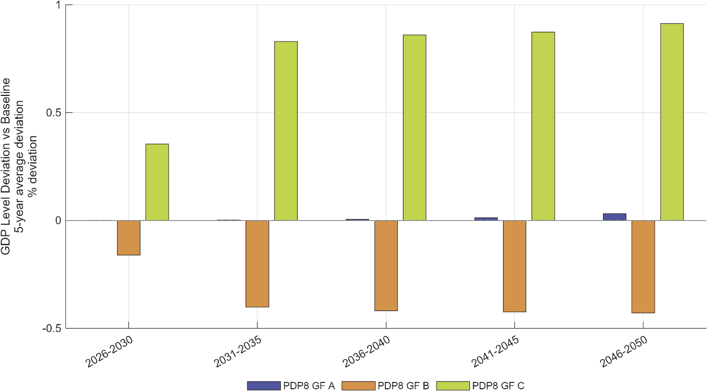
<figcaption>
Figure 4: Five-year average GDP-level deviations across green-finance architectures.
</figcaption>
</figure>

Note: Five-year average GDP-level deviations in percent for 2026–2050 relative to the PDP8-rev Baseline. The public-led, lower-cost GF C architecture generates a larger growth premium than the market-led GF B architecture, particularly from 2031 onward.

Source: Authors’ calculations using the DGE-METRIC model.

<figure>
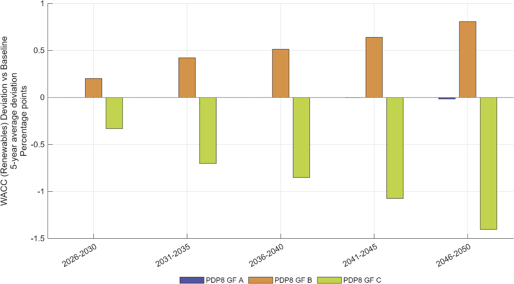
<figcaption>
Figure 5: Renewable-energy financing costs across green-finance architectures.
</figcaption>
</figure>

Note: Five-year average deviation of the effective WACC for renewable investment from the PDP8-rev Baseline, in percentage points. The spread between GF C and GF B widens from about 0.5 pp in 2026–2030 to about 2.2 pp in 2046–2050 as the cheaper (or dearer) financing tranches accumulate in the renewable capital stock, approaching the 2.3 pp gap in the portfolio-wide WACF in [Table 3](#_Ref240286354).

Source: Authors’ calculations using the DGE-METRIC model.

1)  **GDP impact**

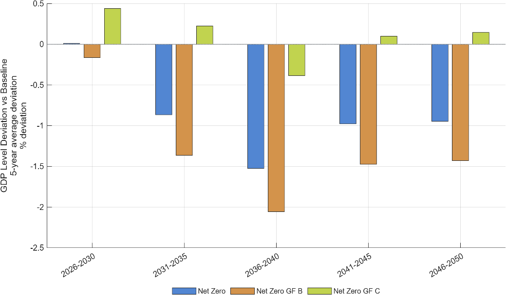

2)  **WACC impact**

<figure>
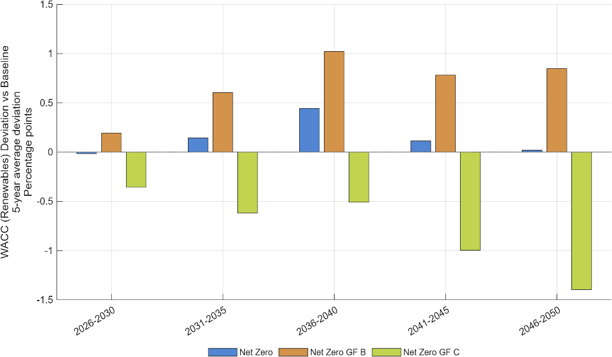
<figcaption>
Figure 6: Renewable-energy financing costs and GDP effects for Net Zero.
</figcaption>
</figure>

Note: Five-year average deviations from the PDP8-rev Baseline for the standalone Net Zero pathway and for Net Zero combined with the GF B and GF C architectures. Panel A: GDP level, percent. Panel B: effective WACC for renewable investment, percentage points. The difference between the NZ GF B or NZ GF C bars and the NZ bars isolates the effect of the financing architecture under a binding Net Zero cap.

Source: Authors’ calculations using the DGE-METRIC model.

## Carbon pricing and the Net Zero pathway

*Policy context.* Vietnam’s current policy trajectory is not sufficient to achieve Net Zero emissions. Closing this gap will require emissions covered by the domestic emissions trading system (ETS) to decline more rapidly. A tighter emissions cap and the resulting increase in carbon prices would strengthen incentives for firms to reduce fossil-fuel use, improve energy efficiency, and adopt low-carbon technologies. However, faster emissions reductions may also raise production and investment costs, placing downward pressure on economic growth, particularly when affordable low-carbon alternatives and financing are limited. These effects fall disproportionately on coal-fired power generation, the country's dominant power source: higher carbon prices raise its generation costs and could feed through to electricity tariffs, with implications for energy security during the transition (see Section 3.4 on structural adjustment in fossil-energy activities).

The macroeconomic effects of a stricter ETS therefore depend critically on complementary policies and the use of ETS revenues. How these revenues are recycled matters. Recycling them into support for non-fossil investment offsets a large part of the adverse GDP effect, whereas returning them to households as a climate dividend does not reduce the GDP loss in the model and can enlarge it, although it may be warranted for distributional and acceptance reasons. Additional measures, such as the GF C green-finance policy, energy-efficiency improvements, and investment-oriented revenue recycling, can further accelerate technological adjustment and help overcome the negative growth effects associated with a more stringent emissions pathway. Designing the ETS together with these complementary measures is therefore essential for reconciling Vietnam’s Net Zero commitment with economic growth and competitiveness.

*Scenarios.* The analysis evaluates a set of carbon-pricing scenarios based on an economy-wide energy related emissions cap consistent with Vietnam's long-term Net Zero objective (`NZ` scenario). The scenarios compare alternative carbon-price pathways in combination with different recycling schemes of the ETS revenues. In addition to the NZ scenario, which does not redistribute the ETS revenues, we simulate an NZ scenario with ETS revenues recycled as subsidies to reduce the cost of capital for non-fossil capital (`NZ subsidy`) and as transfer to citizens as a climate dividend (`Net Zero direct subsidy)`. Further, we simulate a scenario reaching Net Zero but also implementing public-led green finance instruments (GF C) and energy efficiency measures as foreseen by Directive 10 in combination with subsidies for investments excluding fossil capital (`Net Zero GF C + EE + subsidies`).

*Results.* The simulations produce four principal findings:

- **Carbon pricing can generate substantial revenues.** The Net Zero-compatible pathway leads to cumulative ETS revenues of roughly USD 250 billion over 2026–2050, assuming economy-wide energy-related emissions coverage and full auctioning, or roughly 25 percent of total investment needs to accomplish the revised PDP8 pathway ([Figure 7](#_Ref236152615) and [Figure 8](#_Ref236152676)). At the same time annual investment demand into the renewable sector increases from USD 40 billion p.a. to USD 70 billion (see Schult 2026). The implied carbon price under PDP8-rev rises only gradually — from USD 2/tCO2e in 2026–2030 to USD 6, USD 12, USD 18, and USD 23/tCO2e by 2046–2050 — while under Net Zero it climbs far more steeply: USD 10/tCO2e in 2026–2030, rising to USD 47, USD 121, USD 236, and USD 559/tCO2e by 2046–2050. By 2046–2050 the Net Zero carbon price is roughly 24 times the PDP8-rev level, reflecting the much steeper decarbonisation the binding Net Zero cap requires as low-cost abatement options are exhausted.[^4]

- **Carbon pricing entails moderate short-term adjustment costs.** In the standalone Net Zero scenario, higher carbon prices raise production costs in emissions-intensive sectors and, without recycling the additional ETS revenues, lead to moderate but persistent reductions in GDP. These adverse effects are substantially reduced when carbon pricing is combined with energy-efficiency measures, affordable green finance, and productive recycling of ETS revenues; in the most comprehensive policy package, GDP rises above the PDP8-rev baseline ([Figure 9](#_Ref236152628)).

- **Recycling ETS revenues into investment subsidies that reduce the capital cost of non-fossil capital is preferable to distributing them as climate dividends**, as it directly accelerates renewable deployment, lowers transition costs, and generates stronger long-term economic benefits ([Figure 9](#_Ref236152628)).

- **A predictable emissions-reduction pathway toward Net Zero**—combined with **publicly supported green finance**, stronger **energy-efficiency measures**, and the **productive recycling of ETS revenues**— **can raise the GDP level above the PDP8-rev Baseline in every five-year period** and more than offset the adverse economic effects of tighter emissions constraints.

*Policy implications.* The GDP effect of the Net Zero emissions constraint depends on both complementary measures and the use of ETS revenues. Recycling revenues into non-fossil investment support reduces the GDP shortfall relative to standalone Net Zero, whereas direct household transfers do not reduce that shortfall in the reported simulations. Combining investment-oriented revenue recycling with GF C financing and Directive 10 efficiency raises GDP above the revised PDP8 Baseline in every five-year period. These results inform the discussion of carbon pricing and revenue use in Section 4, while leaving household-welfare and distributional questions to complementary analysis. The revenue envelope also varies across scenarios: the combined package reduces the emissions price and produces lower ETS revenues than standalone Net Zero.

<figure>
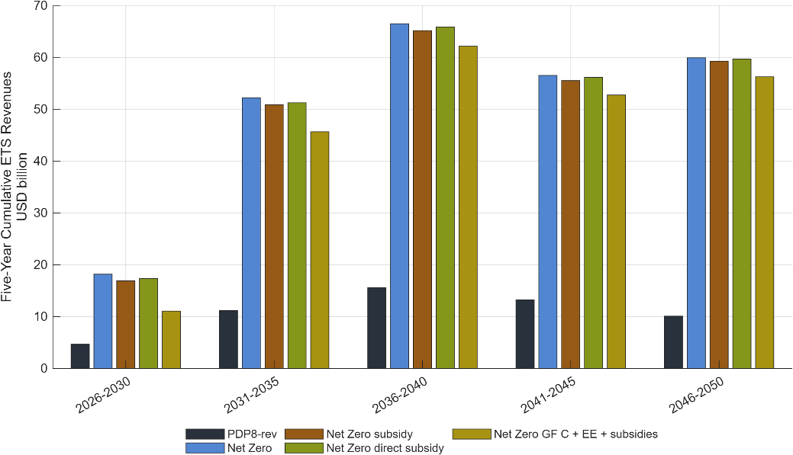
<figcaption>
Figure 7: Cumulative emissions trading system revenues.
</figcaption>
</figure>

Note: Values are five-year cumulative emissions trading system (ETS) revenues in USD billion, 2026–2050. Revenues assume economy-wide ETS coverage with full auctioning; under the pilot's narrower coverage and free allocation, revenues would be lower. The scenarios compare the PDP8-rev Baseline with a Net Zero pathway, Net Zero pathways supported by subsidies or direct subsidies, and a Net Zero pathway combining the public-led GF-C financing architecture with additional energy-efficiency measures and subsidies.

Source: Authors’ calculations using the DGE-METRIC model.

<figure>
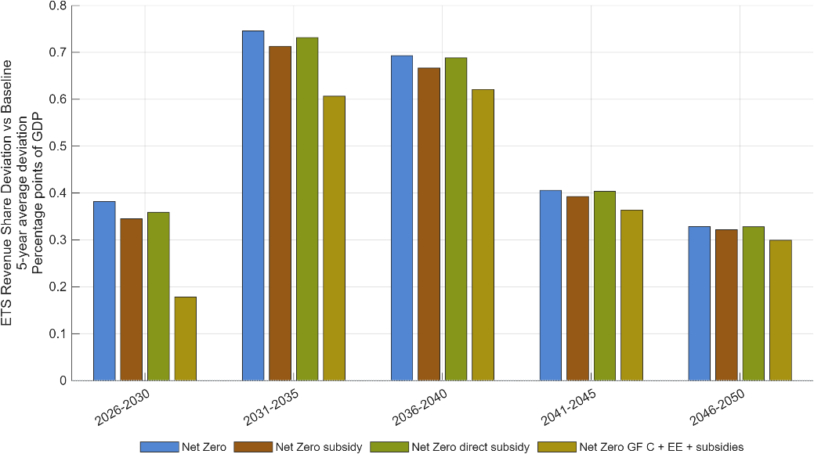
<figcaption>
Figure 8: Average deviations in ETS revenue as a share of GDP from the PDP8-rev Baseline.
</figcaption>
</figure>

Note: Bars show the five-year average deviation of ETS revenue from the baseline, measured in percentage points of GDP. Positive values indicate higher ETS revenues relative to the baseline. The largest deviations occur in 2031–2035, while the Net Zero – GF C + EE + subsidies scenario consistently produces the smallest increase in ETS revenues, reflecting lower demand for fossil energy and therefore a lower emission price.

Source: Authors’ calculations using the DGE-METRIC model.

<figure>
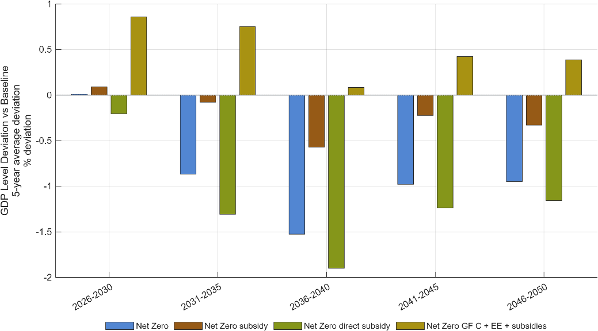
<figcaption>
Figure 9: GDP level deviation from the PDP8-rev Baseline.
</figcaption>
</figure>

Note: Bars show five-year average percentage deviations in GDP levels from the PDP8-rev baseline, 2026–2050. Recycling ETS revenues through non-fossil investment support reduces GDP losses relative to standalone Net Zero, whereas direct household transfers produce larger GDP losses. Combining investment-oriented revenue recycling with public-led green finance and stronger energy efficiency raises GDP above the baseline. These comparisons concern aggregate output and do not establish a ranking of household welfare or distributional outcomes.

Source: Authors’ calculations using the DGE-METRIC model.

# Cross-Cutting Findings

The scenario analysis demonstrates that Vietnam's energy transition should be understood as a coordinated economic transformation rather than a sequence of independent policy interventions. Energy efficiency, green finance, and carbon pricing influence different dimensions of the transition, yet their impacts are closely interconnected. Evaluating these policy areas within a common macroeconomic framework reveals six overarching findings that are relevant for policy design.

## Energy efficiency reduces the overall cost of the transition

Across the assessed scenarios, additional energy-efficiency improvements reduce energy requirements and production costs, supporting GDP with relatively modest additional investment. By limiting future electricity demand, efficiency also reduces pressure on investment in energy-supply infrastructure. Its economic contribution therefore extends beyond energy savings to the scale and cost of the wider transition.

The emissions outcome must be interpreted within the scenario design. Each efficiency comparison retains the emissions cap of its respective reference pathway: either the PDP8-rev Baseline or Net Zero. Where this cap remains binding, efficiency improvements lower the carbon price required to meet it rather than reduce covered emissions further. Under the Net Zero constraint, adding the Directive 10 package improves the GDP outcome by approximately **0.7–1.0 percentage points relative to standalone Net Zero over 2026–2050** (Figure 3). This quantifies the contribution of efficiency to reducing the economic cost of achieving the same emissions trajectory, rather than the effect of a different emissions target.

## Financing conditions determine the pace of investment

Financing conditions influence renewable investment and economic output throughout the transition. In the public-led GF C scenario, GDP is approximately **0.9 percent above the PDP8-rev Baseline in 2046–2050**, while the market-led GF B scenario leaves GDP approximately **0.4 percent below it** (Figure 4). Lower financing costs stimulate renewable investment, with the economic effects accumulating as additional capacity is installed. These are differences in GDP levels, not additions to annual GDP growth rates.

These results compare financing portfolios with specified costs and funding shares. For example, GF C assumes that public capital finances 36.5 percent of renewable investment, including concessional lending, the public component of blended finance and sovereign green bonds. This share is a scenario assumption, not an estimate of the optimal public contribution. The analysis demonstrates the macroeconomic consequences of different financing conditions without separately establishing the effects of each financial instrument. The availability, terms and implementation of individual instruments therefore remain distinct from the aggregate financing-cost effects quantified here.

## The economic effects of carbon pricing depend on complementary measures

A tighter emissions cap strengthens incentives to reduce fossil-fuel use but also raises adjustment costs, particularly when firms have limited access to affordable low-carbon alternatives. The scenarios show that these costs depend not only on the emissions trajectory but also on the opportunities available to improve energy efficiency and finance investment. Carbon pricing and these complementary measures therefore affect the transition through connected economic mechanisms.

[Figure 3](#_Ref240041185) isolates the contribution of additional efficiency under the Net Zero emissions constraint, while [Figure 6](#_Ref236146263) compares financing conditions under that constraint. Efficiency reduces energy requirements and the carbon-price pressure needed to meet the cap; lower financing costs facilitate investment in renewable capacity. The resulting GDP differences reflect changes in the economic cost of adjustment while maintaining the same emissions trajectory. The contribution of complementary measures is therefore to reduce the modelled cost of meeting the emissions constraint, rather than to substitute for that constraint or change its ambition.

## Structural adjustment is concentrated in fossil-energy activities

The transition to Net Zero emissions involves significant structural change across the economy, but these adjustment costs are unevenly distributed. Across all Net Zero scenarios, the fossil-energy sector experiences the largest contraction as capital and labour are progressively reallocated towards renewable electricity generation and other productive sectors. Energy efficiency measures can lower the required number of workers in the renewables industry. Vietnam has been the second largest exporter of PV modules and cells in the world in 2023 by export value, showing the potential of renewable energy industries in the creation of value and jobs.[^5] The contraction of fossil fuel-based jobs need to be counterbalanced with the respective labour market policies, such as re-skilling, up-skilling and the support of spatial and occupational labour mobility.

Industry and services are affected primarily through changing energy prices rather than direct emissions constraints. As a result, these sectors benefit disproportionately from policies that improve energy efficiency and reduce production costs. The findings therefore suggest that transition policies should be accompanied by measures that facilitate capital reallocation, and technological upgrading in affected sectors, thereby reducing adjustment costs while maintaining economic competitiveness (see the sectoral results in Schult 2026). For the coal industry specifically, this includes targeted support for workers and coal-producing regions — such as re-skilling, redeployment, and regional economic diversification programmes — drawing on international experience with coal-transition support in other emerging economies (see Carbon Trust et al. 2021) and from European coal transitions (Oei, Brauers, et al. 2020; Oei, Hermann, et al. 2020; Brachert et al. 2025; Garha and García Mira 2023).

The sectoral model results describe national adjustment patterns rather than region-specific labour-market outcomes. Evidence on skills requirements, recruitment difficulties and geographical mismatches between declining fossil-energy activities and new renewable-energy opportunities comes from the complementary CASE research discussed in Section 4 and the transition studies cited above. This evidence informs the discussion of workers, skills and affected regions; it is distinct from the aggregate model results and does not constitute a modelled estimate of the effects of individual retraining or regional-support programmes.

## Carbon pricing has important fiscal implications

Carbon pricing affects government revenues through the auctioning of emissions allowances and changes in the tax base. The standalone Net Zero pathway generates approximately **USD 250 billion in cumulative ETS revenues over 2026–2050**, assuming the model’s economy-wide coverage of energy-related emissions and full auctioning of allowances ([Figure 7](#_Ref236152615)). This is a conditional scenario estimate, not a guaranteed financing envelope: different coverage or allocation arrangements would change the revenue available.

The revenue estimate also depends on the accompanying policy package. With a common binding emissions cap, measures that lower the required carbon price also reduce the revenue raised from auctioning allowances. The combined GF C, energy-efficiency and investment-support scenario produces a smaller increase in ETS revenues relative to the Baseline, reflecting its lower emissions price ([Figure 8](#_Ref236152676)). The revenue envelope from standalone Net Zero therefore cannot be carried over unchanged to the combined package.

The use of revenues also changes the investment and GDP outcomes. Recycling revenues into non-fossil investment support reduces the GDP shortfall relative to standalone Net Zero, whereas direct household transfers do not reduce that shortfall in the reported simulations ([Figure 9](#_Ref236152628)). These comparisons concern aggregate output; they do not establish the relative household-welfare or distributional effects of the alternatives. Impacts on vulnerable households, workers and regions, as well as public acceptance, are separate questions that cannot be inferred from the GDP comparison alone.

## Policy areas are complementary rather than substitutable

Energy efficiency, green finance and ETS revenue recycling affect different constraints within the transition. Efficiency reduces energy requirements, lower financing costs support renewable investment, and investment-oriented revenue recycling reduces capital costs in non-fossil activities. Their combined effect is assessed directly in the integrated Net Zero scenario, rather than inferred by adding together the results of separate policy comparisons.

The scenario combining the Net Zero emissions constraint with **GF C financing, Directive 10 efficiency and investment-oriented revenue recycling raises GDP above the PDP8-rev Baseline in every five-year period over 2026–2050** ([Figure 9](#_Ref236152628)). This contrasts with the GDP losses that emerge under standalone Net Zero. Because the Net Zero variants share the same emissions constraint, the combined package changes the economic cost of meeting that constraint; it does not demonstrate additional reductions in covered emissions relative to the other Net Zero variants.

These findings provide the quantitative basis for Section 4’s discussion of efficiency implementation, financing conditions and the use of ETS revenues. Timing is also relevant: efficiency-related GDP gains peak in 2031–2035, while the effects of financing conditions accumulate over time. Together with the pre-2035 financing gap identified in the accompanying Investment Needs Assessment, these patterns inform the discussion of implementation sequencing. They do not establish an optimal allocation of a fixed public or concessional-finance budget across measures or periods.

Battery storage requires a separate interpretation. Its small additional GDP effect in these simulations reflects the model’s lack of hourly electricity-system operation, not an assessment of the value of storage for reliability, flexibility or renewable integration. Those contributions remain outside the macroeconomic comparisons presented here.

# Policy Recommendations

The recommendations are organised around a single guiding question: where can limited public and concessional resources generate the largest reduction in system-wide financing costs and the strongest mobilisation of private capital? The results point to three priorities: front-loading energy efficiency, using concessional and blended finance strategically to lower the effective cost of capital, and concentrating policy attention on the financing constraint before 2035. A gradually tightening ETS, whose revenues are recycled into investment, reinforces all three.

At the core of the recommended policy package is a strong emphasis on energy efficiency. Energy-efficiency measures should be front-loaded, with the bulk of the additional effort concentrated in the investment-intensive period before 2035. The model results show that relatively modest additional expenditure on efficiency measures can generate substantial economic benefits by reducing electricity demand, limiting the need for new generation capacity, and lowering the cost of meeting emissions targets. Scaling efficiency ambition from PDP8-rev to Directive 10 raises GDP by roughly 0.8 percent on average over 2026–2050 for an incremental cost of less than USD 400 million per year (below 0.1 percent of GDP). The gain peaks at about 1 percent in 2031–2035, the same period in which each unit of avoided electricity demand also reduces the generation and grid capacity that must be financed at still-high capital costs. Under a binding Net Zero cap, the same package narrows the GDP shortfall by 0.7–1.0 percentage points, because lower energy demand reduces the carbon price needed to meet the cap. Delivering the rooftop-solar build-out already embedded in the PDP8-rev Baseline (≈135 GW) is part of this priority: falling back to the pre-revision ≈95 GW path would cost 0.6–1.0 percent of GDP from 2031 onward. Efficiency programmes under Directive 09/CT-TTg and Directive 10/CT-TTg should therefore be scaled up now rather than phased in gradually after 2030. Fuel switching and technological upgrading further strengthen these effects by providing firms with practical options to respond to tighter climate policies.

Concessional and blended finance should be used strategically to lower the effective cost of capital across the entire investment pool, rather than being treated simply as an additional source of funds. The financing architecture is a first-order determinant of the cost of the transition: moving from the balanced GF A architecture (weighted average cost of finance 6.43 percent) to the public-led GF C architecture (5.07 percent) raises GDP by about 0.9 percent by 2050, whereas slipping to the market-led GF B architecture (7.37 percent) lowers it by about 0.4 percent. This gain does not rely on an unlimited public balance sheet. Even in GF C, public capital finances only 36.5 percent of renewable investment; the benefit comes from concessional windows, blended first-loss tranches and sovereign green bonds pulling down the cost of the whole portfolio and crowding in private co-investment. Applied to the power-sector investment requirement of about USD 136 billion for 2026–2030, the difference between GF C and GF B amounts to an illustrative USD 3.1 billion per year in financing costs. The model does not rank individual instruments, but its mechanism implies that limited concessional resources have the greatest effect where they reduce financing costs system-wide, for example through first-loss capital, guarantees and credit enhancement that make private renewable and grid projects bankable at lower rates, rather than where they substitute for capital that private investors would supply anyway.

The financing constraint before 2035 deserves particular policy attention, because this is where financing conditions are most consequential. The Investment Needs Assessment (Heinisch et al. 2026b) locates the largest financing gap in these investment-intensive years, and the model shows that capital financed in this window shapes the cost of capital for decades: the effective WACC gap between the GF C and GF B architectures widens from about 0.5 percentage points in 2026–2030 to about 2.2 percentage points in 2046–2050 as cheaper or dearer financing tranches accumulate in the renewable capital stock. The same period coincides with the peak GDP gains from energy efficiency (2031–2035) and, on a Net Zero pathway, with a steep rise in the carbon price (from about USD 10/tCO2e in 2026–2030 to USD 47/tCO2e in 2031–2035); under a binding Net Zero cap, a given reduction in the cost of capital yields a larger GDP effect than under PDP8-rev. Mobilising ODA, concessional and JETP finance, and building the institutional basis for blended structures, should therefore be concentrated in the period to 2035 rather than spread evenly across the transition.

In parallel, carbon pricing should be introduced gradually and coordinated with energy-efficiency programmes, renewable-energy policies, and affordable green finance. Concessional and blended finance can reduce capital costs, accelerate low-carbon investment, and ease the economic burden of the transition, particularly during the investment-intensive period before 2035. ETS revenues (cumulatively about USD 250 billion on the Net Zero pathway, assuming economy-wide coverage and full auctioning) can reinforce this process when they are used to reduce capital costs or support investment in non-fossil sectors, while targeted transfers can protect vulnerable households. In the model, combining investment-oriented revenue recycling with public-led green finance and Directive 10 efficiency raises GDP above the PDP8-rev Baseline in every five-year period, whereas returning revenues as climate dividends does not reduce the GDP loss of the standalone Net Zero pathway.

Finally, complementary measures are required to safeguard the reliability and inclusiveness of the transition. Battery energy storage should be treated primarily as a system-stability and grid-balancing requirement, while retraining and labour-mobility programmes can reduce adjustment costs for affected workers and regions. Taken together, these measures can transform a more ambitious Net Zero pathway from a potential economic burden into a driver of investment, productivity, and long-term resilience.

<figure>

<figcaption>
Figure 10: Policy Recommendations.
</figcaption>
</figure>

Source: Authors’ illustration.

Complementary **“Clean, Affordable and Secure Energy for Southeast Asia“ (CASE)** research identifies workforce development as an enabling condition for Vietnam’s energy transition. Employment projections indicate that renewable-energy expansion can generate more jobs than are lost in declining fossil-fuel activities, but differences in skills requirements and geographical location mean that new opportunities will not automatically absorb affected workers (NewClimate Institute 2025). Initial industry interviews also identify recruitment difficulties in technical and operational roles, highlighting the need to align training with planned renewable-energy deployment (NewClimate Institute 2025). These findings support closer coordination between employers and training institutions, targeted retraining and transition support in coal-dependent areas, and stronger domestic capabilities in renewable-energy installation, operation and maintenance (Deutsche Gesellschaft für Internationale Zusammenarbeit (GIZ) 2024; NewClimate Institute 2025). These recommendations complement the macroeconomic analysis.

# Conclusion

Vietnam’s transition to net zero emissions need not come at the expense of long-term economic growth. The scenario analysis shows that the economic outcome depends not only on the pace of emissions reduction, but also on how the transition is financed and implemented. A predictable emissions pathway, combined with stronger energy efficiency, affordable green finance and the use of emissions trading revenues to support investment, can substantially reduce adjustment costs. In the combined scenario, gross domestic product exceeds the baseline associated with the revised Power Development Plan VIII in every five-year period over 2026–2050.

Energy efficiency contributes by lowering energy requirements and production costs. The modelled Directive 10 pathway raises gross domestic product by approximately 0.8 percent on average over 2026–2050, for assumed additional annual efficiency investment equivalent to around 0.08 percent of gross domestic product in the model calibration, excluding battery storage. Under the net zero emissions constraint, these improvements reduce the carbon price and economic adjustment costs required to achieve the same emissions target. Rooftop solar makes a related contribution: the separate deployment comparison shows that falling short of the pathway already included in the baseline would reduce economic output. Fuel switching and technological upgrading provide further ways for firms to respond to tighter emissions constraints.

Financing conditions shape both the pace of renewable investment and its longer-term economic contribution. Renewable energy requires substantial upfront expenditure, making investment sensitive to financing costs. In the public-led financing scenario, gross domestic product is approximately 0.9 percent above the baseline in 2046–2050, whereas greater reliance on higher-cost market financing leaves it around 0.4 percent below. The simulations illustrate how concessional, blended and publicly supported finance can lower capital costs and support renewable investment, with benefits accumulating as new capacity is installed. These effects become larger under the more stringent net zero emissions pathway.

Carbon pricing connects emissions incentives with investment decisions and public revenues. A gradually tightening emissions trading system changes the relative cost of fossil-fuel use while generating revenues from allowance auctions. In the model, using these revenues to reduce capital costs in non-fossil sectors lowers the economic output loss associated with the standalone net zero pathway, whereas direct household transfers do not reduce that loss. This finding concerns aggregate output rather than household welfare. The role of targeted transfers, skills development and support for affected workers and regions therefore also depends on distributional considerations that are not resolved by the output comparison.

Coordination and timing connect these findings. Efficiency-related gains in economic output peak in 2031–2035, while the benefits of lower financing costs continue to accumulate. The accompanying investment-needs assessment also identifies a significant financing gap during the investment-intensive period before 2035. These patterns highlight the importance of early implementation and affordable financing, without establishing a precise allocation of public or concessional resources across measures and periods.

The results remain conditional on the model’s assumptions and are not forecasts. Battery storage illustrates the importance of complementary analysis: its contribution to grid balancing, renewable integration and reliability is not captured by the model’s annual representation of the electricity system. Detailed implications for workers, households and regions likewise require additional assessment. Within these limits, the analysis demonstrates how energy efficiency reduces energy requirements, affordable finance supports investment, and carbon pricing redirects activity towards lower emissions. Their interaction shapes the economic cost of the transition and its contribution to long-term economic performance.

# Annex: Methodology Summary

DGE-METRIC is a five-sector, one-region dynamic general equilibrium model that represents Vietnam’s economy over the period 2026–2050. The model is solved in Dynare as a deterministic perfect-foresight transition path and is calibrated to Vietnam’s 2019 input-output structure and a 2026 baseline. It captures interactions among households, firms, government, international trade, and the energy sector through goods, labour, capital, emissions-permit, and trade markets.

The productive economy is divided into five sectors: a non-energy aggregate, fossil energy, renewable energy, industry, and services. Policy scenarios are introduced as changes in variables such as energy productivity, emissions intensity, financing costs, investment prices, and the Emissions Trading System cap. Because all scenarios are evaluated against a common baseline, differences in outcomes can be interpreted as the estimated macroeconomic effects of the respective policy assumptions.

The model is designed to compare alternative policy pathways rather than to provide a point forecast of Vietnam’s future economy. The revised Power Development Plan VIII serves as the reference pathway, against which scenarios for stronger energy efficiency, alternative green-finance architectures, carbon pricing, and revenue recycling are assessed. The results therefore illustrate the relative direction and magnitude of policy effects under internally consistent assumptions.

DGE-METRIC provides an economy-wide perspective that complements engineering, electricity-system, and financial-sector analyses. It captures how energy-transition policies affect investment, consumption, production, government revenue, trade, and sectoral adjustment across the economy. Technical questions relating to electricity-system operation, grid balancing, technology dispatch, or the detailed performance of individual power technologies are best assessed together with specialised energy-system models. This is particularly relevant for battery energy storage systems, whose principal contribution lies in reliability, flexibility, and renewable-energy integration.

Vietnam is represented as a single national economy. The results therefore reflect aggregate national effects and do not distinguish between provinces or regions. Regional investment needs, local labour-market effects, infrastructure constraints, and subnational distributional impacts can be examined through complementary regional analysis.

Green finance is represented primarily through changes in the effective cost of capital and, where applicable, investment prices and capital-accumulation pathways. This approach captures the main macroeconomic effects of improved financing conditions without modelling every financial instrument separately. Concessional loans, blended finance, guarantees, green bonds, and development-bank facilities can therefore be interpreted as alternative mechanisms capable of delivering the financing-cost reductions represented in the scenarios.

The analysis also evaluates the fiscal effects of carbon pricing, including revenues generated through the auctioning of emissions allowances. Alternative revenue-recycling scenarios illustrate how the use of these revenues can affect investment and GDP. Detailed questions concerning household compensation, firm-level support, administrative design, and the distribution of costs and benefits remain important areas for complementary fiscal and distributional assessment.

As with any calibrated macroeconomic model, the quantitative results depend on assumptions regarding technology, financing conditions, trade, capital flows, behavioural responses, and policy implementation. The scenarios are therefore most informative when interpreted comparatively. Across the scenarios assessed, the main qualitative findings remain consistent: energy efficiency lowers transition costs, affordable finance supports investment and growth, and carbon pricing performs best when combined with complementary investment and technology policies.

For a full description of the model structure, calibration, data sources, equations, solution method, and scenario configuration, see the accompanying Technical Report (Schult 2026).

# References

Brachert, Matthias, Jochen Dehio, Katja Heinisch, et al. 2025. *Begleitende Evaluierung des Investitionsgesetzes Kohleregionen (InvKG) und des STARK-Bundesprogramms: Zwischenbericht 2025*. IWH Studies No. 3/2025. Leibniz-Institut für Wirtschaftsforschung Halle (IWH). https://doi.org/10.18717/sy6dd-ns70.

Carbon Trust, Asia Group Advisors, and Climate Smart Ventures. 2021. *Regional: Opportunities to Accelerate Coal to Clean Power Transition in Selected Southeast Asian Developing Member Countries*. Technical Assistance Consultant’s Report ADB Project No. 55024-001. Asian Development Bank. https://www.adb.org/sites/default/files/project-documents/55024/55024-001-tacr-en.pdf.

Deutsche Gesellschaft für Internationale Zusammenarbeit (GIZ). 2024. *Co-Benefits of Energy Transition in Vietnam’s Industrial Development*. Clean, Affordable and Secure Energy (CASE) for Southeast Asia. GIZ. https://caseforsea.org/post_knowledge/co-benefits-of-energy-transition-in-viet-nams-industrial-development/.

Garha, Nachatter Singh, and Ricardo García Mira. 2023. *D6.1 Policy Recommendations (European Level)*. ENTRANCES Project Deliverable, Horizon 2020 Grant Agreement No. 883947. University of A Coruña. https://entrancesproject.eu/wp-content/uploads/2024/02/D6.1-Policy-recommendations-report.pdf.

Government of Viet Nam. 2026. *Directive No. 10/CT-TTg of the Prime Minister: On Strengthening the Implementation of Electricity Saving and Development of Rooftop Solar Power*. 10/CT-TTg. Prime Minister of Viet Nam. https://vanban.chinhphu.vn/?pageid=27160&docid=217358.

Heinisch, Katja, Ulrike Lehr, Christian Lutz, Huyen Nguyen, and Christoph Schult. 2026a. *Macroeconomic Modelling for Energy Investments in Vietnam: Report on Green Financial Instruments for the Energy Transition in Vietnam*. Project report. Halle Institute for Economic Research (IWH).

Heinisch, Katja, Ulrike Lehr, Christian Lutz, Huyen Nguyen, and Christoph Schult. 2026b. *Macroeconomic Modelling for Energy Investments in Vietnam: Report on Investment Needs Assessment*. Project report. Halle Institute for Economic Research (IWH).

National Assembly of Viet Nam. 2025. *On a Number of Special Mechanisms and Policies for Private Economic Development*. Resolution 198/2025/QH15. https://vanban.chinhphu.vn/?pageid=27160&docid=213695.

NewClimate Institute. 2025. *Projection of Labour Force for Vietnam’s Energy Transition*. Clean, Affordable and Secure Energy (CASE) for Southeast Asia. NewClimate Institute. https://newclimate.org/resources/publications/projection-of-labour-force-for-viet-nams-energy-transition.

Oei, Pao-Yu, Hanna Brauers, and Philipp Herpich. 2020. “Lessons from Germany’s Hard Coal Mining Phase-Out: Policies and Transition from 1950 to 2018.” *Climate Policy* 20 (8): 963–79. https://doi.org/10.1080/14693062.2019.1688636.

Oei, Pao-Yu, Hauke Hermann, Philipp Herpich, Oliver Holtemöller, Benjamin Lünenbürger, and Christoph Schult. 2020. “Coal Phase-Out in Germany – Implications and Policies for Affected Regions.” *Energy* 196: 117004. https://doi.org/10.1016/j.energy.2020.117004.

Schult, Christoph. 2026. *DGE-METRIC: A Dynamic General Equilibrium Model for Vietnam’s Energy Transition*. Technical report. Halle Institute for Economic Research (IWH).

World Bank (World Bank). 2022. “Key Highlights: Country Climate and Development Report for Vietnam.” July 1. https://www.worldbank.org/en/brief/2022/07/01/key-highlights-country-climate-and-development-report-for-vietnam.

World Bank. 2026. “Photovoltaic Cells, Whether or Not Assembled in Modules or Made Up into Panels (HS 854140): Exports by Country, 2023.” World Integrated Trade Solution (WITS). https://wits.worldbank.org/trade/comtrade/en/country/ALL/year/2023/tradeflow/Exports/partner/WLD/product/854140.

[^1]: See Government of Viet Nam (2026).

[^2]: The 7.4%/5.1% savings paths and less than USD 400 million/year investment figure are not quantitative targets stated verbatim in Directive 10; they are expert-calibrated modelling assumptions constructed by the project team to represent the Directive's efficiency ambition. Savings percentages are converted into sector-level energy-productivity shocks in the model (industry and services), and the associated investment path is accumulated as a capital-cost stock feeding those shocks. Calibration draws on sector energy-intensity benchmarks and comparable efficiency-programme cost data; it does not represent a specific budget line published in the Directive.

[^3]: The model's second capital-cost channel is labelled "foreign" for convenience, but it represents credit-enhanced, non-household private capital priced at an intermediate rate of about 6–7%. The residency of corporate green-bond finance is not identified separately.

[^4]: Carbon prices for the revised PDP8 replicate the values reported in Carbon Trust, Asia Group Advisors, and Climate Smart Ventures (2021). Further, the simulated CO2 price under Net-Zero are consistent with the values reported in World Bank (2022) until 2040.

[^5]: Ranking based on 2023 export values for photovoltaic cells and modules (HS 854140) in the World Integrated Trade Solution, which draws on UN Comtrade data (World Bank 2026).

