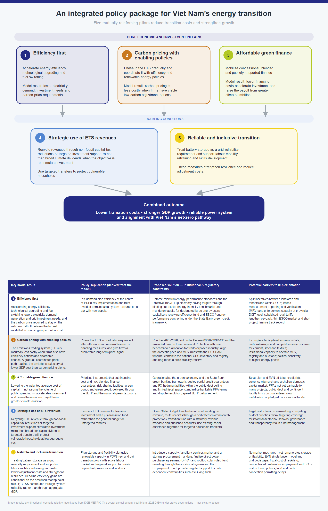



> Macroeconomic Modelling for Energy Investments in Vietnam
>
> Report on Macroeconomic Impact Assessment
>
> Katja Heinisch, Ulrike Lehr, Christian Lutz, Huyen Nguyen, Christoph Schult

**Imprint**

> **Contact**
>
> Dr Katja Heinisch
>
> Tel +49 345 77 53 836
>
> E-mail: katja.heinisch@iwh-halle.de
>
> **Authors**
>
> Katja Heinischa
>
> Ulrike Lehrb
>
> Christian Lutzb
>
> Huyen Nguyena,c
>
> Christoph Schulta
>
> a Halle Institute for Economic Research (IWH)\
> b GWS – Gesellschaft für Wirtschaftliche Strukturforschung (GWS) mbH\
> c King’s College London
>
> **Issuer**
>
> Halle Institute for Economic Research (IWH) – Member of the Leibniz Association
>
> **Executive Board**
>
> Professor Reint E. Gropp, PhD
>
> Professor Dr Oliver Holtemöller
>
> Professor Michael Koetter, PhD
>
> Dr Tankred Schuhmann
>
> **Address**
>
> Kleine Maerkerstrasse 8
>
> D-06108 Halle (Saale), Germany
>
> Postal Address
>
> P.O. Box 11 03 61
>
> D-06017 Halle (Saale), Germany
>
> Tel +49 345 7753 60
>
> [www.iwh-halle.de](http://www.iwh-halle.de)
>
> All rights reserved.
>
> Macroeconomic Modelling for Energy Investments in Vietnam
>
> Report on Macroeconomic Impact Assessment
>
> Katja Heinisch, Ulrike Lehr, Christian Lutz, Huyen Nguyen, Christoph Schult
>
> Halle (Saale), 14.09.2026

# Table of Contents

Table of Contents 4

List of Figures 5

List of Tables 5

Abbreviations 6

Executive Summary 8

1 Introduction 10

1.1 The implementation challenge 10

1.2 Policy questions 11

1.3 Purpose of this report 12

122 Policy Areas Assessed

2.1 Energy efficiency 12

2.2 Green finance (GF) architecture 18

2.3 Carbon pricing and the Net Zero pathway 23

3 Cross-Cutting Findings 27

3.1 Energy efficiency reduces the overall cost of the transition 27

3.2 Financing conditions determine the pace of investment 27

3.3 Carbon pricing is most effective within an integrated policy framework 27

3.4 Structural adjustment is concentrated in fossil-energy activities 28

3.5 Carbon pricing has important fiscal implications 28

3.6 Policy areas are complementary rather than substitutable 29

4 Policy Recommendations 29

5 Conclusion 31

Annex: Methodology Summary 33

References 35

**\**

# List of Figures

Figure 1: Impact of Energy Efficiency Measures on GDP. 15

Figure 2: Energy-intensity reductions relative to the PDP8-rev Baseline. 16

Figure 3: Impact of Energy Efficiency Measures on GDP and Energy intensity under Net Zero. 17

Figure 4: Five-year average GDP-level deviations across green-finance architectures. 22

Figure 5: Renewable-energy financing costs across green-finance architectures. 22

Figure 6: Renewable-energy financing costs and GDP effects for Net Zero. 23

Figure 7: Cumulative emissions trading system revenues. 25

Figure 8: Average deviations in ETS revenue as a share of GDP from the PDP8-rev Baseline. 26

Figure 9: GDP level deviation from the PDP8-rev Baseline. 26

Figure 10: Policy Recommendations. 31

# 

List of TablesTable 1: Green finance instruments 11

Table 2: Overview of Energy Efficiency Scenarios 13

Table 3: Financing instruments: indicative terms, providers, and model treatment 19

Table 4: Portfolio allocation and resulting financing cost by architecture 20

**\**

# 

AbbreviationsADB Asian Development Bank

AFD Agence française de développement

BESS Battery Energy Storage System

BIDV Joint Stock Commercial Bank for Investment and Development of Vietnam

CASE Clean, Affordable and Secure Energy for Southeast Asia

CBAM Carbon Border Adjustment Mechanism

CO₂ Carbon Dioxide

COP26 26th United Nations Climate Change Conference of the Parties

CT-TTg Prime Minister’s Directive

DGE Dynamic General Equilibrium

DGE-METRIC Dynamic General Equilibrium for Macroeconomic Energy Transition Incorporating Carbon Markets

DFI Development Finance Institution

DOIT Department of Industry and Trade

DPPA Direct Power Purchase Agreement

EE Energy Efficiency

ESCO Energy Service Company

ESG Environmental, Social and Governance

ETS Emissions Trading System

EU European Union

EVN Vietnam Electricity

FDI Foreign Direct Investment

FX Foreign Exchange

GCF Green Climate Fund

GDP Gross Domestic Product

GF Green finance

GHG Greenhouse Gas

GIZ Deutsche Gesellschaft für Internationale Zusammenarbeit

GW Gigawatt

GWS Gesellschaft für Wirtschaftliche Strukturforschung

HS Harmonized Commodity Description and Coding System

IBRD International Bank for Reconstruction and Development

IDA International Development Association

IWH Halle Institute for Economic Research

JETP Just Energy Transition Partnership

JICA Japan International Cooperation Agency

KfW Kreditanstalt für Wiederaufbau

MDB Multilateral Development Bank

MOIT Ministry of Industry and Trade

MRV Measurement, reporting and verification

NDC Nationally Determined Contribution

NĐ-CP Government Decree

NZ Net Zero

ODA Official Development Assistance

OCR Ordinary Capital Resources

PDP8 Power Development Plan VIII

PDP8-rev Revised Power Development Plan VIII

PM Prime Minister

Pp Percentage points

PPA Power Purchase Agreement

PV Photovoltaic

QĐ-BCT Ministry of Industry and Trade Decision

QĐ-TTg Prime Minister’s Decision

RTS Rooftop solar

SOE State-Owned Enterprise

tCO₂e Tonnes of carbon dioxide equivalent

UN United Nations

USD United States dollar

WACC Weighted Average Cost of Capital

WACF Weighted Average Cost of Finance

WITS World Integrated Trade Solution

# 

Executive SummaryVietnam's commitment to achieve Net Zero greenhouse gas emissions by 2050 while maintaining a alongside its target of at least 10 percent annual economic growth over 2026–2030 and above 7.5 percent thereafter to 2050, requires an unprecedented transformation of its energy system. The revised Power Development Plan VIII (PDP8-rev) provides the strategic framework for this transition. Its successful implementation depends on expanding renewable energy capacity and improving energy efficiency, enabled by mobilising affordable finance to meet the investment needs of one trillion USD (IWH Investment Needs Assessment, 2026) and establishing effective carbon pricing mechanisms — the three policy areas this report evaluates. These policy choices will shape Vietnam's emissions trajectory, its long-term economic growth, investment, and competitiveness.

This report assesses the macroeconomic implications of three key policy areas using **DGE-METRIC** (**D**ynamic **G**eneral **E**quilibrium for **M**acroeconomic **E**nergy **T**ransition **I**ncorporating **C**arbon markets), a dynamic general equilibrium model with 5 sectors calibrated to the Vietnamese economy. The analysis compares alternative energy-efficiency pathways, green-finance architectures, and carbon-pricing scenarios over the period 2026–2050 to evaluate how different policy packages affect economic performance and the cost of the energy transition.

The analysis leads to **five principal findings**:

1)  

*Energy efficiency delivers economic gains while supporting the energy transition.*Accelerating energy-efficiency improvements increases economic output with only modest additional investment requirements. Both the revised PDP8 (PDP8-rev), serving as the Baseline scenario, and more ambitious efficiency targets under PM Directive 10/CT-TTg (our EE Directive 10 scenario; see Scenarios below) raise GDP levels throughout the 2026–2050 horizon, with only a small near-term investment-consumption trade-off (see IWH Technical Report, 2026). Scaling ambition from PDP8-rev to Directive-10-equivalent targets raises GDP by roughly 0.8 percent on average over 2026–2050, peaking at 1 percent in 2031–2035, for an incremental cost of less than USD 400 million per year.

2)  

*Affordable green finance substantially lowers the cost of the transition.*Lower financing costs stimulate renewable investment, increase long-term economic growth, and reduce the overall cost of implementing Vietnam's energy transition. Shifting from market-led to public-led (concessional) green finance reduces annual weighted average cost of capital by 1.5 percentage points, compounding into a persistent GDP growth premium that builds through the 2030s as lower-cost capital accumulates.

3)  

*Carbon pricing is most effective when combined with complementary policies.*A binding emissions cap accelerates decarbonisation relative to the PDP8-rev Baseline but imposes adjustment costs on the economy. These costs are significantly reduced when firms can respond through fuel switching, technological improvements, and stronger energy efficiency. Carbon pricing should therefore be implemented as part of a broader policy package rather than as a standalone instrument.

4)  

*Policy areas reinforce one another.*The strongest macroeconomic outcomes are achieved when energy efficiency, affordable finance, and carbon pricing are implemented together. The analysis demonstrates that these policies are complementary rather than substitutable: improved financing conditions increase the effectiveness of climate policy, while energy-efficiency improvements reduce the economic cost of achieving emissions targets.

5)  

*Early action delivers the greatest economic benefits.*The gains from efficiency and from integrated Net Zero policy are largest during the period of rapid investment before 2035, while the benefits of cheaper finance keep building as the lower-cost capital stock accumulates. Mobilising concessional finance, accelerating energy-efficiency programmes, and establishing credible carbon-market institutions early in the transition can substantially reduce long-term adjustment costs while supporting sustainable economic growth.

Overall, the results suggest that Vietnam's energy transition should not be viewed solely as an environmental challenge but as an economic opportunity requiring coordinated investment, financial-sector development, and complementary policy design. Well-designed policy packages can substantially reduce the macroeconomic costs of decarbonisation while supporting long-term growth, competitiveness, and energy security. The findings are based on quantitative evidence to support policymakers and development partners in prioritising investments and policy reforms that enable a cost-effective and economically resilient transition to Net Zero emissions.

# Introduction

Vietnam is one of Southeast Asia's fastest-growing economies, with electricity demand having approximately doubled every decade over the past two decades. This rapid growth has been supported by coal-fired power generation, making the decarbonisation of the energy sector one of the country's most significant economic and policy challenges. To address this challenge, Vietnam has adopted a set of ambitious climate and energy commitments, including:

- 
- 

**Net Zero greenhouse gas emissions by 2050**, announced at COP26 and reaffirmed in recent key strategies and policies, which Vietnam has stated it will achieve with the support of international partners; **No new coal-fired power capacity after 2030**, a central pillar of the PDP8-rev, and as agreed in the Just Energy Transition Partnership (JETP). These commitments represent Vietnam’s ambitious climate and energy transition targets.. Throughout this report, the revised PDP8 (PDP8-rev) serves as the **Baseline scenario** (reference), representing the development path under currently announced energy and climate policies. The baseline assumes a rapid expansion of renewable electricity generation, storage technologies, and transmission infrastructure, together with a gradual phase-down of coal-fired power and continued economic growth of approximately 10 percent per year until 2030 and above 7.5 percent between 2030 and 2050, reflecting a high level of ambition for investment mobilisation, institutional capacity, and policy execution. This growth path is DGE-METRIC's Baseline modelling assumption, calibrated to Vietnam's medium-term ambition rather than an independent forecast.

## The implementation challenge

Successful implementation moreover will need to face a threefold challenge: the mere scale of the investment needed, an emerging **financing gap** hinging on borrowing conditions, and the impacts from the newly introduced **carbon pricing** mechanism.

**Investment scale.** Achieving the objectives of PDP8-rev requires an unprecedented mobilisation of capital. The accompanying IWH Investment Needs Assessment (2025) estimates cumulative investment needs of approximately **USD 1 trillion over 2026–2050**, excluding replacement investment required to offset depreciation and maintain the existing capital stock**.** The estimate covers the deployment of renewable power-generation capacity, transmission-network expansion and grid reinforcement, energy-efficiency improvements, and climate-adaptation measures. The central policy question is therefore not whether Vietnam can ultimately afford the transition, but whether investment can be mobilised **at sufficient scale, at sufficiently low cost**, and **within the implementation timeline** required to achieve the country's climate and energy objectives.

**The financing gap.** Financing conditions represent one of the principal constraints to this transition. The accompanying IWH Investment Needs Assessment (2026) identifies a significant financing gap during the investment-intensive period before 2035, driven by large upfront infrastructure costs, comparatively high commercial borrowing costs for private energy projects, a limited domestic institutional investor base, and uncertainty regarding future carbon-market revenues.

Different green finance instruments can address these constraints through complementary channels (see IWH Financial Assessment 2026). Concessional loans reduce borrowing costs, blended finance lowers project risk and mobilises private capital, green bonds expand access to long-term infrastructure finance, and development-bank facilities ease investment constraints during the transition. Together, these instruments can lower the effective cost of capital and support higher levels of private investment.

|     |     |
|-----|-----|
|     |     |
|     |     |
|     |     |
|     |     |

Source: Authors’ compilation.

**Carbon market development.** At the same time, Vietnam is implementing a pilot domestic emissions trading system under Decree No. 06/2022/NĐ-CP, as amended by Decree No. 119/2025/NĐ-CP, with the domestic carbon exchange governed by Decree No. 29/2026/NĐ-CP and Decree No. 83/2026/NĐ-CP. The macroeconomic impacts of this emerging carbon-pricing mechanism operate mainly through two channels: rising energy costs for carbon-intensive sectors and households, which raise adjustment costs during the transition unless offset by revenue recycling; and the price signal itself, which redirects investment toward lower-emission technologies as the emissions cap tightens over time. Because the pilot ETS's sector coverage and allocation method (free versus auctioned permits) are still being finalised, the scale of these impacts remains more uncertain than for the energy-efficiency and green-finance policy areas assessed elsewhere in this report. Together, financing conditions and carbon pricing will play a central role in determining both the pace and the macroeconomic cost of the energy transition.

## Policy questions

Against this background, this report evaluates three policy areas that are central to Vietnam's energy transition. Each addresses a different challenge to achieving the country's climate objectives while sustaining long-term economic growth.

- **Energy efficiency.** How much can accelerated improvements in energy efficiency reduce energy demand, lower investment requirements, and support economic growth? The analysis examines alternative efficiency pathways to quantify their macroeconomic implications and their contribution to reducing the overall cost of the energy transition.

- **Green finance.** To what extent can improved financing conditions accelerate investment in renewable energy during the energy transition? The analysis evaluates

- 

[how lower financing costs—through concessional lending, blended finance, green bonds, green credit, and other financial instruments—affect investment, economic growth, and the affordability of Vietnam's energy transition. **Carbon pricing.** How can an emissions trading system (ETS) support Vietnam's Net Zero commitment while limiting macroeconomic adjustment costs? The analysis examines alternative carbon-revenue recycling pathways and assesses how complementary policies influence both emissions reductions and economic performance. Taken together, these policy areas address the three principal dimensions of the energy transition: **reducing energy demand, mobilising investment, and** **managing the adjustment costs of decarbonisation**. While each policy can influence macroeconomic outcomes individually, their greatest impact is expected when implemented as part of a coordinated policy package.](mailto:achim.deuchert@giz.de)

## [Purpose of this report](mailto:achim.deuchert@giz.de)

[This report is intended to inform the design and sequencing of Vietnam's energy transition policy package under the revised PDP8 — in particular, the level of energy-efficiency ambition, the choice of green finance instruments, and the design of the emissions trading system (ETS). Energy efficiency, green finance, and carbon pricing are frequently assessed individually; this report's contribution is to evaluate how the three interact under a common modelling framework, providing quantitative evidence to support policymakers and development partners in prioritising investments and policy reforms for a cost-effective and economically resilient transition to Net Zero emissions. Because the three policy areas are shown to be complementary rather than substitutable, the report's recommendations emphasise their coordinated implementation rather than treating any one instrument in isolation.](mailto:achim.deuchert@giz.de)

[This report is written for Vietnamese policymakers and development partners: for policymakers, it is intended to inform the sequencing and design of energy-efficiency, green-finance, and carbon-pricing measures under the revised PDP8; for development partners, it identifies where concessional finance and technical support can be most effectively targeted. It forms part of a broader assessment for Vietnam's energy transition, alongside the Investment Needs Assessment (IWH Investment Needs Assessment Report, 2026) and Financial Assessment Report (IWH Financial Assessment Report, 2026).](mailto:achim.deuchert@giz.de)

[This report evaluates the macroeconomic implications of alternative policy pathways using **DGE-METRIC** (**D**ynamic **G**eneral **E**quilibrium for **M**acroeconomic **E**nergy **T**ransition **I**ncorporating **C**arbon markets), a dynamic general equilibrium model calibrated to the Vietnamese economy. The model captures interactions between households, firms, government, international trade, and the energy sector, allowing alternative policy scenarios to be evaluated within a consistent macroeconomic framework. Rather than forecasting Vietnam's future economy, the model compares internally consistent policy scenarios to identify the economic consequences of different policy choices and the mechanisms through which they affect long-term development.](mailto:achim.deuchert@giz.de)

[The remainder of this report is organised as follows. Section 2 presents the macroeconomic assessment of the three policy areas, covering energy efficiency, green finance, and carbon pricing. Section 3 synthesises the cross-cutting findings and discusses their policy implications. Section 4 presents recommendations for policymakers and development partners, while Section 5 concludes. A concise description of the modelling framework is provided in the Annex, with additional methodological details available in the accompanying technical report.](mailto:achim.deuchert@giz.de)

# [Policy Areas Assessed](mailto:achim.deuchert@giz.de)

[This section evaluates three complementary policy areas that address different dimensions of Vietnam's energy transition. While each instrument can influence macroeconomic outcomes individually, the greatest benefits arise when they are implemented as part of a coherent policy package. The analysis therefore examines the effects of energy-efficiency improvements, alternative green-finance architectures, and carbon pricing under a common modelling framework, allowing their individual and combined macroeconomic impacts to be assessed.](mailto:achim.deuchert@giz.de)

## [Energy efficiency](mailto:achim.deuchert@giz.de)

[*Policy context.* Improving energy efficiency is widely recognised as one of the **most cost-effective measures** for reducing future energy demand while supporting economic growth. Vietnam's PDP8-rev already incorporates significant efficiency improvements across industry and services, while Decision No. 280/QĐ-TTg approving the National Energy Efficiency Programme (VNEEP3) provides the overarching legal framework for energy efficiency in Vietnam. Prime Minister Directive 09/CT-TTg on strengthening energy saving and efficient use, together with Prime Minister Directive 10/CT-TTg of 30 March 2026 calls for a more ambitious acceleration of energy-saving measures and rooftop solar (RTS). A key policy question is whether increasing energy-efficiency ambition generates sufficient macroeconomic benefits to justify the additional investment required. Battery energy storage systems (BESS) are also assessed as part of the analysis to distinguish their contribution to system performance from their aggregate macroeconomic effects.](mailto:achim.deuchert@giz.de)

[*Scenarios.* Directive No. 10/CT-TTg places electricity saving and demand-side management at the centre of Vietnam's response to rapid demand growth and emerging risks to security of supply. It calls for stronger electricity savings, lower peak demand, more efficient equipment and production processes, and greater use of self-consumption rooftop solar combined, where appropriate, with battery energy storage. The EE Directive 10 scenario translates this policy direction into an economy-wide pathway and is evaluated against the more moderate revised PDP8-rev (our Baseline scenario, defined above). The Directive 10 pathway assumes sector-specific energy savings by 2030 of approximately **7.4% in industry and 5.1% in services**, supported by efficiency investment of less than **USD 400 million** per year, equivalent to approximately **0.076%** of GDP. These values are expert-calibrated modelling assumptions translating the Directive's higher efficiency ambition into model variables; they are not quantitative targets stated verbatim in the Directive.[^1] The Baseline and EE Directive 10 scenarios follow the emissions trajectory given by the carbon cap, so that differences in outcomes capture the macroeconomic effects of stronger energy efficiency.](mailto:achim.deuchert@giz.de)

| [Scenario](mailto:achim.deuchert@giz.de) | [Policy interpretation](mailto:achim.deuchert@giz.de) | [What it shocks vs. Baseline](mailto:achim.deuchert@giz.de) | [Key modelling constraint](mailto:achim.deuchert@giz.de) |
|----|----|----|----|
| [Directive 10 (full)](mailto:achim.deuchert@giz.de) | [Directive 10 ambition: stronger industry/services efficiency + RTS rollout to 135 GW (as in the revised PDP8 high case and already in the Baseline, so no additional RTS shock) + PV–battery (BESS) integration](mailto:achim.deuchert@giz.de) | [Sector energy-productivity gains (≈7.4% industry, ≈5.1% services by 2030)](mailto:achim.deuchert@giz.de) | [Emissions held to the Baseline ETS cap; BESS/RTS deployment and cost paths are assumed, not optimised](mailto:achim.deuchert@giz.de) |
| [Directive 10 (no BESS)](mailto:achim.deuchert@giz.de) | [Same package, storage-specific contribution removed](mailto:achim.deuchert@giz.de) | [As Directive 10 (full), but grid BESS reset to Baseline](mailto:achim.deuchert@giz.de) | [Isolates the macro contribution of BESS](mailto:achim.deuchert@giz.de) |
| [RTS at pre-revision 95 GW](mailto:achim.deuchert@giz.de) | [Rooftop solar under-delivers — reaches only the pre-revision ≈95 GW instead of the ≈135 GW now in the Baseline](mailto:achim.deuchert@giz.de) | [Rooftop-PV capacity and its efficiency/investment channels rewound to the 95 GW path; no retrofit EE, no BESS](mailto:achim.deuchert@giz.de) | [Downside counterfactual: quantifies the RTS contribution by removing it](mailto:achim.deuchert@giz.de) |

[Table 2: Overview of Energy Efficiency Scenarios](mailto:achim.deuchert@giz.de)

[Note: RTS = rooftop solar; BESS = battery energy storage system; ETS = emissions trading scheme. All three scenarios are built on top of the Baseline and isolate the contribution of specific policy levers described in Directive 10: Directive 10 (full) applies the complete package of industrial/services efficiency gains and BESS deployment, with rooftop solar at the Baseline's 135 GW path; Directive 10 (no BESS) removes only the storage-specific contribution to isolate BESS's macro impact; and RTS at pre-revision 95 GW tests a downside counterfactual in which rooftop-PV capacity underperforms and reverts to the pre-revision ≈95 GW target instead of the ≈135 GW assumed in the Baseline. Sector energy-productivity gains and BESS investment costs are model inputs (not optimised outcomes), and emissions in all scenarios are capped at Baseline ETS levels.](mailto:achim.deuchert@giz.de)

[To test how the same efficiency ambition performs once the economy is on a binding decarbonisation path, Directive 10 is run on top of the Net Zero emissions cap rather than the Baseline (see Figure 3). Three scenarios share the identical Net Zero cap, so that differences in outcomes isolate the contribution of energy efficiency and rooftop solar/BESS while holding the pace of decarbonisation fixed: **Net Zero** (the standalone decarbonisation pathway, no additional efficiency package), **Net Zero and Directive 10 (full)** (Net Zero combined with the complete Directive 10 package — stronger industry/services efficiency, rooftop solar (RTS) at the Baseline’s ≈135 GW by 2050, and battery storage (BESS)), and **Net Zero and Directive 10 (no BESS)** (the same package with the storage‑specific contribution removed).](mailto:achim.deuchert@giz.de)

[*Results.* The simulations produce six principal findings ([Figure 1](#_Ref236059137) to Figure 3).](mailto:achim.deuchert@giz.de)

- 
- 
- 
- 
- 
- 

[**Higher energy efficiency improves economic performance.** Efficiency scenarios increase GDP relative to the PDP8-rev Baseline; Directive 10 raises **GDP by roughly 0.8 percent** on average over 2026–2050, **peaking at 1 percent in 2031–2035**, for an incremental efficiency investment of less than 0.1% of GDP (less than USD 400 million per year), plus about USD 800 million per year for BESS, which has no measurable GDP effect (Figure 1).**The additional investment requirement is modest.** Achieving higher efficiency requires less than USD 400 million per year for efficiency measures and about USD 800 million per year for BESS — together a limited increase in investment expenditure relative to GDP — while the temporary reduction in consumption is small and largely offset by stronger long-term economic growth and lower energy costs in the future (see IWH Technical Report, 2026).**Energy demand declines, while covered emissions remain unchanged under the common binding cap.** Directive-10 is run against the same ETS cap trajectory as Baseline, so differences between the two scenarios isolate the macroeconomic effect of energy efficiency. Efficiency directly lowers energy demand at given prices; because less carbon-price pressure is then needed to hit the same cap, the equilibrium carbon price falls relative to Baseline. That lower price both shifts the generation mix toward higher carbon intensity and induces some rebound in energy demand, and the two together restore emissions to the fixed cap. The net effect is unchanged covered emissions, a lower carbon price than Baseline, and reduced cost pressure on energy-intensive industry.**Due to model design, battery energy storage (BESS) shows only limited macroeconomic effects.** Removing battery storage has a negligible impact on aggregate GDP (≈0 pp by 2050). This should not be read as evidence that BESS has little value. DGE-METRIC operates at annual resolution with no hourly dispatch, so the channels through which storage actually creates value — curtailment avoidance, peak shaving, and reduced fossil back-up capacity — cannot be priced in this framework by design. The near-zero GDP effect therefore reflects a structural model limitation, not an economic assessment of storage. The reliability and renewable-integration benefits of BESS are real but sit outside what an annual general-equilibrium model can quantify. **Rooftop solar (RTS) is a key driver of the positive GDP effects.** The RTS at pre-revision 95 GW counterfactual shows that the rooftop build-out already embedded in the PDP8-rev Baseline is worth about 0.6–1.0% of GDP in the 2030s and 2040s, a magnitude similar to the gain from the full Directive 10 package. Mechanically, this works through a specific modelled channel: self-consumed rooftop generation displaces grid-purchased electricity, which lowers the effective cost of energy inputs to production, rather than reflecting a general preference for rooftop solar over utility-scale renewables or grid investment. Accelerating its deployment therefore appears to be one of the most promising measures for reducing demand for centrally-supplied electricity, easing pressure on the power system. The model can not capture potential side effects on grid stability, congestion, or balancing needs — those require network- and dispatch-resolution analysis that lies outside this annual general-equilibrium model.**Energy efficiency also lowers the cost of** **decarbonisation.** Repeating the Directive 10 package on top of a binding Net Zero emissions cap shows the same effect holds under stronger climate ambition: Net Zero combined with **Directive 10** delivers roughly **0.7–1.0** percentage points higher GDP than the standalone Net Zero pathway across 2026–2050, narrowing the transition cost of decarbonisation rather than adding to it. As under the Baseline, BESS makes little additional difference, the full and no‑BESS variants are nearly identical (Figure 3).*Policy implication.* The results suggest that energy efficiency is a low-cost growth policy as well as an energy policy. Accelerating efficiency improvements delivers sustained economic benefits while reducing future energy demand and investment requirements. However, energy efficiency alone cannot achieve Vietnam's emissions objectives. To maximise both economic and environmental benefits, efficiency policies should therefore be implemented alongside carbon pricing and continued investment in low-carbon electricity generation.](mailto:achim.deuchert@giz.de)

[Figure 1: Impact of Energy Efficiency Measures on GDP.](mailto:achim.deuchert@giz.de)

[Note: Five-year-average deviation of GDP level from the PDP8-rev Baseline (percent), 2026–2050, with the ETS emissions cap held constant across scenarios. Directive 10 (full): stronger industry/services efficiency + rooftop solar (RTS) at the Baseline’s ≈135 GW by 2050 + battery storage (BESS). Directive 10 no BESS: same, storage removed. RTS at pre-revision 95 GW: rooftop solar limited to the original ≈95 GW target, no extra efficiency retrofit, no BESS. Directive 10 raises GDP by about 0.7–1.0%; the two variants are near-identical; missing the 135 GW rooftop target costs 0.6–1.0% of GDP from 2031 onward.](mailto:achim.deuchert@giz.de)

[Source: Authors’ calculations using the DGE-METRIC model.](mailto:achim.deuchert@giz.de)

[Figure 2: Energy-intensity reductions relative to the PDP8-rev Baseline.](mailto:achim.deuchert@giz.de)

[Note: Five-year-average deviation of the energy-intensity index (final energy per unit GDP, 2026 = 100) from the PDP8-rev Baseline, in index points; negative = lower energy intensity (more efficient). The two Directive 10 variants cut energy intensity and are near-identical (BESS adds nothing). Under RTS at pre-revision 95 GW, weaker rooftop-solar deployment raises reliance on grid electricity, pushing energy intensity above Baseline.](mailto:achim.deuchert@giz.de)

[Source: Authors’ calculations using the DGE-METRIC model.](mailto:achim.deuchert@giz.de)

1)  

[**Impact on GDP**](mailto:achim.deuchert@giz.de)

2)  

[**Impact on Energy Intensity** ](mailto:achim.deuchert@giz.de)

[Figure 3: Impact of Energy Efficiency Measures on GDP and Energy intensity under Net Zero.](mailto:achim.deuchert@giz.de)

[Note: Five‑year average deviation of GDP level (Panel A) and energy intensity (Panel B) from the PDP8‑rev Baseline, 2026–2050. The ETS emissions cap is held at the binding Net Zero trajectory across all three scenarios, so differences in outcomes isolate the contribution of energy efficiency on top of decarbonisation rather than a different climate‑policy stance. Net Zero: standalone decarbonisation pathway, no additional efficiency measures. Net Zero and Directive 10 (full): Net Zero combined with the complete Directive 10 package (industry/services efficiency + rooftop solar (RTS) at the Baseline’s ≈135 GW by 2050 + battery storage (BESS)). Net Zero and Directive 10 (no BESS): as above with the storage‑specific contribution removed. Adding Directive 10 energy efficiency narrows the GDP shortfall relative to standalone Net Zero and further reduces energy intensity; the full and no‑BESS variants are nearly identical, indicating BESS has little additional macroeconomic effect within the Net Zero pathway.](mailto:achim.deuchert@giz.de)

[Source: Authors' calculations using the DGE‑METRIC model.](mailto:achim.deuchert@giz.de)

## [Green finance (GF) architecture](mailto:achim.deuchert@giz.de)

[*Policy context*. Mobilising investment at the scale required by the PDP8-rev will depend not only on the availability of capital but also on its cost. Renewable energy projects are characterised by high upfront investment costs and relatively low operating costs, making financing conditions a key determinant of project viability. Reducing the cost of capital through concessional finance, blended finance, green bonds, green credit, and other financial instruments can therefore accelerate renewable energy deployment while lowering the overall economic cost of the transition.](mailto:achim.deuchert@giz.de)

[*Scenarios.* Three financing architectures are compared. Each is a portfolio of seven instruments — bilateral and multilateral concessional loans, the public and private tranches of blended finance, sovereign and corporate green bonds, and commercial green credit (Table 3) — whose allocation shares differ across the architectures (Table 3). These instruments group into the three types of capital DGE-METRIC distinguishes: public capital (ODA and multilateral concessional loans, the public tranche of blended finance, and sovereign green bonds), foreign or credit-enhanced private capital (the private tranche of blended finance and corporate green bonds)[^2], and domestic private and household capital (commercial green credit, which is the residual).](mailto:achim.deuchert@giz.de)

[Each instrument carries an indicative all-in cost drawn from observed 2025–26 terms: bilateral and multilateral concessional windows at roughly 1–1.5%, the public first-loss tranche of blended structures at about 1%, sovereign and quasi-sovereign green bonds at 3.6–4.3% (close to Vietnam's ten-year government yield of about 4.4%), the credit-enhanced private tranche of blended structures at 6.0–6.5%, corporate green bonds at 6.0–7.0%, and commercial green credit at 7.0–8.0% — against a baseline commercial borrowing cost of 8–10% for private energy projects (State Bank of Vietnam lending-rate data; IWH Financial Assessment 2026).](mailto:achim.deuchert@giz.de)

[The scenario allocation shares (Table 4) are applied to these rates, and the weighted average cost of finance is the sum of each share multiplied by its rate. For the balanced architecture this is 0.04×1.5% + 0.04×1.0% + 0.01×1.0% + 0.10×4.0% + 0.04×6.0% + 0.10×6.5% + 0.67×7.5% = **6.43%**; the same calculation gives **7.37%** for the market-led and **5.07%** for the public-led architecture. Public capital is charged the share-weighted average cost of its four instruments (2.68 / 2.82 / 2.22%); foreign capital is charged the share-weighted average of its two instruments (6.36 / 6.90 / 6.00%); and the return on domestic private and household capital is determined within the model by the household saving-and-investment decision rather than imposed by the scenario. The dollar figures in the last rows of Table 4 are illustrative only: they apply each architecture's weighted-average cost to the power-sector investment requirement of about USD 136 billion for 2026–2030 estimated in the IWH Investment Needs Assessment (2026), to indicate the scale of the financing bill. They are not inputs to DGE-METRIC, which works with the cost-of-capital rates and allocation shares and derives the investment path from the PDP8 build-out.](mailto:achim.deuchert@giz.de)

[The public and foreign capital shares are fixed in each architecture and are not free for the model to expand: public capital finances a set fraction of renewable investment (19.0% under GF A, 9.6% under GF B, 36.5% under GF C), and foreign capital likewise. Only the domestic private and household share adjusts endogenously. The analysis therefore does not assume an unlimited public balance sheet — even the public-led GF C architecture holds the concessional and ODA share to a bounded 36.5%, consistent with the narrowing concessional envelope as Vietnam graduates from lower-middle-income status and loses access to the softest ODA and IDA terms (IWH Financial Assessment, 2025). A larger public share would require the corresponding assumption that additional ODA, multilateral, and JETP capital can in fact be mobilised at that scale.](mailto:achim.deuchert@giz.de)

| [Instrument](mailto:achim.deuchert@giz.de) | [Loan rate p.a.](mailto:achim.deuchert@giz.de) | [Tenor](mailto:achim.deuchert@giz.de) | [Typical providers](mailto:achim.deuchert@giz.de) | [Model category](mailto:achim.deuchert@giz.de) |
|----|----|----|----|----|
| [ODA / bilateral concessional](mailto:achim.deuchert@giz.de) | [≈0.8–1.5%](mailto:achim.deuchert@giz.de) | [20–40 yr](mailto:achim.deuchert@giz.de) | [JICA, KfW, AFD, ADB](mailto:achim.deuchert@giz.de) | [Public capital](mailto:achim.deuchert@giz.de) |
| [Multilateral (MDB) concessional](mailto:achim.deuchert@giz.de) | [≈0.9–1.5%](mailto:achim.deuchert@giz.de) | [15–30 yr](mailto:achim.deuchert@giz.de) | [World Bank IBRD/IDA, ADB OCR](mailto:achim.deuchert@giz.de) | [Public capital](mailto:achim.deuchert@giz.de) |
| [Blended finance — public first-loss tranche](mailto:achim.deuchert@giz.de) | [≈0–1.5%](mailto:achim.deuchert@giz.de) | [10–20 yr](mailto:achim.deuchert@giz.de) | [GCF, JETP partners, DFI subordinated debt/equity](mailto:achim.deuchert@giz.de) | [Public capital](mailto:achim.deuchert@giz.de) |
| [Green bonds — sovereign / quasi-sovereign](mailto:achim.deuchert@giz.de) | [≈3.6–4.3%](mailto:achim.deuchert@giz.de) | [5–15 yr](mailto:achim.deuchert@giz.de) | [State Treasury, state-owned enterprises](mailto:achim.deuchert@giz.de) | [Public capital](mailto:achim.deuchert@giz.de) |
| [Blended finance — private co-investment tranche](mailto:achim.deuchert@giz.de) | [≈6.0–6.5%](mailto:achim.deuchert@giz.de) | [10–20 yr](mailto:achim.deuchert@giz.de) | [Credit-enhanced commercial co-investors](mailto:achim.deuchert@giz.de) | [Foreign / credit-enhanced private capital](mailto:achim.deuchert@giz.de) |
| [Green bonds — corporate](mailto:achim.deuchert@giz.de) | [≈6.0–7.0%](mailto:achim.deuchert@giz.de) | [3–15 yr](mailto:achim.deuchert@giz.de) | [BIDV, Vietcombank, HDBank, SeABank](mailto:achim.deuchert@giz.de) | [Foreign / credit-enhanced private capital](mailto:achim.deuchert@giz.de) |
| [Green credit — commercial banks](mailto:achim.deuchert@giz.de) | [≈7.0–8.0%](mailto:achim.deuchert@giz.de) | [1–10 yr](mailto:achim.deuchert@giz.de) | [BIDV, VietinBank, Vietcombank](mailto:achim.deuchert@giz.de) | [Domestic private / household capital — the **residual**; its return is determined by the model, not set as an assumption](mailto:achim.deuchert@giz.de) |

[Table 3: Financing instruments: indicative terms, providers, and model treatment](mailto:achim.deuchert@giz.de)

[Notes: Baseline commercial borrowing cost for private energy projects is 8–10% (IWH Financial Assessment 2025); the concessional, blended, and sovereign-bond instruments are the levers that pull the portfolio average below that range. Rates reflect 2025–26 conditions and do **not** yet embed the 2% ESG interest-rate subsidy (Resolution 198/2025/QH15) or a green-collateral framework.](mailto:achim.deuchert@giz.de)

[\
](mailto:achim.deuchert@giz.de)

<table>
<caption>
<a href="mailto:achim.deuchert@giz.de">Table 4: Portfolio allocation and resulting financing cost by architecture</a>
</caption>
<colgroup>
<col style="width: 23%" />
<col style="width: 16%" />
<col style="width: 20%" />
<col style="width: 20%" />
<col style="width: 20%" />
</colgroup>
<thead>
<tr>
<th><a href="mailto:achim.deuchert@giz.de">Instrument</a></th>
<th><a href="mailto:achim.deuchert@giz.de">Model channel</a></th>
<th><a href="mailto:achim.deuchert@giz.de">GF A — balanced (PDP8 revised)</a></th>
<th><a href="mailto:achim.deuchert@giz.de">GF B — market-led</a></th>
<th><a href="mailto:achim.deuchert@giz.de">GF C — public-led</a></th>
</tr>
</thead>
<tbody>
<tr>
<td><a href="mailto:achim.deuchert@giz.de">ODA / bilateral concessional</a></td>
<td><a href="mailto:achim.deuchert@giz.de">Public</a></td>
<td><a href="mailto:achim.deuchert@giz.de">4.0% @ 1.5%</a></td>
<td><a href="mailto:achim.deuchert@giz.de">2.0% @ 1.5%</a></td>
<td><a href="mailto:achim.deuchert@giz.de">8.0% @ 1.0%</a></td>
</tr>
<tr>
<td><a href="mailto:achim.deuchert@giz.de">Multilateral (MDB) concessional</a></td>
<td><a href="mailto:achim.deuchert@giz.de">Public</a></td>
<td><a href="mailto:achim.deuchert@giz.de">4.0% @ 1.0%</a></td>
<td><a href="mailto:achim.deuchert@giz.de">2.0% @ 1.0%</a></td>
<td><a href="mailto:achim.deuchert@giz.de">8.0% @ 0.9%</a></td>
</tr>
<tr>
<td><a href="mailto:achim.deuchert@giz.de">Blended finance — public tranche</a></td>
<td><a href="mailto:achim.deuchert@giz.de">Public</a></td>
<td><a href="mailto:achim.deuchert@giz.de">1.0% @ 1.0%</a></td>
<td><a href="mailto:achim.deuchert@giz.de">0.6% @ 1.0%</a></td>
<td><a href="mailto:achim.deuchert@giz.de">3.0% @ 1.0%</a></td>
</tr>
<tr>
<td><a href="mailto:achim.deuchert@giz.de">Green bonds — sovereign</a></td>
<td><a href="mailto:achim.deuchert@giz.de">Public</a></td>
<td><a href="mailto:achim.deuchert@giz.de">10.0% @ 4.0%</a></td>
<td><a href="mailto:achim.deuchert@giz.de">5.0% @ 4.3%</a></td>
<td><a href="mailto:achim.deuchert@giz.de">17.5% @ 3.6%</a></td>
</tr>
<tr>
<td><a href="mailto:achim.deuchert@giz.de">Public capital — subtotal</a></td>
<td><a href="mailto:achim.deuchert@giz.de">Public</a></td>
<td><a href="mailto:achim.deuchert@giz.de">19.0%</a></td>
<td><a href="mailto:achim.deuchert@giz.de">9.6%</a></td>
<td><a href="mailto:achim.deuchert@giz.de">36.5%</a></td>
</tr>
<tr>
<td><a href="mailto:achim.deuchert@giz.de">Blended finance — private tranche</a></td>
<td><a href="mailto:achim.deuchert@giz.de">Foreign / cr.-enh. private</a></td>
<td><a href="mailto:achim.deuchert@giz.de">4.0% @ 6.0%</a></td>
<td><a href="mailto:achim.deuchert@giz.de">2.4% @ 6.5%</a></td>
<td><a href="mailto:achim.deuchert@giz.de">12.0% @ 6.0%</a></td>
</tr>
<tr>
<td><a href="mailto:achim.deuchert@giz.de">Green bonds — corporate</a></td>
<td><a href="mailto:achim.deuchert@giz.de">Foreign / cr.-enh. private</a></td>
<td><a href="mailto:achim.deuchert@giz.de">10.0% @ 6.5%</a></td>
<td><a href="mailto:achim.deuchert@giz.de">10.0% @ 7.0%</a></td>
<td><a href="mailto:achim.deuchert@giz.de">7.0% @ 6.0%</a></td>
</tr>
<tr>
<td><a href="mailto:achim.deuchert@giz.de">Foreign / credit-enhanced private — subtotal</a></td>
<td><a href="mailto:achim.deuchert@giz.de">Foreign</a></td>
<td><a href="mailto:achim.deuchert@giz.de">14.0%</a></td>
<td><a href="mailto:achim.deuchert@giz.de">12.4%</a></td>
<td><a href="mailto:achim.deuchert@giz.de">19.0%</a></td>
</tr>
<tr>
<td><a href="mailto:achim.deuchert@giz.de">Green credit — commercial banks</a></td>
<td><a href="mailto:achim.deuchert@giz.de">Domestic private / household</a></td>
<td><a href="mailto:achim.deuchert@giz.de">67.0% @ 7.5%</a></td>
<td><a href="mailto:achim.deuchert@giz.de">78.0% @ 8.0%</a></td>
<td><a href="mailto:achim.deuchert@giz.de">44.5% @ 7.0%</a></td>
</tr>
<tr>
<td><a href="mailto:achim.deuchert@giz.de">Total</a></td>
<td></td>
<td><a href="mailto:achim.deuchert@giz.de">100%</a></td>
<td><a href="mailto:achim.deuchert@giz.de">100%</a></td>
<td><a href="mailto:achim.deuchert@giz.de">100%</a></td>
</tr>
<tr>
<td><a href="mailto:achim.deuchert@giz.de">Weighted average cost of finance (WACF) = Σ(share × rate)</a></td>
<td></td>
<td><a href="mailto:achim.deuchert@giz.de">6.43%</a></td>
<td><a href="mailto:achim.deuchert@giz.de">7.37%</a></td>
<td><a href="mailto:achim.deuchert@giz.de">5.07%</a></td>
</tr>
<tr>
<td><a href="mailto:achim.deuchert@giz.de">Cost applied to public capital (share-weighted average of its four instruments)</a></td>
<td></td>
<td><a href="mailto:achim.deuchert@giz.de">2.68%</a></td>
<td><a href="mailto:achim.deuchert@giz.de">2.82%</a></td>
<td><a href="mailto:achim.deuchert@giz.de">2.22%</a></td>
</tr>
<tr>
<td><a href="mailto:achim.deuchert@giz.de">Cost applied to foreign capital (share-weighted average of its two instruments)</a></td>
<td></td>
<td><a href="mailto:achim.deuchert@giz.de">6.36%</a></td>
<td><a href="mailto:achim.deuchert@giz.de">6.90%</a></td>
<td><a href="mailto:achim.deuchert@giz.de">6.00%</a></td>
</tr>
<tr>
<td><a href="mailto:achim.deuchert@giz.de">Cost of domestic private/household capital</a></td>
<td></td>
<td colspan="3"><a href="mailto:achim.deuchert@giz.de">determined by the model</a></td>
</tr>
<tr>
<td><a href="mailto:achim.deuchert@giz.de"><em>Illustrative</em> annual financing cost — WACF × USD 136 bn (see note)</a></td>
<td></td>
<td><a href="mailto:achim.deuchert@giz.de">USD 8.74 bn</a></td>
<td><a href="mailto:achim.deuchert@giz.de">USD 10.02 bn</a></td>
<td><a href="mailto:achim.deuchert@giz.de">USD 6.89 bn</a></td>
</tr>
<tr>
<td><a href="mailto:achim.deuchert@giz.de"><em>Illustrative</em> saving vs GF B</a></td>
<td></td>
<td><a href="mailto:achim.deuchert@giz.de">−USD 1.28 bn/yr</a></td>
<td></td>
<td><a href="mailto:achim.deuchert@giz.de">−USD 3.13 bn/yr</a></td>
</tr>
</tbody>
</table>

[*Note on the last two rows.* These are **not** model inputs or outputs. They apply each architecture's weighted average cost of finance to the Investment Needs Assessment's (2025) estimate of the power-sector investment requirement for 2026–2030 (USD 136 bn, 4.0% of GDP), purely to give a sense of the dollar stakes. DGE-METRIC works with the cost-of-capital rates and allocation shares above, not with this dollar figure; the investment need in the model is determined by the PDP8 build-out path, not by this line.](mailto:achim.deuchert@giz.de)

[*\*
](mailto:achim.deuchert@giz.de)

[*Results.* The simulations produce four principal findings ([Figure 4](#_Ref236302951) - [Figure 6](#_Ref236146263)):](mailto:achim.deuchert@giz.de)

- 
- 
- 
- 

<!-- -->

- 
- 
- 

> [**Lower financing costs stimulate investment.** Reducing the cost of capital increases investment in renewable energy and accelerates capital accumulation. Relative to the balanced GF A architecture (WACF 6.43%), which reproduces the PDP8-rev Baseline almost exactly, public-led financing (GF C, WACF 5.07%) lowers the cost of capital by roughly 1.4 percentage points and raises GDP by ≈0.9 percent by 2050; market-led financing (GF B, WACF 7.37%) raises the cost of capital by ≈0.9 percentage points and lowers GDP by ≈0.4 percent over the same horizon (Figure 4, Figure 5).**Green finance supports stronger economic growth.** The GDP gain from cheaper finance is positive from the first period and builds as the lower-cost capital stock accumulates: GF C adds 0.35% to GDP in 2026–2030 and about 0.85% on average thereafter. Improved financing conditions raise long-term GDP by reducing investment costs and, through a lower WACC, lowering energy prices (Figure 4). **Macroeconomic benefits increase with the scale of financial support**. As the blended cost of capital falls — from GF B (7.37%) to GF C (5.07%) — the GDP gain strengthens correspondingly, but the mechanism is not "more public spending": it is concessional and blended instruments (ODA/MDB finance, guarantees, risk-sharing structures) reducing the effective financing cost paid across the investment pool, which crowds in private capital rather than substituting for it. Limited concessional resources are most valuable when deployed to de-risk and mobilise private capital at scale, particularly in the pre-2035 window where the financing gap is largest. When the same architectures are run against the NZ baseline, this leverage effect is larger still: a given WACC reduction produces a bigger absolute GDP effect than under PDP8-rev alone, because binding decarbonisation raises both investment needs and the cost of capital (Figure 6).**Green finance complements other policy areas.** Lower financing costs enhance the effectiveness of both energy-efficiency policies and carbon pricing by reducing the economic cost of low-carbon investment and facilitating the transition to cleaner technologies.*Policy implications.* The results suggest that the choice of financing architecture is not a second-order design question but a first-order determinant of Vietnam's transition cost. Slipping toward market-led financing imposes a persistent GDP cost of about 0.4% relative to the balanced GF A architecture from 2031 onward, while mobilising concessional and blended finance toward the public-led GF C architecture delivers a sustained benefit roughly twice that size (about 0.9% by 2046–2050), one that grows further under a binding Net Zero pathway. Policy and development-partner effort should therefore prioritise closing the pre-2035 financing gap through concessional and blended instruments, particularly as carbon-pricing ambition rises. Given the substantially larger benefits delivered by the public-led GF C architecture, mobilising ODA, concessional loans and other favourable-term international finance is particularly urgent in the early, investment-intensive years of the transition, before 2035, when the financing gap is largest.](mailto:achim.deuchert@giz.de)

[Figure 4: Five-year average GDP-level deviations across green-finance architectures.](mailto:achim.deuchert@giz.de)

[Note: Five-year average GDP-level deviations in percent for 2026–2050 relative to the PDP8-rev Baseline. The public-led, lower-cost GF C architecture generates a larger growth premium than the market-led GF B architecture, particularly from 2031 onward.](mailto:achim.deuchert@giz.de)

[Source: Authors’ calculations using the DGE-METRIC model.](mailto:achim.deuchert@giz.de)

[Figure 5: Renewable-energy financing costs across green-finance architectures.](mailto:achim.deuchert@giz.de)

[Note: Five-year average deviation of the effective WACC for renewable investment from the PDP8-rev Baseline, in percentage points. The spread between GF C and GF B widens from about 0.5 pp in 2026–2030 to about 2.2 pp in 2046–2050 as the cheaper (or dearer) financing tranches accumulate in the renewable capital stock, approaching the 2.3 pp gap in the portfolio-wide WACF in Table 4.](mailto:achim.deuchert@giz.de)

[Source: Authors’ calculations using the DGE-METRIC model.](mailto:achim.deuchert@giz.de)

1)  

[**GDP impact**](mailto:achim.deuchert@giz.de)

2)  

[**WACC** **impact**](mailto:achim.deuchert@giz.de)

[Figure 6: Renewable-energy financing costs and GDP effects for Net Zero.](mailto:achim.deuchert@giz.de)

[Note: Five-year average deviations from the PDP8-rev Baseline for the standalone Net Zero pathway and for Net Zero combined with the GF B and GF C architectures. Panel A: GDP level, percent. Panel B: effective WACC for renewable investment, percentage points. The difference between the NZ GF B or NZ GF C bars and the NZ bars isolates the effect of the financing architecture under a binding Net Zero cap.](mailto:achim.deuchert@giz.de)

[Source: Authors’ calculations using the DGE-METRIC model.](mailto:achim.deuchert@giz.de)

## 

## 

## 

## [Carbon pricing and the Net Zero pathway](mailto:achim.deuchert@giz.de)

[*Policy context.* Vietnam’s current policy trajectory is not sufficient to achieve Net Zero emissions. Closing this gap will require emissions covered by the domestic emissions trading system (ETS) to decline more rapidly. A tighter emissions cap and the resulting increase in carbon prices would strengthen incentives for firms to reduce fossil-fuel use, improve energy efficiency, and adopt low-carbon technologies. However, faster emissions reductions may also raise production and investment costs, placing downward pressure on economic growth, particularly when affordable low-carbon alternatives and financing are limited. These effects fall disproportionately on coal-fired power generation, the country's dominant power source: higher carbon prices raise its generation costs and could feed through to electricity tariffs, with implications for energy security during the transition (see Section 3.4 on structural adjustment in fossil-energy activities).](mailto:achim.deuchert@giz.de)

[The macroeconomic effects of a stricter ETS therefore depend critically on complementary policies and the use of ETS revenues. How these revenues are recycled matters. Recycling them into support for non-fossil investment offsets a large part of the adverse GDP effect, whereas returning them to households as a climate dividend does not reduce the GDP loss in the model and can enlarge it, although it may be warranted for distributional and acceptance reasons. Additional measures, such as the GF C green-finance policy, energy-efficiency improvements, and investment-oriented revenue recycling, can further accelerate technological adjustment and help overcome the negative growth effects associated with a more stringent emissions pathway. Designing the ETS together with these complementary measures is therefore essential for reconciling Vietnam’s Net Zero commitment with economic growth and competitiveness.](mailto:achim.deuchert@giz.de)

[*Scenarios.* The analysis evaluates a set of carbon-pricing scenarios based on an economy-wide energy related emissions cap consistent with Vietnam's long-term Net Zero objective (`NZ` scenario). The scenarios compare alternative carbon-price pathways in combination with different recycling schemes of the ETS revenues. In addition to the NZ scenario, which does not redistribute the ETS revenues, we simulate an NZ scenario with ETS revenues recycled as subsidies to reduce the cost of capital for non-fossil capital (`NZ subsidy`) and as transfer to citizens as a climate dividend (`Net Zero direct subsidy)`. Further, we simulate a scenario reaching Net Zero but also implementing public-led green finance instruments (GF C) and energy efficiency measures as foreseen by Directive 10 in combination with subsidies for investments excluding fossil capital (`Net Zero`` GF C + EE`` +`` ``subsid``ies`).](mailto:achim.deuchert@giz.de)

[*Results.* The simulations produce four principal findings:](mailto:achim.deuchert@giz.de)

- 
- 
- 
- 
- 

[**Carbon pricing can generate substantial revenues.** The Net Zero-compatible pathway leads to cumulative ETS revenues of roughly USD 250 billion, or roughly 25 percent of total investment needs to accomplish the revised PDP8 pathway (Figure 7 and Figure 8). At the same time annual investment demand into the renewable sector increases from USD 40 billion p.a. to USD 70 billion (see IWH Technical Report, 2026). The implied carbon price under PDP8-rev rises only gradually — from USD 2/tCO2e in 2026–2030 to USD 6, USD 12, USD 18, and USD 23/tCO2e by 2046–2050 — while under Net Zero it climbs far more steeply: USD 10/tCO2e in 2026–2030, rising to USD 47, USD 121, USD 236, and USD 559/tCO2e by 2046–2050. By 2046–2050 the Net Zero carbon price is roughly 24 times the PDP8-rev level, reflecting the much steeper decarbonisation the binding Net Zero cap requires as low-cost abatement options are exhausted.[^3] **Carbon pricing entails** **moderate** **short-term adjustment costs.** In the standalone Net Zero scenario, higher carbon prices raise production costs in emissions-intensive sectors and, without recycling the additional ETS revenues, lead to moderate but persistent reductions in GDP. These adverse effects are substantially reduced when carbon pricing is combined with energy-efficiency measures, affordable green finance, and productive recycling of ETS revenues; in the most comprehensive policy package, GDP rises above the PDP8-rev baseline (Figure 9). **Recycling ETS revenues into investment subsidies that reduce the capital cost of non-fossil capital is preferable to distributing them as climate dividends**, as it directly accelerates renewable deployment, lowers transition costs, and generates stronger long-term economic benefits ([Figure 9](#_Ref236152628)).**A predictable emissions-reduction pathway toward Net Zero**—combined with **publicly supported green finance**, stronger **energy-efficiency measures**, and the **productive recycling of ETS revenues**— **can raise the GDP level above the PDP8-rev Baseline in every five-year period** and more than offset the adverse economic effects of tighter emissions constraints. *Policy implications.* The results indicate that **carbon pricing should be implemented as part of a broader policy package rather than as a standalone instrument**. An effective ETS can provide a transparent and technology-neutral incentive for emissions reductions, but its economic costs are significantly lower when firms have access to affordable finance and opportunities to improve energy efficiency. Coordinating carbon pricing with complementary investment and financing policies can therefore accelerate decarbonisation while limiting macroeconomic adjustment costs and supporting Vietnam's long-term competitiveness.](mailto:achim.deuchert@giz.de)

[Figure 7: Cumulative emissions trading system revenues.](mailto:achim.deuchert@giz.de)

[Note: Values are five-year cumulative emissions trading system (ETS) revenues in USD billion, 2026–2050. Revenues assume economy-wide ETS coverage with full auctioning; under the pilot's narrower coverage and free allocation, revenues would be lower. The scenarios compare the PDP8-rev Baseline with a Net Zero pathway, Net Zero pathways supported by subsidies or direct subsidies, and a Net Zero pathway combining the public-led GF-C financing architecture with additional energy-efficiency measures and subsidies.](mailto:achim.deuchert@giz.de)

[Source: Authors’ calculations using the DGE-METRIC model.](mailto:achim.deuchert@giz.de)

[Figure 8: Average deviations in ETS revenue as a share of GDP from the PDP8-rev Baseline.](mailto:achim.deuchert@giz.de)

[Note: Bars show the five-year average deviation of ETS revenue from the baseline, measured in percentage points of GDP. Positive values indicate higher ETS revenues relative to the baseline. The largest deviations occur in 2031–2035, while the Net Zero – GF C + EE + subsidies scenario consistently produces the smallest increase in ETS revenues, reflecting lower demand for fossil energy and therefore a lower emission price.](mailto:achim.deuchert@giz.de)

[Source: Authors' calculations using the DGE-METRIC model.](mailto:achim.deuchert@giz.de)

[Figure 9: GDP level deviation from the PDP8-rev Baseline.](mailto:achim.deuchert@giz.de)

[Note: Bars show five-year average percentage deviations in GDP levels from the PDP8-rev baseline, 2026–2050. Recycling ETS revenues through non-fossil investment support reduces GDP losses relative to standalone Net Zero, whereas direct household transfers produce larger GDP losses. Combining investment-oriented revenue recycling with public-led green finance and stronger energy efficiency raises GDP above the baseline. These comparisons concern aggregate output and do not establish a ranking of household welfare or distributional outcomes.](mailto:achim.deuchert@giz.de)

[Source: Authors’ calculations using the DGE-METRIC model.](mailto:achim.deuchert@giz.de)

# [Cross-Cutting Findings](mailto:achim.deuchert@giz.de)

[The scenario analysis demonstrates that Vietnam's energy transition should be understood as a coordinated economic transformation rather than a sequence of independent policy interventions. Energy efficiency, green finance, and carbon pricing influence different dimensions of the transition, yet their impacts are closely interconnected. Evaluating these policy areas within a common macroeconomic framework reveals six overarching findings that are relevant for policy design.](mailto:achim.deuchert@giz.de)

## [Energy efficiency reduces the overall cost of the transition](mailto:achim.deuchert@giz.de)

[Across all scenarios, accelerated improvements in energy efficiency consistently generate positive macroeconomic outcomes. Higher efficiency reduces energy demand, lowers production costs, and supports long-term economic growth while requiring only modest additional investment. By reducing the scale of future electricity demand, energy efficiency also decreases the investment required in generation and network infrastructure, thereby lowering the overall cost of the energy transition.](mailto:achim.deuchert@giz.de)

[However, energy efficiency alone is insufficient to achieve Vietnam's climate objectives. In the absence of a binding emissions constraint, lower energy intensity does not automatically translate into lower greenhouse gas emissions. Its contribution therefore lies not in reducing emissions directly, but in lowering the economic cost of the decarbonisation that a binding climate policy requires: by reducing energy demand, efficiency lowers the carbon price needed to meet a given cap, so GDP is higher under Net Zero combined with Directive 10 than under Net Zero alone. The efficiency gain shows up as a smaller GDP shortfall from decarbonisation, not as fewer emissions..](mailto:achim.deuchert@giz.de)

## [Financing conditions determine the pace of investment](mailto:achim.deuchert@giz.de)

[The analysis confirms that financing conditions are a major determinant of transition outcomes. Because renewable energy technologies are highly capital intensive, reducing the cost of capital stimulates earlier investment, accelerates technology deployment, and improves long-term economic performance.](mailto:achim.deuchert@giz.de)

[The simulations indicate that concessional finance, blended finance, and other mechanisms that lower financing costs generate benefits extending well beyond the energy sector. By reducing investment costs throughout the transition period, green finance increases economic resilience while improving the affordability of achieving Vietnam's energy and climate objectives. Among these, ODA and other concessional international funds carry the lowest cost-of-capital assumption in the model, which is why the public-led GF C architecture delivers the largest GDP premium; in practice, the availability and terms of concessional finance vary and should not be assumed to be favourable by default..](mailto:achim.deuchert@giz.de)

## [Carbon pricing is most effective within an integrated policy framework](mailto:achim.deuchert@giz.de)

[Carbon pricing provides an effective market-based incentive for emissions reductions but also creates adjustment costs for emissions-intensive sectors. The scenario decomposition demonstrates that these costs depend critically on the availability of complementary mitigation options.](mailto:achim.deuchert@giz.de)

[Where firms can improve energy efficiency and substitute towards lower-carbon technologies, the carbon price required to achieve a given emissions pathway is substantially lower. The analysis therefore shows that energy efficiency and technological flexibility are not optional complements to carbon pricing but essential mechanisms for reducing the economic cost of decarbonisation.](mailto:achim.deuchert@giz.de)

## [Structural adjustment is concentrated in fossil-energy activities](mailto:achim.deuchert@giz.de)

[The transition to Net Zero emissions involves significant structural change across the economy, but these adjustment costs are unevenly distributed. Across all Net Zero scenarios, the fossil-energy sector experiences the largest contraction as capital and labour are progressively reallocated towards renewable electricity generation and other productive sectors. Energy efficiency measures can lower the required number of workers in the renewables industry. Vietnam has been the second largest exporter of PV modules and cells in the world in 2023 by export value, showing the potential of renewable energy industries in the creation of value and jobs.[^4] The contraction of fossil fuel-based jobs need to be counterbalanced with the respective labour market policies, such as re-skilling, up-skilling and the support of spatial and occupational labour mobility.](mailto:achim.deuchert@giz.de)

[Industry and services are affected primarily through changing energy prices rather than direct emissions constraints. As a result, these sectors benefit disproportionately from policies that improve energy efficiency and reduce production costs. The findings therefore suggest that transition policies should be accompanied by measures that facilitate capital reallocation, and technological upgrading in affected sectors, thereby reducing adjustment costs while maintaining economic competitiveness (see the sectoral results in the IWH Technical Report, 2026). For the coal industry specifically, this includes targeted support for workers and coal-producing regions — such as re-skilling, redeployment, and regional economic diversification programmes — drawing on international experience with coal-transition support in other emerging economies (see Carbon Trust, Asia Group Advisors, and Climate Smart Ventures, 2021) and from European coal transitions (Oei, Brauers, and Herpich, 2020; Oei et al., 2020; Brachert et al., 2025; Garha and García Mira, 2023).](mailto:achim.deuchert@giz.de)

## [Carbon pricing has important fiscal implications](mailto:achim.deuchert@giz.de)

[The analysis shows that carbon pricing affects not only emissions and investment decisions, but also government revenues. Changes in public revenue arise from shifts in the tax base and from the auctioning of Emissions Trading System allowances.](mailto:achim.deuchert@giz.de)

[The model results further indicate that the way these revenues are recycled matters for investment and GDP. Recycling auction revenues through climate dividends to households is less effective at stimulating investment than using them to fund non-fossil investment subsidies. Targeted this way, the subsidy lowers the cost of investment in productive and low-carbon activities, while excluding the fossil-fuel sector avoids subsidising emissions-intensive capital formation. From a macroeconomic perspective, this form of revenue recycling therefore performs better than uniform household transfers when the primary policy objective is to mobilise investment and support the energy transition. However, a partial revenue recycling towards household transfers can enhance public acceptance of a carbon pricing policy, especially among low-income households and workers in coal supply regions.](mailto:achim.deuchert@giz.de)

## [Policy areas are complementary rather than substitutable](mailto:achim.deuchert@giz.de)

[Energy efficiency, green finance and ETS revenue recycling should not be viewed as alternatives. Instead, they address different constraints within Vietnam's energy transition and become substantially more effective when implemented together.](mailto:achim.deuchert@giz.de)

[Energy efficiency reduces future energy demand but requires a carbon constraint to deliver sustained emissions reductions. Green finance improves financing conditions for renewable investment by lowering financing costs, facilitating risk sharing and mobilising private capital and becomes increasingly valuable as carbon prices rise. Carbon pricing creates incentives for decarbonisation but imposes significantly lower adjustment costs when firms have access to affordable finance and opportunities to improve energy efficiency. Similarly, battery energy storage contributes primarily through improved system reliability and renewable integration rather than through direct macroeconomic gains.](mailto:achim.deuchert@giz.de)

[Taken together, these findings demonstrate that the strongest economic and environmental outcomes are achieved through coordinated policy packages rather than any single policy area implemented in isolation.](mailto:achim.deuchert@giz.de)

# [Policy Recommendations](mailto:achim.deuchert@giz.de)

[The scenario analysis demonstrates that Vietnam's energy transition can achieve its climate objectives while supporting long-term economic growth, provided that policy areas are implemented in a coordinated manner. The findings suggest that priority should be given to measures that simultaneously mobilise investment, improve energy productivity, and create credible incentives for decarbonisation. Based on the model results, we propose the following recommendations to support implementation of the revised Power Development Plan VIII (PDP8-rev) and Vietnam's long-term Net Zero strategy](mailto:achim.deuchert@giz.de)

[(Figure 10).](mailto:achim.deuchert@giz.de)

[At the core of the recommended policy package is a strong emphasis on energy efficiency. The model results show that relatively modest additional expenditure on efficiency measures can generate substantial economic benefits by reducing electricity demand, limiting the need for new generation capacity, and lowering the cost of meeting emissions targets. Fuel switching and technological upgrading further strengthen these effects by providing firms with practical options to respond to tighter climate policies.](mailto:achim.deuchert@giz.de)

[Carbon pricing should therefore be introduced gradually and coordinated with energy-efficiency programmes, renewable-energy policies, and affordable green finance. Concessional and blended finance can reduce capital costs, accelerate low-carbon investment, and ease the economic burden of the transition, particularly during the investment-intensive period before 2035. ETS revenues can reinforce this process when they are used to reduce capital costs or support investment in non-fossil sectors, while targeted transfers can protect vulnerable households.](mailto:achim.deuchert@giz.de)

[Finally, complementary measures are required to safeguard the reliability and inclusiveness of the transition. Battery energy storage should be treated primarily as a system-stability and grid-balancing requirement, while retraining and labour-mobility programmes can reduce adjustment costs for affected workers and regions. Taken together, these measures can transform a more ambitious Net Zero pathway from a potential economic burden into a driver of investment, productivity, and long-term resilience.](mailto:achim.deuchert@giz.de)

[Figure 10: Policy Recommendations.](mailto:achim.deuchert@giz.de)

[Source: Authors’ illustration](mailto:achim.deuchert@giz.de)

[Complementary **“Clean, Affordable and Secure Energy for Southeast Asia“ (CASE)** research identifies workforce development as an enabling condition for Vietnam’s energy transition. Employment projections indicate that renewable-energy expansion can generate more jobs than are lost in declining fossil-fuel activities, but differences in skills requirements and geographical location mean that new opportunities will not automatically absorb affected workers (New Climate Institute, 2025). Initial industry interviews also identify recruitment difficulties in technical and operational roles, highlighting the need to align training with planned renewable-energy deployment (New Climate Institute, 2025). These findings support closer coordination between employers and training institutions, targeted retraining and transition support in coal-dependent areas, and stronger domestic capabilities in renewable-energy installation, operation and maintenance (GIZ, 2024; New Climate Institute, 2025). These recommendations complement the macroeconomic analysis.](mailto:achim.deuchert@giz.de)

# [Conclusion](mailto:achim.deuchert@giz.de)

[Ultimately, Vietnam's energy transition should be viewed not only as an environmental obligation but also as an opportunity to modernise the economy, strengthen energy security, and enhance long-term competitiveness. The evidence presented in this report suggests that an integrated strategy combining energy efficiency, affordable green finance, and effective carbon pricing offers the most economically resilient pathway towards achieving Vietnam's Net Zero ambitions.](mailto:achim.deuchert@giz.de)

[Vietnam's Net Zero commitment need not come at the expense of long-term economic growth. The scenario analysis shows that the macroeconomic outcome depends not only on the pace of emissions reduction, but also on the way the transition is financed and implemented. A predictable Net Zero pathway, combined with stronger energy efficiency, affordable green finance, and investment-oriented recycling of Emissions Trading System revenues, can substantially reduce adjustment costs and, in the most comprehensive policy package, raise GDP above the revised Power Development Plan VIII baseline.](mailto:achim.deuchert@giz.de)

[Energy efficiency should be the first pillar of this strategy. Relatively modest additional expenditure lowers electricity demand, reduces the need for new generation capacity, and improves economic performance. Rooftop solar accounts for much of the positive GDP effect in the efficiency scenarios, while fuel switching and technological upgrading give firms practical ways to respond to tighter emissions constraints. These adjustment options reduce both the carbon price and the GDP cost required to achieve the same emissions target. Battery energy storage, by contrast, should be assessed primarily for its contribution to grid balancing, renewable integration, and system reliability rather than for a direct aggregate GDP effect.](mailto:achim.deuchert@giz.de)

[Financing conditions form the second pillar. Renewable energy is capital intensive, and high financing costs can delay investment precisely when deployment must accelerate. The results show that concessional, blended, and publicly supported finance can lower the cost of capital, bring forward renewable investment, and strengthen long-term growth. These benefits are particularly important during the investment-intensive period before 2035 and become larger as climate ambition increases.](mailto:achim.deuchert@giz.de)

[Carbon pricing is the third pillar, but it is most effective when embedded in this broader framework. A gradually tightening Emissions Trading System can create credible incentives for decarbonisation and generate substantial public revenue. The model results indicate that recycling these revenues through lower capital taxation or targeted investment support in non-fossil sectors stimulates investment more effectively than broad climate dividends. Targeted transfers can nevertheless be used to protect vulnerable households, while labour-market and skills policies can support workers and regions affected by structural change.](mailto:achim.deuchert@giz.de)

[The central policy message is coordination and early action. Energy efficiency reduces the scale of the challenge, affordable finance accelerates investment, and carbon pricing redirects capital towards lower-emission activities. Although DGE-METRIC is not a forecast or an electricity-system model, it shows that, alongside complementary analyses, Vietnam can use the Net Zero transition to strengthen energy security, productivity, and competitiveness.](mailto:achim.deuchert@giz.de)

[\
](mailto:achim.deuchert@giz.de)

# 

[Annex: Methodology SummaryDGE-METRIC is a five-sector, one-region dynamic general equilibrium model that represents Vietnam’s economy over the period 2026–2050. The model is solved in Dynare as a deterministic perfect-foresight transition path and is calibrated to Vietnam’s 2019 input-output structure and a 2026 baseline. It captures interactions among households, firms, government, international trade, and the energy sector through goods, labour, capital, emissions-permit, and trade markets.](mailto:achim.deuchert@giz.de)

[The productive economy is divided into five sectors: a non-energy aggregate, fossil energy, renewable energy, industry, and services. Policy scenarios are introduced as changes in variables such as energy productivity, emissions intensity, financing costs, investment prices, and the Emissions Trading System cap. Because all scenarios are evaluated against a common baseline, differences in outcomes can be interpreted as the estimated macroeconomic effects of the respective policy assumptions.](mailto:achim.deuchert@giz.de)

[The model is designed to compare alternative policy pathways rather than to provide a point forecast of Vietnam’s future economy. The revised Power Development Plan VIII serves as the reference pathway, against which scenarios for stronger energy efficiency, alternative green-finance architectures, carbon pricing, and revenue recycling are assessed. The results therefore illustrate the relative direction and magnitude of policy effects under internally consistent assumptions.](mailto:achim.deuchert@giz.de)

[DGE-METRIC provides an economy-wide perspective that complements engineering, electricity-system, and financial-sector analyses. It captures how energy-transition policies affect investment, consumption, production, government revenue, trade, and sectoral adjustment across the economy. Technical questions relating to electricity-system operation, grid balancing, technology dispatch, or the detailed performance of individual power technologies are best assessed together with specialised energy-system models. This is particularly relevant for battery energy storage systems, whose principal contribution lies in reliability, flexibility, and renewable-energy integration.](mailto:achim.deuchert@giz.de)

[Vietnam is represented as a single national economy. The results therefore reflect aggregate national effects and do not distinguish between provinces or regions. Regional investment needs, local labour-market effects, infrastructure constraints, and subnational distributional impacts can be examined through complementary regional analysis.](mailto:achim.deuchert@giz.de)

[Green finance is represented primarily through changes in the effective cost of capital and, where applicable, investment prices and capital-accumulation pathways. This approach captures the main macroeconomic effects of improved financing conditions without modelling every financial instrument separately. Concessional loans, blended finance, guarantees, green bonds, and development-bank facilities can therefore be interpreted as alternative mechanisms capable of delivering the financing-cost reductions represented in the scenarios.](mailto:achim.deuchert@giz.de)

[The analysis also evaluates the fiscal effects of carbon pricing, including revenues generated through the auctioning of emissions allowances. Alternative revenue-recycling scenarios illustrate how the use of these revenues can affect investment and GDP. Detailed questions concerning household compensation, firm-level support, administrative design, and the distribution of costs and benefits remain important areas for complementary fiscal and distributional assessment.](mailto:achim.deuchert@giz.de)

[As with any calibrated macroeconomic model, the quantitative results depend on assumptions regarding technology, financing conditions, trade, capital flows, behavioural responses, and policy implementation. The scenarios are therefore most informative when interpreted comparatively. Across the scenarios assessed, the main qualitative findings remain consistent: energy efficiency lowers transition costs, affordable finance supports investment and growth, and carbon pricing performs best when combined with complementary investment and technology policies.](mailto:achim.deuchert@giz.de)

[For a full description of the model structure, calibration, data sources, equations, solution method, and scenario configuration, see the accompanying IWH Technical Report.](mailto:achim.deuchert@giz.de)

[\
](mailto:achim.deuchert@giz.de)

# 

[ReferencesBrachert, Matthias, Jochen Dehio, Katja Heinisch, Oliver Holtemöller, Florian Kirsch, Clara Krause, Silvia Mühlbauer, Uwe Neumann, Michael Rothgang, Torsten Schmidt, Christoph Schult, Anna Solms, and Mirko Titze. 2025. Begleitende Evaluierung des Investitionsgesetzes Kohleregionen (InvKG) und des STARK-Bundesprogramms. Zwischenbericht 2025. IWH Studies 3/2025. Halle (Saale): Leibniz-Institut für Wirtschaftsforschung Halle (IWH). *https://doi.org/10.18717/sy6dd-ns70*.](mailto:achim.deuchert@giz.de)

[Carbon Trust, Asia Group Advisors, and Climate Smart Ventures. 2021. Regional: Opportunities to Accelerate Coal to Clean Power Transition in Selected Southeast Asian Developing Member Countries. Technical Assistance Consultant's Report, ADB Project No. 55024-001. Manila, Philippines: Asian Development Bank. *https://www.adb.org/sites/default/files/project-documents/55024/55024-001-tacr-en.pdf*](mailto:achim.deuchert@giz.de)

[Deutsche Gesellschaft für Internationale Zusammenarbeit (GIZ). 2024. Co-benefits of Energy Transition in Vietnam’s Industrial Development. Clean, Affordable and Secure Energy (CASE) for Southeast Asia. *https://caseforsea.org/post_knowledge/co-benefits-of-energy-transition-in-viet-nams-industrial-development/*.](mailto:achim.deuchert@giz.de)

[Garha, Nachatter Singh, and Ricardo García Mira. 2023. D6.1. Policy Recommendations (European Level). ENTRANCES Project – ENergy TRANsitions from Coal and carbon: Effects on Societies. Horizon 2020, Grant Agreement No. 883947. University of A Coruña. https://entrancesproject.eu/wp-content/uploads/2024/02/D6.1-Policy-recommendations-report.pdf.](mailto:achim.deuchert@giz.de)

[IWH Investment Needs Assessment (2026): Katja Heinisch, Ulrike Lehr, Christian Lutz, Huyen Nguyen, Christoph Schult, Macroeconomic Modelling for Energy Investments in Vietnam](mailto:achim.deuchert@giz.de)

[IWH Financial Assessment (2025): Katja Heinisch, Ulrike Lehr, Christian Lutz, Huyen Nguyen, Christoph Schult, Report on Green Financial Instruments for the Energy Transition in Vietnam](mailto:achim.deuchert@giz.de)

[IWH Technical Report (2026): Christoph Schult, DGE-METRIC: A Dynamic General Equilibrium Model for Vietnam’s Energy Transition.](mailto:achim.deuchert@giz.de)

[New Climate Institute. 2025. Projection of Labour Force for Vietnam’s Energy Transition. Clean, Affordable and Secure Energy (CASE) for Southeast Asia. Published 25 April 2025. *https://newclimate.org/resources/publications/projection-of-labour-force-for-viet-nams-energy-transition*.](mailto:achim.deuchert@giz.de)

[Oei, Pao-Yu, Hanna Brauers, and Philipp Herpich. 2020. Lessons from Germany’s Hard Coal Mining Phase-Out: Policies and Transition from 1950 to 2018. Climate Policy 20(8): 963–979. https://doi.org/10.1080/14693062.2019.1688636.](mailto:achim.deuchert@giz.de)

[Oei, Pao-Yu, Hauke Hermann, Philipp Herpich, Oliver Holtemöller, Benjamin Lünenbürger, and Christoph Schult. 2020. Coal Phase-Out in Germany – Implications and Policies for Affected Regions. Energy 196: 117004. https://doi.org/10.1016/j.energy.2020.117004.](mailto:achim.deuchert@giz.de)

[World Bank (2022): Key highlights: Country Climate and Development Report for Vietnam. World Bank. https://www.worldbank.org/en/brief/2022/07/01/key-highlights-country-climate-and-development-report-for-vietnam](mailto:achim.deuchert@giz.de)

[^1]: The 7.4%/5.1% savings paths and less than USD 400 million/year investment figure are not quantitative targets stated verbatim in Directive 10; they are expert-calibrated modelling assumptions constructed by the project team to represent the Directive's efficiency ambition. Savings percentages are converted into sector-level energy-productivity shocks in the model (industry and services), and the associated investment path is accumulated as a capital-cost stock feeding those shocks. Calibration draws on sector energy-intensity benchmarks and comparable efficiency-programme cost data; it does not represent a specific budget line published in the Directive.

[^2]: The model's second capital-cost channel is labelled "foreign" for convenience, but it represents credit-enhanced, non-household private capital priced at an intermediate rate of about 6–7%. The residency of corporate green-bond finance is not identified separately.

[^3]: Carbon prices for the revised PDP8 replicate the values reported in Carbon Trust, Asia Group Advisors, and Climate Smart Ventures (2021). Further, the simulated CO2 price under Net-Zero are consistent with the values reported in World Bank (2022) until 2040.

[^4]: World Bank, World Integrated Trade Solution (WITS), based on UN Comtrade data, “Photovoltaic cells, whether or not assembled in modules or made up into panels (HS 854140): Exports by country, 2023,” accessed 12 September 2026, [https://wits.worldbank.org/trade/comtrade/en/country/ALL/year/2023/tradeflow/Exports/partner/WLD/product/854140.](https://wits.worldbank.org/trade/comtrade/en/country/ALL/year/2023/tradeflow/Exports/partner/WLD/product/854140)

