

> DGE-METRIC: A Dynamic General Equilibrium Model for Vietnam’s Energy Transition
>
> Technical Report
>
> Christoph Schult
>
> Halle (Saale), 30.09.2026

*Prepared under the joint GIZ–IWH research project supporting Vietnam’s energy and climate policy dialogue.*

**How to use this document.** This is the methodological companion to the PDP8 Macroeconomic Impact Assessment, which presents policy findings. This report documents the model, its data foundations, its solution method, and its limitations, so that results can be reproduced, audited, and extended.

**Reporting conventions used in this technical report.** The document follows standard technical-report practice used by international financial institutions: (i) clear separation of evidence, assumptions, and modeled outcomes; (ii) explicit statement of limitations and interpretation risks; (iii) figure-by-figure documentation using caption, note, and source; and (iv) reproducibility through direct file and script references.

# Table of Contents

Table of Contents [I](#table-of-contents)

List of Figures [III](#list-of-figures)

List of Tables [IV](#list-of-tables)

Abbreviations [V](#abbreviations)

Executive Summary [VI](#executive-summary)

1 Introduction and Motivation [1](#introduction-and-motivation)

1.1 Policy Context [1](#policy-context)

1.2 Scope of the Model [2](#scope-of-the-model)

2 Repository and Documentation Structure [3](#repository-and-documentation-structure)

2.1 Repository role and source-of-truth hierarchy [3](#repository-role-and-source-of-truth-hierarchy)

2.2 Top-level repository map [3](#top-level-repository-map)

2.3 Documentation structure and navigation [4](#documentation-structure-and-navigation)

2.4 Running your own scenario analysis [4](#running-your-own-scenario-analysis)

2.5 Relationship to this report and reproducible use [8](#relationship-to-this-report-and-reproducible-use)

2.6 Recommended navigation sequence [8](#recommended-navigation-sequence)

3 Model Structure [8](#model-structure)

3.1 Sectors [9](#sectors)

3.2 Representative Household [10](#representative-household)

3.3 Firms and production structure [11](#firms-and-production-structure)

3.4 Wholesale, Retail, and Export Sectors [11](#wholesale-retail-and-export-sectors)

3.5 Government and the Emissions Trading System [12](#government-and-the-emissions-trading-system)

3.6 Key model features to analyze Energy Transitions [12](#key-model-features-to-analyze-energy-transitions)

3.7 External sector [13](#external-sector)

4 Data and Calibration [14](#data-and-calibration)

4.1 Data sources [15](#data-sources)

4.2 Calibration [15](#calibration)

4.3 Baseline Validation and Diagnostic Assessment [17](#baseline-validation-and-diagnostic-assessment)

5 Scenario Design Framework [21](#scenario-design-framework)

5.1 Nested-counterfactual logic [21](#nested-counterfactual-logic)

5.2 Energy Efficiency (EE) scenarios [22](#energy-efficiency-ee-scenarios)

5.3 Green finance scenarios [27](#green-finance-scenarios)

5.4 Net-Zero decomposition [34](#net-zero-decomposition)

6 Solution Method [42](#solution-method)

6.1 Dynare perfect-foresight solving [42](#dynare-perfect-foresight-solving)

6.2 Steady-state / calibration pipeline [43](#steady-state-calibration-pipeline)

6.3 Simulation [44](#simulation)

6.4 Verification approach [45](#verification-approach)

7 Limitations, Implementation Risks, and Interpretation Guidance [45](#limitations-implementation-risks-and-interpretation-guidance)

8 Conclusion [47](#conclusion)

9 References [48](#references)


# List of Figures

Figure 1: Model Architecture. 9

Figure 2: Input-Output production structure across sectors. 12

Figure 3: Expenditure-side GDP components: actual 2019 vs simulated baseline start and end. 16

Figure 4: Baseline simulation vs PDP8 target for renewable installed capacity (end-year levels). 19

Figure 5: Baseline simulation vs PDP8 target for fossil installed capacity (end-year levels). 19

Figure 6: Baseline simulation vs PDP8 target for renewable investment share. 20

Figure 7: Baseline simulation vs PDP8 target for fossil investment share. 20

Figure 8: Hierarchical organisation of the DGE-METRIC scenario framework. 21

Figure 9: Energy-intensity deviation of EE scenarios from the Baseline. 23

Figure 10: Government consumption share deviation versus Baseline. 24

Figure 11: Housing investment share deviation versus Baseline. 24

Figure 12: Net exports share deviation versus Baseline. 25

Figure 13: GDP level deviation versus Baseline across EE scenarios. 25

Figure 14: Consumption share deviation versus Baseline across EE scenarios. 26

Figure 15: Investment share deviation versus Baseline across EE scenarios. 26

Figure 16: GDP growth deviation versus Baseline across green-finance scenarios. 29

Figure 17: GDP level deviation versus Baseline across green-finance scenarios 30

Figure 18: Consumption share deviation versus Baseline across green-finance scenarios. 30

Figure 19: Investment share deviation versus Baseline across green-finance scenarios. 31

Figure 20: Government consumption share deviation versus Baseline across green-finance scenarios. 31

Figure 21: Housing investment share deviation versus Baseline across green-finance scenarios. 32

Figure 22: Net exports share deviation versus Baseline across green-finance scenarios. 32

Figure 23: Renewable-energy WACC deviation versus Baseline across green-finance scenarios. 33

Figure 24: Emissions path across Net Zero scenarios and revised PDP 8 high scenario. 35

Figure 25: GDP growth deviation versus the PDP8-rev Baseline across Net Zero scenarios. 36

Figure 26: GDP level deviation versus the PDP8-rev Baseline across Net Zero scenarios. 36

Figure 27: Consumption share deviation versus the PDP8-rev Baseline across Net Zero scenarios. 37

Figure 28: Investment share deviation versus the PDP8-rev Baseline across Net Zero scenarios. 37

Figure 29: Government consumption share deviation versus the PDP8-rev Baseline across Net Zero scenarios. 38

Figure 30: Housing investment share deviation versus the PDP8-rev Baseline across Net Zero scenarios. 38

Figure 31: Net exports share deviation versus the PDP8-rev Baseline across Net Zero scenarios. 39

Figure 32: Renewable capital deviation versus the PDP8-rev Baseline across Net Zero scenarios. 39

Figure 33: Renewable investment deviation versus the PDP8-rev Baseline across Net Zero scenarios. 40

Figure 34: Renewable-energy WACC deviation versus the PDP8-rev Baseline across Net Zero scenarios. 40

Figure 35: ETS revenue share deviation versus the PDP8-rev Baseline across Net Zero scenarios. 41

Figure 36: Five-year cumulative ETS revenues across the PDP8-rev Baseline and Net Zero scenarios. 41

# List of Tables

Table 1: Scenario run-validation and reproducibility checklist. 7

Table 2: Sectoral classification. 10

Table 3: Model Extensions. 13

Table 4: Data Sources. 15

Table 5: Core Excel workbooks of the five-sector, one-region model. 17

Table 6: Green Finance Transmission Channels. 27

Table 7: Green-finance scenario assumptions 28

Table 8: Net Zero scenario assumptions. 34


# Abbreviations

BESS Battery Energy Storage System

CES Constant Elasticity of Substitution

CGE Computable General Equilibrium

CMIP6 Coupled Model Intercomparison Project Phase 6

DGE Dynamic General Equilibrium

DGE-METRIC Dynamic General Equilibrium Model for Vietnam’s Energy Transition Incorporating Carbon Markets

EDGAR Emissions Database for Global Atmospheric Research

ETS Emissions Trading System

EVN Electricity of Vietnam

EXIOBASE Environmentally Extended Multi-Regional Input-Output Database

FDI Foreign Direct Investment

GIZ Deutsche Gesellschaft für Internationale Zusammenarbeit

GDP Gross Domestic Product

IEA International Energy Agency

IRENA International Renewable Energy Agency

IWH Halle Institute for Economic Research

IO Input-Output

LCOE Levelized Cost of Energy

NDC Nationally Determined Contribution

NSO National Statistics Office

OECD Organisation for Economic Co-operation and Development

PDP8 Power Development Plan 8

PV Photovoltaic

SSP Shared Socioeconomic Pathway

USD United States Dollar

WACC Weighted Average Cost of Capital

WACF Weighted Average Cost of Finance

# Executive Summary

The DGE-METRIC (Dynamic General Equilibrium for Macroeconomic Energy Transition Incorporating Carbon markets) model was developed to analyse the macroeconomic implications of Vietnam’s energy transition and to evaluate alternative pathways for achieving the objectives of the revised Power Development Plan 8 (PDP8-rev) and the country’s net-zero emissions commitment by 2050. The model provides a quantitative framework for assessing how alternative energy and climate policies affect economic growth, investment, sectoral production, household welfare, public finances, and carbon emissions over the transition period.

Unlike engineering-based energy system models that focus on technology deployment and electricity-system optimization, DGE-METRIC captures economy-wide interactions among investment, production, consumption, labour markets, international trade, and climate policy. This integrated perspective enables the assessment of transition pathways within a consistent macroeconomic framework, allowing policy interventions in the energy sector to be evaluated alongside their broader economic consequences (Böhringer and Rutherford 2008; Pfenninger, Hawkes, and Keirstead 2014).

The model is formulated as a deterministic, forward-looking dynamic general equilibrium (DGE) model implemented in Dynare and MATLAB. It represents Vietnam as a five-subsector, one-region economy, comprising a representative household, firms operating in five production sectors, wholesale and retail trade, an exporting sector, a government with an emissions trading system (ETS), and the rest of the world. The model is calibrated to Vietnam’s 2019 input-output structure (General Statistics Office of Vietnam 2019) and a 2026 baseline and is solved over the 2026–2050 transition horizon, drawing on data from the General Statistics Office (GSO), Vienam Electricity(EVN), the International Energy Agency (IEA), EDGAR, the World Bank, and project-specific (GIZ/IWH) calibration inputs (Government of Viet Nam and Department of Energy 2024).

The report documents the theoretical foundations, calibration strategy, and numerical implementation of the model, together with the construction of the policy scenarios used throughout the analysis. It explains how baseline and scenario pathways are translated into model inputs, how the perfect-foresight transition path is solved, and how key assumptions regarding technology, emissions, and financing are incorporated into the modelling framework. The report also discusses the principal limitations of the approach and provides guidance for the interpretation of simulation results.

Taken together, these elements provide a transparent and reproducible modelling framework for analysing the macroeconomic consequences of Vietnam’s energy transition and for supporting evidence-based policy analysis on climate, energy, and green finance.

#  Introduction and Motivation

## Policy Context

Vietnam’s energy transition represents one of the country’s most significant long-term development challenges. Achieving sustained economic growth while simultaneously transforming the electricity sector to meet national climate objectives requires unprecedented levels of investment, coordinated policy interventions, and substantial structural adjustment across the economy. Decisions regarding the timing, scale, and financing of these investments will shape not only the future energy system but also broader economic development over the coming decades.

Meeting the objectives of revised Power Development Plan 8 (PDP8-rev) and Vietnam’s commitment to achieve net-zero greenhouse gas emissions by 2050 is estimated to require approximately USD 1 trillion in energy-sector investment by 2050 (IWH Investment Needs Assessment, 2026). At the same time, Vietnam aims to maintain annual GDP growth of 10% from 2026 to 2030 and 7.5% from 2031 to 2050, raise renewable electricity generation to at least 60% including hydro by 2030, halt further expansion of coal-fired power generation after 2030 (Government of Viet Nam and Department of Energy 2024; Prime Minister of the Socialist Republic of Viet Nam 2024), and fulfil its Nationally Determined Contribution under the Paris Agreement.

Bottom-up energy-system models (capacity expansion, LCOE, dispatch) play a central role in energy planning by identifying cost-effective technology portfolios, evaluating generation capacity expansion, and analysing system operation. These models are not designed to quantify the broader macroeconomic consequences of alternative transition pathways (Böhringer and Rutherford 2008; Pfenninger, Hawkes, and Keirstead 2014). In particular, they cannot directly address economy-wide questions such as:

- What are the macroeconomic costs of meeting PDP8 investment requirements in terms of GDP, household consumption, investment, and employment?
- To what extent does achieving net-zero emissions impose additional economic costs beyond those already associated with implementing PDP8?
- How do improvements in energy efficiency affect investment requirements and long-term economic performance?
- How do alternative green-finance architectures influence the pace, affordability, and macroeconomic impacts of the energy transition?
- Which carbon-price trajectories are consistent with alternative transition pathways?
- Which sectors experience the largest structural adjustment during the transition?

Addressing these questions requires an economy-wide analytical framework that captures the interactions between the energy sector and the broader economy. Investment in low-carbon technologies competes for capital and labour with investment in other sectors, while changes in energy prices, production costs, household income, international trade, and public finances generate adjustment effects throughout the economic system. DGE-METRIC was developed to analyse these interactions within a consistent forward-looking general equilibrium framework and to quantify the macroeconomic implications of alternative energy-transition pathways.

## Scope of the Model

DGE-METRIC is a reduced-form dynamic general equilibrium model designed to analyse the economy-wide consequences of Vietnam’s energy transition. It combines a detailed representation of the energy sector with a comprehensive macroeconomic framework that captures interactions between households, firms, government, international trade, capital accumulation, and carbon pricing. Rather than determining optimal technology choices, the model evaluates the economic implications of externally specified policy pathways and investment trajectories.

As with any macroeconomic model, DGE-METRIC deliberately abstracts from several aspects that are more appropriately analysed using specialised engineering or financial models. In particular, the model does not:

- optimise electricity dispatch or represent individual power plants;
- endogenously model technology learning and cost reductions;
- distinguish between sub-national regions or provincial governments.

Similarly, technology cost projections, renewable deployment pathways, and capacity expansion plans are taken as exogenous inputs based on official planning documents and international energy outlooks rather than being determined endogenously within the model.

Consequently, DGE-METRIC should be viewed as complementary to engineering-based energy system models rather than as a substitute for them (Bollen et al. 2009; Shoven and Whalley 1992). While engineering models identify technically feasible and cost-efficient energy-system configurations, DGE-METRIC evaluates the broader macroeconomic consequences of implementing these pathways. Together, the two modelling approaches provide a more comprehensive evidence base for assessing Vietnam’s transition towards a low-carbon economy (Böhringer and Rutherford 2008; Pfenninger, Hawkes, and Keirstead 2014).

# Repository and Documentation Structure

The public GitHub repository is the operational companion to this technical report. It contains the executable Dynare and MATLAB model, calibration and scenario inputs, supporting documentation, training material, and selected generated results. The report provides the stable methodological narrative, while the repository provides the versioned implementation needed to inspect, reproduce, and extend the analysis.

**Repository:** [schultkr/DGE-METRIC](https://github.com/schultkr/DGE-METRIC-VietNam) (GitHub). The structure described below was verified against the main branch at commit 619b45a (31 July 2026). Because the repository is actively maintained, users reproducing published results should record the exact commit used.

## Repository role and source-of-truth hierarchy

Different parts of the repository serve different purposes. Model equations are authoritative in the Dynare source files, numerical and data-handling logic is authoritative in the MATLAB functions and scripts, calibrated values and time paths are authoritative in the active Excel workbooks, and scenario selection is controlled by the run script. Documentation explains these components but does not replace inspection of the executable source when exact implementation details matter.

## Top-level repository map

The repository root exposes the main entry points and groups the implementation by function:

- **DGE_Model.mod and DGE_Model_steadystate.m:** primary Dynare model entry point and steady-state routine.
- **RunSimulations.m and setup_paths.m:** scenario batch runner and MATLAB/Dynare path initialization. The active scenario groups in RunSimulations.m determine what is actually executed.
- **ModFiles/:** modular Dynare declarations, parameters, equations, display equations, and LaTeX-output includes. Equation blocks are separated by economic agent or mechanism.
- **Functions/:** MATLAB implementation of the simulation and steady-state pipelines. Its SteadyState/ and steady_state/ folders contain calibration blocks and wrappers; Miscellaneous/ groups Excel, simulation, model-setup, diagnostics, and plotting utilities.
- **ExcelFiles/:** calibration, baseline, scenario, and path-definition workbooks. Output/ contains model-generated results, while the active five-sector, one-region workbooks provide the principal model inputs.
- **scripts/:** maintenance and reporting routines, including workbook preparation, baseline updates, result checks, and figure generation.
- **docs/:** the documentation hub, including orientation material, technical reference pages, scenario-specific notes, implementation plans, presentations, and figures.
- **Training/:** workshop resources, Dynare examples, and calibration exercises. These materials support capacity building but are not required by the core production run.
- **Figures/ and result artifacts:** selected plots, comparison tables, MATLAB structures, logs, and other generated files. These document a run but should normally be regenerated rather than edited manually.

## Documentation structure and navigation

The docs/ directory is deliberately layered so that policy users, new analysts, and model developers can enter at an appropriate level. The recommended starting point is docs/index.md, which acts as the documentation catalogue and repository map.

- **Central navigation page:** docs/index.md links the introductory material, use cases, technical reference, scenario notes, and implementation plans.
- **Orientation and policy context:** overview.md, vietnam_context.md, and scenarios_overview.md explain the model in plain language, establish the Vietnamese policy setting, and summarize scenario families.
- **Use cases:** use_cases_ee.md and use_cases_finance.md connect model mechanisms to energy-efficiency and green-finance experiments and their reported results.
- **Technical reference:** the model, scenario, calibration, running, data-source, and parameter-audit pages are collected under docs/reference/. Related top-level technical pages remain available for repository navigation and compatibility.
- **Scenario and implementation notes:** files such as ee_scenario_design.md, grid_investment_scenario_design.md, scenario_notes/, and implementation_plans/ document how to construct scenarios, the feasibility of each scenario, and their implementation within the model.
- **Figures and presentations:** docs/figures/ stores report-ready and diagnostic graphics, including scenario-specific result folders and model-diagram sources; presentation subdirectories package selected scenario narratives.

The documentation is written primarily in Markdown and cross-links to the relevant model files, workbooks, scripts, and figures. Analysts should navigate through README.md and docs/index.md rather than treating the directory listing itself as a workflow. Where a top-level technical page and a page under docs/reference/ overlap, the index and the exact commit used should be recorded to avoid ambiguity.

## Running your own scenario analysis

A user-defined scenario is implemented as a named sheet in the active scenario workbook and as a correspondingly named run in RunSimulations.m. The scenario sheet supplies the exogenous time paths, while RunSimulations.m selects the workbook set, assigns the scenario to the appropriate model configuration, invokes the Dynare preprocessor, and solves the model. The workbook preparation procedure is documented in docs/scenario_notes/workbook_creation_procedure.md. Because that procedure describes a tested pipeline at a specific repository commit, the workbooks, MATLAB code, Dynare files, and documentation used for an analysis should all come from the same checkout. Mixing a workbook rebuilt from one commit with RunSimulations.m from another may produce results that are internally plausible but not reproducible.

### Establish a controlled starting point

Start from a clean repository checkout and record its commit identifier. MATLAB, Microsoft Excel, and Dynare must be installed; Excel must be closed while maintenance scripts write to the workbooks. Run MATLAB from the repository root and execute setup_paths before calling individual functions. RunSimulations.m performs these path-initialisation steps itself and returns MATLAB to the directory from which it was launched when the run finishes.

The five-sector, one-region implementation uses three model-ready workbooks:

\- ExcelFiles/ModelCalibration5Sectorsand1Regions\<suffix\>.xlsx for calibrated parameters;

\- ExcelFiles/ModelBaseline5Sectorsand1Regions\<suffix\>.xlsx for the common Baseline path; and

\- ExcelFiles/ModelScenarios5Sectorsand1Regions\<suffix\>.xlsx for non-Baseline scenario sheets.

In the current RunSimulations.m, the default suffix is an empty string \`\`. Setting the environment variable DGE_WORKBOOK_VERSION to canonical selects the corresponding files without a suffix; any other non-empty value is used as the suffix literally. Users should verify the three resolved filenames before running because a scenario sheet added to the canonical workbook will not be found when the script is still targeting another suffix e.g., \_replication workbook.

### Decide whether the change affects the baseline or only a scenario

For a policy experiment that leaves the benchmark economy and reference path unchanged, copy the closest existing sheet in the active \`ModelScenarios...xlsx\` workbook, give it a unique and valid Excel sheet name, and modify only the exogenous paths required by the experiment. Retain the model-ready sheet structure, variable identifiers, year columns, units, conversion conventions, and unchanged rows from the parent scenario. The sheet name must exactly match the scenario name passed to \`RunSimulations.m\`.

If the experiment changes the benchmark data or Baseline trajectory, rebuild the upstream files in dependency order instead of editing a downstream workbook in isolation:

1.  Verify or restore ExcelFiles/ScenarioPathDefinition.xlsx, the hand-maintained source of truth.
2.  Run scripts/maintenance/create_baseline_from_user_input_file.m to rebuild the model-ready Baseline workbook.
3.  Run scripts/maintenance/create_ee_scenarios_from_expert_inputs.m when the energy-efficiency sheets depend on the revised Baseline.
4.  Optionally copy the regenerated energy-efficiency sheets back into ScenarioPathDefinition.xlsx so that the template and runnable workbook remain synchronized.

The workbook procedure should be followed in full when rebuilding these files. In particular, the source path definition must contain the required base year and complete horizon, the terminal value-added-share consistency check must be close to zero, and a newly generated Baseline should be compared systematically with its predecessor rather than accepted on the basis of a few spot checks.

### Register the scenario and its model configuration

RunSimulations.m defines named groups for the reference, energy-efficiency, green-finance, Net-Zero sensitivity, and import/export experiments. A new scenario can be added to an appropriate \`scenarioGroups\` entry, but the safer approach for a one-off reproducible run is to select an exact ordered list with the \`DGE_SCENARIO_NAMES\` environment variable. This override replaces both \`scenarioGroups\` and \`activeScenarioGroups\`. Alternatively, \`DGE_SCENARIO_GROUPS\` accepts a comma-separated list of existing group names. If neither override is set, the last active assignment to \`activeScenarioGroups\` in the script determines what runs; earlier assignments, even if uncommented, have no effect after a later assignment overwrites them.

Scenario registration alone is not sufficient. The conditional block inside the simulation loop assigns each recognised scenario its reference state and solution switches, including \`sBaseline\`, \`sSimulation\`, and \`sCapandTrade\`. For example, the Baseline runs without cap-and-trade, the listed Net-Zero variants use the solved \`NZ\` reference and cap-and-trade, and \`EE_Directive10_nocap\` uses the Baseline with cap-and-trade disabled. An unrecognised custom name falls into the final default branch, which currently uses the Baseline, sets \`sSimulation\` to \`20\`, and enables cap-and-trade. Every custom scenario should therefore be added explicitly to the appropriate branch or assigned a new branch; otherwise, it may run successfully under the wrong economic closure.

Scenarios should be executed in dependency order. Run \`Baseline\` before scenarios that use the common baseline final state, and run \`NZ\` before a custom scenario designed to use the Net-Zero reference. A controlled PowerShell invocation of a scenario called \`MyScenario\` against the canonical workbooks could be:

For a scenario stored in the default \`\_replication\` workbooks, omit \`DGE_WORKBOOK_VERSION\`. Environment overrides remain active in the launching shell, so they should be recorded with the run metadata and cleared or reset before a different experiment.

### Check optional external inputs

With lReshuffleInitial_p = 1, the runner can use a GSO investment-by-ownership CSV and the 2019 input-output workbook to construct and rescale initial-period investment targets. Portable runs should set DGE_INVESTMENT_TARGETS_CSV and DGE_INVESTMENT_TARGETS_IOTABLE_XLSX to the exact archived inputs used. If either file is absent, RunSimulations.m issues a warning and skips the corresponding reshuffling or rescaling step rather than stopping. These warnings must therefore be treated as changes to the run specification, not merely as harmless console output.

The sector and region definitions in sSubsecstart, sSubsecend, and sRegions must remain consistent with the workbook filenames and model declarations. Changing these strings does not by itself create compatible workbooks or a valid alternative aggregation.

### Run, inspect, and archive the results

For every selected scenario, RunSimulations.m calls change_mod_file, reruns dynare DGE_Model noclearall, and thereby rebuilds the generated Dynare code for the active switches. The runner catches scenario-level errors, prints the error message, and continues; completion of the MATLAB batch is consequently not proof that every requested scenario converged. The console output and scenario-specific artifacts must be checked individually.


**Minimum run-validation checklist.** Complete each item for every scenario run and retain the cited evidence with the reproducibility package as reported in Table 1.

A reproducibility package should retain the repository commit, the three input workbooks, any external investment inputs, the values of all DGE\_\* environment variables, the ordered scenario list, the MATLAB and Dynare versions, the console log, and the generated outputs. Scenario-specific tables and figures should then be produced through the shared scripts in scripts/reporting/, rather than by manually editing exported results.

| ☐ | Validation check | Evidence / result |
|:---|:---|:---|
| ☐ | **Workbook and scenario selection.** Confirm that the resolved calibration, Baseline, and scenario workbook filenames use the intended suffix and that the exact scenario sheet was selected. | Suffix: ________<br />Scenario sheet: ________<br />Resolved files checked: ________ |
| ☐ | **Reference dependency.** Confirm that the required Baseline or Net-Zero reference was solved in the current run or loaded from the intended saved structure, and that the scenario used the correct closure and cap-and-trade settings. | Dependency: ________<br />Solved / loaded: ________<br />Source artifact: ________ |
| ☐ | **Numerical convergence.** Confirm convergence of both the steady-state and perfect-foresight solvers. Record the maximum residuals and verify that they are within the chosen tolerances. | Steady-state residual: ________<br />Perfect-foresight residual: ________<br />Tolerances: ________ |
| ☐ | **Accounting and allocation diagnostics.** Run the available accounting, market-clearing, and allocation checks; confirm that all required identities pass and investigate any warning or non-zero discrepancy. | Checks run: ________<br />Maximum discrepancy: ________<br />Status / notes: ________ |
| ☐ | **Growth-target alignment.** Compare simulated growth with the active workbook targets over the full horizon and confirm that deviations are within the accepted audit threshold. | Audit file: ________<br />Maximum deviation: ________<br />Accepted threshold: ________ |
| ☐ | **Outputs and plausibility.** Confirm creation of the expected scenario CSV, results-workbook sheet, MATLAB structures, and reporting outputs. Inspect key paths for completeness, plausible signs and magnitudes, smooth transitions, and absence of missing, infinite, or unexplained discontinuous values. | CSV: ________<br />
Workbook sheet: ________<br />
MATLAB structures: ________<br />
Reporting outputs: ________<br />
Plausibility notes: ________</td>
</tr>
<tr>
<td>☐</td>
<td><strong>Run sign-off.</strong> Record the final disposition only after all checks above have been completed.</td>
<td>☐ Pass ☐ Pass with documented caveats ☐ Fail<br />
Reviewer: ________<br />
Date: ________<br />
Run / commit ID: ________</td>
</tr>
</tbody>
</table>

## Relationship to this report and reproducible use

This report summarizes the model architecture, calibration strategy, solution method, scenario logic, and limitations in a citable form. The repository documentation supplies the more granular implementation detail that changes as the code evolves. In particular, docs/reference/model.md should be read alongside ModFiles/, calibration documentation alongside ExcelFiles/ and the steady-state functions, and scenario documentation alongside RunSimulations.m and the active scenario workbooks.

A reproducible analysis should therefore identify the repository commit, preserve the input workbooks, record the active scenario groups, retain the generated output and diagnostic files, and cite this report for the methodological interpretation. Changes to equations, calibration logic, or scenario definitions should be accompanied by corresponding updates to the relevant documentation page.

## Recommended navigation sequence

1.  Read README.md and docs/index.md to identify the relevant workflow and reference pages.
2.  Follow docs/reference/running.md and setup_paths.m to establish the MATLAB and Dynare environment.
3.  Inspect the calibration and scenario documentation together with the active ExcelFiles/ workbooks before changing assumptions.
4.  Confirm the active scenario groups in RunSimulations.m, run the model, and review diagnostics before interpreting results.
5.  Generate tables and figures through scripts/reporting/ and retain the commit identifier and run artifacts with any published output.

# Model Structure 

DGE-METRIC is a deterministic, forward-looking dynamic general equilibrium model developed to analyse the macroeconomic implications of Vietnam's energy transition (Bollen et al. 2009; Shoven and Whalley 1992). The model represents Vietnam as a small open economy in which households, firms, government, and the rest of the world interact through interconnected markets for goods, labour, capital, international trade, and emissions permits (see Figure 1). Within this framework, changes in energy policy affect not only the energy sector itself but also production costs, household welfare, investment decisions, public finances, and external trade, allowing the economy-wide consequences of alternative transition pathways to be analysed in a consistent manner.

<figure>
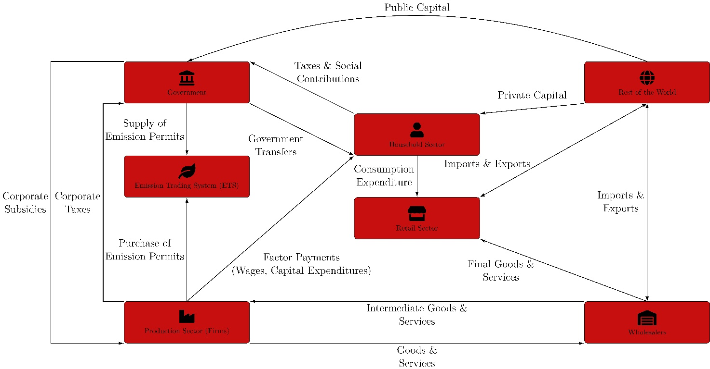
<figcaption><p>Figure 1: Model Architecture.</p></figcaption>
</figure>

The model is formulated as a **five-sector, one-region** economy and is solved as a deterministic perfect-foresight transition path over the period **2026–2050**. The perfect-foresight framework reflects the nature of the policy questions considered in this report, where major policy interventions—including the implementation of PDP8, emissions reduction targets, and alternative green-finance strategies—are represented as anticipated long-term policy pathways rather than unexpected economic shocks.

The economy consists of a representative household, firms operating in five productive sectors, wholesale and retail trade, an exporting sector, a government that operates an emissions trading system (ETS), and the rest of the world. These agents are linked through markets for intermediate goods, labour, capital, emissions permits, and internationally traded goods, forming a coherent representation of the economic mechanisms through which the energy transition and the associated climate policies affects aggregate economic performance.

## Sectors

The model distinguishes five production sectors that capture the principal channels through which the energy transition influences Vietnam's economy. The chosen level of aggregation represents a compromise between economic structure, data availability, and computational tractability. In particular, the explicit separation of fossil and renewable energy production enables the model to analyse structural changes within the electricity sector and to evaluate policies targeting fuel switching, renewable deployment, and carbon pricing.

| \# | Label | Economic role (aligned with Input-Output table provided by GSO in 2019) |
|----|----|----|
| 1 | Primary | Agriculture, forestry, fisheries, and related primary activities (GSO codes 1–33). |
| 2 | Fossil energy | Fossil extraction and fuel supply: coal, crude oil, natural gas, refined petroleum products, and gas and steam distribution (codes 34–36, 67–69, and 107–108). |
| 3 | Renewable energy | No direct standalone subsector in the Input-Output table provided by GSO. They are estimated by allocating part of the aggregated electricity and utilities activity, mainly code 106, to renewable energy using EXIOBASE input–output coefficients. |
| 4 | Secondary | Industry and production block: non-energy mining, manufacturing, water and waste utilities, and construction (codes 37–40, 41–66, 70–105, and 109–118). |
| 5 | Tertiary | Services block: trade, transport, ICT, finance, real estate, professional services, public administration, education, health, and other services (codes 119–171). |

Table 2: Sectoral classification.

Source: Own depiction.

Following the detailed sectoral representation used within the model, results are also reported for a more aggregated sector classification in which the fossil and renewable energy sectors are combined into a single energy sector. This produces the four-sector reporting structure—Primary, Energy, Secondary, and Tertiary—that is used throughout the presentation of simulation results. Capital and labour are mobile across sectors in response to changes in relative prices, while the energy sectors supply intermediate inputs to the non-energy production sectors.

## Representative Household

A representative household maximizes discounted lifetime utility by choosing consumption, labour supply, housing, savings, and investment over the transition horizon. Household decisions determine the allocation of labour across production sectors and the accumulation of physical and housing capital, thereby linking current economic decisions with future production possibilities. The forward-looking nature of the household ensures that anticipated policy changes influence behaviour before they are fully implemented, an important feature for analysing long-term transition policies.

A representative household derives utility from consumption $`C_{t}`$, housing services $`H_{t + 1}`$, and disutility from supplying labour $`N_{s,t}`$ across sectors $`s \in \left\{ 1,\ldots,S \right\}\`$

``` math
\mathbf{U}_{\mathbf{t}}\mathbf{=}\frac{\left( \mathbf{C}_{\mathbf{t}}^{\mathbf{1 -}\mathbf{\gamma}}\mathbf{H}_{\mathbf{t}\mathbf{+ 1}}^{\mathbf{\gamma}} \right)^{\mathbf{1 -}\mathbf{\sigma}^{\mathbf{C}}}}{\mathbf{1 -}\mathbf{\sigma}^{\mathbf{C}}}\mathbf{-}\sum_{\mathbf{s}\mathbf{= 1}}^{\mathbf{S}}\mathbf{A}_{\mathbf{s}\mathbf{,}\mathbf{t}}^{\mathbf{L}}\mathbf{\phi}_{\mathbf{s}}^{\mathbf{L}}\frac{\mathbf{N}_{\mathbf{s}\mathbf{,}\mathbf{t}}^{\mathbf{1 +}\mathbf{\sigma}^{\mathbf{L}}}}{\mathbf{1 +}\mathbf{\sigma}^{\mathbf{L}}}\mathbf{,}
```

where $`\gamma`$ is the preference weight on housing, $`\sigma^{C}\`$the inverse intertemporal elasticity of substitution in consumption, and $`\sigma^{L}`$ the inverse Frisch elasticity of labour supply. Labour disutility is scaled by sector-specific labour productivity $`A_{s,t}^{L}`$ and calibrated weights $`\phi_{s}^{L}`$ that pin down realistic long-run sectoral labour shares.

The household chooses consumption, sectoral labour supply, sectoral investment $`I_{s,t}`$, next-period sectoral capital $`K_{s,t + 1}`$, housing $`H_{t + 1}`$, and net foreign asset holdings $`B_{t + 1}`$ to maximize discounted lifetime utility $`\Sigma_{t}\beta^{t}U( \cdot )`$ subject to:

- a **budget constraint** (income = expenditure);
- **sector-specific capital accumulation**, $`K_{s,t + 1} = (1 - \delta)K_{s,t} + I_{s,t}\Gamma_{t}`$, where climate damages $`D_{s,t}^{K}`$ reduce the capital stock directly;
- **housing accumulation**, $`H_{t + 1} = \left( 1 - \delta^{H} \right)H_{t} + I_{t}^{H}.`$

Income sources are rental income from sector-specific capital, labour income across sectors, and returns on foreign bond holdings; foreign borrowing carries a debt-elastic risk premium.

## Firms and production structure

Production is carried out by profit-maximizing firms operating in each of the five sectors. Firms combine intermediate inputs $`Q_{s,k,t}^{I}`$, labour $`L_{s,t}`$, and capital $`K_{s,t}`$ to produce sectoral output while responding to changes in relative prices, wages, capital costs, and carbon prices. The nested production structure allows substitution between production factors and intermediate inputs while preserving the input-output relationships that characterize Vietnam's economy:

``` math
\max P_{s,t}^{Q}\left( 1 - \kappa_{s,t}^{E}P_{t}^{E} \right)Q_{s,t} - {\widetilde{W}}_{s,t}L_{s,t} - P_{s,t}^{K}K_{s,t} - \sum_{k}^{}P_{k,t}^{D}Q_{s,k,t}^{I}.
```

Sector-specific emission intensity $`\kappa_{s,t}^{E}`$ is proportional to output and can vary over time (the channel through which fuel-switching and emission-intensity scenarios operate). Final output is a CES (or Cobb-Douglas, when the elasticity of substitution between intermediates and primary production factors equals 1) aggregate of intermediate inputs and value added; value added is a CES/Cobb-Douglas aggregate of effective labour and capital; intermediate inputs are themselves a CES aggregate across sectors of origin. This production structure enables the model to capture both direct effects of climate and energy policies on individual sectors and indirect effects transmitted through intermediate input linkages across the economy. All model equations are explained in docs/reference/model.md.

##  Wholesale, Retail, and Export Sectors

Domestic production and international trade are linked through wholesale, retail, and export sectors that combine domestic and imported goods using constant-elasticity-of-substitution (CES) aggregation functions. These sectors determine the composition of intermediate and final demand while allowing domestic and imported products to substitute imperfectly in response to relative price changes.

A representative wholesaler in each subsector combines domestic and imported intermediate goods to supply both intermediate demand and final retail demand. A representative retailer combines domestic goods and imports for final use (consumption, investment, and government spending) via a CES nest. An exporter aggregates sectoral exports into a single export good sold to the rest of the world. Elasticities of substitution between domestic and imported goods ($`\eta_{s}^{Q},\eta^{F}`$) and origin-sector home bias ($`\omega_{s}^{Q},\omega_{s}^{M}`$) are sector-specific calibrated parameters.

<figure>
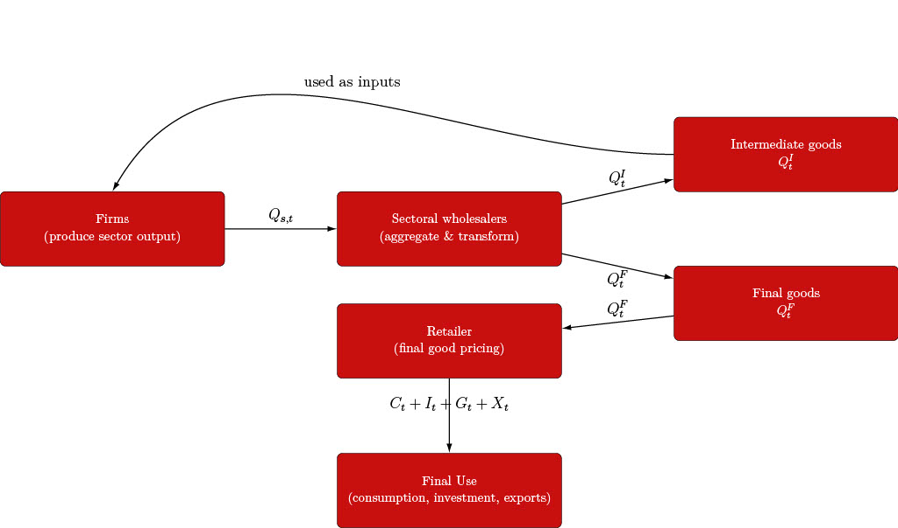
<figcaption><p>Figure 2: Input-Output production structure across sectors.</p></figcaption>
</figure>

## Government and the Emissions Trading System

The government fulfils two principal functions within the model. First, it collects taxes on consumption $`\tau_{t}^{C}`$, labour $`\tau_{t}^{N,H}`$ and capital income $`\tau_{t}^{K,H}`$, provides public expenditure, and maintains the public budget according to a reduced-form fiscal framework, i.e., tax rates on consumption, labour, and capital income are constant over time (no endogenous fiscal feedback rule as in Kliem and Kriwoluzky 2014). Second, it operates an economy-wide emissions trading system (ETS), which establishes an endogenous carbon price consistent with an exogenously specified emissions cap. This representation enables the model to analyse how carbon pricing influences production decisions, investment, and the overall cost of achieving alternative emissions targets (Barrage 2020; Bollen et al. 2009; Metcalf 2019).

``` math
R_{t}^{ETS} = P_{t}^{E}\sum_{s}^{}E_{s,t} = P_{t}^{E}\sum_{s}^{}\kappa_{s,t}^{E}Q_{s,t}
```

Under the ETS, firms hold allowances for covered emissions; the carbon price $`P_{t}^{E}`$ clears the permit market against the cap. Government debt $`B_{t}^{G}`$ is serviced at the world interest rate, and the government faces the same interest-rate schedule as households. Because tax rates are fixed, any change in government revenue from climate policy flows entirely through the tax base and the ETS revenue term, not through an endogenous rate response.

## Key model features to analyze Energy Transitions

While DGE-METRIC builds upon the standard dynamic general equilibrium framework, it incorporates several extensions that enable the analysis of long-term energy transition policies. These extensions adapt the core model to the specific characteristics of Vietnam's energy sector and climate policy objectives while preserving the internal consistency and behavioural foundations of a dynamic general equilibrium model. Table 3 summarises the principal extensions incorporated into DGE-METRIC.

| Feature | Intuitive role in the model | Key variables |
|:---|:---|:---|
| Input–output structure and energy demand | Links sectors through supply chains and connects production to energy use. Each sector purchases intermediate inputs from other sectors, including market-based energy services. Higher production therefore raises demand for both non-energy inputs and energy supplied by the energy sector. | $`Q_{s,k}^{I}`$*: intermediate input from sector k used by sector s. including* market-based energy inputs. |
| Emission coefficients | The model converts energy consumption into greenhouse-gas emissions using emission factors. Sectors with higher carbon intensity generate more CO₂ emissions for the same amount of fossil-energy consumption. | $`\kappa_{s}^{E}`$: emission intensity of sector s |
| Emissions trading system | Imposes a cap on covered emissions and generates an endogenous permit price. Firms respond by reducing emissions, improving efficiency or purchasing allowances. | $`E^{ETS}`$*: emissions cap;* $`P^{E}`$*: permit price;* $`\xi s`$: ETS coverage rate |
| Energy-efficiency improvements | Reduce the amount of market-based energy required to produce one unit of output, thereby lowering energy intensity and production costs. | $`\epsilon_{s,Energy,t}^{AI}`$: exogenous energy-efficiency path |
| Rooftop solar | Represents behind-the-meter photovoltaic generation that directly supplies firms or households and reduces their demand for market-based energy services. Rooftop solar is modelled separately from the renewable capital stock used by the energy sector to produce electricity for the market. | $`Q_{PV}`$: rooftop-solar energy supplied directly to users; $`\epsilon^{PVeff}1`$*: photovoltaic-efficiency path;* $`\epsilon^{GA}s`$: rooftop-solar deployment or availability path capturing expenditures. |
| Green-finance channels | Transmit financing conditions to energy investment. Lower financing rates or capital-goods prices reduce the effective cost of renewable-energy investment. | $`\epsilon_{s}^{r_{G}}`$*domestic public finance rate;* $`\epsilon_{s}^{r_{G}}`$ *foreign-finance rate* |

Table 3: Model Extensions.

Source: Own depiction.

## External sector

Vietnam is modelled as a small open economy that trades goods and financial assets with the rest of the world. The external sector determines exports, imports, foreign borrowing, and the accumulation of net foreign assets. Through these channels, domestic consumption and investment decisions are linked to international goods and capital markets, while foreign output, prices, and interest rates can be treated as exogenous to the domestic economy (Adolfson et al. 2007; Bacchetta and Van Wincoop 2021; Schmitt-Grohé and Uribe 2003).

In representative-agent small-open-economy models with incomplete financial markets, the foreign-asset position is generally not stationary without an additional closure mechanism. A debt-elastic interest-rate or external-finance premium is a standard method of inducing stationarity by making the cost of foreign borrowing increase with the economy’s external indebtedness. Exponential specifications of the premium as a function of the net foreign asset position are used, for example, by Adolfson et al. 2007.

Net foreign assets evolve according to the economy’s balance-of-payments constraint. More precisely, the change in net foreign assets is linked to the current-account balance, which includes the trade balance as well as net investment income and, where relevant, transfers. This relationship is standard in small-open-economy models.

In the present model, the debt-elastic external-finance factor is specified as

``` math
\exp\left\lbrack - \phi^{B}\left( \frac{B_{t + 1}^{TOTAL} - \ \left( 1 - \delta^{B} \right)B_{t}^{TOTAL}}{Y_{t}} \right) \right\rbrack,\ where\ B_{t + 1}^{TOTAL}\  - \left( 1 - \delta^{B} \right)B_{t}^{TOTAL}\ 
```

measures the change in the economy’s total external position after accounting for the depreciation or repayment rate $`\left( \delta^{B} \right)`$. Scaling this term by gross value added, $`\left( Y_{t} \right)`$, expresses the external-position adjustment relative to the size of the economy. The parameter $`\left( \phi^{B} \right)`$ governs the sensitivity of the external finance premium to this adjustment. The associated quadratic adjustment cost is given by:\
``` math
\frac{\phi_{adjB}}{2}\left( \frac{B_{t} - B_{t - 1}}{Y_{t}} \right)^{2},
```

where $`\left( \phi_{adjB} > 0 \right)`$ determines the cost associated with changes in the net foreign asset position. This term discourages abrupt movements in foreign asset holdings and contributes to the stability of the model’s external dynamics.

The modeler may use the exchange-rate depreciation rate $`\left( s_{r,t} \right)`$ to determine the path of the net-exports-to-GDP ratio by setting $`\left( \epsilon_{t}^{NX} = 1 \right)`$. Under this specification, $`s_{r,t}`$ adjusts endogenously to satisfy the external-balance condition. Otherwise $`\left( \epsilon_{t}^{NX} \neq 1 \right)`$, the variable instead follows an autoregressive process of order one.

# Data and Calibration

The credibility of a computable general equilibrium model depends critically on the consistency between its theoretical structure and the empirical data used for calibration. DGE-METRIC combines national accounts, energy statistics, emissions inventories, international datasets, and project-specific assumptions to construct a representation of Vietnam's economy that serves as the reference point for all policy simulations. Calibration therefore serves two complementary purposes: it ensures consistency with observed economic data and provides the benchmark from which all scenario analyses are conducted (Dawkins, Srinivasan, and Whalley 2001; Shoven and Whalley 1992).

The model is calibrated to Vietnam's **2019 input-output structure** (General Statistics Office of Vietnam 2019), representing the latest comprehensive benchmark prior to the economic disruptions associated with the COVID-19 pandemic, and uses a **2026 baseline** as the starting point for forward-looking simulations over the period 2026–2050.

## Data sources

Detailed documentation of the underlying datasets and variable mappings is maintained in the accompanying technical documentation files and calibration workbooks.

Full variable-to-source mapping is documented in docs/reference/data_sources.md; parameter-by-parameter citations for the structural-parameters sheet are in docs/reference/structural_parameters_source_audit.md. Raw source data is maintained outside the repository (size/licensing) and is pre-processed into the calibration workbook.

| Category | Primary source | Used for |
|:---|:---|:---|
| Macroeconomic structure | GSO (Vietnam), OECD | Input–output table, sectoral value-added and employment shares |
| Energy production and capacity | EVN, IEA WEO | Baseline energy calibration and capacity targets |
| Energy investment costs | Government of Viet Nam and Department of Energy 2024 | CAPEX pathways and LCOE assumptions |
| Emissions | EDGAR, IEA | Baseline emissions levels and emission intensity |
| Trade and capital flows | World Bank, OECD | Import and export shares and foreign direct investment flows |
| Environmentally extended input–output data | EXIOBASE 3 | Cross-check of embodied-emissions and energy coefficients |
| Climate variables | CMIP6 and SSP scenarios | Climate-damage pathways represented as temperature shocks |
| Financial parameters | IWH Financial Assessment (2026), GIZ Green Finance workbook | Financing rates and WACC scenarios |

Table 4: Data Sources.

Source: Own depiction.

## Calibration

The repository includes a reproducible cross-check generated by scripts/reporting/generate_gdp_components_start_end_vs_actual.m, which compares the model’s expenditure-side GDP component shares at the baseline start and end years against actual 2019 Vietnam national-accounts shares.

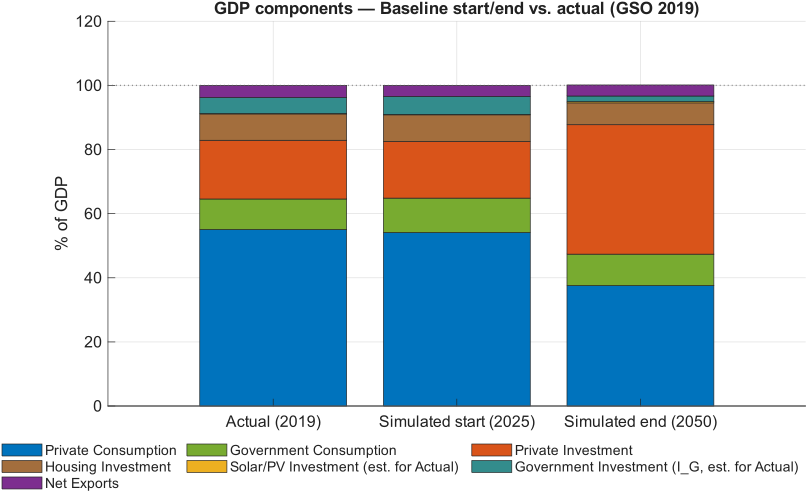

Figure 3: Expenditure-side GDP components: actual 2019 vs simulated baseline start and end.

Note: The chart stacks seven components as shares of GDP: private consumption, government consumption, private investment, housing investment, solar/PV investment, government investment, and net exports. In the Actual 2019 bar, government investment and solar/PV investment are proxy estimates documented in the script header; housing investment is taken directly from the NSO IO table.

Source: General Statistical Office of Viet Nam.

The calibration combines observed economic data with structural assumptions and model-consistent parameter estimation (Dawkins, Srinivasan, and Whalley 2001; Dixon and Rimmer 2013). Four categories of information enter the calibration process:

1.  Observed baseline data, including sectoral production, employment, trade flows, and expenditure shares obtained from official statistics — read directly from workbook sheets.

2.  Structural parameters, such as discount factors, depreciation rates, substitution elasticities, and tax rates, derived from the literature or project assumption — read from the `Structural Parameters` sheet or left at code defaults.

3.  Initial macroeconomic conditions, defining the baseline economy at the beginning of the simulation period — read from `Start` when available.

4.  **Residual calibration parameters**, including productivity levels, CES share parameters, labour-disutility parameters, and emission coefficients, which are determined endogenously to ensure that the model exactly reproduces the observed benchmark equilibrium.

This combination allows the model to remain closely aligned with observed economic data while preserving internal consistency between the theoretical structure and the empirical calibration.

The 5-sector, 1-region model is driven by three workbooks as reported in Table 5. The model is calibrated in three stages. First, when `lCalibration_p = 1`, the baseline steady state is constructed and the remaining parameters are solved using `fsolve `(Judd 1998; The MathWorks, Inc. 2026). Second, when `lCalibration_p = 0`, the full steady state is recalculated while holding the calibrated parameters fixed. Third, non-baseline scenarios are run in a hybrid mode with `lCalibration_p = 2`, which takes the calibrated baseline as given and applies the relevant scenario shocks. See docs/reference/calibration.md for the step-by-step MATLAB call sequence.

| Workbook | Main purpose | Key contents and workflow |
|:---|:---|:---|
| ModelCalibration5Sectorsand1Regions | Model calibration | Contains the hand-entered calibration inputs, generated named ranges, and parameter sheets used to initialise the five-sector, one-region model. |
| ModelBaseline5Sectorsand1Regions | Baseline construction | Contains the runnable Baseline sheet plus its supporting baseline-construction sheets; scripts/maintenance/update_baseline_sheet.m refreshes Baseline. |
| ModelScenarios5Sectorsand1Regions | Scenario definition | Holds the scenario-specific sheets, exogenous shock paths, and assumptions that \`RunSimulations.m\` and \`simulation_model_refactored.m\` use during transition runs. |

Table 5: Core Excel workbooks of the five-sector, one-region model.

Source: Own exhibition.

An essential objective of the calibration is to ensure consistency between the model's accounting framework and Vietnam's national accounts. Particular attention is given to reproducing the benchmark structure of production, value added, intermediate demand, investment, trade, and emissions before introducing any policy shocks.

While the model source code (ModFiles/DGE_Model_Parameters.mod) contains default values for all structural parameters, the parameterization used in any simulation in the active 5-sector/1-region workbook materially overrides several of them. **The workbook values, not the** .mod **file defaults, govern the compiled model**.

Accordingly, all simulation results presented in this report are based on the parameter values defined in the active calibration rather than the default values contained in the model source code. When reproducing or extending the model, users should therefore verify which calibration workbook was used for a particular simulation before interpreting or reporting individual parameter values. The full override table is in docs/reference/calibration_model_detailed.md.

## Baseline Validation and Diagnostic Assessment

To ensure that the calibrated model provides a reliable basis for scenario analysis, the baseline solution is evaluated using a comprehensive set of diagnostic indicators. These diagnostics assess whether the calibrated economy reproduces both the intended macroeconomic benchmark and the planned evolution of Vietnam's energy sector under the baseline assumptions. Rather than serving as policy results, the figures presented in this section constitute an integral part of the model validation process.

The validation focuses on three complementary aspects. First, long-term development paths for key energy-sector variables—including renewable capital, renewable electricity generation, energy efficiency, and the renewable share of electricity production—are examined to verify that the simulated baseline follows the intended transition trajectory over the period 2026–2050. Second, annual comparisons between simulated outcomes and PDP8 targets assess whether the model reproduces the planned development of renewable and fossil generation capacity as well as annual investment requirements. Third, end-of-period comparisons evaluate whether cumulative investment volumes and installed capacities remain consistent with the planning assumptions that underpin the baseline calibration.

The resulting figures therefore provide a transparent quality-assurance framework for the calibration. Consistent agreement between simulated trajectories and the underlying planning assumptions demonstrates that the model successfully reproduces both the empirical structure of the benchmark economy and the intended energy transition pathway before any policy scenarios are introduced.

This section documents how to check results after running the Baseline scenario — i.e., how to confirm the calibrated baseline reproduces the intended PDP8 trajectory before any policy scenario is run on top of it. The baseline reporting script scripts/reporting/display_baseline_energy.m writes its figures to the repository-level Figures/ directory (not docs/figures/). The script uses `outDir = fullfile(repoRoot, 'Figures')` and exports both raster and vector versions (`.png` at 300 dpi and `.pdf` vector).

These plots provide an operational bridge between the workbook targets and the calibrated baseline path:

1.  **Level/index path checks** (`baseline_ren_capital`, `baseline_ren_production`, `baseline_energy_efficiency`, `baseline_res_share`) show whether the solved baseline trajectory behaves plausibly over 2025-2050.
2.  **Annual target alignment checks** (`ren_cap_annual`, `fos_cap_annual`, `ren_inv_annual`, `fos_inv_annual`, plus dashboard `baseline_pdp8_annual_comparison`) compare simulation series to PDP8/Baseline target paths year by year.
3.  **Period/end-year consistency checks** (`ren_inv_bar`, `fos_inv_bar`, `ren_cap_bar`, `fos_cap_bar`, plus dashboard `baseline_pdp8_period_comparison`) verify that five-year investment shares and end-year capacity levels match the planning aggregates used in calibration discussions.

In practice, Section 4’s data provenance and calibration claims should be read alongside these files in `Figures/`, because they are the fastest visual quality assurance artifacts for checking whether the solved baseline reproduces the workbook’s energy transition intent.

Bar-plot previews used in this section (rendered from `Figures/`):

<figure>
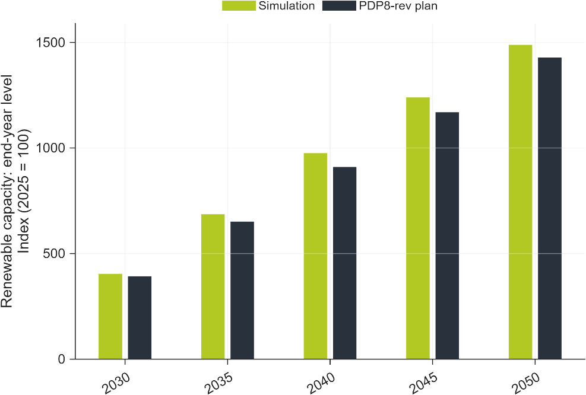
<figcaption><p>Figure 4: Baseline simulation vs PDP8 target for renewable installed capacity (end-year levels).</p></figcaption>
</figure>

Note: Bars compare the model-implied renewables installed capacity index to PDP8 index values at the end of each reporting period (2025 = 100).

Source: Author calculations based on baseline simulation output and revised PDP8 capacity targets.

<figure>
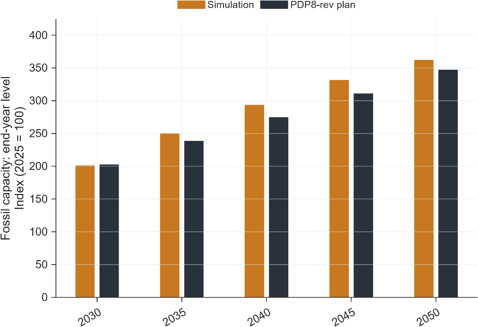
<figcaption><p>Figure 5: Baseline simulation vs PDP8 target for fossil installed capacity (end-year levels).</p></figcaption>
</figure>

Note: Bars compare the model-implied capacity index to PDP8 index values at the end of each reporting period (2025 = 100).

Source: Author calculations based on baseline simulation output and revised PDP8 capacity targets.

<figure>
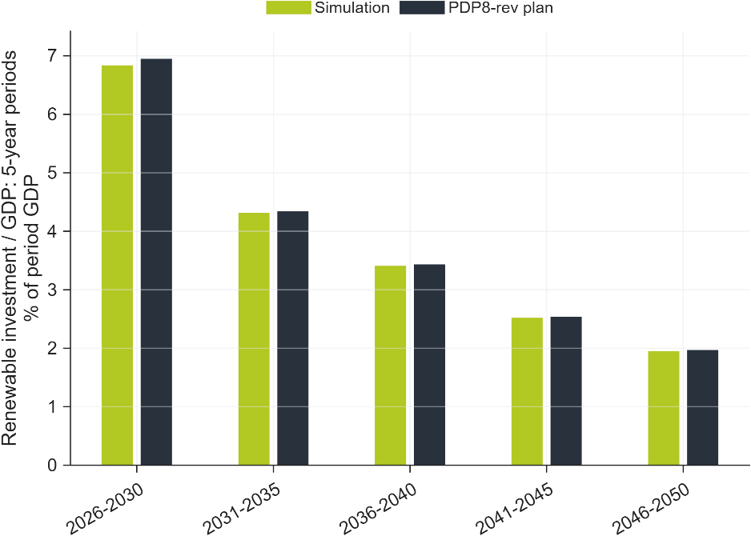
<figcaption><p>Figure 6: Baseline simulation vs PDP8 target for renewable investment share.</p></figcaption>
</figure>

Note: Bars report renewable investment as a share of GDP aggregated over a five-year period, comparing simulation outcomes to the baseline workbook target path.

Source: Author calculations based on baseline simulation output and baseline target workbook

<figure>
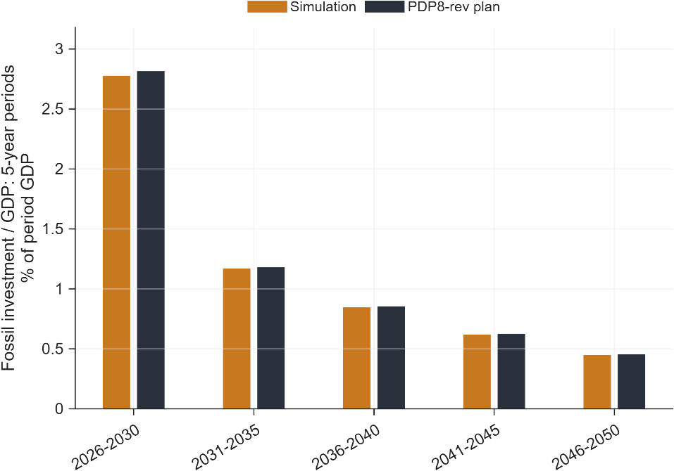
<figcaption><p>Figure 7: Baseline simulation vs PDP8 target for fossil investment share.</p></figcaption>
</figure>

Note: Bars report fossil investment as a share of GDP aggregated over a five-year period, comparing simulation outcomes to the baseline workbook target path.

Source: Author calculations based on baseline simulation output and baseline target workbook.

Taken together, the diagnostic results indicate that the calibrated baseline reproduces the principal macroeconomic and energy-sector characteristics that define the reference scenario. This provides confidence that subsequent differences between policy scenarios can be attributed to the simulated policy interventions rather than inconsistencies in the underlying calibration.

# Scenario Design Framework

With the model specification, calibration, and computational framework established, this section introduces the policy scenarios used to evaluate Vietnam's energy transition. The scenarios translate alternative policy assumptions into a consistent set of model inputs, enabling the economy-wide implications of different transition strategies to be analysed within the DGE-METRIC framework. All simulations are conducted relative to the calibrated baseline described in Section 3.

## Nested-counterfactual logic

The scenario analysis is organised as a **nested counterfactual framework** that allows the individual economic mechanisms underlying Vietnam's energy transition to be examined in a systematic and internally consistent manner (Dixon and Rimmer 2013; Shoven and Whalley 1992). Rather than treating each policy scenario as an independent experiment, all simulations are constructed sequentially from a common benchmark economy. This hierarchical design ensures that the marginal contribution of individual policy measures can be isolated while maintaining a consistent calibration, model structure, and initial conditions across all simulations.

<figure>
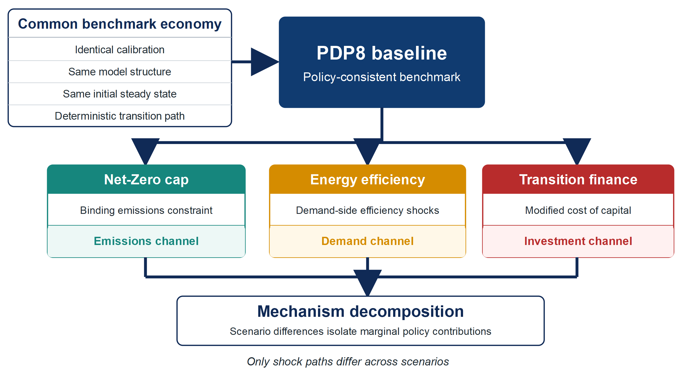
<figcaption><p>Figure 8: Hierarchical organisation of the DGE-METRIC scenario framework.</p></figcaption>
</figure>

The analysis begins with a policy-consistent baseline (PDP8), then either (a) impose a binding Net-Zero emissions cap, (b) add demand-side energy efficiency shocks, or (c) modify the cost of capital for transition investment. Every scenario shares the identical calibration and is solved as a deterministic transition path from the same initial steady state, so differences are attributable solely to the shock paths applied.

An important advantage of the nested design is that it supports **mechanism decomposition**. Because only a limited number of exogenous variables are modified between successive scenarios, differences in simulation outcomes can be attributed directly to specific economic adjustment channels. This approach improves the interpretability of the results and facilitates a transparent assessment of how individual policy instruments contribute to achieving Vietnam's long-term climate and energy objectives.

## Energy Efficiency (EE) scenarios

The scenarios described here examine how alternative rates of energy efficiency improvement influence energy demand, investment requirements, emissions, and overall macroeconomic performance.

Improving energy efficiency reduces the amount of energy required to produce a given level of economic output. Within DGE-METRIC, these improvements lower intermediate energy demand across production sectors and households, thereby reducing emissions, alleviating pressure on electricity generation capacity, and moderating the investment required to satisfy future energy demand. Because these effects propagate throughout the economy via changes in production costs, household expenditure, international competitiveness, and capital accumulation, the model provides a comprehensive assessment of both the direct and indirect economic benefits of energy efficiency policies (Gillingham, Rapson, and Wagner 2016; Sorrell 2009; Turner 2009).

Because lower effective energy costs raise real household income, the model also produces an equilibrium rebound effect: part of the physical energy savings from efficiency improvements is offset by higher energy demand stimulated by that income gain (Sorrell 2009). Reported GDP and energy-demand effects already net out this behavioural response rather than assuming the full engineering savings are realised.

Directive 10 (full)

Directive 10 (full) translates Prime Minister Directive No. 10/CT-TTg into an economy-wide pathway, combining stronger industry and services energy efficiency with expanded self-consumption rooftop solar (RTS) and grid-connected battery energy storage (BESS). Relative to the PDP8-rev Baseline, it assumes sector-specific energy savings by 2030 of approximately 7.4% in industry and 5.1% in services, rooftop-PV expansion to approximately 135 GW by 2050, and combined investment of less than USD 400 million per year for efficiency measures plus approximately USD 0.8 billion per year for grid BESS. These are expert-calibrated modelling assumptions translating the Directive's ambition into model variables, not quantitative targets stated verbatim in the Directive itself. Emissions are held to the Baseline ETS cap throughout, so that differences in outcomes capture the macroeconomic effects of stronger efficiency and distributed renewables rather than a different climate-policy stance.

By lowering future electricity demand, enhanced efficiency also reduces the investment required for generation capacity expansion and network development. Consequently, this scenario illustrates how demand-side measures can complement supply-side decarbonisation policies by lowering the overall cost of the energy transition.

Directive 10 (no BESS)

Directive 10 (no BESS) applies the identical industry/services efficiency gains and rooftop-solar expansion as Directive 10 (full), but with the grid battery energy-storage investment reset to the Baseline. Comparing the two isolates BESS's standalone macroeconomic contribution, holding the efficiency and rooftop-PV assumptions fixed.

The inclusion of distributed PV and battery storage modifies both electricity demand and supply. Self-generation reduces demand for grid-supplied electricity, while battery storage allows renewable generation to be shifted across time, reducing curtailment and improving system utilisation. Within the model, these changes influence generation requirements, investment patterns, wholesale electricity demand, and the broader allocation of capital across the economy.

RTS at pre-revision 95 GW

RTS at pre-revision 95 GW is a downside counterfactual in which rooftop-solar deployment under-delivers, reaching only the original pre-revision target of approximately 95 GW instead of the approximately 135 GW now assumed in the Baseline, with no additional retrofit efficiency measures and no BESS. Comparing this scenario against the Baseline quantifies the macroeconomic contribution of the RTS expansion itself by removing it.

Where applicable, additional **NoBESS** variants isolate the contribution of battery storage by comparing otherwise identical distributed photovoltaic systems with and without storage capacity. These comparisons quantify the incremental economic value of storage technologies within the broader energy transition.

Any near-zero standalone contribution of battery storage to aggregate GDP should not be read as evidence that storage has little value: DGE-METRIC's annual resolution has no hourly dispatch, so the channels through which storage actually creates value — curtailment avoidance, peak shaving, reduced fossil back-up capacity — are outside what this model can price by design (see Section 7, ‘Recognise the model’s scope’).

Comparisons across these scenarios therefore quantify the incremental macroeconomic benefits associated with stronger improvements in energy efficiency and distributed renewable technologies. The resulting differences in economic growth, investment requirements, electricity demand, emissions, and household welfare provide an integrated assessment of the extent to which demand-side measures can reduce the overall cost of Vietnam's energy transition.

| Scenario | Policy interpretation | What it shocks vs. Baseline | Key modelling constraint |
|:---|:---|:---|:---|
| **Directive 10 (full)** | Directive 10 ambition: stronger industry/services efficiency + expanded self-consumption rooftop solar (RTS) + PV–battery (BESS) integration | Sector energy-productivity gains (≈7.4% industry, ≈5.1% services by 2030); rooftop-PV expansion to the revised ≈135 GW; grid BESS investment (≈USD 0.8 bn/yr) | Emissions held to the Baseline ETS cap; BESS/RTS deployment and cost paths are assumed, not optimised |
| **Directive 10 (no BESS)** | Same package, storage-specific contribution removed | As Directive 10 (full), but grid BESS reset to Baseline | Isolates the macro contribution of BESS |
| **RTS at pre-revision 95 GW** | Rooftop solar under-delivers — reaches only the pre-revision ≈95 GW instead of the ≈135 GW now in the Baseline | Rooftop-PV capacity and its efficiency/investment channels rewound to the 95 GW path; no retrofit EE, no BESS | Downside counterfactual: quantifies the RTS contribution by removing it |

Table 6: Energy Efficiency scenario assumptions.

Note: RTS = rooftop solar; BESS = battery energy storage system; ETS = emissions trading scheme. All three scenarios are built on top of the Baseline and isolate the contribution of specific policy levers described in Directive 10: Directive 10 (full) applies the complete package of industrial/services efficiency gains and expanded RTS+BESS deployment; Directive 10 (no BESS) removes only the storage-specific contribution to isolate BESS's macro impact; and RTS at pre-revision 95 GW tests a downside counterfactual in which rooftop-PV capacity underperforms and reverts to the pre-revision ≈95 GW target instead of the ≈135 GW assumed in the Baseline. Sector energy-productivity gains and BESS investment costs are model inputs (not optimised outcomes), and emissions in all scenarios are capped at Baseline ETS levels. See ExcelFiles/ModelScenarios5Sectorsand1Regions.xlsx (EE sheets) for the underlying scenario assumptions, and Functions/README_AdditionalShocks.md for the shock-struct schema.

Source: Adapted from the IWH Report on Macroeconomic Impact Assessment (2026), Table 2; the assumptions are harmonised with those used there.

The script `scripts/reporting/``generate_ee_simulation_results_figures.m` exports scenario-comparison figures to `docs/figures/EE_Simulation_Results/`. This subsection reports only deviation-versus-Baseline diagnostics (Figure 9 - Figure 15).

<figure>
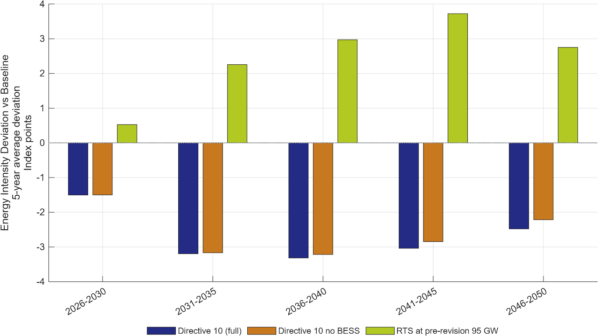
<figcaption><p>Figure 9: Energy-intensity deviation of EE scenarios from the Baseline.</p></figcaption>
</figure>

Note: Values are index-point deviations from the Baseline energy-intensity index (base year 2026). Negative values indicate improved energy efficiency relative to Baseline. Energy-intensity gains are nearly identical for the two Directive 10 variants (about –1.5 to –3.3 index points), confirming that BESS contributes little to the efficiency channel; the RTS shortfall moves in the opposite direction, becoming more energy-intensive over time as capacity remains capped at the pre-revision 95 GW target.

Source: Generated by `scripts/reporting/``generate_ee_simulation_results_figures.m` from scenario output CSV files in `ExcelFiles/Output/`.

<figure>
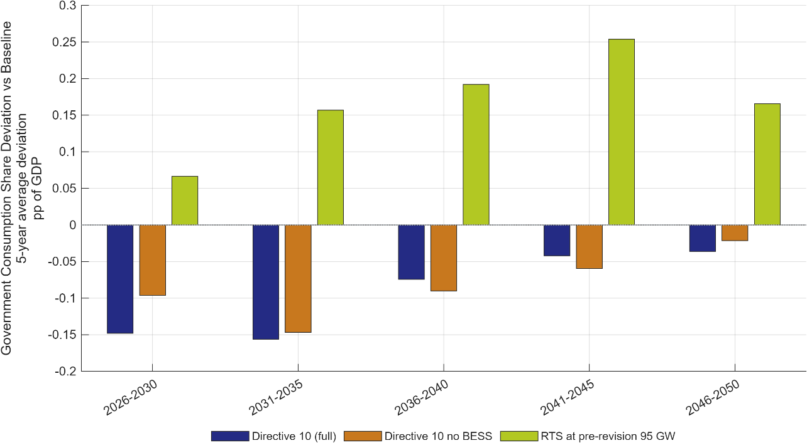
<figcaption><p>Figure 10: Government consumption share deviation versus Baseline.</p></figcaption>
</figure>

Note: Bars report five-year averages of the deviation in the government consumption share of GDP relative to Baseline, measured in percentage points of GDP (`pp of GDP`). The figure highlights persistent differences in the composition of fiscal demand. Government consumption's GDP share falls modestly under both Directive 10 variants and rises under the RTS shortfall — a mechanical consequence of GDP itself moving in opposite directions across the two cases, not a discretionary fiscal response.

Source: Generated by `scripts/reporting/``generate_ee_simulation_results_figures.m` from scenario output CSV files in `ExcelFiles/Output/`.

<figure>
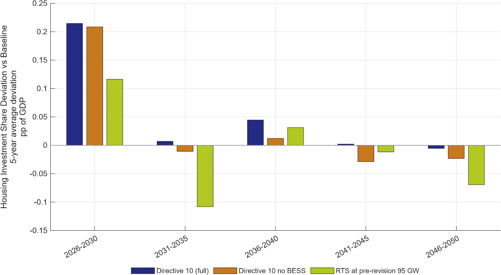
<figcaption><p>Figure 11: Housing investment share deviation versus Baseline.</p></figcaption>
</figure>

Note: Bars report five-year averages of the deviation in the housing investment share of GDP relative to Baseline, measured in percentage points of GDP. The figure highlights medium-term allocation differences. Housing-investment deviations stay within about ±0.2 pp of GDP with no consistent direction across periods, consistent with this channel being a second-order consequence of the EE and RTS shocks rather than a direct target of either policy.

Source: Generated by `scripts/reporting/``generate_ee_simulation_results_figures.m` from scenario output CSV files in `ExcelFiles/Output/`.

<figure>
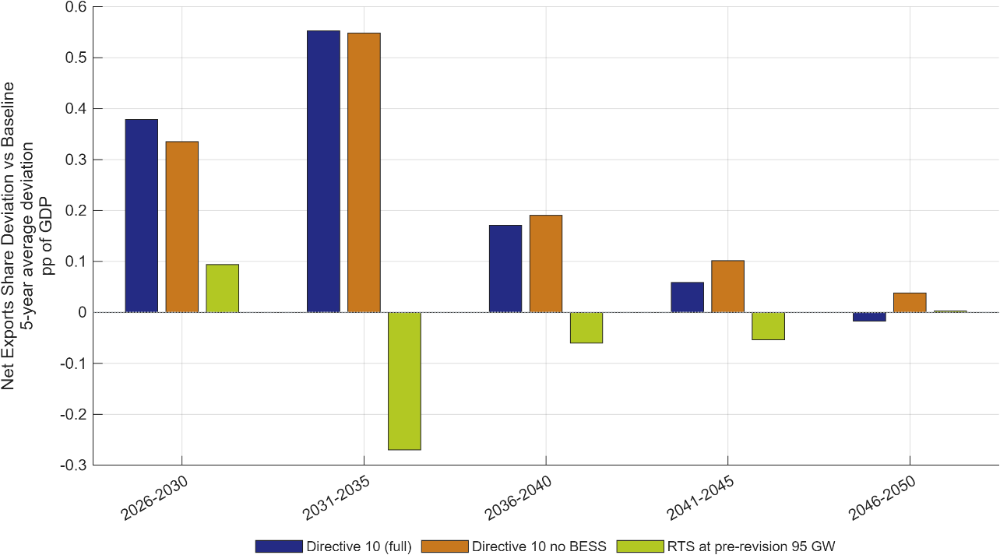
<figcaption><p>Figure 12: Net exports share deviation versus Baseline.</p></figcaption>
</figure>

Note: Bars report five-year averages of the deviation in net-exports-share of GDP relative to Baseline, measured in percentage points of GDP, summarizing sustained external-balance differences under each EE scenario. Net exports improve under both Directive 10 variants — most strongly in 2031–2035 — as lower energy demand eases pressure on imports, while the RTS shortfall worsens the trade balance over the same period as reliance on grid electricity increases.

Source: Generated by `scripts/reporting/``generate_ee_simulation_results_figures.m` from scenario output CSV files in `ExcelFiles/Output/`.

<figure>
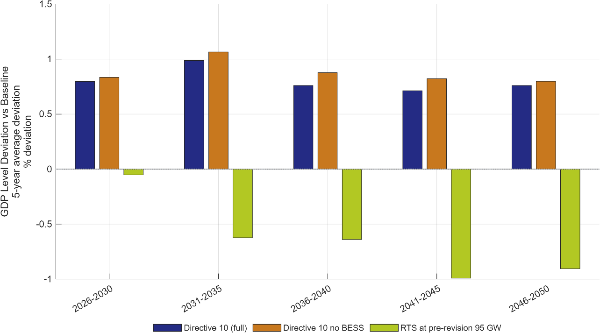
<figcaption><p>Figure 13: GDP level deviation versus Baseline across EE scenarios.</p></figcaption>
</figure>

Note: Bars report five-year averages of the deviation in GDP-level (percent) from Baseline, highlighting medium-run macro effects of each EE pathway. This is the headline comparison for the EE analysis: the two Directive 10 variants track closely together throughout 2026–2050, confirming BESS is immaterial to the aggregate result, while the RTS shortfall turns negative from 2031–2035 onward and approaches –1% of GDP by 2041–2045.

Source: Generated by `scripts/reporting/``generate_ee_simulation_results_figures.m` from scenario output CSV files in `ExcelFiles/Output/`.

<figure>
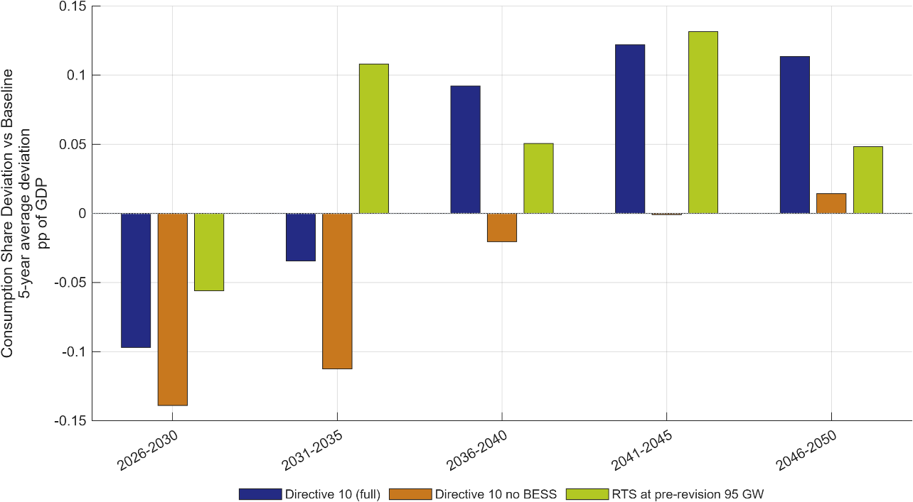
<figcaption><p>Figure 14: Consumption share deviation versus Baseline across EE scenarios.</p></figcaption>
</figure>

Note: Bars report five-year averages of the deviation in consumption share of GDP relative to Baseline (`pp of GDP`), allowing direct comparison of household-demand reallocation under alternative EE scenarios. Consumption's GDP share dips under both Directive 10 variants in the first two periods as investment is front-loaded, then turns positive from 2036–2040 onward as the growth dividend materialises — the reversal underlying the report's ‘small near-term trade-off, offset by long-term growth’ finding.

Source: Generated by `scripts/reporting/``generate_ee_simulation_results_figures.m` from scenario output CSV files in `ExcelFiles/Output/`.

<figure>
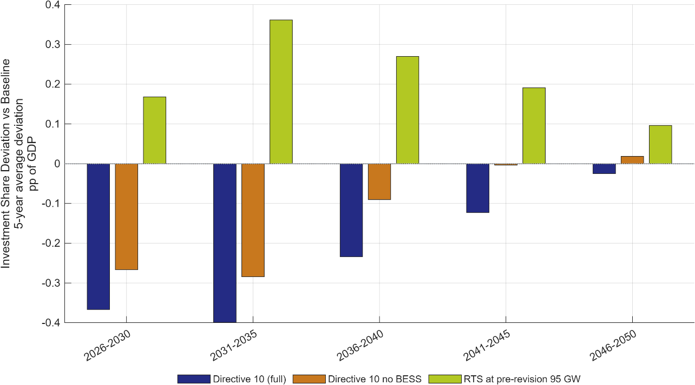
<figcaption><p>Figure 15: Investment share deviation versus Baseline across EE scenarios.</p></figcaption>
</figure>

Note: Bars report five-year averages of the deviation in investment share of GDP relative to Baseline (`pp of GDP`) and summarize the medium-term capital-allocation response in each EE pathway. Investment-share deviations mirror Figure 14: strongly negative for both Directive 10 variants in the first decade as efficiency and rooftop-PV investment is front-loaded, and positive for the RTS shortfall as the economy substitutes other capital formation for the missing rooftop-PV capacity.

Source: Generated by `scripts/reporting/``generate_ee_simulation_results_figures.m` from scenario output CSV files in `ExcelFiles/Output/`.

## Green finance scenarios

Financing conditions play a central role in determining the pace and economic cost of Viet Nam’s energy transition. Renewable-energy projects generally require substantial upfront investment but have comparatively low operating costs, making their viability particularly sensitive to the cost and availability of capital. Improving access to affordable finance can therefore bring forward renewable-energy investment, lower electricity-generation costs, and support capital accumulation and long-term economic growth (Electricity and Renewable Energy Authority (EREA) and Danish Energy Agency (DEA) 2023; International Renewable Energy Agency (IRENA) and Climate Policy Initiative (CPI) 2025).

DGE-METRIC captures these effects without modelling concessional loans, blended-finance facilities, green bonds, guarantees, or development-bank programmes as separate financial instruments or balance-sheet items. Instead, these instruments are represented through reduced-form changes in the financing rates and capital volumes available for renewable-energy investment. The model distinguishes between the cost of public or concessional finance, the cost of foreign direct investment (FDI) or other foreign finance, and the shares of investment financed through public, foreign, and domestic private or household capital. Table 6 summarises the principal transmission channels.

| Channel | Variable | Economic interpretation |
|:---|:---|:---|
| Public or concessional financing rate | 
``` math
\epsilon_{s}^{r_{G}}
``` | Cost of government-intermediated or concessional capital available to sector (s) |
| FDI or foreign-finance rate | 
``` math
\epsilon_{s}^{r_{FDI}}
``` | Cost of international private capital available to sector (s) |
| Public and foreign capital volume | 
``` math
\epsilon_{s}^{s_{G}},\epsilon_{s}^{s_{FDI}}
``` | Scale and sectoral allocation of public and FDI investment |

Table 6: Green Finance Transmission Channels.

Source: Author’s exhibition.

These transmission channels are combined into three green-finance architectures that differ in both their financing composition and their modelled financing rates. As shown in Table 7, GF A represents a balanced architecture combining Official Development Assistance and Multilateral Development Bank finance with blended finance, green bonds, FDI, and domestic private capital. GF B represents a more market-led architecture with the greatest reliance on domestic private and household finance and comparatively limited public and foreign participation. GF C represents a public-led architecture with substantially larger shares of public and FDI capital and a stronger role for concessional and Official Development Assistance finance. The assumptions are harmonised with those used in the Macroeconomic Impact Assessment.


| Instrument | Loan rate p.a. | Tenor | Typical providers | Model category |
|:---|:---|:---|:---|:---|
| **ODA / bilateral concessional** | ≈0.8–1.5% | 20–40 yr | JICA, KfW, AFD, ADB | Public capital |
| **Multilateral (MDB) concessional** | ≈0.9–1.5% | 15–30 yr | World Bank IBRD/IDA, ADB OCR | Public capital |
| **Blended finance — public first-loss tranche** | ≈0–1.5% | 10–20 yr | GCF, JETP partners, DFI subordinated debt/equity | Public capital |
| **Green bonds — sovereign / quasi-sovereign** | ≈3.6–4.3% | 5–15 yr | State Treasury, state-owned enterprises | Public capital |
| **Blended finance — private co-investment tranche** | ≈6.0–6.5% | 10–20 yr | Credit-enhanced commercial co-investors | Foreign / credit-enhanced private capital |
| **Green bonds — corporate** | ≈6.0–7.0% | 3–15 yr | BIDV, Vietcombank, HDBank, SeABank | Foreign / credit-enhanced private capital |
| **Green credit — commercial banks** | ≈7.0–8.0% | 1–10 yr | BIDV, VietinBank, Vietcombank | Domestic private / household capital — the residual; its return is determined by the model, not set as an assumption |

Table 7: Financing instruments: indicative terms, providers, and model treatment.

Notes: Baseline commercial borrowing cost for private energy projects is 8–10% (IWH Financial Assessment 2026); the concessional, blended, and sovereign-bond instruments are the levers that pull the portfolio average below that range. Rates reflect 2025–26 conditions and do not yet embed the 2% ESG interest-rate subsidy (Resolution 198/2025/QH15) or a green-collateral framework.

| Instrument | GF A — balanced (PDP8 revised) | GF B — market-led | GF C — public-led |
|:---|:---|:---|:---|
| **ODA / bilateral concessional (Public)** | 4.0% @ 1.5% | 2.0% @ 1.5% | 8.0% @ 1.0% |
| **Multilateral (MDB) concessional (Public)** | 4.0% @ 1.0% | 2.0% @ 1.0% | 8.0% @ 0.9% |
| **Blended finance — public tranche (Public)** | 1.0% @ 1.0% | 0.6% @ 1.0% | 3.0% @ 1.0% |
| **Green bonds — sovereign (Public)** | 10.0% @ 4.0% | 5.0% @ 4.3% | 17.5% @ 3.6% |
| **Public capital — subtotal** | 19.0% | 9.6% | 36.5% |
| **Blended finance — private tranche (Foreign/cr.-enh. private)** | 4.0% @ 6.0% | 2.4% @ 6.5% | 12.0% @ 6.0% |
| **Green bonds — corporate (Foreign/cr.-enh. private)** | 10.0% @ 6.5% | 10.0% @ 7.0% | 7.0% @ 6.0% |
| **Foreign / credit-enhanced private — subtotal** | 14.0% | 12.4% | 19.0% |
| **Green credit — commercial banks (Domestic private/household)** | 67.0% @ 7.5% | 78.0% @ 8.0% | 44.5% @ 7.0% |
| **Total** | 100% | 100% | 100% |
| **Weighted average cost of finance (WACF) = Σ(share × rate)** | 6.43% | 7.37% | 5.07% |
| **Cost applied to public capital in the model (= WACF)** | 6.43% | 7.37% | 5.07% |
| **Cost applied to foreign capital (share-weighted average of its two instruments)** | 6.36% | 6.90% | 6.00% |
| **Cost of domestic private/household capital** | determined by the model | determined by the model | determined by the model |

Table 8: Portfolio allocation and resulting financing cost by architecture

Note on the WACF and illustrative-cost rows: the illustrative annual financing cost and saving figures apply each architecture's weighted-average cost of finance to the IWH Investment Needs Assessment's (2026) estimate of the power-sector investment requirement for 2026–2030 (USD 136 billion, 4.0% of GDP), purely to indicate the scale of the financing bill; they are not model inputs or outputs. DGE-METRIC works with the cost-of-capital rates and allocation shares above, and the investment need in the model is determined by the PDP8 build-out path, not this dollar figure.

Source: Adapted from the IWH Report on Macroeconomic Impact Assessment (2026), Tables 3 and 4; the assumptions are harmonised with those used there.

Sources: (International Renewable Energy Agency (IRENA) and Climate Policy Initiative (CPI) 2025; Vietnam Bond Market Association 2024, 2025).

GF A serves as an intermediate case between the market-led and public-led alternatives. GF B combines the highest domestic private and household financing share with the highest public and foreign financing rates and therefore represents the least favourable financing conditions assessed. By contrast, GF C combines the highest public and FDI shares with the lowest public financing rate and a lower FDI financing rate, producing the most favourable financing conditions for renewable-energy investment.

Each architecture is evaluated against both the revised Power Development Plan VIII (PDP8-rev) pathway and the Net Zero pathway. The PDP8-rev variants isolate the macroeconomic effects of alternative financing conditions under the reference transition. The Net Zero variants assess how far affordable finance can reduce the additional adjustment costs associated with a more investment-intensive and emissions-constrained pathway. The scenarios are therefore implemented both as standalone financing experiments and in combination with stronger climate policy.

The simulations indicate that lower financing costs stimulate renewable-energy investment and accelerate capital accumulation. Under the PDP8-rev scenarios, the approximately 1.5 percentage-point difference in the effective renewable-energy WACC between the public-led GF C and market-led GF B architectures is associated with an approximately 1 percentage-point difference in the GDP level by 2050. The effect is larger under the Net Zero pathway because investment requirements are higher and financing costs become a more binding constraint. Comparing the two sets of simulations therefore illustrates how affordable capital can facilitate a more cost-effective transition and reduce the macroeconomic burden of greater climate ambition.

These financing-rate assumptions are expert-calibrated from the IWH Financial Assessment (2026) and GIZ Green Finance workbook, cross-checked against IRENA/CPI (2025) and Vietnam Bond Market Association benchmarks and against State Bank of Vietnam lending-rate data for the 8–10% baseline commercial borrowing cost for private energy projects; they are not quantitative figures read directly off any single source. They reflect 2025–26 conditions and do not yet embed the 2% ESG interest-rate subsidy under Resolution 198/2025/QH15 or a green-collateral framework, nor the green-taxonomy verification and certification costs firms may face in practice under Decision No. 21/2025/QĐ-TTg.

These results should nevertheless be interpreted as conditional model outcomes. DGE-METRIC estimates the economy-wide effects that could arise if the assumed financing structures and rates were achieved and maintained at the required scale. It does not determine whether the corresponding volumes of concessional finance, FDI, blended finance, or domestic private capital can be mobilised in practice, nor does it assess the institutional design, eligibility rules, risk-sharing arrangements, or balance-sheet implications of individual financial products.

The script scripts/reporting/generate_finance_simulation_results_figures.m exports scenario-comparison figures to docs/figures/Finance_Simulation_Results/. This subsection reports only deviation-versus-Baseline diagnostics, using five-year average bar charts.

<figure>
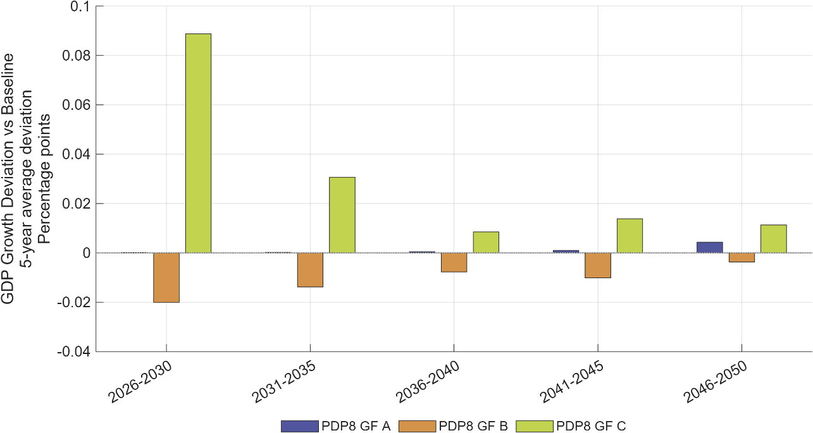
<figcaption><p>Figure 16: GDP growth deviation versus Baseline across green-finance scenarios.</p></figcaption>
</figure>

Note: Bars report five-year averages of the deviation in annual GDP growth (percentage points) from Baseline, comparing how financing architectures alter the medium-run growth profile.

Source: Generated by `scripts/reporting/``generate_finance_simulation_results_figures.m` from scenario output CSV files in `ExcelFiles/Output/`.

<figure>
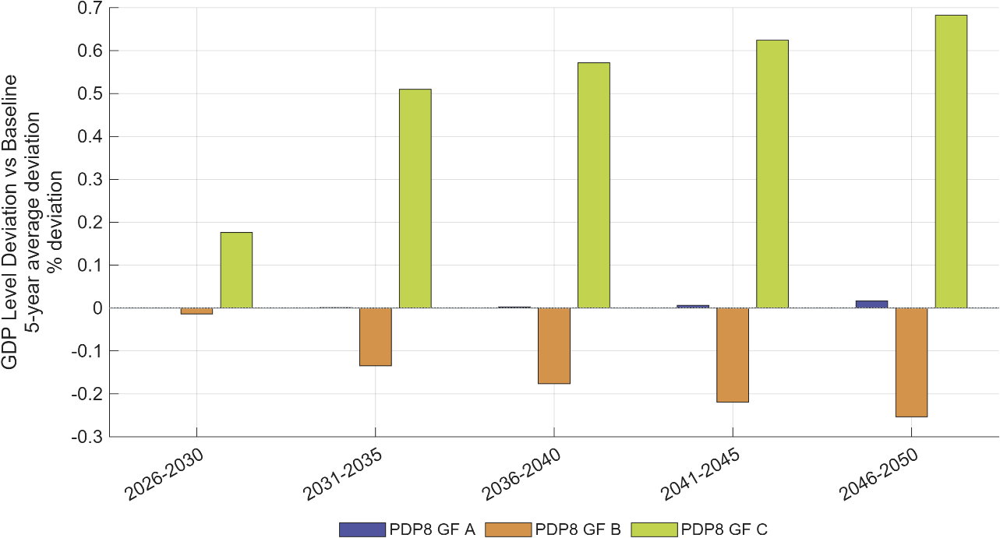
<figcaption><p>Figure 17: GDP level deviation versus Baseline across green-finance scenarios</p></figcaption>
</figure>

Note: Bars report five-year averages of the percent deviation of GDP level from Baseline (in percent) and capture cumulative macro effects of financing conditions.

Source: Generated by `scripts/reporting/``generate_finance_simulation_results_figures.m` from scenario output CSV files in `ExcelFiles/Output/`.

<figure>
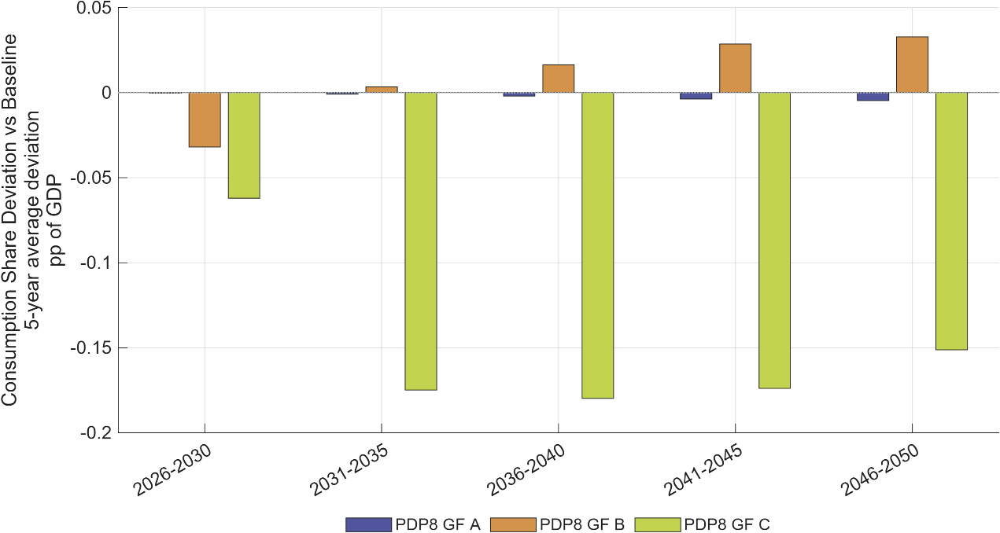
<figcaption><p>Figure 18: Consumption share deviation versus Baseline across green-finance scenarios.</p></figcaption>
</figure>

Note: Bars report five-year averages of the deviation in private-consumption share of GDP relative to Baseline (`pp of GDP`).

Source: Generated by `scripts/reporting/``generate_finance_simulation_results_figures.m` from scenario output CSV files in `ExcelFiles/Output/`.

<figure>
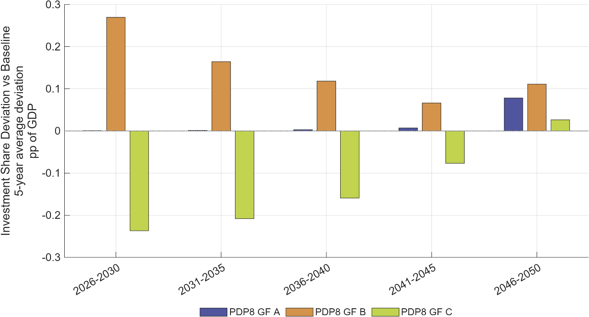
<figcaption><p>Figure 19: Investment share deviation versus Baseline across green-finance scenarios.</p></figcaption>
</figure>

Note: Bars report five-year averages of the deviation in investment share of GDP relative to Baseline (`pp of GDP`), indicating medium-run capital-allocation shifts.

Source: Generated by `scripts/reporting/``generate_finance_simulation_results_figures.m` from scenario output CSV files in `ExcelFiles/Output/`.

<figure>
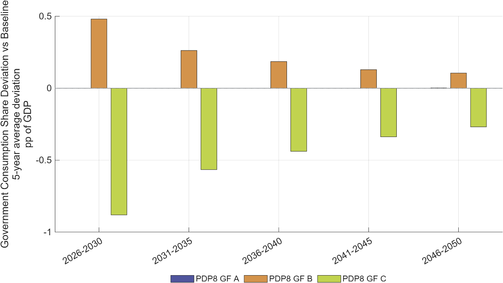
<figcaption><p>Figure 20: Government consumption share deviation versus Baseline across green-finance scenarios.</p></figcaption>
</figure>

Note: Bars report five-year averages of the deviation in government consumption share of GDP relative to Baseline (`pp of GDP`).

Source: Generated by `scripts/reporting/``generate_finance_simulation_results_figures.m` from scenario output CSV files in `ExcelFiles/Output/`.

<figure>
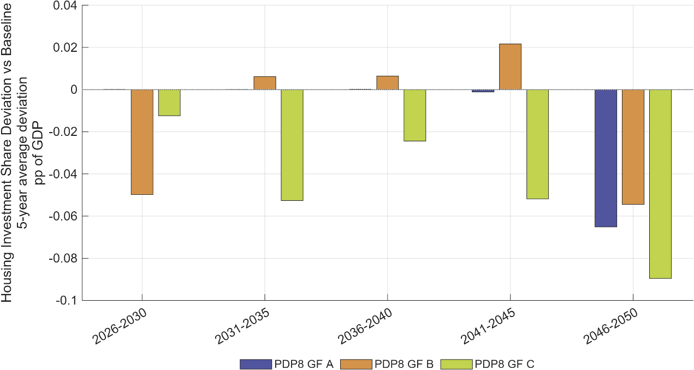
<figcaption><p>Figure 21: Housing investment share deviation versus Baseline across green-finance scenarios.</p></figcaption>
</figure>

Note: Bars report five-year averages of the deviation in housing investment share of GDP relative to Baseline (`pp of GDP`).

Source: Generated by `scripts/reporting/``generate_finance_simulation_results_figures.m` from scenario output CSV files in `ExcelFiles/Output/`.

<figure>
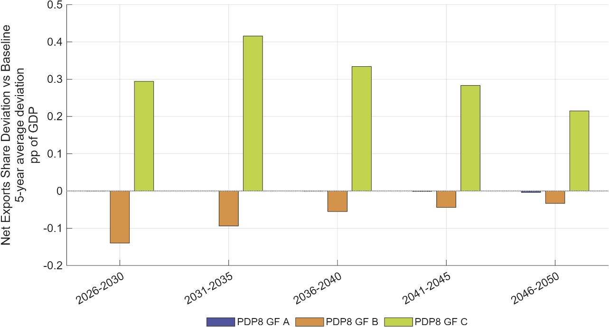
<figcaption><p>Figure 22: Net exports share deviation versus Baseline across green-finance scenarios.</p></figcaption>
</figure>

Note: Bars report five-year averages of the deviation in net exports share of GDP relative to Baseline (`pp of GDP`), summarizing external-balance effects.

Source: Generated by `scripts/reporting/``generate_finance_simulation_results_figures.m` from scenario output CSV files in `ExcelFiles/Output/`.

<figure>
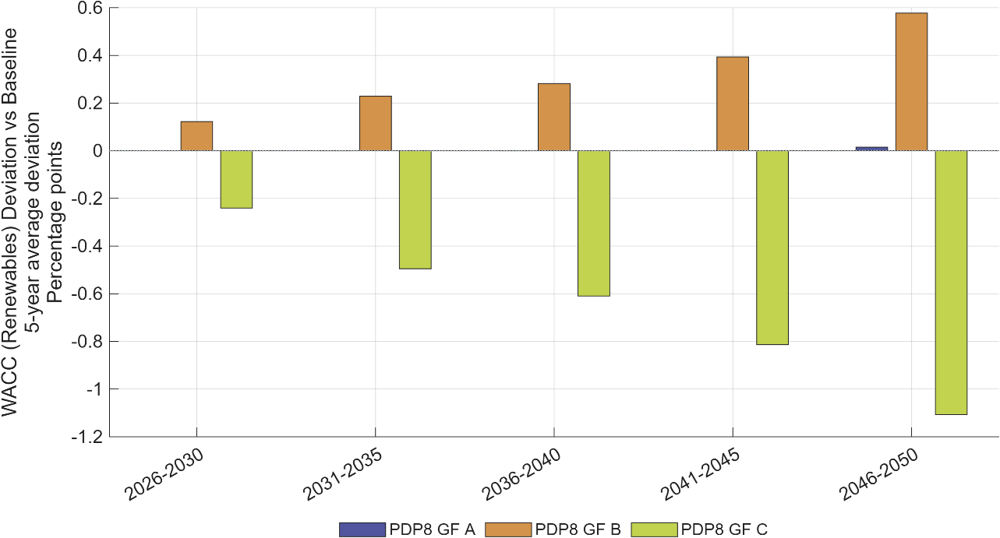
<figcaption><p>Figure 23: Renewable-energy WACC deviation versus Baseline across green-finance scenarios.</p></figcaption>
</figure>

Note: Bars report five-year averages of the deviations in renewable weighted average cost of capital (percentage points) from Baseline, summarizing the financial-channel intensity of each policy package.

Source: Generated by `scripts/reporting/``generate_finance_simulation_results_figures.m` from scenario output CSV files in `ExcelFiles/Output/`.

## Net-Zero decomposition

The Net Zero scenarios impose a binding, economy-wide cap on energy-related emissions consistent with Viet Nam’s long-term Net Zero objective. The cap is implemented through an emissions trading system (ETS), with the permit price adjusting endogenously to clear the emissions market in each period. Firms and households respond to the resulting carbon price through changes in energy use, production, investment, and the allocation of capital between fossil and non-fossil activities.

The European Union's Carbon Border Adjustment Mechanism (CBAM) adds a further rationale for developing Vietnam's domestic ETS: eligible domestic carbon payments can reduce CBAM liabilities on covered exports, though this may shift where payments occur without necessarily lowering their combined cost.


| Scenario | Policy design | Use of ETS revenues / additional measures | Main economic mechanism |
|:---|:---|:---|:---|
| **NZ** | Core Net-Zero pathway with a binding economy-wide emissions cap and an endogenous emissions price. Emissions reach 5% of 2025 GHG levels by 2050, an 80% reduction from the Baseline's 25%-of-2025 level. | No recycling of ETS revenues through the modelled subsidy or household-transfer channels. | Carbon pricing encourages emissions reductions, renewable investment, energy substitution and contraction of fossil-energy activity. |
| **NZ subsidy** | Applies the same Net-Zero emissions constraint while recycling ETS revenues as subsidies to non-fossil firms. | The modelled subsidy share is set to one, using ETS revenues to reduce the effective capital-tax burden on non-fossil production. | Revenue recycling lowers investment costs and supports low-carbon capital formation, partially offsetting the adjustment cost of the emissions cap. |
| **NZ subsidy direct** | Applies the same Net-Zero emissions constraint but directs ETS revenues to households through the transfer channel. | The household-transfer share is set to one rather than using revenues to subsidise non-fossil firms. | Transfers support household income and consumption, but provide a weaker direct stimulus to productive low-carbon investment. |
| **NZ GF C EE** | Integrated policy package combining the Net-Zero cap, public-led concessional finance, stronger energy efficiency, solar-PV measures and non-fossil firm subsidies. | The GF C structure assigns **36.5%** of renewable investment to public finance and **19.0%** to FDI. Public and FDI financing costs fall to approximately **5.07%** and **6.00%**, respectively. ETS revenues are recycled through the firm-subsidy channel. | Lower financing costs accelerate renewable capital formation, while efficiency and PV measures moderate energy demand. These measures reduce the macroeconomic adjustment burden of the emissions constraint. |

Table 8: Net Zero scenario assumptions.

Note: NZ_subsidy and NZ_subsidy_direct are reduced-form transmission experiments. They represent alternative uses of ETS revenues rather than fully specified fiscal programmes with detailed eligibility, administration or budget rules. These four scenarios appear as NZ / NZ subsidy / Net Zero direct subsidy (climate dividend) / Net Zero + GF C + EE in the Macro Impact Assessment, and as Net Zero / Net Zero-subsidy / Net Zero-subsidy direct / Net Zero-GF-C+EE in the Policy Brief — same underlying scenarios, named to match each document's style.

Source: Author’s exhibition.

The scenario framework distinguishes between alternative uses of ETS revenues and the inclusion of complementary energy-efficiency and green-finance measures. This structure makes it possible to assess not only the macroeconomic effects of the emissions constraint itself, but also the extent to which revenue recycling and complementary policies can reduce the associated adjustment costs (Bollen et al. 2009; Metcalf 2019). The principal scenarios are summarised in Table 8 and differ by use of ETS revenues as well as energy efficiency measures and green finance instruments.

The script scripts/reporting/generate_nz_simulation_results_figures.m exports scenario-comparison figures to docs/figures/NZ_Simulation_Results/. This subsection reports five-year-average deviation-versus-PDP8-rev Baseline diagnostics and five-year cumulative emissions trading system (ETS) revenues.

Results. The simulations indicate that carbon pricing can generate substantial revenues under a binding Net Zero cap: cumulative ETS revenues reach approximately USD 250 billion over 2026–2050, around 25% of total investment needs for the revised PDP8 pathway, while annual investment demand in the renewable sector rises from approximately USD 40 billion to USD 70 billion. The implied carbon price under PDP8-rev rises gradually from about USD 2/tCO2e in 2026–2030 to USD 23/tCO2e by 2046–2050, while under Net Zero it climbs far more steeply, from USD 10/tCO2e to USD 559/tCO2e over the same horizon — roughly 24 times the PDP8-rev level by 2046–2050, reflecting the steeper decarbonisation a binding Net Zero cap requires once low-cost abatement options are exhausted. Recycling ETS revenues through investment subsidies for non-fossil capital reduces GDP losses relative to the standalone Net Zero pathway more effectively than direct household transfers; combining public-led green finance (GF C), energy-efficiency measures, and investment-oriented revenue recycling can raise GDP above the PDP8-rev Baseline even under the binding emissions cap.

<figure>
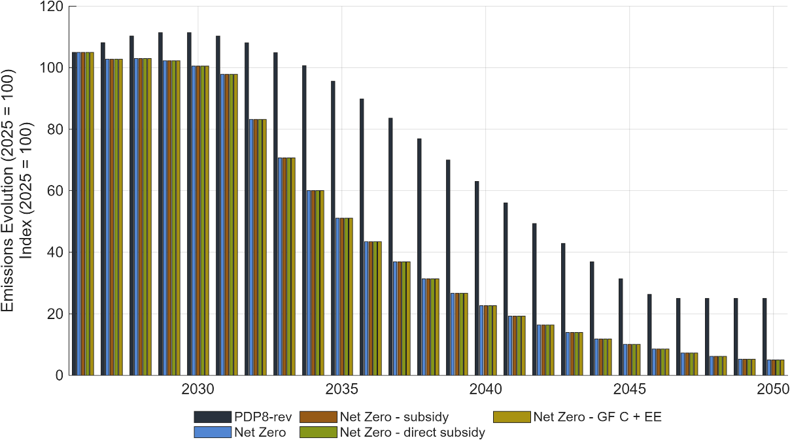
<figcaption><p>Figure 24: Emissions path across Net Zero scenarios and revised PDP 8 high scenario.</p></figcaption>
</figure>

Note: Bars show the emission trajectories for the Baseline scenario and all Net-Zero variants.

Source: Generated by scripts/reporting/generate_nz_simulation_results_figures.m through the shared reporting pipeline, using scenario output CSV files in ExcelFiles/Output/.

<figure>
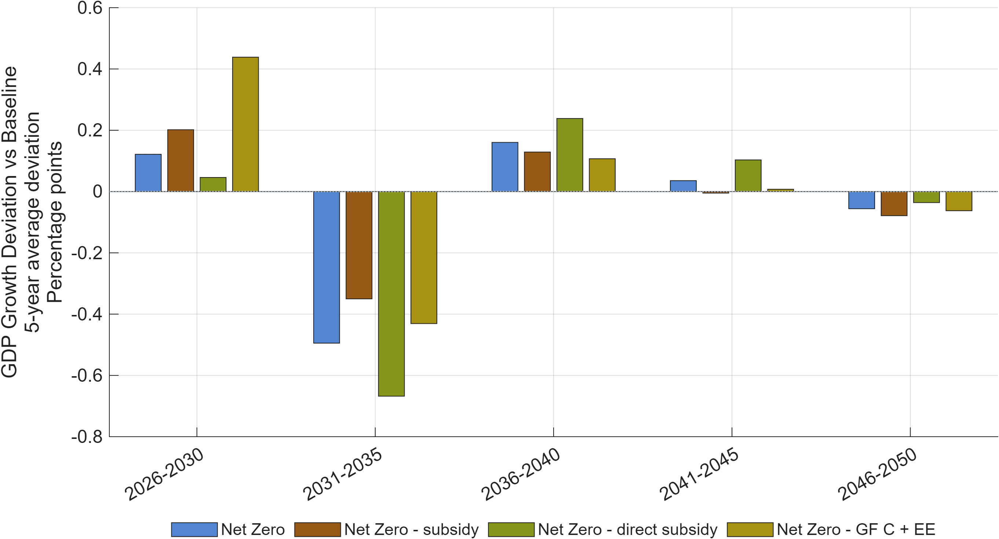
<figcaption><p>Figure 25: GDP growth deviation versus the PDP8-rev Baseline across Net Zero scenarios.</p></figcaption>
</figure>

Note: Bars show the five-year average deviation in annual GDP growth, in percentage points, from the PDP8-rev Baseline.

Source: Generated by scripts/reporting/generate_nz_simulation_results_figures.m through the shared reporting pipeline, using scenario output CSV files in ExcelFiles/Output/.

<figure>
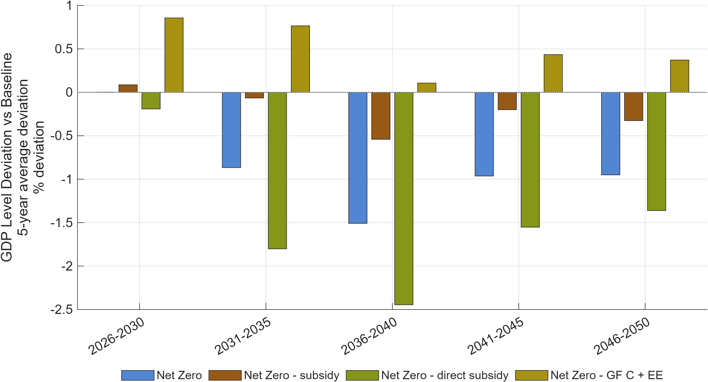
<figcaption><p>Figure 26: GDP level deviation versus the PDP8-rev Baseline across Net Zero scenarios.</p></figcaption>
</figure>

Note: Bars show the five-year average percentage deviation of the GDP level from the PDP8-rev Baseline.

Source: Generated by scripts/reporting/generate_nz_simulation_results_figures.m through the shared reporting pipeline, using scenario output CSV files in ExcelFiles/Output/.

<figure>
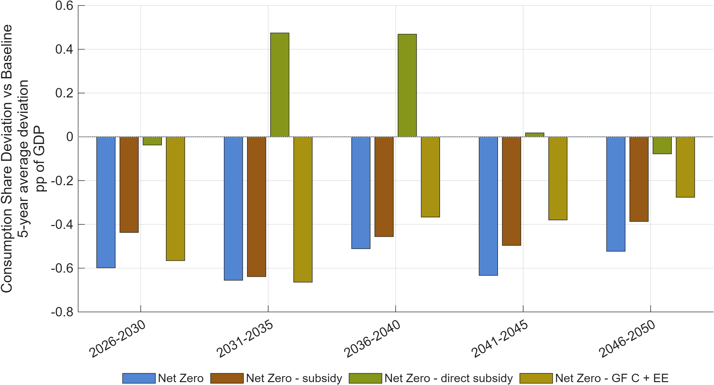
<figcaption><p>Figure 27: Consumption share deviation versus the PDP8-rev Baseline across Net Zero scenarios.</p></figcaption>
</figure>

Note: Bars report the five-year average deviation in private consumption as a share of GDP, in percentage points of GDP.

Source: Generated by scripts/reporting/generate_nz_simulation_results_figures.m through the shared reporting pipeline, using scenario output CSV files in ExcelFiles/Output/.

<figure>
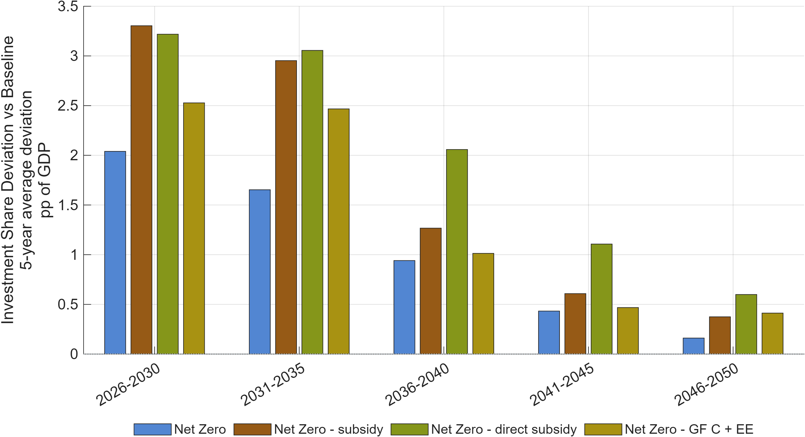
<figcaption><p>Figure 28: Investment share deviation versus the PDP8-rev Baseline across Net Zero scenarios.</p></figcaption>
</figure>

Note: Bars report the five-year average deviation in investment as a share of GDP, in percentage points of GDP.

Source: Generated by scripts/reporting/generate_nz_simulation_results_figures.m through the shared reporting pipeline, using scenario output CSV files in ExcelFiles/Output/.

<figure>
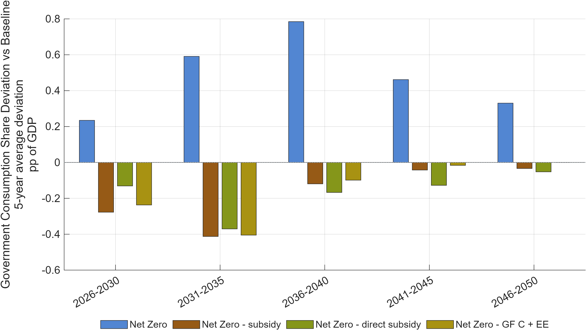
<figcaption><p>Figure 29: Government consumption share deviation versus the PDP8-rev Baseline across Net Zero scenarios.</p></figcaption>
</figure>

Note: Bars report the five-year average deviation in government consumption as a share of GDP, in percentage points of GDP.

Source: Generated by scripts/reporting/generate_nz_simulation_results_figures.m through the shared reporting pipeline, using scenario output CSV files in ExcelFiles/Output/.

<figure>
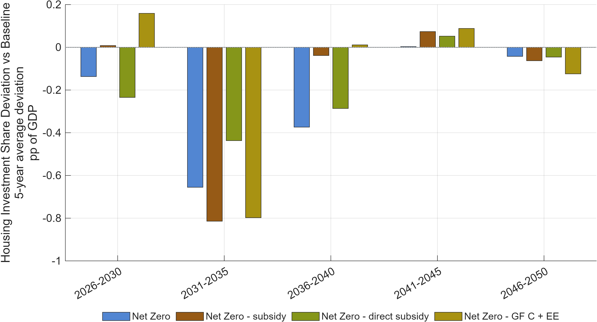
<figcaption><p>Figure 30: Housing investment share deviation versus the PDP8-rev Baseline across Net Zero scenarios.</p></figcaption>
</figure>

Note: Bars report the five-year average deviation in housing investment as a share of GDP, in percentage points of GDP.

Source: Generated by scripts/reporting/generate_nz_simulation_results_figures.m through the shared reporting pipeline, using scenario output CSV files in ExcelFiles/Output/.

<figure>
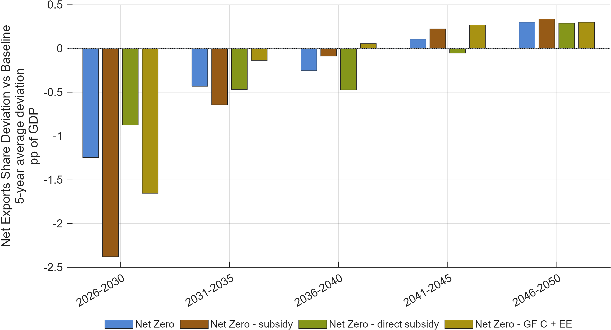
<figcaption><p>Figure 31: Net exports share deviation versus the PDP8-rev Baseline across Net Zero scenarios.</p></figcaption>
</figure>

Note: Bars report the average deviation in net exports as a share of GDP, in percentage points of GDP.

Source: Generated by scripts/reporting/generate_nz_simulation_results_figures.m through the shared reporting pipeline, using scenario output CSV files in ExcelFiles/Output/.

<figure>
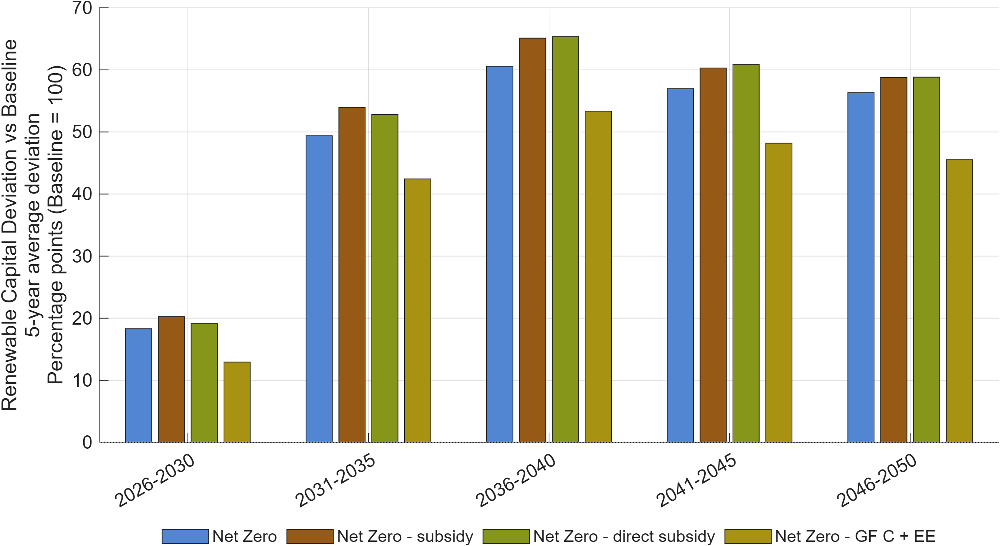
<figcaption><p>Figure 32: Renewable capital deviation versus the PDP8-rev Baseline across Net Zero scenarios.</p></figcaption>
</figure>

Note: Bars show five-year-average deviations from the PDP8-rev Baseline renewable-capital index (Baseline = 100). Positive values indicate a larger renewable capital stock than in the Baseline.

Source: Generated by scripts/reporting/generate_nz_simulation_results_figures.m through the shared reporting pipeline, using scenario output CSV files in ExcelFiles/Output/.

<figure>
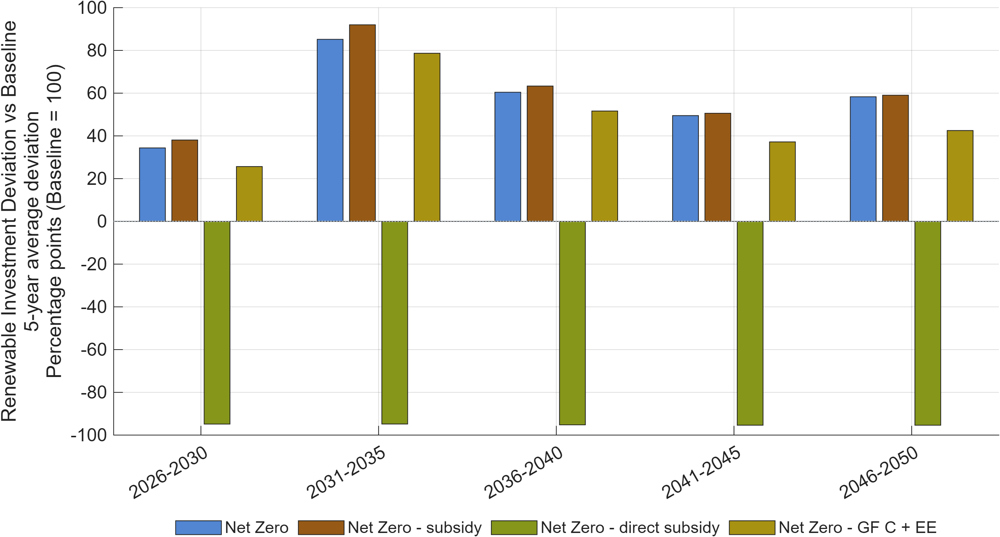
<figcaption><p>Figure 33: Renewable investment deviation versus the PDP8-rev Baseline across Net Zero scenarios.</p></figcaption>
</figure>

Note: Bars show five-year-average deviations from the PDP8-rev Baseline renewable-investment index (Baseline = 100). Positive values indicate higher renewable investment than in the Baseline.

Source: Generated by scripts/reporting/generate_nz_simulation_results_figures.m through the shared reporting pipeline, using scenario output CSV files in ExcelFiles/Output/.

<figure>
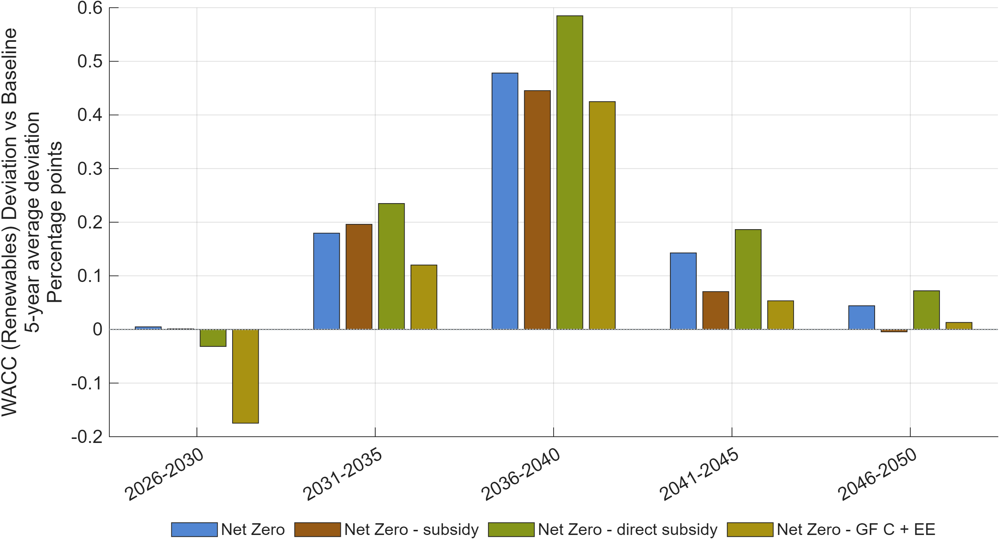
<figcaption><p>Figure 34: Renewable-energy WACC deviation versus the PDP8-rev Baseline across Net Zero scenarios.</p></figcaption>
</figure>

Note: Bars report the average deviation in the renewable-energy weighted average cost of capital, in percentage points, from the PDP8-rev Baseline.

Source: Generated by scripts/reporting/generate_nz_simulation_results_figures.m through the shared reporting pipeline, using scenario output CSV files in ExcelFiles/Output/.

<figure>
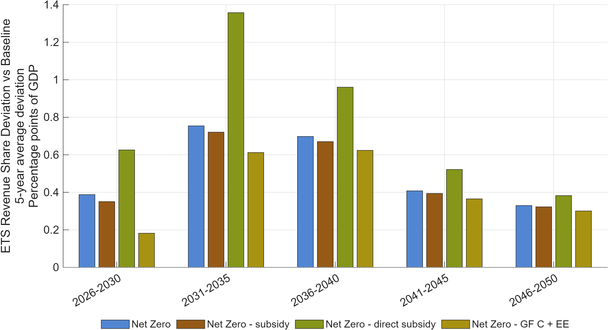
<figcaption><p>Figure 35: ETS revenue share deviation versus the PDP8-rev Baseline across Net Zero scenarios.</p></figcaption>
</figure>

Note: Bars report the average deviation in emissions trading system revenue as a share of GDP, in percentage points of GDP, from the PDP8-rev Baseline.

Source: Generated by scripts/reporting/generate_nz_simulation_results_figures.m through the shared reporting pipeline, using scenario output CSV files in ExcelFiles/Output/.

<figure>
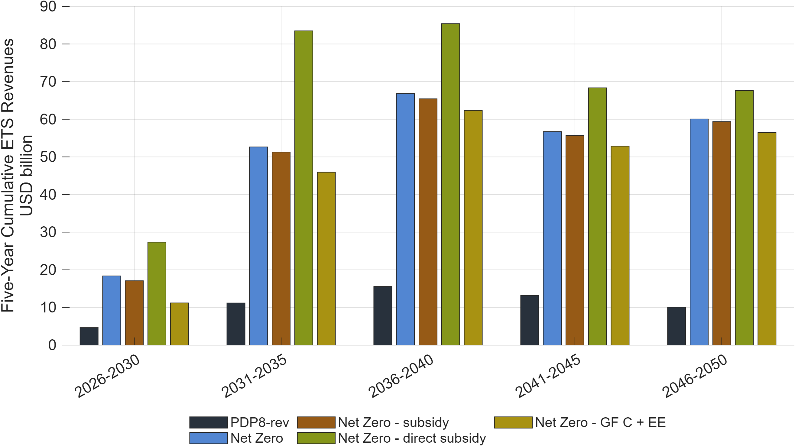
<figcaption><p>Figure 36: Five-year cumulative ETS revenues across the PDP8-rev Baseline and Net Zero scenarios.</p></figcaption>
</figure>

Note: Bars show five-year cumulative emissions trading system revenues in USD billion. The comparison includes the PDP8-rev Baseline, NZ, NZ subsidy, NZ subsidy direct, and NZ GF C EE.

Source: Generated by scripts/reporting/generate_nz_simulation_results_figures.m through the shared reporting pipeline, using scenario output CSV files in ExcelFiles/Output/.

# Solution Method

DGE-METRIC is implemented in **Dynare** and **MATLAB** and solved as a deterministic, forward-looking dynamic general equilibrium model under perfect foresight (Adjemian et al. 2026; Judd 1998). The solution framework combines Dynare's nonlinear equilibrium solver with a custom calibration pipeline developed specifically for DGE-METRIC. This pipeline constructs an internally consistent benchmark economy, calibrates residual model parameters, initializes the transition path, and subsequently evaluates alternative policy scenarios within a common computational framework.

The economic model is defined in modular Dynare source files, empirical calibration is managed through structured Excel workbooks and MATLAB routines, and scenario simulations are executed through dedicated simulation scripts. This modular architecture improves transparency, facilitates model maintenance, and allows individual components of the framework to be modified or extended without affecting the overall solution procedure.

## Dynare perfect-foresight solving

DGE-METRIC is implemented in **Dynare** and solved using its deterministic perfect-foresight simulation framework. Economic agents are assumed to have full knowledge of the future path of exogenous shocks and policy variables, and the model solves for the transition path that satisfies all first-order conditions and market-clearing conditions simultaneously across the full 2026–2050 horizon.

The deterministic perfect-foresight framework is well suited to the policy questions addressed in this report. The principal policy interventions—including the implementation of the revised Power Development Plan VIII (PDP8), the introduction of an emissions trading system (ETS), improvements in energy efficiency, and alternative green-finance strategies—represent announced policy pathways rather than unforeseen shocks. Forward-looking households and firms therefore adjust investment, production, consumption, and financing decisions in anticipation of these policy changes, allowing the model to capture the dynamic adjustment process associated with Vietnam's long-term energy transition.

The implementation follows a modular architecture that separates model specification from calibration and simulation. `DGE_Model.mod` is the canonical entry point, which defines shared equation blocks live under `ModFiles/Equations/` (and are mirrored in human-readable form under `ModFiles/Equations/Equations_display/`). Dynare’s macro-preprocessor (`@#`-directives) expands sector/region loops and branches on structural switches (`lCapPrice`, `lAdjPos`, `YEndogenous`, `CapandTrade`, …) declared at the top of `DGE_Model.mod`. All Dynare-generated code (`+DGE_Model/`, `DGE_Model/`, `*_dynamic.m`, `*_static.m`) is rebuilt on every invocation and is not source — fixes belong in the `.mod` files, followed by a re-run.

## Steady-state / calibration pipeline

The steady-state/calibration pipeline converts workbook inputs into a benchmark economy that satisfies the model equations, accounting identities, and market-clearing conditions. For the Baseline, the workflow runs a calibration pass followed by a full steady-state pass. During transition-path construction, the same machinery is reused in hybrid mode to obtain consistent terminal conditions. The file-by-file flow is as follows.

Execution flow

1.  **Prepare the input workbooks.** ExcelFiles/ModelCalibration5Sectorsand1Regions.xlsx supplies calibration inputs and named ranges. Functions/Miscellaneous/Excel/update_data_excel.m propagates the editable input sheets into the model-ready calibration sheets. scripts/maintenance/update_baseline_sheet.m refreshes the values-only Baseline sheet in ExcelFiles/ModelBaseline5Sectorsand1Regions.xlsx, while ExcelFiles/ModelScenarios5Sectorsand1Regions.xlsx holds scenario-specific paths.
2.  **Select and launch a run**. RunSimulations.m defines the active scenario groups, workbook paths, sector and region dimensions, and principal model switches. It calls setup_paths.m, applies scenario-dependent macro settings through Functions/Miscellaneous/ModelSetup/change_mod_file.m, and launches Dynare on DGE_Model.mod.
3.  **Assemble the Dynare model**. DGE_Model.mod includes ModFiles/DGE_Model_Declaration.mod, ModFiles/DGE_Model_Equations.mod, and ModFiles/DGE_Model_Parameters.mod. After the declarations, equations, and parameters have been assembled, the command steadystate_model resolves to Functions/SteadyState_Model.m on the MATLAB path.
4.  **Dispatch the baseline calibration pass.** Functions/SteadyState_Model.m sets lCalibration_p to 1 and calls DGE_Model_steadystate.m. The dispatcher converts the Dynare arrays M\_.params, ys, and exo into named parameter, endogenous-variable, and exogenous-variable structures, then selects the calibration branch.
5.  **Build and solve the calibrated initial state.** Functions/steady_state/ss_build_initial_guess.m forwards to Functions/SteadyState/build_initial_guess.m in calibrate mode and constructs the vector of unknowns. Functions/steady_state/ss_setup_initial_state.m then forwards to Functions/SteadyState/setup_initial_state.m. That routine calls the blocks in Functions/SteadyState/setupInitialState/ to build price indices, production parameters, sectoral and regional accounts, imports, emissions, taxes, and government variables. It returns price-consistency residuals; fsolve is used when the initial residuals exceed tolerance.
6.  **Solve the full steady state.** Functions/SteadyState_Model.m resets lCalibration_p to 0 and invokes the Dynare steady command. DGE_Model_steadystate.m now requests a fullSS initial guess and routes through Functions/steady_state/ss_compute_capital.m to Functions/SteadyState/compute_capital.m. The blocks in Functions/SteadyState/computeCapital/ update prices, production, factor demands, aggregates, taxes, and regional macro accounts before Functions/SteadyState/computeCapital/evaluate_capital_steady_state_residuals.m evaluates the nonlinear closure conditions. fsolve is called if necessary.
7.  **Write back and validate the benchmark.** DGE_Model_steadystate.m writes calibrated parameters and solved endogenous and exogenous values back to the Dynare vectors. Functions/SteadyState_Model.m runs the Dynare stability check and retains the steady state as the initial condition for the Baseline. Later scenario runs load the solved Baseline state from structScenarioResults\*.mat rather than recalibrating a different benchmark.

During construction of the Baseline transition path, Functions/simulation_model_refactored.m temporarily sets lCalibration_p to 2 and repeatedly calls DGE_Model_steadystate.m for the terminal state associated with each incremental shock step. In this hybrid branch, Functions/SteadyState/build_initial_guess.m selects the quantities and wedges that may adjust, while Functions/SteadyState/compute_capital.m uses the same accounting and market-clearing blocks as the full steady-state solve. Hybrid mode does not recalibrate the benchmark; it reconciles each step-specific terminal condition with the calibrated model structure.

Numerical closure and diagnostics

The residual system is part of the economic closure and must not be shortened merely because an equation appears redundant. In particular,

Functions/SteadyState/computeCapital/evaluate_capital_steady_state_residuals.m

must retain fval_vec_11 in hybrid mode. It pins fossil output to its exogenous target and leaves the relevant energy-efficiency term free to adjust; removing it makes the hybrid system underdetermined. After calibration and hybrid solves, Functions/steady_state/diagnostics/check_allocation_errors.m checks the principal allocation identities, while Dynare steady and check provide the final model-level validation.

For maintenance purposes, Functions/steady_state/ should be treated as the compatibility layer and Functions/SteadyState/ as the canonical implementation. The accompanying workflow description and workbook conventions are maintained in docs/reference/calibration.md. Changes to the core routines should therefore be reflected in that documentation and verified against both calibration and full steady-state modes.

## Simulation

Functions/simulation_model_refactored.m starts from the common calibrated Baseline, loads the baseline and scenario time paths from the active ExcelFiles/ workbooks through helpers in Functions/Miscellaneous/Simulation/, constructs the target growth paths, and initializes Dynare's deterministic perfect-foresight problem.

For numerical stability, large changes are introduced incrementally. At each step the routine updates the exogenous paths, obtains a compatible terminal steady state from DGE_Model_steadystate.m, and calls perfect_foresight_solver. The optional AdditionalShocks structure can postpone selected shocks and phase them in through additional fine-tuning steps.

All scenarios use the same benchmark and computational sequence. Outputs and audit files are written to ExcelFiles/Output/ and structScenarioResults\*.mat; scripts/reporting/ generates comparable tables and figures.

## Verification approach

The verification framework follows a layered approach in which each stage of the computational workflow is validated before proceeding to the next. This strategy facilitates the early identification of numerical or calibration inconsistencies and substantially improves the transparency and reproducibility of the modelling framework.

There is no automated test suite. “Does it work” is verified by: the steady-state solver converging (`fsolve` residuals near zero, no lCalibration_p branch errors); the accounting identities in ExcelFiles/README.md holding after any calibration edit (row sums, `phiQI = phiX + phiY0`, Trade_Flows rows summing to 1); and, after a baseline/scenario run, the growth-audit CSVs showing simulated growth tracking the Excel `gY_*` targets. scripts/analysis/CheckResults.m and Functions/steady_state/diagnostics/check_allocation_errors.m are the existing sanity-check entry points.

Model verification combines numerical, accounting, calibration, implementation, and reproducibility checks. Dynare solves the nonlinear equilibrium system iteratively, using standard residual and tolerance criteria to ensure that the full transition path satisfies all model equations. Because the model has a long horizon and highly nonlinear relationships, carefully constructed initial trajectories are used to improve convergence and numerical stability.

The calibrated benchmark is also checked against all accounting identities, including production, income, government, trade, capital accumulation, and emissions balances. Simulated macroeconomic, sectoral, energy, investment, emissions, and capacity-expansion outcomes are compared with calibration data and baseline assumptions, including Vietnam’s revised Power Development Plan VIII. Additional implementation checks confirm that calibration inputs, parameter transfers, data structures, and MATLAB–Dynare routines are correctly initialised and consistent. The modular workflow allows intermediate outputs to be inspected independently and ensures that benchmark and scenario results can be reproduced using the same inputs and model configuration.

# Limitations, Implementation Risks, and Interpretation Guidance

Like all quantitative policy models, DGE-METRIC simplifies a complex economic system. It is designed to assess the economy-wide effects of alternative energy-transition policies in a consistent, transparent, and manageable way. The results should therefore be interpreted in light of the model’s assumptions, calibration, and implementation choices.

Before results are published or used for policy analysis, the following checks are particularly important:

1.  **Preserve the core model structure:** Some equations and calibration routines are essential for obtaining a stable and well-defined solution. Changes to these elements should only be made after confirming their role in the overall model.

2.  **Confirm how energy-efficiency measures are represented:** Different versions of the model have used different levels of detail for energy efficiency. Analysts should verify the active specification before introducing new assumptions or interpreting results.

3.  **Target investment flows rather than capital stocks directly:** Directly fixing the level of capital can create inconsistencies in the model. A more reliable approach is to influence investment decisions and allow the capital stock to adjust gradually over time.

4.  **Verify the calibration used in each simulation:** Default values in the code may differ substantially from the parameters loaded from the calibration workbooks. The active calibration should always be checked before reporting parameter values or simulation results.

5.  **Modify source files, not automatically generated files:** Some model files are recreated whenever the model is run. Any correction should therefore be made in the underlying source files rather than in files generated automatically by the software.

6.  **Check which scenarios are actually active:** The presence of a scenario in the code does not necessarily mean that it is included in a standard model run. Analysts should confirm the active scenario set before claiming that a result can be reproduced directly.

7.  **Recognise the model’s scope:** DGE-METRIC does not represent power-plant dispatch, technology learning at the plant level, subnational regions, or detailed financial balance sheets. Results should not be interpreted as providing these forms of analysis.

8.  **Treat the renewable-energy IO split as a calibrated proxy, not an observed value:** renewable energy has no standalone line in Vietnam's 2019 IO table and is estimated by allocating part of aggregated electricity/utility activity (code 106) using non-Vietnam-specific EXIOBASE coefficients. This is the single calibration input the EE/GF/NZ comparisons are most sensitive to; results involving the renewable sector's value-added share should be read with this in mind, and a sensitivity range should accompany any figure quoted externally.

9.  **Account for the 2019 input-output vintage:** Vietnam's most recent full input-output table remains the 2019 benchmark, so structural shares are not re-benchmarked to 2020–2024 developments such as the FIT-driven solar boom, COVID-19, or the post-2021 FDI manufacturing wave; the model instead cross-checks its level of GDP components against 2019 national-accounts actuals (Figure 3), and relies on the 2026 baseline construction (Section 3) to reconcile the calibrated structure with more recent aggregate targets.

Taken together, these points provide a practical quality-control framework for checking that the model has been implemented correctly and that its results are interpreted within the intended scope.

# Conclusion

This report has presented **DGE-METRIC**, a dynamic general equilibrium framework developed to analyse the macroeconomic implications of Vietnam's long-term energy transition. The model integrates detailed representations of the energy sector within a forward-looking economic framework, enabling consistent evaluation of interactions among energy investment, production, household welfare, public finances, international trade, and greenhouse gas emissions. The modular architecture combines a transparent calibration methodology, deterministic perfect-foresight solution framework, and flexible scenario design to provide a reproducible platform for policy analysis.

The report has demonstrated the application of DGE-METRIC through a structured suite of policy scenarios, including the revised Power Development Plan VIII baseline, Net-Zero transition pathways, energy-efficiency policies, and green-finance interventions represented as reduced-form changes in the cost of capital. The nested scenario framework enables both comparison of alternative policy packages and decomposition of the principal economic adjustment mechanisms, allowing policymakers to distinguish the contributions of emissions constraints, technological improvements, and financing conditions to long-term economic outcomes.

Although the model abstracts from many engineering, financial, and institutional details, these simplifications are intentional. DGE-METRIC is designed to complement, rather than replace, engineering and sector-specific models by providing an economy-wide perspective on the consequences of energy-transition policies. Its principal strength lies in capturing the interactions between the energy sector and the broader economy within a consistent general equilibrium framework, thereby supporting evidence-based assessment of alternative policy pathways.

While developed for Vietnam, the methodological architecture of DGE-METRIC is not country specific. The framework has been designed to support continued development as new data and policy priorities emerge. Future enhancements are prioritised as follows: first, stochastic and stress-test extensions to global fuel prices and external demand — given Vietnam's exposure to LNG price swings under PDP8-rev's gas-fired capacity and to US trade-policy risk as an export-FDI-dependent economy — ahead of greater sectoral and regional detail, endogenous technological learning (Acemoglu et al. 2012), and closer integration with engineering-based energy-system models. As Vietnam advances towards its long-term climate and development objectives, DGE-METRIC provides a transparent, extensible, and reproducible analytical platform for evaluating the macroeconomic implications of energy-transition policies and informing evidence-based decision-making.

# References

Acemoglu, Daron, Philippe Aghion, Leonardo Bursztyn, and David Hemous. 2012. “The Environment and Directed Technical Change.” *American Economic Review* 102(1): 131–66. doi:10.1257/aer.102.1.131.

Adjemian, Stéphane, Michel Juillard, Frédéric Karamé, Willi Mutschler, Johannes Pfeifer, Marco Ratto, Normann Rion, and Sébastien Villemot. 2026. *Dynare: Reference Manual, Version 7*. CEPREMAP. Dynare Working Papers. https://www.dynare.org/wp-repo/dynarewp087.pdf.

Adolfson, Malin, Stefan Laséen, Jesper Lindé, and Mattias Villani. 2007. “Bayesian Estimation of an Open Economy DSGE Model with Incomplete Pass-Through.” *Journal of International Economics* 72(2): 481–511. doi:10.1016/j.jinteco.2007.01.003.

Bacchetta, Philippe, and Eric Van Wincoop. 2021. “Puzzling Exchange Rate Dynamics and Delayed Portfolio Adjustment.” *Journal of International Economics* 131: 103460. doi:10.1016/j.jinteco.2021.103460.

Barrage, Lint. 2020. “Optimal Dynamic Carbon Taxes in General Equilibrium.” *American Economic Journal: Economic Policy* 12(4): 1–40. doi:10.1257/pol.20170144.

Böhringer, Christoph, and Thomas F. Rutherford. 2008. “Combining Bottom-up and Top-Down.” *Energy Economics* 30(2): 574–96. doi:10.1016/j.eneco.2007.03.004.

Bollen, Johannes, Benoit Guay, Stephane Jamet, and Jan Corfee-Morlot. 2009. “Economic Impacts of Climate Change Mitigation Policies: A Global CGE Analysis.” *Energy Economics* 31: S295–305. doi:10.1016/j.eneco.2009.06.009.

Dawkins, Christina, T. N. Srinivasan, and John Whalley. 2001. “Calibration.” In *Handbook of Econometrics*, eds. James J. Heckman and Edward E. Leamer. Amsterdam: Elsevier, 3653–3703. https://ideas.repec.org/h/eee/ecochp/5-58.html.

Dixon, Peter B., and Maureen T. Rimmer. 2013. “Validation in Computable General Equilibrium Modeling.” In *Handbook of Computable General Equilibrium Modeling*, eds. Peter B. Dixon and Dale W. Jorgenson. Amsterdam: Elsevier, 1271–1330. doi:10.1016/B978-0-444-59568-3.00019-5.

Electricity and Renewable Energy Authority (EREA) and Danish Energy Agency (DEA). 2023. *Viet Nam Technology Catalogue for Power Generation*. Hanoi: Ministry of Industry and Trade (MOIT); Danish Energy Agency. /mnt/data/5_vn_technology_catalogue_2023_power_generation_eng_final.pdf.

General Statistics Office of Vietnam. 2019. “Input–Output Table 2019.”

Gillingham, Kenneth, David Rapson, and Gernot Wagner. 2016. “The Rebound Effect and Energy Efficiency Policy.” *Review of Environmental Economics and Policy* 10(1): 68–88. doi:10.1093/reep/rev017.

Government of Viet Nam and Department of Energy. 2024. *Background Report: Energy Outlook Report - Net Zero Technical Report*. Hanoi: Government of Viet Nam. /mnt/data/3.\_background_eor-nz_technical_report_june2024.pdf.

International Renewable Energy Agency (IRENA) and Climate Policy Initiative (CPI). 2025. *Global Landscape of Energy Transition Finance 2025*. Abu Dhabi: International Renewable Energy Agency. https://www.irena.org/Publications/2025/Nov/Global-landscape-of-energy-transition-finance-2025.

Judd, Kenneth L. 1998. *Numerical Methods in Economics*. Cambridge, MA: MIT Press. https://mitpress.mit.edu/9780262100717/numerical-methods-in-economics/.

Kliem, Martin, and Alexander Kriwoluzky. 2014. “Toward a Taylor Rule for Fiscal Policy.” *Review of Economic Dynamics* 17(2): 294–302. doi:10.1016/j.red.2013.08.003.

Metcalf, Gilbert E. 2019. “On the Economics of a Carbon Tax for the United States.” *Brookings Papers on Economic Activity* 2019(1): 405–84. doi:10.1353/eca.2019.0007.

Pfenninger, Stefan, Adam Hawkes, and James Keirstead. 2014. “Energy Systems Modeling for Twenty-First Century Energy Challenges.” *Renewable and Sustainable Energy Reviews* 33: 74–86. doi:10.1016/j.rser.2014.02.003.

Prime Minister of the Socialist Republic of Viet Nam. 2024. *Decision 262/QD-TTg on the Implementation Plan of the National Power Development Plan VIII*. Ha Noi: Government of Viet Nam. /mnt/data/Decision 262 QD-TTG on 1st April 2024 on Plan implementing the Master Power Plan VIII.docx.

Schmitt-Grohé, Stephanie, and Martı́n Uribe. 2003. “Closing Small Open Economy Models.” *Journal of International Economics* 61(1): 163–85. doi:10.1016/S0022-1996(02)00056-9.

Shoven, John B., and John Whalley. 1992. *Applying General Equilibrium*. Cambridge: Cambridge University Press. https://books.google.com/books?id=CBt6kS2-EsUC.

Sorrell, Steve. 2009. “Jevons’ Paradox Revisited: The Evidence for Backfire from Improved Energy Efficiency.” *Energy Policy* 37(4): 1456–69. doi:10.1016/j.enpol.2008.12.003.

The MathWorks, Inc. 2026. *Fsolve: Solve System of Nonlinear Equations*. Natick, MA: The MathWorks, Inc. https://www.mathworks.com/help/optim/ug/fsolve.html (August 4, 2026).

Turner, Karen. 2009. “Economy-Wide Effects of Energy Efficiency Improvements: A Computable General Equilibrium Analysis.” *Energy Economics* 31(5): 648–62. doi:10.1016/j.eneco.2009.01.006.

Vietnam Bond Market Association. 2024. *Vietnam Bond Market Report 2023*. Hanoi: Vietnam Bond Market Association.

Vietnam Bond Market Association. 2025. *Vietnam Bond Market Report 2024*. Hanoi: Vietnam Bond Market Association.


