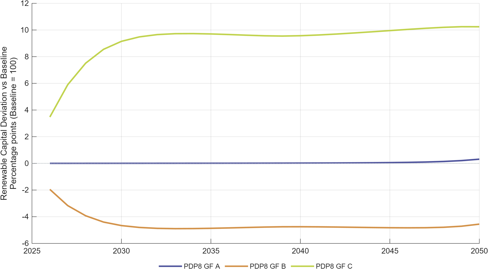
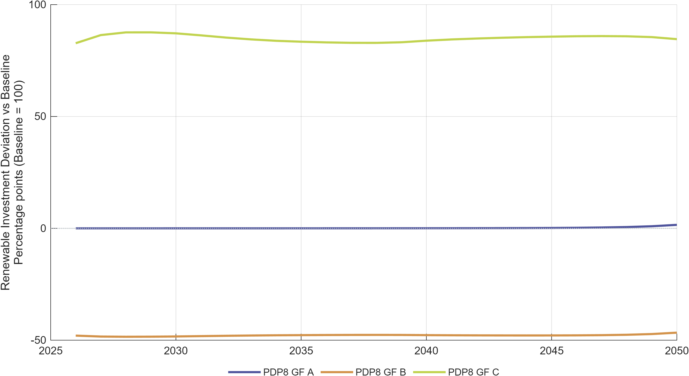
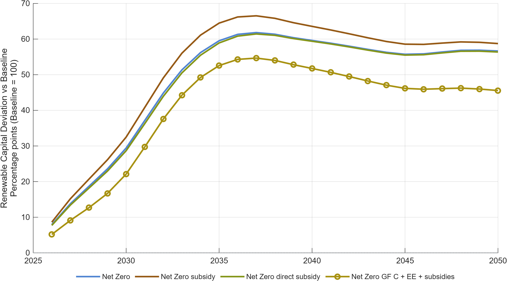
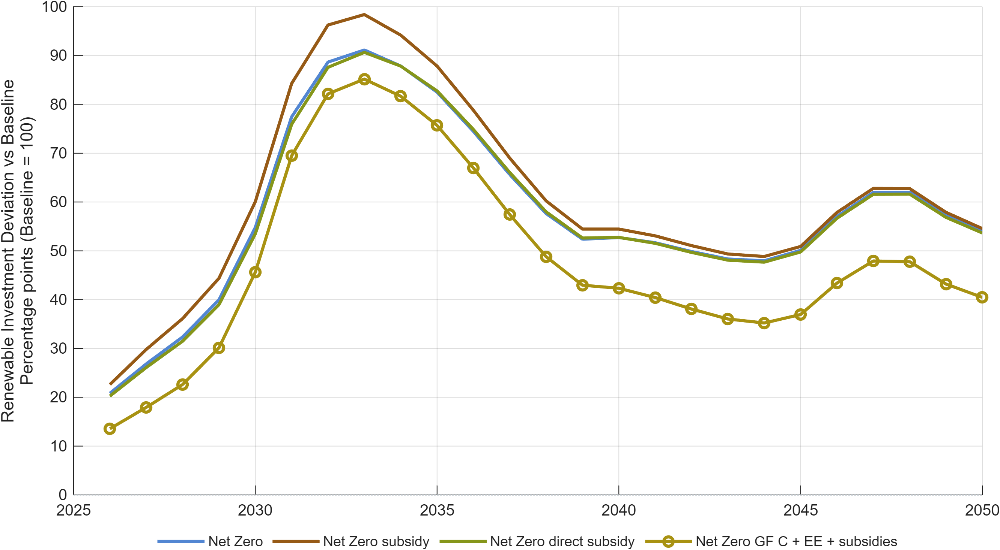
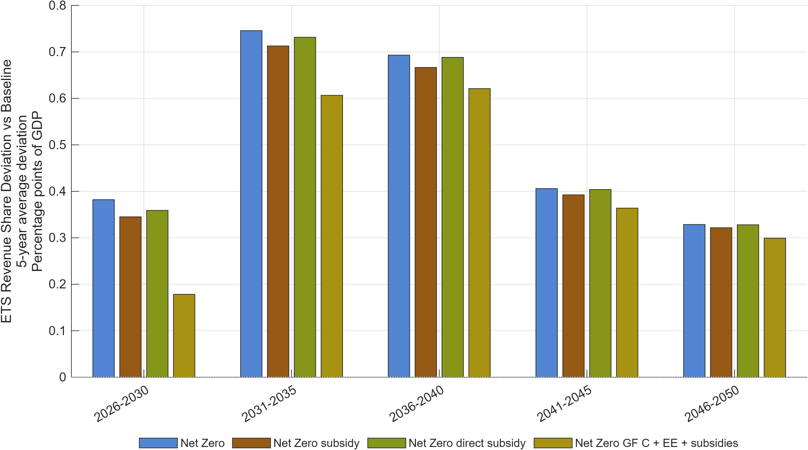
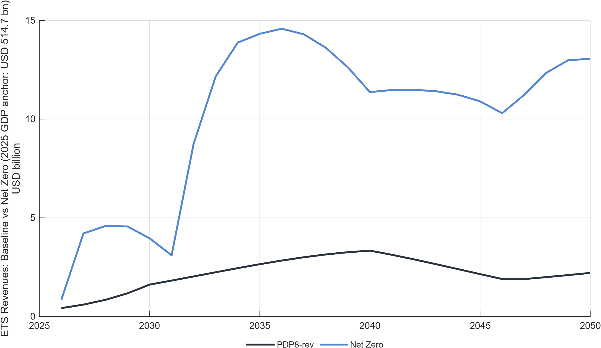
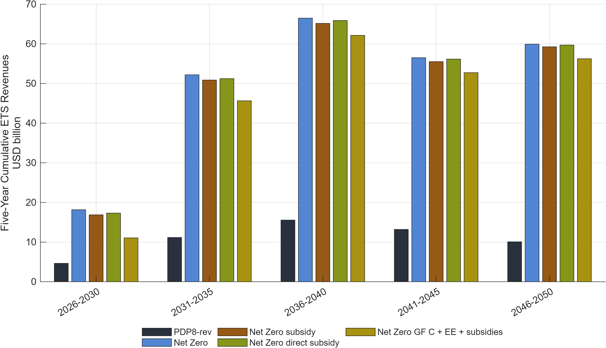
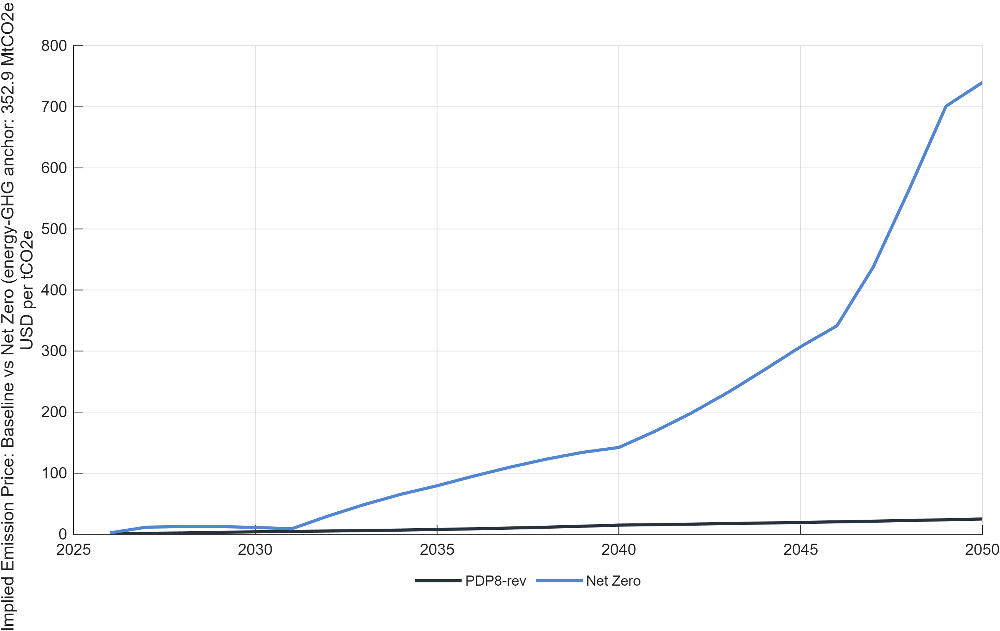

# Macroeconomic Impact Assessment of Vietnam's Power Development Plan 8 and Associated Policy Instruments

*A DGE-METRIC model-based assessment.*

> **How to use this document.** This report presents policy findings on the
> macroeconomic effects of PDP8 and three transition policy instruments —
> energy efficiency, green finance, and carbon pricing — using the
> DGE-METRIC model. For the underlying model, data, and solution method, see
> the companion [Technical Report](TECHNICAL_REPORT.md). This document is
> written to convert cleanly to Word/PDF (e.g. via `pandoc`) for circulation
> as a policy deliverable.

---

## Table of Contents

1. [Executive Summary](#1-executive-summary)
2. [Vietnam&#39;s Energy Transition Challenge](#2-vietnams-energy-transition-challenge)
3. [Policy Instruments Assessed](#3-policy-instruments-assessed)
4. [Cross-Cutting Findings](#4-cross-cutting-findings)
5. [Policy Recommendations](#5-policy-recommendations)
6. [Data and Modeling Caveats](#6-data-and-modeling-caveats)
7. [Annex: Methodology Summary](#7-annex-methodology-summary)

---

## 1. Executive Summary

Vietnam's Power Development Plan 8 (PDP8) and net-zero-by-2050 commitment
require an estimated **USD 136 billion** in energy-sector investment through
2050. This report uses DGE-METRIC (**D**ynamic **G**eneral **E**quilibrium for **M**acroeconomic
**E**nergy **T**ransition **I**ncorporating **C**arbon markets) — a five-sector dynamic general
equilibrium model calibrated to Vietnam — to quantify the macroeconomic
consequences of three policy levers available to shape that transition:
energy efficiency ambition, the architecture of green finance, and carbon
pricing under a net-zero emissions cap.

**Headline findings:**

- **Directive 10 combines stronger efficiency with distributed solar.**
  The higher-ambition pathway combines energy savings in industry and
  services with accelerated self-consumption rooftop PV and, where
  appropriate, BESS integration. It raises GDP throughout the 2026–2050
  horizon with only a small near-term investment-consumption trade-off.
- **Cheaper capital delivers a measurable, compounding growth dividend.**
  Shifting from market-led to public-led (concessional) green finance
  reduces annual financing costs by approximately **USD 3 billion**,
  compounding into a persistent GDP growth premium that builds through the
  2030s as lower-cost capital accumulates.
- **A binding net-zero emissions cap creates a transitional GDP cost, but
  policy design materially changes that result.** Relative to the PDP8
  Baseline, the standalone NZ pathway is below the Baseline from 2035,
  whereas the combined `NZ_GF_C_EE` package remains above it through 2050.
  The subsidy and direct-subsidy variants show that the transmission channel
  of support matters, not only its headline size.
- **The value of concessional finance is higher, not lower, under more
  ambitious climate policy** — financing-cost reductions and carbon pricing
  are complements, not substitutes, meaning development partners and MDBs
  have larger impact precisely where climate ambition is highest.
- **The ETS has material fiscal implications.** The simulations report ETS
  revenue both as a share of GDP and in USD billions, together with an
  implied USD/tCO2e emissions price. Five-year cumulative revenues make the
  potential fiscal scale clear, but the model does not prescribe how those
  revenues should be recycled.

These findings are based on specific, non-default model configurations (see
§6); reproducing any individual figure requires the exact
`activeScenarioGroups` configuration used to generate it.

---

## 2. Vietnam's Energy Transition Challenge

Vietnam is one of Southeast Asia's fastest-growing economies, with
electricity consumption that has roughly doubled every decade, historically
powered largely by coal. Vietnam has committed to:

- **net-zero emissions by 2050** (COP26 pledge, restated in its Nationally
  Determined Contribution);
- **60% renewable electricity share by 2030** (PDP8, Decision 500/QD-TTg,
  2023);
- **no new coal capacity after 2030** (a core PDP8 commitment).

These targets compress a multi-decade technology transition into roughly a
decade. In the model, PDP8 serves as the **reference (baseline) scenario**:
the trajectory the economy follows if current energy and climate policy
plans are maintained, including rapid solar/wind/storage build-out, coal
phase-down, large grid investment, and continued 6–7% annual GDP growth
through the 2030s. PDP8 is treated as a planning baseline, not a certainty —
it is ambitious relative to current implementation capacity.

**Investment scale.** The IWH Investment Needs Assessment (2025) estimates
cumulative energy-sector investment needs of approximately **USD 1 trillion** (2026–2050), spanning renewable capacity, grid
reinforcement/transmission, energy efficiency, and climate-adaptation
measures. The central economic question is not whether Vietnam can
eventually afford this, but whether the **timing, financing cost, and
institutional capacity** are adequate at the pace PDP8 requires.

**The financing gap.** The IWH Financial Assessment (2025) identifies a
financing bottleneck in the **pre-2035 window**, driven by large upfront
grid/storage costs, high market borrowing costs (8–10% for private energy
projects), a limited domestic institutional investor base, and uncertainty
over carbon-market revenue. Green finance instruments — concessional loans,
blended finance, green bonds, and development-bank facilities — are designed
to narrow this gap by lowering the effective cost of capital (§3.2).

**Carbon market development.** Vietnam is building a domestic emissions
trading system (ETS), piloted first in the power sector. Design questions —
coverage rate, cap trajectory, and revenue recycling — determine both the
carbon-price path and its distributional consequences (§3.3).

---

## 3. Policy Instruments Assessed

### 3.1 Energy efficiency

**Policy context.** Improving energy efficiency is one of the most
cost-effective ways to moderate future energy demand while supporting
economic growth. The revised PDP8 already assumes substantial efficiency
improvements, while Prime Minister Directive No. 10/CT-TTg calls for faster
electricity savings, lower peak demand, more efficient equipment and
production processes, and wider deployment of self-consumption rooftop
solar PV. The Directive also encourages PV integration with BESS where this
can reduce peak demand, increase on-site supply, and improve system
flexibility.

**Policy question:** what are the macroeconomic consequences of moving from
the revised PDP8 reference to the more ambitious Directive 10 package, and
how much of the result is attributable to BESS?

The `EE_Directive10` pathway combines stronger energy efficiency with
expanded rooftop PV and improved PV integration. It assumes sector-specific
energy savings by 2030 of approximately **7.4% in industry and 5.1% in
services**, supported by combined energy-efficiency investment of about
**USD 361 million per year**, equivalent to approximately **0.076% of GDP**.
These are expert-calibrated modeling assumptions used to represent the
Directive's ambition; they are not quantitative targets stated verbatim in
Directive 10. The reporting comparison also includes
`EE_Directive10_NoBESS` and `EE_PDP8_PV_BESS_NoBESS` counterfactuals. The
`NoBESS` variants retain their efficiency and PV assumptions while removing
the storage-specific contribution.

All energy-efficiency pathways are evaluated against the PDP8 Baseline under
the same emissions trajectory, maintained through the ETS. This controls
for emissions differences so that the reported deviations isolate the
macroeconomic effects of efficiency, rooftop PV, and BESS assumptions.

**Results:**

- GDP levels rise throughout the horizon under the Directive 10 variants.
  Relative to the lower-ambition comparison, Directive 10 delivers roughly
  **0.44–0.58 percentage points** more GDP across 2030–2050.
- The near-term effect on the consumption/investment mix is small
  (consumption share down at most 0.09 pp in 2030, recovering by 2040) as
  upfront EE capital outlay is later offset by lower energy costs.
- **Emissions are identical by design across the EE variants.** The common
  ETS trajectory is a modeling control; it allows the analysis to attribute
  differences in GDP and energy intensity to efficiency and distributed-PV
  measures rather than to different emissions paths.
- Removing the BESS-specific contribution (`NoBESS` counterfactuals) changes
  aggregate GDP outcomes negligibly (≤0.013 pp by 2050) — **BESS's value case
  rests on grid reliability, not aggregate macro impact.**

Figure 3.1. GDP level deviation from the PDP8 Baseline under Directive 10
and the EE/PV NoBESS counterfactuals.

Note: Values are percent deviations of GDP level from the PDP8 Baseline path,
2026–2050. The comparison separates the stronger Directive 10 package from
the storage-specific contribution removed in the NoBESS variants.

Source: Generated by `scripts/reporting/generate_ee_simulation_results_figures.m`
from scenario output CSV files in `ExcelFiles/Output/`.

Figure 3.2. Energy-intensity deviation of the Directive 10 and EE/PV
NoBESS pathways from the PDP8 Baseline.

Note: Values are index-point deviations from the Baseline energy-intensity
index (base year 2026). The Directive 10 variants are approximately 1.88
points below the Baseline in 2030 and 1.64 points below it in 2040; the
lower-ambition EE/PV NoBESS pathway is approximately 0.94 and 0.75 points
below the Baseline in those years.

Source: Generated by `scripts/reporting/generate_ee_simulation_results_figures.m`
from scenario output CSV files in `ExcelFiles/Output/`.

Figure 3.3. Emissions index across the PDP8 Baseline, Directive 10, and
EE/PV NoBESS variants.

Note: Index, base year 2026 = 100. All four EE variants track the same
emissions path because the ETS trajectory is held constant to isolate the
macroeconomic effect of the efficiency, PV, and storage assumptions.

Source: Generated by `scripts/reporting/generate_ee_simulation_results_figures.m`
from scenario output CSV files in `ExcelFiles/Output/`.

*(Full discussion, including the consumption/investment mix and BESS sensitivity: [use_cases_ee.md](../policy/use_cases_ee.md).)*

### 3.2 Green finance architecture

**Policy question:** does *who* provides transition capital, and at what
cost, materially change Vietnam's macroeconomic trajectory?

Within each policy pathway, the analysis holds the physical
renewable-investment requirement constant while varying both its ownership
structure and the financing conditions faced by different investors. For
renewable energy, the model allocates investment among public capital,
foreign direct investment (FDI), and
domestic private or household-owned capital. The public and FDI shares are
controlled directly in each scenario; the domestic private/household share
is the residual after those two shares have been assigned. The model also
sets separate costs of capital for public and FDI-financed investment. It
does not impose a policy-controlled financing rate on household-owned
private capital: the household capital return is determined endogenously
through the household investment decision. The reported Weighted Average
Cost of Finance (WACF) should therefore be interpreted as a summary of each
financing architecture, not as a single interest rate applied uniformly to
all investors.

Three financing architectures are compared. The balanced `GF_A`
architecture combines ODA/MDB finance, blended finance, and green bonds. It
allocates renewable investment across 19.0% public capital, 14.0% FDI, and
67.0% domestic private/household capital; its headline WACF is 6.43%, with
modeled public and FDI capital costs of 6.43% and 6.36%, respectively. The
market-led `GF_B` architecture allocates 9.6% to public capital, 12.4% to
FDI, and 78.0% to domestic private/household capital. Its headline WACF is
7.37%, while the modeled public and FDI capital costs are 7.37% and 6.90%.
The public-led `GF_C` architecture, dominated by concessional and ODA
finance, raises the public share to 36.5% and the FDI share to 19.0%,
leaving 44.5% for domestic private/household capital. Its headline WACF is
5.07%, with modeled public and FDI capital costs of 5.07% and 6.00%.

Each architecture is applied to both the PDP8 baseline and the Net-Zero
pathway, giving six configurations in total. The public and FDI investment
shares and their respective costs of capital are controlled directly,
whereas the domestic private/household share is the residual and its
financing rate is determined endogenously. Financing instruments therefore
enter the model as reduced-form ownership-share and cost-of-capital shocks,
rather than as named loans, bonds, guarantees, or balance-sheet
instruments. See §6 for what this representation does and does not capture.

**Results:**

- Moving from the market-led `GF_B` architecture to the public-led `GF_C`
  architecture changes both the ownership mix and the cost of renewable
  capital. In `GF_B`, renewable investment is financed by 9.6% public
  capital, 12.4% FDI, and 78.0% domestic private/household capital; the
  modeled costs of public and FDI capital are 7.37% and 6.90%,
  respectively. In `GF_C`, the public share rises to 36.5% and the FDI share
  to 19.0%, reducing the residual domestic private/household share to 44.5%;
  the corresponding public and FDI capital costs fall to 5.07% and 6.00%.
  The financing rate for domestic private/household capital is not directly
  changed by the policy scenario. This shift toward lower-cost public and
  foreign finance increases renewable investment and accelerates capital
  accumulation, particularly during the investment-intensive period before
  2035. The approximately 2.3 percentage-point difference in headline WACF
  between `GF_B` and `GF_C` implies about **USD 3 billion per year** in
  avoided financing costs at an investment scale of USD 136 billion and
  produces a consistent GDP growth premium over the model horizon.
- The GDP effect can be slightly negative in the very near term (higher
  investment temporarily displaces consumption) before the payoff from a
  larger, cheaper-financed capital stock materializes.
- **Financing effects are amplified under Net-Zero.** When the same finance
  scenarios are run against the NZ baseline, investment requirements are
  larger and the cost of capital more binding, so a given WACF reduction has
  a larger absolute GDP effect than under PDP8 alone. This means concessional
  finance and carbon pricing are **complements**, not substitutes — the case
  for cheaper capital strengthens as climate ambition rises.
- The model results represent an **upper bound**: they show what a given
  financing architecture achieves *if fully deployed at the assumed cost*,
  not whether that cost reduction is institutionally achievable at scale.

Figure 3.4. GDP growth under GF_A, GF_B, and GF_C financing architectures vs. the PDP8 Baseline.

Note: Annual GDP growth rates, 2026–2050. Cheaper capital (GF_C, public-led)
delivers a measurable growth premium over market-led finance (GF_B), largest
in the pre-2035 investment-intensive window.

Source: Generated by `scripts/reporting/generate_finance_simulation_results_figures.m`
from scenario output CSV files in `ExcelFiles/Output/`.

Figure 3.5. Weighted average cost of capital (WACC) for renewable investment under GF_A, GF_B, and GF_C.

Note: Effective financing cost for renewable energy investment, in percent.
The roughly 2 percentage-point WACF spread between GF_C (5.07%) and GF_B
(7.37%) translates directly into a lower effective WACC for renewable
investment.

Source: Generated by `scripts/reporting/generate_finance_simulation_results_figures.m`
from scenario output CSV files in `ExcelFiles/Output/`.

Figure 3.6. Renewable capital (`K_3_1`) under GF_A, GF_B, and GF_C,
expressed as percentage-point deviations from the PDP8 Baseline index.

Note: The Baseline is normalised to 100 in each year. Positive deviations
therefore show the additional renewable capital stock associated with each
financing architecture.

Source: Generated by `scripts/reporting/generate_finance_simulation_results_figures.m`
from scenario output CSV files in `ExcelFiles/Output/`.

Figure 3.7. Renewable investment (`I_3_1`) under GF_A, GF_B, and GF_C,
expressed as percentage-point deviations from the PDP8 Baseline index.

Note: The figure shows how lower public and FDI capital costs affect the
flow of renewable investment before those flows accumulate into the capital
stock shown in Figure 3.6.

Source: Generated by `scripts/reporting/generate_finance_simulation_results_figures.m`
from scenario output CSV files in `ExcelFiles/Output/`.

*(Full discussion, including the Net-Zero amplification effect: [use_cases_finance.md](../policy/use_cases_finance.md).)*

### 3.3 Carbon pricing and the Net-Zero pathway

**Policy context.** Viet Nam is developing a domestic emissions trading
system as an instrument for meeting its climate commitments. An ETS can
create a consistent incentive to reduce emissions and can generate
substantial public revenue, but its macroeconomic consequences depend on
how quickly low-carbon capital can be deployed, how support is delivered,
and whether efficiency and concessional-finance channels are available.

**Policy question:** what is the macroeconomic and fiscal effect of a
binding Net-Zero pathway relative to the PDP8 Baseline, and how do subsidy
design, affordable finance, and energy efficiency change that outcome?

The comparison uses the PDP8 `Baseline` as the common reference and includes
four Net-Zero variants:

- `NZ`: the core pathway with an economy-wide ETS cap and endogenous
  emissions price;
- `NZ_subsidy`: a Net-Zero pathway with the modeled subsidy support;
- `NZ_subsidy_direct`: a Net-Zero pathway in which support enters through
  the direct-subsidy channel; and
- `NZ_GF_C_EE`: an integrated package combining the Net-Zero constraint
  with the public-led GF_C financing architecture and stronger energy
  efficiency.

The subsidy variants are reduced-form policy experiments. They quantify the
macroeconomic consequences of their modeled shock paths rather than
representing fully specified fiscal programmes with administrative rules,
eligibility criteria, or endogenous budget closure.

**Results:**

- The standalone `NZ` pathway is initially above the Baseline but falls
  approximately **2.29% below it in 2035** and **1.27% below it in 2050**.
  This reflects the transition cost of accelerating renewable investment
  and fossil-energy adjustment under the binding emissions constraint.
- `NZ_subsidy` cushions this adjustment more effectively than
  `NZ_subsidy_direct` in the current calibration. GDP in 2050 is about
  **0.56% below Baseline** under `NZ_subsidy`, compared with about **1.46%
  below Baseline** under `NZ_subsidy_direct`.
- The integrated `NZ_GF_C_EE` package produces the strongest macroeconomic
  outcome. GDP remains above the Baseline throughout the reported horizon:
  approximately **2.68% in 2030**, **0.99% in 2035**, and **1.75% in 2050**.
  The result illustrates the complementarity of the carbon constraint,
  lower-cost public/FDI finance, and stronger energy efficiency.
- All Net-Zero variants accelerate renewable capital accumulation. Under
  `NZ`, renewable capital is approximately **63.8% above Baseline in 2035**
  and **58.6% above Baseline in 2050**. The corresponding investment flow
  is more front-loaded, reaching about **88.7% above Baseline in 2035**.
- ETS revenues rise materially under the Net-Zero constraint. With the
  reporting conversion described below, annual revenue under `NZ` rises
  from approximately **USD 8.4 billion in 2030** to **USD 19.9 billion in
  2035**, and is approximately **USD 14.2 billion in 2050**. Five-year
  cumulative values show the fiscal scale more clearly than a single-year
  series.

Figure 3.8. GDP level deviation from the PDP8 Baseline under `NZ`,
`NZ_subsidy`, `NZ_subsidy_direct`, and `NZ_GF_C_EE`.

Note: Values are percent deviations from the PDP8 Baseline GDP level,
2026–2050.

Source: Generated by `scripts/reporting/generate_nz_simulation_results_figures.m`
from replication CSV files in `ExcelFiles/Output/`.

Figure 3.9. Renewable capital (`K_3_1`) in the Net-Zero policy scenarios,
expressed as percentage-point deviations from the Baseline index.

Figure 3.10. Renewable investment (`I_3_1`) in the Net-Zero policy
scenarios, expressed as percentage-point deviations from the Baseline
index.

Source for Figures 3.9–3.10: Generated by
`scripts/reporting/generate_nz_simulation_results_figures.m` from
replication CSV files in `ExcelFiles/Output/`.

Figure 3.11. Five-year average deviation in ETS revenue as a share of GDP
from the PDP8 Baseline.

Note: Values are percentage-point deviations of ETS revenue relative to
GDP. The common Baseline makes the additional fiscal contribution of each
Net-Zero policy package directly comparable.

Figure 3.12. Annual ETS revenue for the Baseline and core `NZ` pathway, in
USD billions.

Note: Model monetary units are converted using Viet Nam's 2025 GDP of
**USD 514.7 billion** as the nominal anchor. This is a reporting conversion,
not a separate exchange-rate or inflation forecast.

Figure 3.13. Five-year cumulative ETS revenue for the Baseline and all four
Net-Zero policy scenarios, in USD billions.

Note: Each bar sums annual revenue within the labeled five-year period.

Figure 3.14. Implied emissions price for the Baseline and core `NZ`
pathway, in USD per tCO2e.

Note: The physical conversion anchors model emissions to **352.895 MtCO2e**
of energy-related greenhouse-gas emissions in 2023, the latest observed
EDGAR total used in the project input, comprising power generation,
industrial combustion, transport, buildings, and fuel exploitation. That
physical total is mapped to the model's 2025 emissions base. Together with
the USD 514.7 billion GDP anchor, it converts the endogenous permit-price
series into an implied USD/tCO2e series. The estimate is a model-consistent
reporting metric, not a forecast of the market allowance price.

Source for Figures 3.11–3.14: Generated by
`scripts/reporting/generate_nz_simulation_results_figures.m` from
replication CSV files in `ExcelFiles/Output/`.

*(Full discussion: [scenario.md](../reference/scenario.md), [scenarios_overview.md](../policy/scenarios_overview.md).)*

---

## 4. Cross-Cutting Findings

- **Sectoral adjustment burden.** The fossil energy sector faces the
  largest structural adjustment across all Net-Zero variants, as capital and
  labor reallocate toward renewables and non-energy sectors under a rising
  carbon price. Industry and services face demand-side pressure from
  changing energy prices and are the natural target sectors for
  efficiency policy.
- **Fiscal/ETS revenue implications.** Because tax rates on consumption,
  labor, and capital are held constant in the model (no endogenous fiscal
  rule), any change in government revenue from climate policy flows through
  the tax base and ETS auction revenue alone. The annual and five-year
  cumulative USD results show that ETS receipts can become fiscally
  significant. Revenue recycling — to the budget, firms, households, or
  transition investment — is therefore a first-order policy choice not
  resolved by the model itself.
- **Instrument complementarity, not substitution.** Across all three
  instruments assessed, the strongest results come from combinations rather
  than any single lever in isolation. The `NZ_GF_C_EE` package remains above
  the PDP8 Baseline through 2050, while the standalone NZ pathway carries a
  persistent GDP cost after 2030. Concessional finance and efficiency reduce
  the adjustment burden created by the carbon constraint; BESS's principal
  value remains system reliability rather than aggregate GDP.

---

## 5. Policy Recommendations

1. **Prioritize energy efficiency as a low-cost, GDP-positive early
   action**, and consider raising ambition toward Directive-10-equivalent
   targets given the modest incremental cost and roughly doubled GDP return.
2. **Pair energy efficiency and distributed PV with an active
   carbon-pricing mechanism.** Use Directive 10 implementation to lower
   energy demand and peak load while the ETS maintains the emissions
   trajectory.
3. **Prioritize mobilizing concessional and blended (public-led) finance
   over market-rate capital**, particularly in the pre-2035 window where the
   financing gap is largest — the modeled USD ~3 billion/year saving is a
   lower bound on the value of closing this gap, since it excludes volume
   effects (§6).
4. **Sequence concessional finance mobilization alongside — not instead of
   — carbon-price ambition.** The model shows the two are complements: the
   macroeconomic payoff to cheaper capital rises with climate ambition, so
   development-partner engagement has more leverage in an ambitious
   net-zero pathway than in a PDP8-only one.
5. **Treat BESS investment as a reliability and system-stability
   requirement**, not a mechanism to justify on aggregate GDP grounds alone —
   the model shows negligible macro sensitivity to BESS removal, consistent
   with its role being primarily technical (grid balancing) rather than
   macroeconomic.
6. **Use ETS revenues strategically and transparently.** The modeled revenue
   stream is large enough to affect public finances, but the preferred
   recycling mechanism is a policy choice. Evaluate budget support,
   household compensation, industrial transition assistance, and
   low-carbon investment against explicit efficiency and distributional
   criteria.
7. **Treat subsidy architecture as a design question, not a generic
   add-on.** The subsidy and direct-subsidy variants produce different GDP
   outcomes under the same broad Net-Zero objective. Any real programme
   should specify the recipient, financing source, duration, conditionality,
   and fiscal closure before model results are translated into policy.

---

## 6. Data and Modeling Caveats

Readers relying on this assessment for decision-making should be aware of
the following:

- **Reduced-form financial instruments.** DGE-METRIC does not model named
  financial instruments (green bonds, guarantees, KfW loans) as explicit
  balance-sheet items. All green-finance results are the *aggregate macro
  consequence* of an assumed cost-of-capital or investment-price change —
  not a tool-by-tool breakdown of which specific instrument delivers it.
  The scenarios directly control the public and FDI renewable-investment
  shares and their respective capital costs. Domestic private/household
  investment is the residual share, and its return is determined
  endogenously rather than fixed by the policy scenario.
  Institutional feasibility of achieving the assumed WACF at scale is
  outside the model's scope (see
  [finance_instruments_comments_feasibility.md](../scenario_notes/finance_instruments_comments_feasibility.md)).
- **Volume vs. price.** Current finance scenarios primarily represent
  cost-of-capital/rate changes; concessional-finance *volume* effects
  (e.g., mobilization ratios, blended-finance leverage) are only captured to
  the extent they are separately mapped into public-capital or FDI-volume
  shock paths.
- **Reduced-form subsidy variants.** `NZ_subsidy` and
  `NZ_subsidy_direct` are interpreted through the shock paths contained in
  their scenario outputs. The model does not supply a complete legal,
  administrative, or fiscal design for either instrument. Their results
  should therefore be read as comparative transmission experiments rather
  than costed programme proposals.
- **Reproducibility of cited figures.** `RunSimulations.m` runs only the
  `Baseline` scenario by default. The EE, Green Finance, and Net-Zero results
  in this report were generated with specific non-default scenario
  configurations. The Net-Zero reporting set is `Baseline`, `NZ`,
  `NZ_subsidy`, `NZ_subsidy_direct`, and `NZ_GF_C_EE`, using the
  `_replication.csv` outputs. Other scenarios use the groups documented in
  [running.md](../reference/running.md#scenario-groups). Anyone reproducing these
  figures should confirm the exact configuration and re-verify against
  current calibration before re-citing them in a new context.
- **EE scenario coverage.** The figures in §3.1 use the available reporting
  set: `Baseline`, `EE_Directive10`, `EE_Directive10_NoBESS`, and
  `EE_PDP8_PV_BESS_NoBESS`. Do not infer results for an unavailable
  `EE_Directive10_PV_BESS` output. See
  [implementation_plans/ee_simulation_scenarios_results.md](../implementation_plans/ee_simulation_scenarios_results.md)
  for the scenario-availability record.
- **USD and physical-emissions anchors.** ETS revenue in USD billions uses
  nominal Viet Nam GDP of USD 514.7 billion in 2025 to scale model monetary
  units. The implied emissions price additionally maps the project's 2023
  EDGAR energy-related GHG total of 352.895 MtCO2e to model emissions in
  2025. These anchors make the figures interpretable in current units but
  do not add an endogenous exchange-rate, inflation, or emissions-inventory
  forecast.
- **PDP8 optimism.** The PDP8 baseline itself may embed optimistic
  implementation timelines relative to current institutional capacity; this
  report does not independently stress-test PDP8 delay scenarios.
- **Single-region model.** Sub-national/provincial dynamics (where GIZ has
  done prior related work) are not represented; sub-sovereign finance
  questions can only be addressed narratively, not quantitatively.
- **Calibration sensitivity.** Key external-sector parameters
  (`phiB_p`, `phiadjB_p`) in the active calibration are far weaker than the
  model's built-in code defaults (two orders of magnitude apart) — see
  [calibration_model_detailed.md §12](../reference/calibration_model_detailed.md).
  Results involving external borrowing/foreign-asset dynamics should be
  read alongside this sensitivity.

---

## 7. Annex: Methodology Summary

DGE-METRIC is a five-sector, one-region dynamic general equilibrium model,
solved with Dynare as a deterministic (perfect-foresight) transition path
from 2026–2050, calibrated to Vietnam's 2019 input-output structure and a
2026 baseline. Households, firms (five subsectors: non-energy aggregate,
fossil energy, renewable energy, industry, services), a
wholesale/retail/export trade chain, a government with an emissions trading
system, and the rest of the world interact through goods, labor, capital,
emissions-permit, and trade markets. Scenarios are constructed as shock paths
to exogenous variables (efficiency productivity, emission intensity, cost of
capital, ETS cap) applied to a common calibrated baseline, so that
differences across scenarios isolate the mechanism being tested.

For the full model structure, calibration methodology, data sources,
solution method, and known limitations, see the companion
[Technical Report](TECHNICAL_REPORT.md).
