# DGE-METRIC: A Dynamic General Equilibrium Model for Vietnam's Energy Transition

## Technical Report

*Prepared under the joint GIZ–IWH research project supporting Vietnam's energy and climate policy dialogue.*

> **How to use this document.** This is the methodological companion to the
> [PDP8 Macroeconomic Impact Assessment](PDP8_IMPACT_ASSESSMENT.md), which
> presents policy findings. This report documents the model, its data
> foundations, its solution method, and its limitations, so that results can
> be reproduced, audited, and extended. It is written to convert cleanly to
> Word/PDF (e.g. via `pandoc`) for circulation as a standalone technical
> annex.

> **Reporting conventions used in this technical report.** The document
> follows standard technical-report practice used by international financial
> institutions: (i) clear separation of evidence, assumptions, and modeled
> outcomes; (ii) explicit statement of limitations and interpretation risks;
> (iii) figure-by-figure documentation using caption, note, and source; and
> (iv) reproducibility through direct file and script references.

---

## Table of Contents

- [Executive Summary](#executive-summary)
- [Introduction and Motivation](#1-introduction-and-motivation)
- [Model Structure and Theory](#2-model-structure-and-theory)
- [Data and Calibration](#3-data-and-calibration)
- [Solution Method](#4-solution-method)
- [Scenario Design Framework](#5-scenario-design-framework)
- [Limitations, Implementation Risks, and Interpretation Guidance](#6-limitations-implementation-risks-and-interpretation-guidance)
- [References](#references)
- [Technical Appendix](#a-technical-appendix)


---
## List of Figures


---
## List of Figures
---

## Abbreviations
 
BESS — Battery Energy Storage System
CMIP6 — Coupled Model Intercomparison Project Phase 6
COP26 — 26th UN Climate Change Conference of the Parties
DGE — Dynamic General Equilibrium
DGE-METRIC — Dynamic General Equilibrium Model for Vietnam's Energy Transition Incorporating Carbon Markets
EDGAR — Emissions Database for Global Atmospheric Research
ETS — Emissions Trading System
EVN — Electricity of Vietnam
EXIOBASE — Environmentally Extended Multi-Regional Input-Output Database
FDI — Foreign Direct Investment
GIZ — Deutsche Gesellschaft für Internationale Zusammenarbeit
GDP — Gross Domestic Product
IEA — International Energy Agency
IRENA — International Renewable Energy Agency
IWH — Halle Institute for Economic Research
IO — Input-Output
KfW — Kreditanstalt für Wiederaufbau
LCOE — Levelized Cost of Energy
NDC — Nationally Determined Contribution
NSO — National Statistics Office
OECD — Organisation for Economic Co-operation and Development
PDP8 — Power Development Plan 8
PV — Photovoltaic
SSP — Shared Socioeconomic Pathway
USD — United States Dollar
UIP — Uncovered Interest Parity
WACC — Weighted Average Cost of Capital
WACF — Weighted Average Cost of Finance
---

## Executive Summary

The DGE-METRIC (**D**ynamic **G**eneral **E**quilibrium for **M**acroeconomic
**E**nergy **Tr**ansition **I**ncorporating **C**arbon markets) model was developed to analyse the macroeconomic implications of Vietnam's energy transition and to evaluate alternative pathways for achieving the objectives of the Power Development Plan 8 (PDP8) and the country's net-zero emissions commitment by 2050. The model provides a quantitative framework for assessing how alternative energy and climate policies affect economic growth, investment, sectoral production, household welfare, public finances, and carbon emissions over the transition period.

Unlike engineering-based energy system models, which focus on technology deployment and electricity-system optimisation, DGE-METRIC captures the economy-wide interactions between investment, production, consumption, labour markets, international trade, and climate policy. This integrated perspective enables the assessment of transition pathways within a consistent macroeconomic framework, allowing policy interventions in the energy sector to be evaluated alongside their broader economic consequences

The model is formulated as a deterministic, forward-looking dynamic general equilibrium (DGE) model implemented in Dynare and MATLAB. It represents Vietnam as a five-subsector, one-region economy, comprising a representative household, firms operating in five production sectors, wholesale and retail trade, an exporting sector, a government with an emissions trading system (ETS), and the rest of the world. The model is calibrated to Vietnam's 2019 input-output structure and a 2026 baseline and is solved over the 2026–2050 transition horizon, drawing on data from the National Statistics Office (NSO), Electricity of Vietnam (EVN), the International Energy Agency (IEA), EDGAR, the World Bank, and project-specific (GIZ/IWH)calibration inputs.

The report documents the theoretical foundations, calibration strategy, and numerical implementation of the model, together with the construction of the policy scenarios used throughout the analysis. It explains how baseline and scenario pathways are translated into model inputs, how the perfect-foresight transition path is solved, and how key assumptions regarding technology, emissions, and financing are incorporated into the modelling framework. The report also discusses the principal limitations of the approach and provides guidance for the interpretation of simulation results.

Taken together, these elements provide a transparent and reproducible modelling framework for analysing the macroeconomic consequences of Vietnam's energy transition and for supporting evidence-based policy analysis on climate, energy, and green finance.

---

## 1. Introduction and Motivation

### 1.1 The Policy Motivation

Vietnam's energy transition represents one of the country's most significant long-term development challenges. Achieving sustained economic growth while simultaneously transforming the electricity sector to meet national climate objectives requires unprecedented levels of investment, coordinated policy interventions, and substantial structural adjustment across the economy. Decisions regarding the timing, scale, and financing of these investments will shape not only the future energy system but also broader economic development over the coming decades.

To achieve the objectives of the Power Development Plan 8 (PDP8) and Vietnam's commitment to reach net-zero greenhouse gas emissions by 2050 (COP26 NDC), the country is estimated to require approximately USD 136 billion of investment in the energy sector by 2050 (IWH Investment Needs Assessment, 2025). At the same time, Vietnam aims to sustain annual GDP growth of around 6–7%, increase the share of renewable electricity generation to 60%, phase out the expansion of coal-fired power generation after 2030 (PDP8, Decision 500/QD-TTg, 2023), and meet its Nationally Determined Contributions under the Paris Agreement.

Bottom-up energy-system models (capacity expansion, LCOE,
dispatch) play a central role in energy planning by identifying cost-effective technology portfolios, evaluating generation capacity expansion, and analysing system operation. these models are not designed to quantify the broader macroeconomic consequences of alternative transition pathways. In particular, they cannot directly address economy-wide questions such as:

- What are the macroeconomic costs of meeting PDP8 investment requirements in terms of GDP, household consumption, investment, and employment?
- To what extent does achieving net-zero emissions impose additional economic costs beyond those already associated with implementing PDP8?
- How do improvements in energy efficiency affect investment requirements and long-term economic performance?
- How do alternative green-finance architectures influence the pace, affordability, and macroeconomic impacts of the energy transition?
- Which carbon-price trajectories are consistent with alternative transition pathways?
- Which sectors experience the largest structural adjustment during the transition?

Addressing these questions requires an economy-wide analytical framework that captures the interactions between the energy sector and the broader economy. Investment in low-carbon technologies competes for capital and labour with investment in other sectors, while changes in energy prices, production costs, household income, international trade, and public finances generate adjustment effects throughout the economic system. DGE-METRIC was developed to analyse these interactions within a consistent forward-looking general equilibrium framework and to quantify the macroeconomic implications of alternative energy-transition pathways.

### 1.2 Scope of the Model

DGE-METRIC is a **reduced-form macroeconomic model**, not an energy-system
planning model. It does not:

  loans) as explicit balance-sheet items — these are translated into
  equivalent cost-of-capital or investment-price shocks (§6.3).

Technology cost projections and supply-stack detail are taken as exogenous
inputs from IEA World Energy Outlook and Vietnam PDP8 planning documents.

## 1. Introduction and Motivation

### 1.1 The policy problem

Vietnam's energy transition represents one of the country's most significant long-term development challenges. Achieving sustained economic growth while simultaneously transforming the electricity sector to meet national climate objectives requires unprecedented levels of investment, coordinated policy interventions, and substantial structural adjustment across the economy. Decisions regarding the timing, scale, and financing of these investments will shape not only the future energy system but also broader economic development over the coming decades.

To achieve the objectives of the Power Development Plan 8 (PDP8) and Vietnam's commitment to reach net-zero greenhouse gas emissions by 2050, the country is estimated to require approximately **USD 136 billion** of investment in the energy sector by 2050 (IWH Investment Needs Assessment, 2025). At the same time, Vietnam aims to sustain annual GDP growth of around 6–7%, increase the share of renewable electricity generation, phase out the expansion of coal-fired power generation after 2030, and meet its Nationally Determined Contributions under the Paris Agreement. Together, these objectives require a profound transformation of the energy sector while maintaining macroeconomic stability and economic competitiveness.

Bottom-up energy system models play a central role in energy planning by identifying cost-effective technology portfolios, evaluating generation capacity expansion, and analysing system operation. However, these models are not designed to quantify the broader macroeconomic consequences of alternative transition pathways. In particular, they cannot directly address questions such as:

- What are the macroeconomic costs of meeting PDP8 investment requirements in terms of GDP, household consumption, investment, and employment?

Addressing these questions requires an economy-wide analytical framework that captures the interactions between the energy sector and the broader economy. Investment in low-carbon technologies competes for capital and labour with investment in other sectors, while changes in energy prices, production costs, household income, international trade, and public finances generate adjustment effects throughout the economic system. DGE-METRIC was developed to analyse these interactions within a consistent forward-looking general equilibrium framework and to quantify the macroeconomic implications of alternative energy-transition pathways.

---

### 1.2 Scope of the Model

DGE-METRIC is a reduced-form dynamic general equilibrium model designed to analyse the economy-wide consequences of Vietnam's energy transition. It combines a detailed representation of the energy sector with a comprehensive macroeconomic framework that captures interactions between households, firms, government, international trade, capital accumulation, and carbon pricing. Rather than determining optimal technology choices, the model evaluates the economic implications of externally specified policy pathways and investment trajectories.

As with any macroeconomic model, DGE-METRIC deliberately abstracts from several aspects that are more appropriately analysed using specialised engineering or financial models. In particular, the model does not:

- optimise electricity dispatch or represent individual power plants;
- endogenously model technology learning and cost reductions;
- distinguish between sub-national regions or provincial governments.

Similarly, technology cost projections, renewable deployment pathways, and capacity expansion plans are taken as exogenous inputs based on official planning documents and international energy outlooks rather than being determined endogenously within the model.

Consequently, DGE-METRIC should be viewed as complementary to engineering-based energy system models rather than as a substitute for them. While engineering models identify technically feasible and cost-efficient energy-system configurations, DGE-METRIC evaluates the broader macroeconomic consequences of implementing these pathways. Together, the two modelling approaches provide a more comprehensive evidence base for assessing Vietnam's transition towards a low-carbon economy.

## 2. Model Structure and Theory
### 2.1 Sectors

| # | Label                | Economic role                                                         |
| - | -------------------- | --------------------------------------------------------------------- |
| 1 | Non-energy aggregate | General production; residual macro sector                             |
| 2 | Fossil energy        | Coal, gas, oil generation; declining under Net-Zero                   |
| 3 | Renewable energy     | Solar, wind, hydro, storage; expanding under all transition scenarios |
| 4 | Industry             | Manufacturing; major energy user, energy-efficiency target sector     |
| 5 | Services             | Commercial and public services; secondary energy user                 |

Aggregate reporting sectors collapse Fossil and Renewable into a single
"Energy" sector (giving the four-sector aggregate view: Primary, Energy,
Secondary, Tertiary used in results reporting). Capital and labor move
across sectors in response to relative prices; energy sectors supply
intermediate inputs to sectors 1, 4, and 5.

### 2.2 Household

A representative household derives utility from consumption $C_t$, housing
services $H_{t+1}$, and disutility from supplying labor $N_{s,t}$ across
sectors $s \in \{1,\dots,S\}$:

$$
U(C_t, H_{t+1}, N_{s,t})
= \frac{\left(C_t^{1-\gamma} H_{t+1}^{\gamma} \right)^{1-\sigma^C}}{1-\sigma^C}
- \sum_{s=1}^{S} A^L_{s,t} \, \phi^L_s \, \frac{N_{s,t}^{1+\sigma^{L}}}{1+\sigma^{L}}
$$

where $\gamma$ is the preference weight on housing, $\sigma^C$ the inverse
intertemporal elasticity of substitution in consumption, and $\sigma^L$ the
inverse Frisch elasticity of labor supply. Labor disutility is scaled by
sector-specific labor productivity $A^L_{s,t}$ and calibrated weights
$\phi^L_s$ that pin down realistic long-run sectoral labor shares.

The household chooses consumption, sectoral labor supply, sectoral
investment $I_{s,t}$, next-period sectoral capital $K_{s,t+1}$, housing
$H_{t+1}$, and net foreign asset holdings $B_{t+1}$ to maximize discounted
lifetime utility $\sum_t \beta^t U(\cdot)$ subject to:

- a **budget constraint** (income = expenditure);
- **sector-specific capital accumulation**,
  $K_{s,t+1} = (1-\delta)K_{s,t} + I_{s,t}\Gamma_{s,t} - D^K_{s,t}$, where
  climate damages $D^K_{s,t}$ reduce the capital stock directly;
- **housing accumulation**,
  $H_{t+1} = (1-\delta^H)H_t + I^H_t - D^H_t$.

Income sources are rental income from sector-specific capital, labor income
across sectors, and returns on foreign bond holdings; foreign borrowing
carries a debt-elastic risk premium (§3.7, §5.3).

### 2.3 Firms and the production structure

In each sector $s$, firms choose intermediate inputs $Q^I_{s,k,t}$, labor
$L_{s,t}$, and capital $K_{s,t}$ to maximize static profit:

$$
\max\; P^Q_{s,t}(1-\kappa^E_{s,t}P_{E,t})\,Q_{s,t} - \tilde W_{s,t}L_{s,t}
- P^K_{s,t}K_{s,t} - \sum_{k=1}^{S} P^D_{k,t}Q^I_{s,k,t}
$$

Sector-specific emission intensity $\kappa^E_{s,t}$ is proportional to
output and can vary over time (the channel through which fuel-switching and
emission-intensity scenarios operate). Final output is a CES (or
Cobb-Douglas, when the elasticity equals 1) aggregate of intermediate inputs
and value added; value added is a CES/Cobb-Douglas aggregate of effective
labor and capital; intermediate inputs are themselves a CES aggregate across
sectors of origin. See [model.md](../reference/model.md) for the full equation set
(production, value-added, and intermediate-aggregation identities,
wholesaler/retailer/exporter blocks).

### 2.4 Wholesaler, retailer, exporter

A representative wholesaler in each subsector combines domestic and
imported intermediate goods to supply both intermediate demand and final
retail demand. A representative retailer combines domestic goods and
imports for final use (consumption, investment, and government spending) via
a CES nest. An exporter aggregates subsectoral exports into a single export
good sold to the rest of the world. Elasticities of substitution between
domestic and imported goods ($\eta^Q_s$, $\eta^F$) and origin-sector home
bias ($\omega^Q_s$, $\omega^M_s$) are sector-specific calibrated parameters.

### 2.5 Government and the Emissions Trading System

Fiscal policy follows standard reduced-form rules: tax rates on consumption,
labor, and capital income are constant over time (no endogenous fiscal
feedback rule), and government expenditure is pinned down by the budget
constraint. Revenue sources are consumption tax $\tau^C_tC_t$, labor and
capital income taxes, and ETS auction revenue:

$$
R^{ETS}_t = P^E_t \sum_s E_{s,t} = P^E_t \sum_s \kappa^E_{s,t}Q_{s,t}
$$

Under the ETS, firms hold allowances for covered emissions; the carbon price
$P^E_t$ clears the permit market against the cap. Government debt $B^G_t$ is
serviced at the world interest rate, and the government faces the same
interest-rate schedule as households. Because tax rates are fixed, any
change in government revenue from climate policy flows entirely through the
tax base and the ETS revenue term, not through an endogenous rate response.

### 2.6 Key extensions beyond a textbook DGE model

| Feature                        | What it adds                                    | Key variables                                   |
| ------------------------------ | ----------------------------------------------- | ----------------------------------------------- |
| Input-output structure         | Sectors buy intermediate goods from each other  | $Q^I_{s,k}$ intermediate demand matrix        |
| Energy as intermediate input   | Energy demand derived from production decisions | $Q_{A,s,1}$, $Q_{PV,1}$                     |
| Emission coefficients          | Each fossil fuel unit generates CO₂            | $\kappa^E_s$ emission intensity               |
| Emissions trading system       | Carbon permit market, endogenous price          | $E^{ETS}_1$, $P^E$, $\xi_s$ coverage rate |
| Energy efficiency shocks       | Reduces energy per unit of output over time     | `exo_AI_s`                                    |
| Renewable capital accumulation | PV and grid investment paths                    | `exo_PVEff_1`, `exo_GA_s`                   |
| Climate damages                | Temperature shocks reduce capital and housing   | $D^K_{s,t}$, $D^H_t$                        |
| Green finance channels         | Lower cost of capital for energy investment     | `exo_r_G_s`, `exo_r_FDI_s`, `exo_P_K_s`   |
| Housing as durable capital     | Household wealth and climate exposure           | $H_{t+1}$, $I^H_t$                          |

### 2.7 External sector

Net foreign assets follow a law of motion linked to the trade balance; the
external finance premium is debt-elastic,
$\exp(-\phi_B \cdot \text{external\_position\_gap}/Y)$, with an additional
quadratic adjustment cost ($\phi_{adjB}$) — a standard closure device for
stationarity in small open-economy models. The exchange-rate variable
$s_{reg}$ is **not a full UIP-style nominal exchange-rate block**: it follows
an AR(1) process when `exo_lNXTarget = 0`, or becomes the balancing variable
that enforces a target net-exports/GDP ratio when `exo_lNXTarget = 1`
(the baseline mode). Treat $s_{reg}$ as an external-balance closure/valuation
factor, not a nominal exchange rate in the conventional sense (see
[dev/model_consistency_and_calibration_findings_2026-07-14.md](../dev/model_consistency_and_calibration_findings_2026-07-14.md)).

---

## 3. Data and Calibration

### 3.1 Data sources

| Category                       | Primary source                                              | Used for                                              |
| ------------------------------ | ----------------------------------------------------------- | ----------------------------------------------------- |
| Macroeconomic structure        | NSO (Vietnam), OECD TiVA                                    | IO table, sectoral value-added and employment shares  |
| Energy production and capacity | EVN, IEA WEO                                                | Baseline energy calibration, capacity targets         |
| Energy investment costs        | IEA WEO, IRENA                                              | CAPEX paths, LCOE assumptions                         |
| Emissions                      | EDGAR, IEA                                                  | Baseline emissions levels and intensity               |
| Trade and capital flows        | World Bank, OECD                                            | Import/export shares, FDI flows                       |
| Environmentally extended IO    | EXIOBASE 3                                                  | Cross-check of embodied emissions/energy coefficients |
| Climate variables              | CMIP6 / SSP scenarios                                       | Climate damage paths (`tas` temperature shocks)     |
| Financial parameters           | IWH Financial Assessment (2025), GIZ Green Finance workbook | Finance rates and WACF scenarios                      |

Full variable-to-source mapping is documented in
[data_sources.md](../reference/data_sources.md); parameter-by-parameter citations for
the structural-parameters sheet are in
[structural_parameters_source_audit.md](../reference/structural_parameters_source_audit.md).
Raw source data is maintained outside the repository (size/licensing) and is
pre-processed into the calibration workbook.

### 3.1.1 Expenditure-side GDP cross-check output
**Provenance note (ETS fiscal revenue):** the model does not use an official
published long-run (2030/2050) government ETS revenue forecast for Vietnam.
Instead, ETS revenue is scenario-based and follows:

$$
REV^{ETS}_t = \theta^{auc}_t \cdot P^{CO2}_t \cdot E^{covered}_t
$$

where only auctioned allowances generate direct public revenue. Free allocation
is treated as compliance value transfer, not fiscal revenue.

### 4.1.1 Expenditure-side GDP cross-check output

The repository includes a reproducible cross-check generated by
`scripts/reporting/generate_gdp_components_start_end_vs_actual.m`, which compares
the model's expenditure-side GDP component shares at the baseline start and
end years against actual 2019 Vietnam national-accounts shares.


Figure 4.1. Expenditure-side GDP components: actual 2019 vs simulated baseline start and end.

Note: The chart stacks seven components as shares of GDP: private consumption,
government consumption, private investment, housing investment, solar/PV
investment, government investment, and net exports. In the Actual (2019) bar,
government investment and solar/PV investment are proxy estimates documented in
the script header; housing investment is taken directly from the NSO IO table.

Source: Output files `GDPComponents_StartEndVsActual.png`,
`GDPComponents_StartEndVsActual.svg`, and
`GDPComponents_StartEndVsActual.csv` in
`Figures/Baseline/GDPComponents/`, generated from
`ExcelFiles/Output/Baseline.csv` and external NSO workbook
`IO_GSO_2019.xlsx` by
`scripts/reporting/generate_gdp_components_start_end_vs_actual.m`.

### 3.2 Calibration workflow

The 5-sector, 1-region model is driven by three workbooks:
`ExcelFiles/ModelCalibration5Sectorsand1Regions.xlsx` (calibration inputs and
named ranges), `ExcelFiles/ModelBaseline5Sectorsand1Regions.xlsx` (the split
baseline path, built `Baseline_Input → Baseline_calc → Baseline_Implied → Baseline`), and `ExcelFiles/ModelScenarios5Sectorsand1Regions.xlsx`
(scenario shock paths).

Calibration mixes four distinct types of input, and keeping them separate is
essential to interpreting results correctly:

1. **Observed or targeted baseline shares** (`phiY0`, `phiN0`, `phiW`,
   `phiX`, `phiQI`, …) — read directly from workbook sheets.
2. **Structural assumptions** (`beta`, `delta`, `sigmaL`, `sigmaC`, CES
   elasticities, tax rates) — read from the `Structural Parameters` sheet or
   left at code defaults.
3. **Initial levels / macro closures** (`Y0`, `N0`, `PoP0`, `LF0`, `H0`,
   `E0`, `PE0`, …) — read from `Start` when available.
4. **Solved residual parameters** (CES weights, emission intensities
   `kappaE`, labor disutility weights, TFP levels `A_s`, `rf0`) — backed out
   inside the steady-state routines so the baseline is internally
   consistent.

The model is calibrated in three stages: (i) `lCalibration_p = 1` builds the
baseline steady state and solves residual parameters via `fsolve`; (ii)
`lCalibration_p = 0` re-solves the full steady state using the calibrated
parameters as fixed; (iii) non-baseline scenarios run in a hybrid mode
(`lCalibration_p = 2`) that takes the calibrated baseline as given and
applies scenario shocks. See [calibration.md](../reference/calibration.md) for the
step-by-step MATLAB call sequence.

### 3.3 The factor-cost GVA identity

A central calibration invariant, load-bearing whenever the baseline emission
price is positive ($PE > 0$), is:

$$
P0_{s,r} \cdot Y0_{s,r} = FCgva_{s,r} \equiv QEXP_s - QIEXP_s - emDirect_s
$$

i.e., the baseline price-weighted value-added target in the model numeraire
must equal the factor-cost gross value added actually computed from national
accounts (basic-price gross output, minus intermediate use, minus direct ETS
permit cost). An earlier share-based normalization
($\phi Y_s \cdot Q0_p$) was only valid when $PE = 0$ and produced non-zero
Dynare static residuals in the TFP equations at any positive carbon price.
The current implementation enforces $P0_s \cdot Y0_s = FCgva_s$ consistently
across the MATLAB calibration routines and the `.mod` productivity
equations — see [calibration_model_detailed.md](../reference/calibration_model_detailed.md)
for the full derivation, code locations, and baseline-check identities.

### 3.4 Code defaults vs. active calibration

`ModFiles/DGE_Model_Parameters.mod` ships default parameter values, but the
active 5-sector/1-region workbook materially overrides several of them —
most importantly the external-finance-premium parameters `phiB_p`
(code default 10.0 vs. active workbook 0.1) and `phiadjB_p` (1.0 vs. 0.1),
which differ by two orders of magnitude. **The workbook values, not the
`.mod` file defaults, govern the currently compiled model.** Analysts citing
a structural parameter should always confirm which workbook is loaded for
the run in question; the full override table is in
[calibration_model_detailed.md §12](../reference/calibration_model_detailed.md).

### 3.5 Baseline diagnostics plots used for calibration checks

The baseline reporting script
`scripts/reporting/display_baseline_energy.m` writes its figures to the
repository-level `Figures/` directory (not `docs/figures/`). The script uses
`outDir = fullfile(repoRoot, 'Figures')` and exports both raster and vector
versions (`.png` at 300 dpi and `.pdf` vector).

These plots provide an operational bridge between the workbook targets and the
calibrated baseline path:

1. **Level/index path checks** (`baseline_ren_capital`,
   `baseline_ren_production`, `baseline_energy_efficiency`,
   `baseline_res_share`) show whether the solved baseline trajectory behaves
   plausibly over 2025-2050.
2. **Annual target alignment checks** (`ren_cap_annual`, `fos_cap_annual`,
   `ren_inv_annual`, `fos_inv_annual`, plus dashboard
   `baseline_pdp8_annual_comparison`) compare simulation series to PDP8/Baseline
   target paths year by year.
3. **Period/end-year consistency checks** (`ren_inv_bar`, `fos_inv_bar`,
   `ren_cap_bar`, `fos_cap_bar`, plus dashboard
   `baseline_pdp8_period_comparison`) verify that 5-year investment shares and
   end-year capacity levels match the planning aggregates used in calibration
   discussions.

In practice, Section 4's data provenance and calibration claims should be read
alongside these files in `Figures/`, because they are the fastest visual QA
artifacts for checking whether the solved baseline reproduces the workbook's
energy transition intent.

Bar-plot previews used in this section (rendered from `Figures/`):


Figure 4.2. Baseline simulation vs PDP8 target for renewable installed capacity (end-year levels).

Note: Bars compare the model-implied capacity index to PDP8 index values at the end of each reporting period (index base: 2025 = 100).

Source: Author calculations from baseline simulation output `ExcelFiles/Output/Baseline.csv` and PDP8 capacity targets `ExcelFiles/PDP8/IndexedTrajectories_FossilRenewable_Capacity.csv`, plotted by `scripts/reporting/display_baseline_energy.m`.


Figure 4.3. Baseline simulation vs PDP8 target for fossil installed capacity (end-year levels).

Note: Bars compare the model-implied capacity index to PDP8 index values at the end of each reporting period (index base: 2025 = 100).

Source: Author calculations from baseline simulation output `ExcelFiles/Output/Baseline.csv` and PDP8 capacity targets `ExcelFiles/PDP8/IndexedTrajectories_FossilRenewable_Capacity.csv`, plotted by `scripts/reporting/display_baseline_energy.m`.


Figure 4.4. Baseline simulation vs PDP8 target for renewable investment share.

Note: Each bar reports renewable investment as a share of GDP aggregated over a 5-year period (`% of period GDP`), comparing simulation outcomes to the baseline workbook target path.

Source: Author calculations from baseline simulation output `ExcelFiles/Output/Baseline.csv` and baseline target workbook `ExcelFiles/ModelBaseline5Sectorsand1Regions.xlsx` (sheet `Baseline`), plotted by `scripts/reporting/display_baseline_energy.m`.


Figure 4.5. Baseline simulation vs PDP8 target for fossil investment share.

Note: Each bar reports fossil investment as a share of GDP aggregated over a 5-year period (`% of period GDP`), comparing simulation outcomes to the baseline workbook target path.

Source: Author calculations from baseline simulation output `ExcelFiles/Output/Baseline.csv` and baseline target workbook `ExcelFiles/ModelBaseline5Sectorsand1Regions.xlsx` (sheet `Baseline`), plotted by `scripts/reporting/display_baseline_energy.m`.

---

## 4. Solution Method

### 4.1 Dynare perfect-foresight solving

DGE-METRIC is solved with Dynare's deterministic (perfect-foresight)
simulation routines: agents have full knowledge of the future path of
exogenous shocks and policy variables, and the model solves for the
transition path that satisfies all first-order conditions and market-clearing
conditions simultaneously across the full 2026–2050 horizon. This is the
right solution concept for anticipated, pre-announced policy paths (e.g. a
legislated ETS cap schedule or a pre-announced PDP8 investment plan), as
opposed to a stochastic/linearized solution concept built for analyzing
responses to unanticipated shocks.

`DGE_Model.mod` is the canonical entry point; shared equation blocks live
under `ModFiles/Equations/` (and are mirrored in human-readable form under
`ModFiles/Equations/Equations_display/`). Dynare's macro-preprocessor
(`@#`-directives) expands sector/region loops and branches on structural
switches (`lCapPrice`, `lAdjPos`, `YEndogenous`, `CapandTrade`, …) declared
at the top of `DGE_Model.mod`. All Dynare-generated code
(`+DGE_Model/`, `DGE_Model/`, `*_dynamic.m`, `*_static.m`) is rebuilt on every
invocation and is not source — fixes belong in the `.mod` files, followed by
a re-run.

### 4.2 Steady-state / calibration pipeline

`steadystate_model.m` dispatches to `DGE_Model_steadystate.m`, which routes
to `Functions/SteadyState/` depending on `lCalibration_p`:
`build_initial_guess.m` → `compute_capital.m` → `setup_initial_state.m`, with
low-level blocks in `SteadyState/computeCapital/` and
`SteadyState/setupInitialState/`. `Functions/steady_state/` holds thin
`ss_*` wrapper functions preserving legacy call signatures over the
snake_case refactored implementation.

**Critical invariant:** `evaluate_capital_steady_state_residuals.m` must
retain the equation labeled `fval_vec_11`, which pins
$Q_{fossil} = Q_0 \cdot \exp(exo_{Q,fossil})$ in hybrid calibration mode
(`lCalibration_p == 2`). This is the closing equation that lets
`EE_1`/`EE_sec_reg` float; removing it makes the hybrid steady-state solve
underdetermined and `fsolve` fails to converge. This has been mistakenly
"cleaned up" before.

### 4.3 Simulation

`simulation_model_refactored.m` loads exogenous series
(`Functions/Miscellaneous/Simulation/`), applies baseline/scenario
transitions, then applies optional `AdditionalShocks` (see
`Functions/README_AdditionalShocks.md` for the shock-struct schema and the
`fineTuneSteps` incremental-shock mechanism used to help the Newton solver
converge for large shocks). Post-run audit CSVs compare Excel `gY_*` growth
targets against simulated growth, written next to
`ExcelFiles/Output/Baseline.csv`.

### 4.4 Verification approach

There is no automated test suite. "Does it work" is verified by: the
steady-state solver converging (`fsolve` residuals near zero, no
`lCalibration_p` branch errors); the accounting identities in
[ExcelFiles/README.md](../../ExcelFiles/README.md) holding after any
calibration edit (row sums, `phiQI = phiX + phiY0`, Trade_Flows rows summing
to 1); and, after a baseline/scenario run, the growth-audit CSVs showing
simulated growth tracking the Excel `gY_*` targets.
`scripts/analysis/check_results.m` and
`Functions/steady_state/diagnostics/check_allocation_errors.m` are the
existing sanity-check entry points.

---

## 5. Scenario Design Framework

### 5.1 Nested-counterfactual logic

Scenarios are organized as a layered counterfactual: start from a
policy-consistent baseline (PDP8), then either (a) impose a binding
Net-Zero emissions cap and sequentially shut down individual adjustment
channels to decompose their contribution, (b) add demand-side energy
efficiency shocks, or (c) modify the cost of capital for transition
investment. Every scenario shares the identical calibration and is solved as
a deterministic transition path from the same initial steady state, so
differences are attributable solely to the shock paths applied.

```
Baseline (PDP8)
│
├── Net-Zero (NZ) ─────────────────────── adds: binding emissions cap + ETS
│     ├── NZ_constInt ─────────────────── removes: emission-intensity improvement
│     └── NZ_constEEInt ───────────────── removes: energy efficiency + intensity
│
├── Energy Efficiency ──────────────────  adds: EE shocks on PDP8 baseline
│     ├── EE_PDP8
│     ├── EE_Directive10
│     └── EE_PDP8_PV_BESS (+ NoBESS variants)
│
└── Green Finance ──────────────────────  modifies: cost-of-capital and investment paths
      ├── On PDP8: GF_A, GF_B, GF_C
      └── On NZ:   NZ_GF_A, NZ_GF_B, NZ_GF_C
```

### 5.2 Net-Zero decomposition

The Net-Zero scenario imposes a binding long-run emissions cap via an
economy-wide ETS with an endogenous carbon price. Constrained variants
(`NZ_constInt`: fossil emission intensity held fixed; `NZ_constEEInt`: energy
efficiency *and* emission intensity both held fixed) isolate how much of the
adjustment burden would fall on carbon pricing, sectoral reallocation, and
accelerated renewable deployment if fuel-switching and efficiency channels
were unavailable — an upper bound on adjustment cost under limited
technological learning.

### 5.3 Green finance as a reduced-form cost-of-capital shock

Green finance instruments (concessional loans, blended finance, green
bonds, guarantees) are **not modeled as named balance-sheet items.** They
enter through reduced-form channels:

| Channel                   | Variable                     | Economic interpretation                     |
| ------------------------- | ---------------------------- | ------------------------------------------- |
| Public/concessional rate  | `exo_r_G_s`                | Cost of government-intermediated capital    |
| FDI/foreign finance rate  | `exo_r_FDI_s`              | Cost of international private capital       |
| Investment price/friction | `exo_P_K_s`                | Effective price of new energy capital goods |
| Public capital volume     | `exo_K_G_s`, `exo_s_G_s` | Scale of public/semi-public investment      |

Three financing architectures (`GF_A` balanced, `GF_B` market-led, `GF_C`
public-led) are distinguished by their Weighted Average Cost of Finance
(WACF: 6.43%, 7.37%, 5.07% respectively), each run against both the PDP8 and
Net-Zero baselines. **Modeling implication:** results should be read as an
upper bound on what a given financing architecture can achieve if fully
deployed — the model cannot verify whether the assumed cost reductions are
institutionally achievable at scale (see
[finance_instruments_comments_feasibility.md](../scenario_notes/finance_instruments_comments_feasibility.md)).

### 5.4 Operational status vs. scenario capability

**A scenario being defined in the model does not mean it runs by default.**
`RunSimulations.m` only executes `activeScenarioGroups = {'Reference'}` out
of the box, and within that group only `Baseline` is uncommented. The
Green Finance groups (`GF_PDP8`, `GF_NZ`) are fully wired (scenario-switch
logic uncommented) but excluded from the default active set; several
`EE` and `NZ_Sensitivity` scenario names are individually commented out.
Reproducing a specific published result requires knowing exactly which
`activeScenarioGroups` (or `DGE_SCENARIO_GROUPS` environment variable)
configuration produced it — see [running.md](../reference/running.md#scenario-groups)
and [scenario.md](../reference/scenario.md#reproducibility).

### 5.5 EE scenario reporting figures

The script `scripts/reporting/generate_ee_simulation_results_figures.m` exports
scenario-comparison figures to `docs/figures/EE_Simulation_Results/`.
This subsection reports only deviation-versus-Baseline diagnostics.

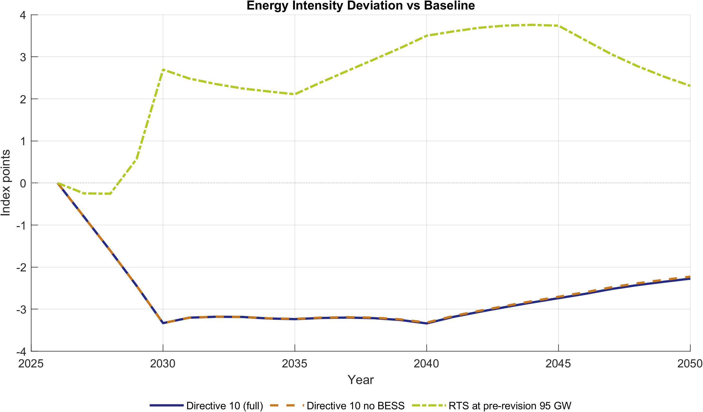

Figure 6.1. Energy-intensity deviation of EE scenarios from the Baseline.

Note: Values are index-point deviations from the Baseline energy-intensity
index (base year 2026). Negative values indicate improved energy efficiency
relative to Baseline.

Source: Generated by `scripts/reporting/generate_ee_simulation_results_figures.m`
from scenario output CSV files in `ExcelFiles/Output/`.

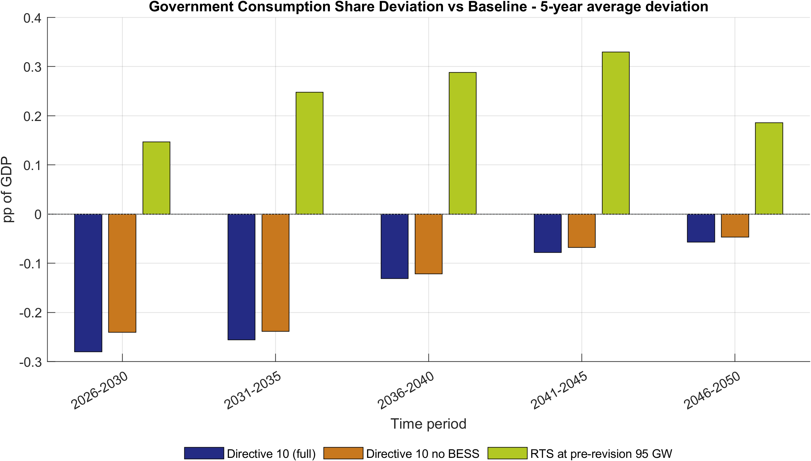

Figure 6.2. Government consumption share deviation versus Baseline (5-year average bar chart).

Note: Bars report average deviation in government consumption share of GDP
(`pp of GDP`) by 5-year block, showing persistent fiscal-demand composition
differences relative to Baseline.

Source: Generated by `scripts/reporting/generate_ee_simulation_results_figures.m`
from scenario output CSV files in `ExcelFiles/Output/`.

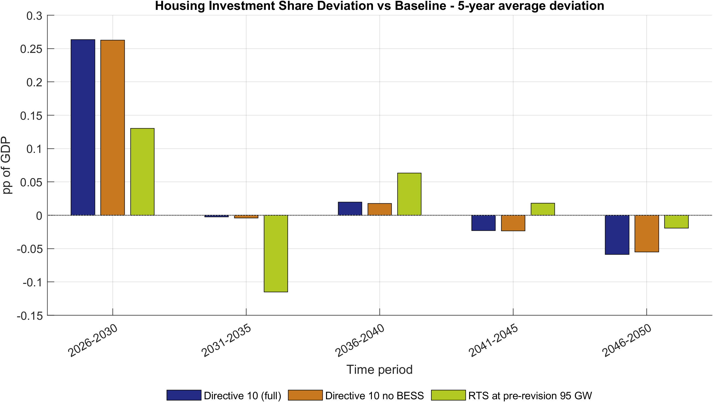

Figure 6.3. Housing investment share deviation versus Baseline (5-year average bar chart).

Note: Bars report average deviation in housing investment share of GDP (`pp of GDP`) by 5-year block, highlighting medium-term allocation differences versus
Baseline.

Source: Generated by `scripts/reporting/generate_ee_simulation_results_figures.m`
from scenario output CSV files in `ExcelFiles/Output/`.

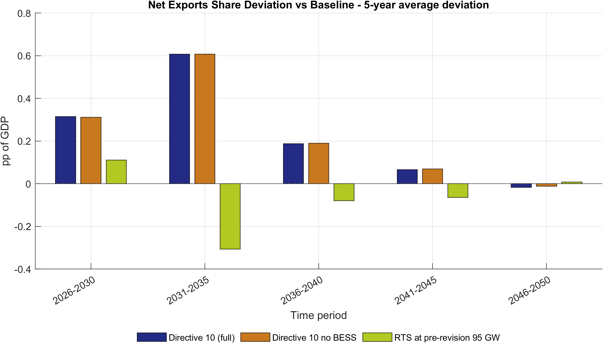

Figure 6.4. Net exports share deviation versus Baseline (5-year average bar chart).

Note: Bars report average net-exports-share deviation (`pp of GDP`) by 5-year
block, summarizing sustained external-balance differences under each EE
scenario.

Source: Generated by `scripts/reporting/generate_ee_simulation_results_figures.m`
from scenario output CSV files in `ExcelFiles/Output/`.

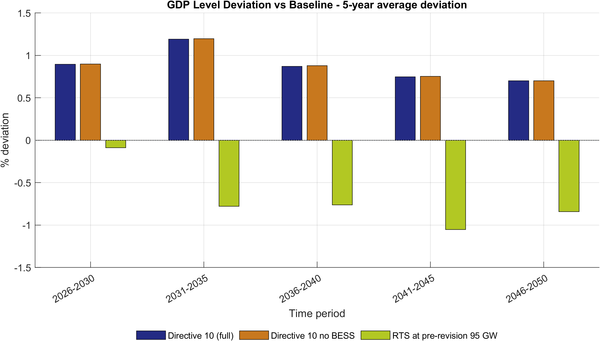

Figure 6.5. GDP level deviation versus Baseline across EE scenarios (5-year average bar chart).

Note: Bars show average GDP-level deviation (percent) from Baseline by
5-year block, highlighting medium-run macro effects of each EE pathway.

Source: Generated by `scripts/reporting/generate_ee_simulation_results_figures.m`
from scenario output CSV files in `ExcelFiles/Output/`.

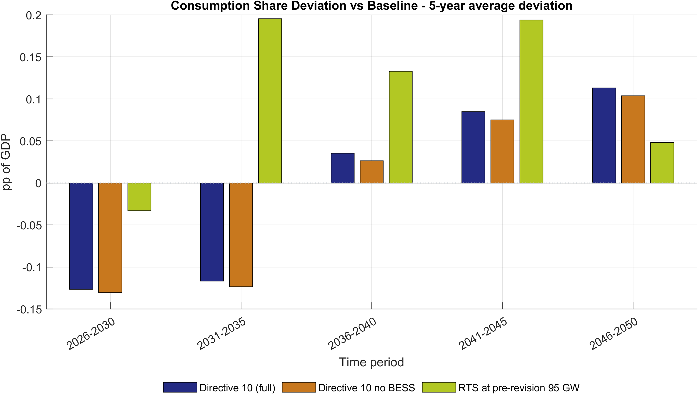

Figure 6.6. Consumption share deviation versus Baseline across EE scenarios (5-year average bar chart).

Note: Bars report average deviation in consumption share of GDP (`pp of GDP`)
for each 5-year block, allowing direct comparison of household-demand
reallocation under alternative EE scenarios.

Source: Generated by `scripts/reporting/generate_ee_simulation_results_figures.m`
from scenario output CSV files in `ExcelFiles/Output/`.

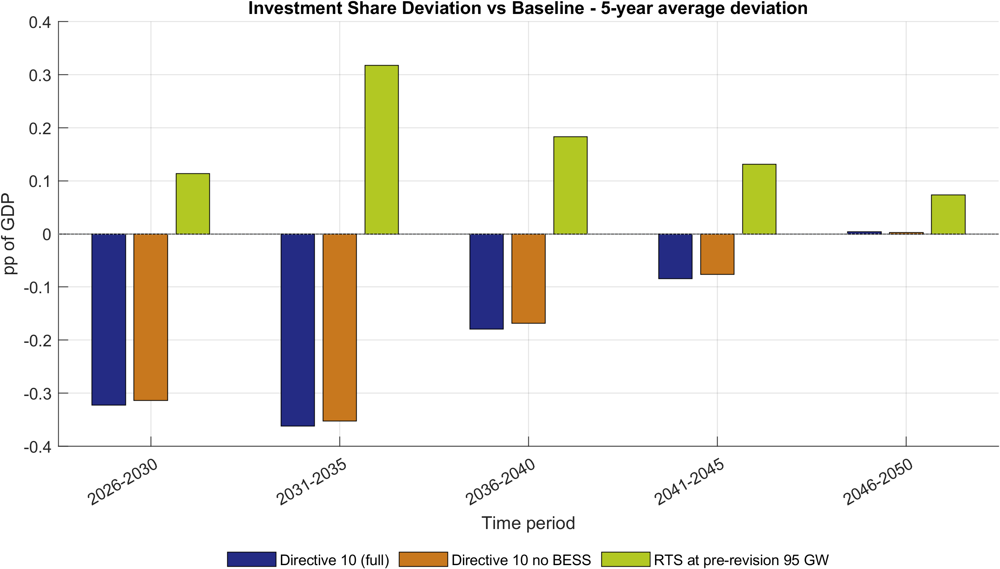

Figure 6.7. Investment share deviation versus Baseline across EE scenarios (5-year average bar chart).

Note: Bars report average deviation in investment share of GDP (`pp of GDP`)
by 5-year block and summarize the medium-term capital-allocation response in
each EE pathway.

Source: Generated by `scripts/reporting/generate_ee_simulation_results_figures.m`
from scenario output CSV files in `ExcelFiles/Output/`.

### 6.6 Green finance scenario reporting figures

The script `scripts/reporting/generate_finance_simulation_results_figures.m`
exports scenario-comparison figures to
`docs/figures/Finance_Simulation_Results/`. This subsection reports only
deviation-versus-Baseline diagnostics, using 5-year average bar charts.

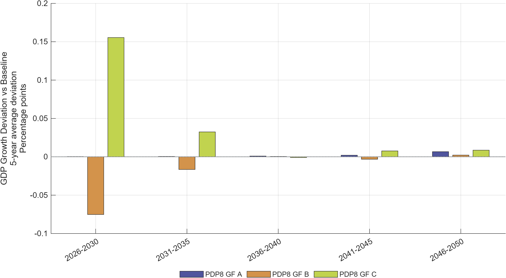

Figure 6.8. GDP growth deviation versus Baseline across green-finance scenarios (5-year average bar chart).

Note: Bars show the average deviation in annual GDP growth (percentage points)
from Baseline by 5-year block, comparing how financing architectures alter the
medium-run growth profile.

Source: Generated by `scripts/reporting/generate_finance_simulation_results_figures.m`
from scenario output CSV files in `ExcelFiles/Output/`.

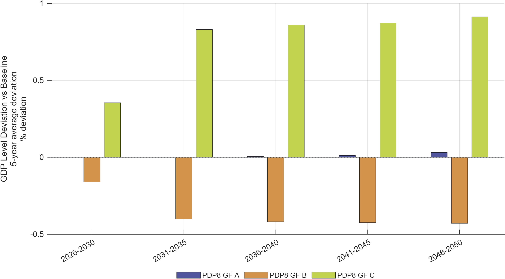

Figure 6.9. GDP level deviation versus Baseline across green-finance scenarios (5-year average bar chart).

Note: Bars show average percent deviations of GDP level from Baseline by
5-year block and capture cumulative macro effects of financing conditions.

Source: Generated by `scripts/reporting/generate_finance_simulation_results_figures.m`
from scenario output CSV files in `ExcelFiles/Output/`.

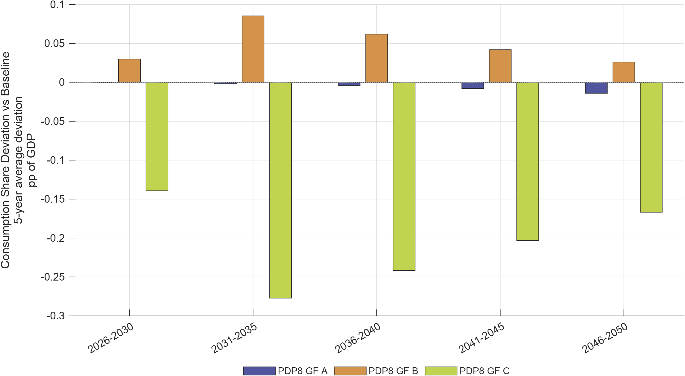

Figure 6.10. Consumption share deviation versus Baseline across green-finance scenarios (5-year average bar chart).

Note: Bars report average deviation in private-consumption share of GDP (`pp of GDP`) by 5-year block.

Source: Generated by `scripts/reporting/generate_finance_simulation_results_figures.m`
from scenario output CSV files in `ExcelFiles/Output/`.

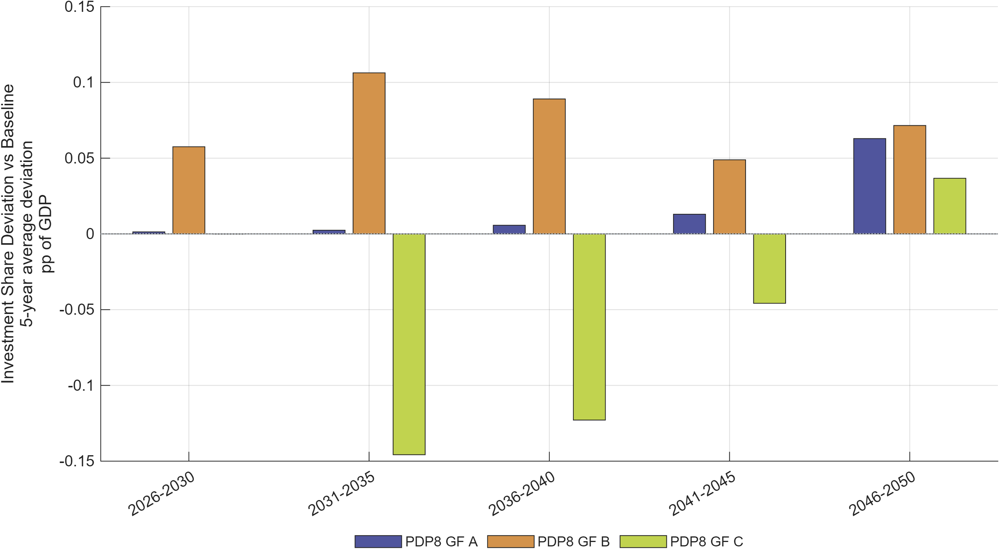

Figure 6.11. Investment share deviation versus Baseline across green-finance scenarios (5-year average bar chart).

Note: Bars report average deviation in investment share of GDP (`pp of GDP`)
by 5-year block, indicating medium-run capital-allocation shifts.

Source: Generated by `scripts/reporting/generate_finance_simulation_results_figures.m`
from scenario output CSV files in `ExcelFiles/Output/`.

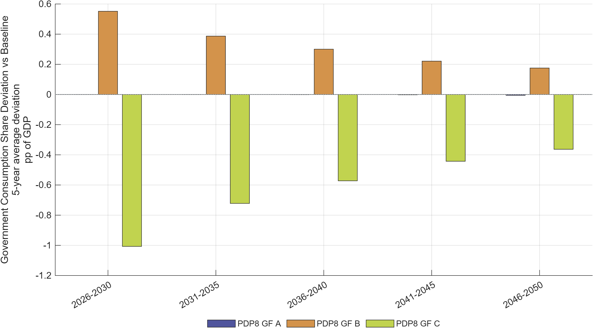

Figure 6.12. Government consumption share deviation versus Baseline across green-finance scenarios (5-year average bar chart).

Note: Bars report average deviation in government consumption share of GDP
(`pp of GDP`) by 5-year block.

Source: Generated by `scripts/reporting/generate_finance_simulation_results_figures.m`
from scenario output CSV files in `ExcelFiles/Output/`.

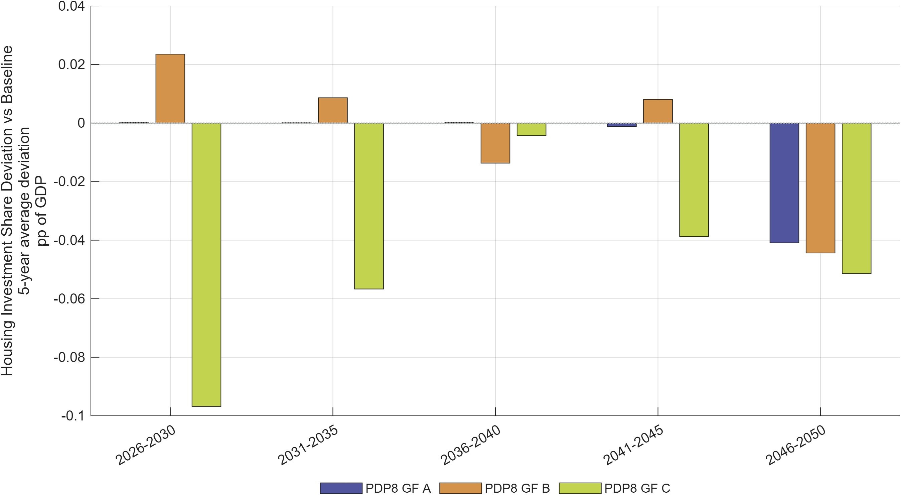

Figure 6.13. Housing investment share deviation versus Baseline across green-finance scenarios (5-year average bar chart).

Note: Bars report average deviation in housing investment share of GDP (`pp of GDP`) by 5-year block.

Source: Generated by `scripts/reporting/generate_finance_simulation_results_figures.m`
from scenario output CSV files in `ExcelFiles/Output/`.

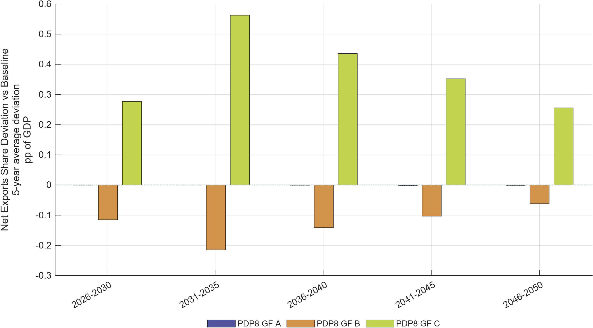

Figure 6.14. Net exports share deviation versus Baseline across green-finance scenarios (5-year average bar chart).

Note: Bars report average deviation in net exports share of GDP (`pp of GDP`)
by 5-year block, summarizing external-balance effects.

Source: Generated by `scripts/reporting/generate_finance_simulation_results_figures.m`
from scenario output CSV files in `ExcelFiles/Output/`.

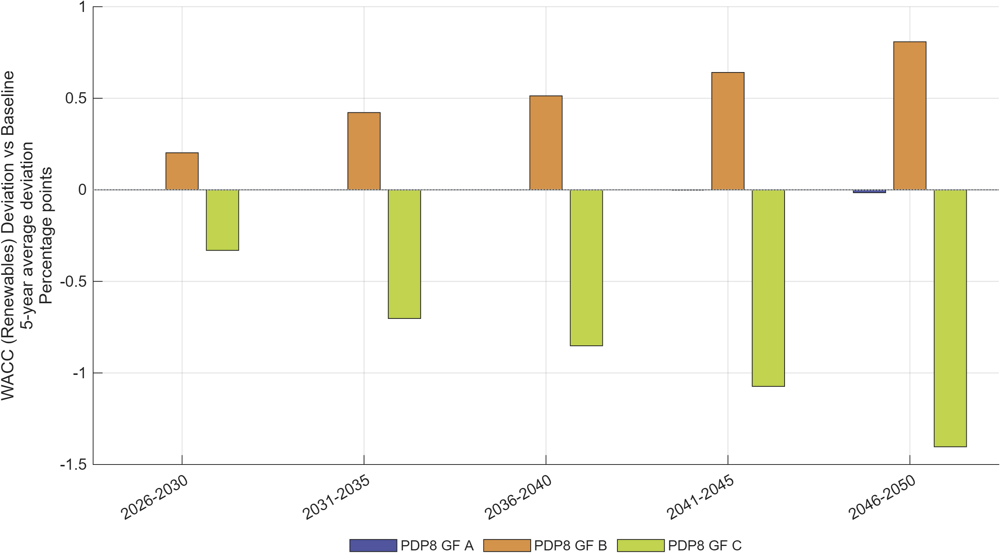

Figure 6.15. Renewable-energy WACC deviation versus Baseline across green-finance scenarios (5-year average bar chart).

Note: Bars report average deviations in renewable weighted average cost of
capital (percentage points) from Baseline by 5-year block, summarizing the
financial-channel intensity of each policy package.

Source: Generated by `scripts/reporting/generate_finance_simulation_results_figures.m`
from scenario output CSV files in `ExcelFiles/Output/`.

---

## 6. Limitations, Implementation Risks, and Interpretation Guidance

This section summarizes recurrent implementation risks and interpretation
constraints that have caused incorrect results or wasted debugging time in
practice. It should be treated as a pre-publication quality-control checklist.

1. **`fval_vec_11` is load-bearing.** Never remove it from
   `evaluate_capital_steady_state_residuals.m` (§5.2). Deleting it makes the
   hybrid steady state underdetermined.
2. **Energy-efficiency variable shape.** Two shapes exist in this
   codebase's history — legacy regional `EE_1`/`exo_EE_1` and a
   sector-specific refactor `EE_sec_reg`/`exo_EE_sec_reg`. As of this
   writing, **only the legacy regional shape is declared in `ModFiles/`.**
   Confirm with `git grep -n "EE_.*_1"` in `ModFiles/` before writing code
   that assumes either shape.
3. **Perfect-foresight singularity under direct capital targeting.**
   Pinning total sector capital $K_t$ directly via a Dynare equation while
   the household Euler equation for $I_{H,t}$ remains active produces a
   rank-deficient Jacobian (the Euler equation loses its degree of freedom
   once $K_t = K_{H,t}+K_{G,t}+K_{FDI,t}$ is fixed and $K_{G,t}$ is
   predetermined). The working pattern is to pin the *flow* (insert a wedge
   into the Euler equation via `exo_lTargetInv`/`wedgeKE`) and let the stock
   follow from the law of motion, not to pin the stock directly. See
   [implementation_plans/capital_targeting_trial_and_error.md](../implementation_plans/capital_targeting_trial_and_error.md).
4. **Code defaults vs. active calibration can diverge by orders of
   magnitude** (§4.4) — always confirm the workbook actually loaded for a
   given run before citing a structural parameter value.
5. **Generated code is not source.** `+DGE_Model/`, `DGE_Model/`,
   `*_dynamic.m`, `*_static.m` are rebuilt by Dynare on every invocation.
   Never hand-edit them; the fix belongs in the `.mod` source.
6. **Scenario "existing" ≠ scenario "running by default"** (§6.4). Many
   scenario names in `RunSimulations.m` are commented out or excluded from
   `activeScenarioGroups`; check before assuming a cited figure is
   reproducible from a plain `RunSimulations` call.
7. **What the model does not do** (§2.2): no plant-level dispatch, no
   endogenous technology learning curves, no sub-national regions, no
   explicit financial-instrument balance sheets.
8. **The exchange-rate variable `s_reg` is a closure device, not a full
   UIP nominal exchange rate** (§3.7) — do not interpret its dynamics as a
   conventional exchange-rate block.

---

## 7. Conclusion

The ...
---

## References

- CITATION.cff (this repository) — canonical citation for the model:
  Schult, C. (2026). *DGE-METRIC: Dynamic General Equilibrium for
  Macroeconomic Energy Transition Incorporating Carbon Markets*. Halle
  Institute for Economic Research (IWH).
  https://github.com/schultkr/DGE-METRIC
- Schult, C. et al. (2025). *Investment Needs Assessment for Vietnam's
  Energy Transition*. IWH Policy Note. GIZ project "Support for Carbon
  Pricing and Green Finance in Vietnam."
- Schult, C. et al. (2025). *Financial Assessment Report: Green Finance
  Instruments for Vietnam's PDP8*. IWH Policy Note. GIZ project "Support for
  Carbon Pricing and Green Finance in Vietnam."
- Vietnam Government, Decision 500/QD-TTg (2023). *Power Development Plan 8
  (PDP8)*.
- General Statistics Office of Vietnam (NSO). *Input-Output Table 2019*.
- IEA. *World Energy Outlook 2025*.
- EDGAR (EU Joint Research Centre). *Global GHG Emissions Database*, 2024
  release.
- EXIOBASE 3. *Environmentally extended multi-region input-output database*.
- Schultz, T.W. (1961). "Investment in Human Capital." *American Economic
  Review*; related labor-productivity treatment cross-referenced via NBER
  working paper 21381.
- Christiano, Motto, and Rostagno (2014); Leeper (2010); Kliem (2014);
  Drygalla et al. (2020) — reduced-form fiscal-policy modeling conventions
  followed in the government block (§3.5).

---

## A. Technical Appendix

### A.1 Equation reference

Full equation listings, by block, are maintained in
`ModFiles/Equations/*.mod` with a parallel human-readable mirror in
`ModFiles/Equations/Equations_display/`. The primary equation-set narrative
is in [model.md](../reference/model.md); this report's §3 summarizes the theoretical
structure without reproducing every first-order condition.

### A.2 Parameter reference

The full parameter-by-parameter calibration source audit — including
flags for stale or uncertain values — is maintained in
[structural_parameters_source_audit.md](../reference/structural_parameters_source_audit.md).
The code-default-vs-active-workbook override table is in
[calibration_model_detailed.md §12](../reference/calibration_model_detailed.md).

### A.3 Repository map

| Folder / File                   | Contents                                                                          |
| ------------------------------- | --------------------------------------------------------------------------------- |
| `DGE_Model.mod`               | Canonical Dynare model entry point                                                |
| `ModFiles/`                   | Hand-maintained Dynare model components                                           |
| `Functions/`                  | MATLAB source: calibration, steady state, simulation, Excel I/O, diagnostics      |
| `ExcelFiles/`                 | Baseline, calibration, and scenario workbooks                                     |
| `scripts/`                    | Operational scripts:`analysis/`, `reporting/`, `maintenance/`               |
| `docs/`                       | Documentation (this report, the impact assessment, and technical reference pages) |
| `Figures/`, `docs/figures/` | Exported figure sets                                                              |
