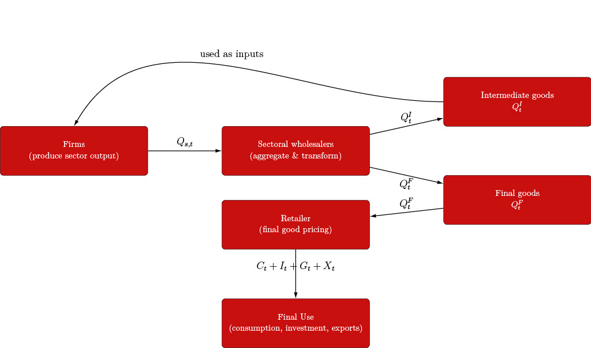
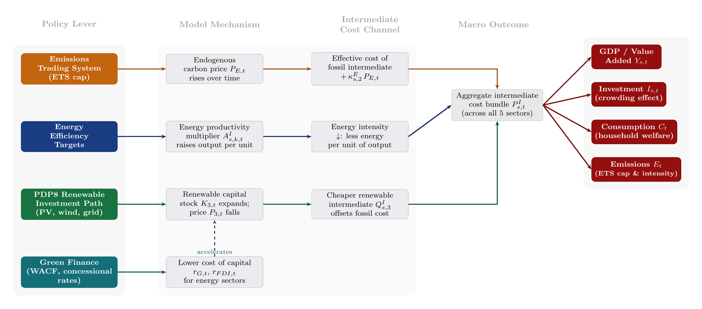
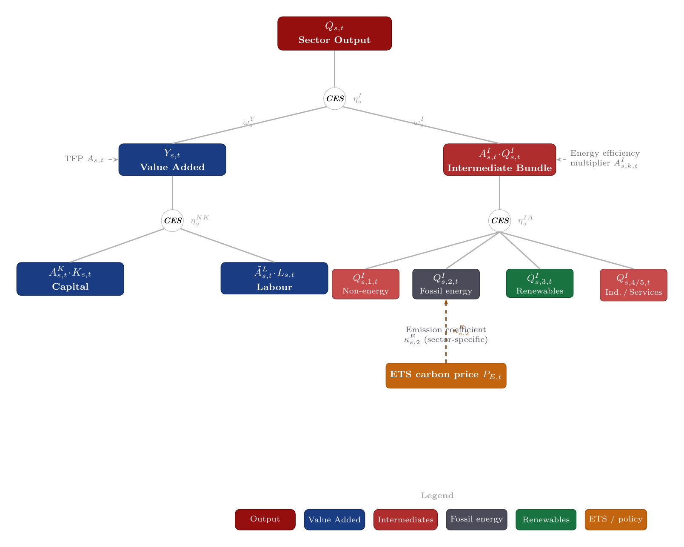
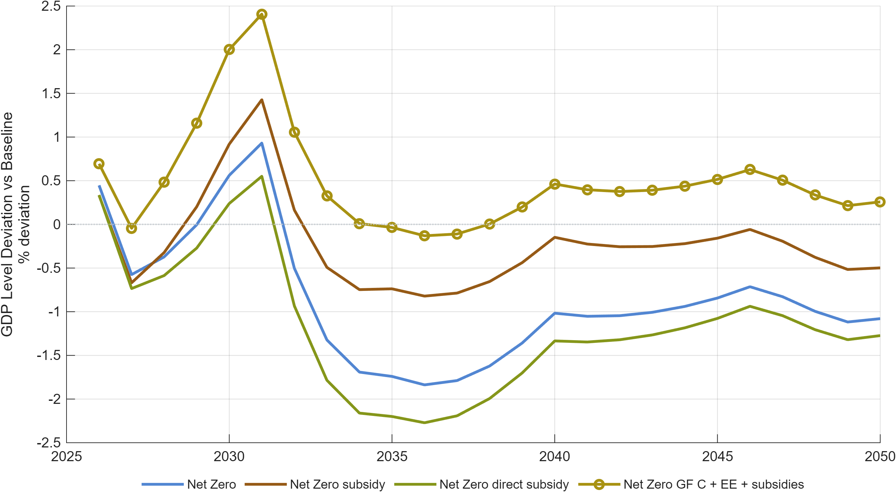
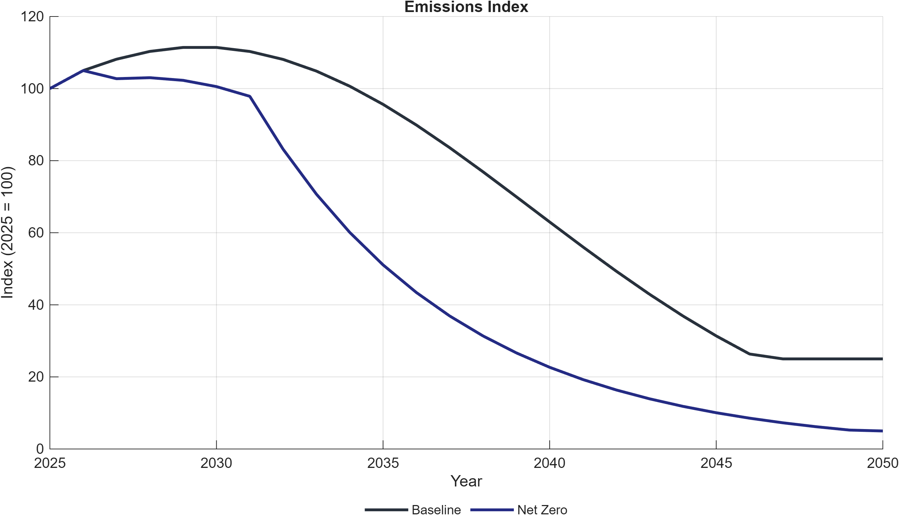

# DGE-METRIC: A Dynamic General Equilibrium Model for Vietnam's Energy Transition

## Complete Technical Report — Ideal Edition

*Prepared under the joint GIZ–IWH research project supporting Vietnam's energy and climate policy dialogue.*

> **What this document is.** This is a single, self-contained "gold standard"
> technical report for DGE-METRIC: it merges the methodological content of
> [TECHNICAL_REPORT.md](TECHNICAL_REPORT.md) with the quantified findings of
> [PDP8_IMPACT_ASSESSMENT.md](PDP8_IMPACT_ASSESSMENT.md) into the full
> publication structure recommended by
> `docs/reports/dge-technical-reporter/references/report-blueprint.md`
> (front matter → model → data/calibration → scenarios → results →
> sensitivity → limitations → implications → conclusions → references →
> appendices). It exists to show, in one place, what a *complete* reader
> experience looks like for this model, and — inline, plus in a dedicated
> §14 — to flag every figure and table a top-tier reader would expect that
> the repository does not yet produce in a form ready to cite. It is a
> **planning/target document**, not a replacement for the two existing
> reports: every number in it is traced to `TECHNICAL_REPORT.md`,
> `PDP8_IMPACT_ASSESSMENT.md`, or another named repository file, and every
> gap is labeled as a gap rather than filled with an invented figure.

> **Reading key.** Three inline markers are used throughout:
> ✅ *already produced by the repository* (figure/table exists, just not
> previously assembled in one document); 🆕 *newly assembled by this report
> from existing repository data* (e.g. a table built by combining two other
> tables — no new numbers, just new organization); 🚧 **[RECOMMENDED
> ADDITION]** *does not exist in the repository in citable form* — described
> so a future revision can build it.

**Report status:** Planning/target document, not a scenario-run output.
**Repository commit at time of writing:** `13a5c9a` (2026-07-20) plus the
uncommitted `TECHNICAL_REPORT.md` edits reviewed the same session — reconfirm
with `git log -1` before treating any cited figure as current.

---

## Abstract

DGE-METRIC is a five-subsector, one-region dynamic general equilibrium (DGE)
model, built in Dynare and MATLAB, calibrated to Vietnam's 2019 input-output
structure and a 2026 baseline, and solved as a deterministic
(perfect-foresight) transition path over 2026–2050. Developed under a joint
GIZ–IWH research project, it quantifies the economy-wide costs and
trade-offs of alternative pathways for meeting Vietnam's Power Development
Plan 8 (PDP8) and its net-zero-by-2050 commitment. The model embeds
households, five production subsectors linked by an explicit input-output
structure, a wholesale/retail/export trade chain, a government operating an
emissions trading system (ETS), and a rest-of-the-world sector. It is used
to assess three policy levers — energy efficiency ambition, the architecture
of green finance, and a binding net-zero carbon cap — each represented as a
family of scenario shocks applied to a common calibrated baseline. Headline
findings: energy efficiency raises GDP throughout 2026–2050 at low
incremental cost but does not by itself reduce emissions; shifting green
finance from market-led to public-led terms saves an estimated USD 3
billion/year in financing costs and compounds into a persistent growth
premium that is larger under net-zero ambition than under PDP8 alone; and a
binding net-zero emissions cap imposes a modest but persistent GDP cost
relative to PDP8, most of which is avoidable if fuel-switching and
efficiency channels remain available. This report documents the model's
theoretical structure, calibration workflow, solution method, full scenario
inventory (including sensitivity and stress-test variants not previously
assembled in one place), and known limitations, and consolidates — for the
first time in one document — model-structure diagrams, a scenario matrix,
a condensed parameter table, and decomposition figures that exist in the
repository but were not previously cited together. It also lists, as an
explicit punch list, the figures, tables, and metrics (a welfare measure, a
full five-sector capital/labor reallocation figure, a formal convergence
table, a cost-per-tonne abatement metric) that a top-tier technical report
would need and that the repository does not yet produce.

**Keywords:** dynamic general equilibrium; energy transition; Vietnam; PDP8;
carbon market; green finance; Dynare; macroeconomics; climate policy.
*(Reproduced from `CITATION.cff`; no formal JEL/classification codes are
assigned anywhere in the repository — 🚧 recommended addition, §14.)*

---

## Table of Contents

- [Abstract](#abstract)
1. [Executive Summary](#1-executive-summary)
2. [Introduction and Policy Context](#2-introduction-and-policy-context)
3. [Model Overview](#3-model-overview)
4. [Mathematical Specification](#4-mathematical-specification)
5. [Data, Calibration, and Baseline](#5-data-calibration-and-baseline)
6. [Solution Method](#6-solution-method)
7. [Scenario and Simulation Strategy](#7-scenario-and-simulation-strategy)
8. [Results](#8-results)
9. [Sensitivity, Uncertainty, and Robustness](#9-sensitivity-uncertainty-and-robustness)
10. [Limitations](#10-limitations)
11. [Implications](#11-implications)
12. [Conclusions](#12-conclusions)
13. [References](#13-references)
14. [Recommended Figures and Tables Not Yet in the Repository](#14-recommended-figures-and-tables-not-yet-in-the-repository)
15. [Technical Appendix](#15-technical-appendix)

---

## 1. Executive Summary

**Problem and decision context.** Vietnam must mobilize large-scale
energy-sector investment through 2050 to meet PDP8 targets and its
net-zero-by-2050 commitment while sustaining 6–7% annual GDP growth
(`TECHNICAL_REPORT.md` §2.1). Project-level engineering models cannot answer
the economy-wide questions this raises: what does the transition cost in
GDP and consumption terms, does a binding carbon cap add material cost on
top of PDP8, does energy efficiency pay for itself, and does the *financing
architecture* — who lends, at what rate — matter for the macro path
(`TECHNICAL_REPORT.md` §2.1).

**Model and evidence base.** DGE-METRIC is a five-subsector, one-region
perfect-foresight DGE model calibrated to Vietnam's 2019 input-output
structure, solved in Dynare/MATLAB over 2026–2050 (`TECHNICAL_REPORT.md`
§1, §3). Calibration draws on GSO, EVN, IEA, EDGAR, World Bank, EXIOBASE,
and IWH/GIZ project data (`TECHNICAL_REPORT.md` §4.1).

**Scenario design.** Three policy-instrument families are layered on a PDP8
baseline as a nested counterfactual: Net-Zero (binding ETS cap, with
fuel-switching/efficiency decomposition variants), Energy Efficiency
(`EE_PDP8`, `EE_Directive10`, and BESS-removed counterfactuals), and Green
Finance (three financing architectures, `GF_A`/`GF_B`/`GF_C`, each run
against both PDP8 and Net-Zero) (`TECHNICAL_REPORT.md` §6;
`PDP8_IMPACT_ASSESSMENT.md` §3). A fourth, `NZ_Sensitivity`, decomposition
group and a one-off `ImportShock` stress-test scenario also exist in code
but are not part of the three headline families (§7, §9 below).

**Quantified findings (2026–2050 horizon, all relative to the PDP8
Baseline unless stated; source: `PDP8_IMPACT_ASSESSMENT.md` §3–§4):**

1. **Energy efficiency is GDP-positive at low cost.** Both `EE_PDP8` and the
   more ambitious `EE_Directive10` raise GDP levels throughout 2026–2050.
   Directive-10 ambition delivers roughly **0.44–0.58 percentage points**
   higher GDP level than `EE_PDP8` across 2030–2050, for an incremental
   investment cost of **USD 100–150 million/year** on top of `EE_PDP8`'s own
   ≈USD 361 million/year (≈0.076% of GDP).
2. **Energy efficiency alone does not reduce emissions.** Emissions are
   identical across all EE variants under the PDP8 baseline (no binding
   cap); the emissions benefit of efficiency only materializes when combined
   with the Net-Zero carbon constraint.
3. **BESS's macro footprint is negligible; its case is technical.** Removing
   the battery-storage contribution changes aggregate GDP by at most
   **0.013 percentage points by 2050** — BESS should be justified on grid
   reliability grounds, not GDP grounds.
4. **Cheaper capital delivers a compounding growth dividend.** The
   public-led (`GF_C`, 5.07% WACF) vs. market-led (`GF_B`, 7.37% WACF)
   comparison — a ≈2 percentage-point WACF spread — translates into
   approximately **USD 3 billion/year** in avoided financing costs at the
   ≈USD 136 billion investment scale, compounding into a persistent GDP
   growth premium.
5. **Concessional finance and carbon pricing are complements.** The same
   WACF reduction produces a *larger* absolute GDP effect when run against
   the Net-Zero baseline than against PDP8 alone, because investment
   requirements and the cost-of-capital margin are both larger under
   Net-Zero.
6. **A binding net-zero cap imposes a modest but persistent GDP cost**
   relative to PDP8 — the price of accelerated fossil phase-out via a carbon
   market. Decomposition scenarios (`NZ_constInt`, `NZ_constEEInt`) show a
   meaningful share of this cost is avoided when fuel-switching and
   efficiency channels remain available; the cost and required carbon price
   rise substantially in the constrained ("no fuel-switching, no
   efficiency") variant, an upper bound under limited technological
   learning.
7. **The fossil sector bears the largest structural adjustment** across all
   Net-Zero variants as capital and labor reallocate toward renewables and
   non-energy sectors (`PDP8_IMPACT_ASSESSMENT.md` §4) — see §8.3 below for
   the closest available sectoral evidence (a value-added decomposition, not
   a capital/labor-unit reallocation figure — 🚧 §14).

**Main mechanisms.** All three instruments operate through the same
general-equilibrium channel structure — see the model-transmission diagram
in §3.3 (✅ existing repository asset, not previously embedded in either
report): policy levers change either the energy productivity term
$A^I_{s,k,t}$ (efficiency), the fossil emission intensity/carbon price
$\kappa^E_{s,t}$/$P_{E,t}$ (Net-Zero), or the cost-of-capital terms
$r_{G,t}$/$r_{FDI,t}$ and the effective investment price $P^K_{s,t}$ (green
finance); these feed into firms' cost structure, household income and
consumption/investment choices, and the government budget, producing the
aggregate paths reported in §8.

**Robustness and uncertainty.** The repository's only two forms of stored
sensitivity evidence are the NZ fuel-switching/efficiency decomposition
(§7, §9) and the documented order-of-magnitude divergence between the
`phiB_p`/`phiadjB_p` code defaults and the active calibration workbook
(`TECHNICAL_REPORT.md` §4.4). No systematic parameter-sweep or Monte Carlo
sensitivity analysis exists (🚧 §14).

**Implications and interpretation boundaries.** Green-finance results are
an upper bound on what a financing architecture achieves *if fully deployed
at the assumed cost* — institutional feasibility of reaching that WACF at
scale is outside the model (`TECHNICAL_REPORT.md` §6.3). Reproducing any
specific figure requires the exact `activeScenarioGroups`/workbook
configuration used to generate it (§7.4, §9). The model has no welfare
metric, no full five-sector capital/labor reallocation figure, and no
cost-per-tonne abatement metric (🚧 §14) — all three would materially
strengthen the report's ability to communicate distributional and
cost-effectiveness results to a policy audience.

---

## 2. Introduction and Policy Context

*(Content identical in substance to `TECHNICAL_REPORT.md` §2 and
`PDP8_IMPACT_ASSESSMENT.md` §2, merged here; see those files for the full
prose. Reproduced in condensed form so this document is self-contained.)*

Vietnam must mobilize large-scale energy-sector investment through 2050 to
meet PDP8 (Decision 500/QD-TTg, 2023) and its net-zero-by-2050 commitment
(COP26 NDC), including a 60% renewable electricity share by 2030 and no new
coal capacity after 2030, while sustaining 6–7% annual GDP growth. The IWH
Investment Needs Assessment (2025) and IWH Financial Assessment (2025)
identify both the investment scale and a pre-2035 financing bottleneck
driven by high market borrowing costs (8–10% for private energy projects)
and a limited domestic institutional investor base
(`PDP8_IMPACT_ASSESSMENT.md` §2). Vietnam is also building a domestic ETS,
piloted first in the power sector, whose coverage rate, cap trajectory, and
revenue recycling design determine both the carbon-price path and its
distributional consequences.

DGE-METRIC was built to embed this transition inside a full economy, where
investment in one sector competes for resources with consumption and
investment elsewhere, factor prices adjust, trade responds, and households
and firms are forward-looking. It is a **reduced-form macroeconomic model**,
not an energy-system planning model: it does not schedule individual power
plants, model technology learning curves endogenously, represent
sub-national regions, or track individual financial instruments as explicit
balance-sheet items (`TECHNICAL_REPORT.md` §2.2).

---

## 3. Model Overview

### 3.1 Verbal summary

DGE-METRIC is a five-sector, one-region dynamic general equilibrium model
solved as a 25-year (2026–2050) deterministic perfect-foresight transition
path. The economy consists of households, firms (5 sectors), a wholesale
sector, a retail sector, an exporter, a government with an ETS, and the rest
of the world, interacting through markets for goods, labor, capital,
emissions permits, and international trade (`TECHNICAL_REPORT.md` §3).

| # | Label | Economic role |
|---|---|---|
| 1 | Non-energy aggregate | General production; residual macro sector |
| 2 | Fossil energy | Coal, gas, oil generation; declining under Net-Zero |
| 3 | Renewable energy | Solar, wind, hydro, storage; expanding under all transition scenarios |
| 4 | Industry | Manufacturing; major energy user, energy-efficiency target sector |
| 5 | Services | Commercial and public services; secondary energy user |

*Table 3.1. Sector definitions. Source: `TECHNICAL_REPORT.md` §3.1.*

### 3.2 Model-structure diagram ✅

> The overall agent/market diagram and the input-output structure diagram
> already exist in the repository (`docs/figures/ModelDiagram.jpg`,
> `docs/figures/IOStructure.jpg`) and are embedded in `docs/model.md` but
> were **not previously cited in either technical report** — a genuine,
> now-closed gap.


Figure 3.1. DGE-METRIC agent and market structure: households, five-sector
firms, wholesale/retail/export trade chain, government with an ETS, and the
rest of the world, connected through goods, labor, capital, permit, and
trade markets.

Source: `docs/figures/ModelDiagram.jpg`, embedded in `docs/model.md` line 78.



Figure 3.2. Input-output linkages across the five model sectors.

Source: `docs/figures/IOStructure.jpg`, embedded in `docs/model.md` line 159.

### 3.3 Policy-to-GDP transmission diagram ✅



Figure 3.3. The four policy levers modeled (ETS cap, energy-efficiency
targets, PDP8 renewable investment path, green finance) and the mechanism,
cost channel, and macro outcome each maps to: ETS → carbon price
$P_{E,t}$ → fossil intermediate cost; efficiency targets → energy
productivity $A^I_{s,k,t}$ → lower energy intensity; renewable investment →
capital stock/price $K_{3,t}$/$P_{3,t}$ → cheaper renewable intermediates;
green finance → lower $r_{G,t}$/$r_{FDI,t}$ → accelerated renewable capital
formation. All three cost channels feed an aggregate intermediate-cost
bundle $P^I_{s,t}$ that determines GDP/value added, investment, consumption,
and emissions outcomes.

Source: `docs/figures/model_diagrams/energy_gdp_channels.tex` (TikZ,
compiled via the `Makefile` in `docs/figures/model_diagrams/`), embedded in
`docs/model.md` line 84.

### 3.4 Nested production structure ✅



Figure 3.4. Nested CES production tree: sector output $Q_{s,t}$ splits into
value added $Y_{s,t}$ (capital/labor CES nest) and an intermediate bundle
$A^I_{s,t}Q^I_{s,t}$ (a 4-way CES/Leontief split across non-energy, fossil,
renewable, and industry/services origins), with the ETS carbon price
$P_{E,t}$ attached to the fossil-energy leaf via the emission coefficient
$\kappa^E_{s,2}$.

Source: `docs/figures/model_diagrams/production_structure.tex`, embedded in
`docs/model.md` line 172.

### 3.5 Key extensions beyond a textbook DGE model

| Feature | What it adds | Key variables |
|---|---|---|
| Input-output structure | Sectors buy intermediate goods from each other | $Q^I_{s,k}$ |
| Energy as intermediate input | Energy demand derived from production decisions | $Q_{A,s,1}$, $Q_{PV,1}$ |
| Emission coefficients | Each fossil fuel unit generates CO₂ | $\kappa^E_s$ |
| Emissions trading system | Carbon permit market, endogenous price | $E^{ETS}_1$, $P^E$, $\xi_s$ |
| Energy efficiency shocks | Reduces energy per unit of output over time | `exo_AI_s` |
| Renewable capital accumulation | PV and grid investment paths | `exo_PVEff_1`, `exo_GA_s` |
| Climate damages | Temperature shocks reduce capital and housing | $D^K_{s,t}$, $D^H_t$ |
| Green finance channels | Lower cost of capital for energy investment | `exo_r_G_s`, `exo_r_FDI_s`, `exo_P_K_s` |
| Housing as durable capital | Household wealth and climate exposure | $H_{t+1}$, $I^H_t$ |

*Table 3.2. Source: `TECHNICAL_REPORT.md` §3.6.*

---

## 4. Mathematical Specification

*(Full prose in `TECHNICAL_REPORT.md` §3.2–§3.7; reproduced and
supplemented here with a consolidated notation table.)*

### 4.1 Households

$$
U(C_t, H_{t+1}, N_{s,t})
= \frac{\left(C_t^{1-\gamma} H_{t+1}^{\gamma} \right)^{1-\sigma^C}}{1-\sigma^C}
- \sum_{s=1}^{S} A^L_{s,t} \, \phi^L_s \, \frac{N_{s,t}^{1+\sigma^{L}}}{1+\sigma^{L}}
$$

subject to a budget constraint, sector-specific capital accumulation
$K_{s,t+1} = (1-\delta)K_{s,t} + I_{s,t}\Gamma_{s,t} - D^K_{s,t}$, and housing
accumulation $H_{t+1} = (1-\delta^H)H_t + I^H_t - D^H_t$.

### 4.2 Firms

$$
\max\; P^Q_{s,t}(1-\kappa^E_{s,t}P_{E,t})\,Q_{s,t} - \tilde W_{s,t}L_{s,t}
- P^K_{s,t}K_{s,t} - \sum_{k=1}^{S} P^D_{k,t}Q^I_{s,k,t}
$$

### 4.3 Government and ETS

$$
R^{ETS}_t = P^E_t \sum_s E_{s,t} = P^E_t \sum_s \kappa^E_{s,t}Q_{s,t}
$$

Tax rates on consumption, labor, and capital income are fixed; government
expenditure is pinned down by the budget constraint. Because tax rates are
fixed, any change in government revenue from climate policy flows entirely
through the tax base and ETS revenue, not through an endogenous rate
response.

### 4.4 External sector

Net foreign assets follow a law of motion linked to the trade balance; the
external finance premium is debt-elastic,
$\exp(-\phi_B \cdot \text{external\_position\_gap}/Y)$, with a quadratic
adjustment cost $\phi_{adjB}$. The exchange-rate variable $s_{reg}$ is not a
full UIP block: it follows an AR(1) process or becomes the external-balance
closure variable depending on `exo_lNXTarget` (`TECHNICAL_REPORT.md` §3.7).

### 4.5 Notation table 🆕

> No single symbol→definition→units table exists anywhere in `docs/` (the
> closest is a partial reserve-margin glossary in
> `docs/implementation_plans/energy_reserve_inputs.md`, which does not cover
> the core model). The table below is **assembled by this report** from the
> symbols already defined in `TECHNICAL_REPORT.md` §3 and `docs/model.md`;
> it introduces no new values, only consolidates existing definitions. A
> repository-native version of this table (e.g. `docs/notation.md`) is
> recommended — see §14.

| Symbol | Definition | Index | Source |
|---|---|---|---|
| $C_t$ | Aggregate household consumption | time | `TECHNICAL_REPORT.md` §3.2 |
| $H_{t+1}$ | Housing services (durable stock) | time | §3.2 |
| $N_{s,t}$ | Labor supplied to sector $s$ | sector, time | §3.2 |
| $\gamma$ | Preference weight on housing | — | §3.2 |
| $\sigma^C$ | Inverse intertemporal elasticity of substitution, consumption | — | §3.2 |
| $\sigma^L$ | Inverse Frisch elasticity of labor supply | — | §3.2 |
| $A^L_{s,t}$ | Sector-specific labor productivity (disutility scaling) | sector, time | §3.2 |
| $\phi^L_s$ | Calibrated labor-disutility weight | sector | §3.2 |
| $I_{s,t}$ | Sectoral investment | sector, time | §3.2 |
| $K_{s,t}$ | Sectoral capital stock | sector, time | §3.2 |
| $\delta$ | Capital depreciation rate | — | §3.2, `structural_parameters_source_audit.md` (`delta_p` = 0.05) |
| $D^K_{s,t}$, $D^H_t$ | Climate-damage terms on capital/housing | sector, time | §3.2 |
| $Q^I_{s,k,t}$ | Intermediate input from sector $k$ used by sector $s$ | sector pair, time | §3.3 |
| $L_{s,t}$ | Labor input (firm side) | sector, time | §3.3 |
| $\kappa^E_{s,t}$ | Sector emission intensity | sector, time | §3.3 |
| $\eta^Q_s$, $\eta^F$ | Domestic/import substitution elasticities | sector | §3.4 |
| $\omega^Q_s$, $\omega^M_s$ | Home-bias share parameters | sector | §3.4 |
| $\tau^C_t$ | Consumption tax rate | time | §3.5, `tauC_p` = 0.2 |
| $P^E_t$ | Endogenous ETS carbon/permit price | time | §3.5 |
| $\xi_s$ | ETS coverage rate by sector | sector | Table 3.2 |
| $\phi_B$, $\phi_{adjB}$ | External-finance-premium parameters | — | §3.7, §5.3 (`phiB_p`, `phiadjB_p` = 0.1 active vs. 10.0/1.0 code default) |
| $s_{reg}$ | External-balance closure/valuation variable | — | §3.7 |
| $\beta$ | Household discount factor | — | `structural_parameters_source_audit.md` (`beta_p` = 0.97) |
| $r_{G,t}$, $r_{FDI,t}$ | Public/concessional and FDI cost-of-capital rates | time | Table 6.2 below |
| $P^K_{s,t}$ | Effective price of new energy capital goods | sector, time | Table 6.2 |

*Table 4.1. Notation table (assembled from repository sources; see column
"Source"). 🆕*

---

## 5. Data, Calibration, and Baseline

### 5.1 Data sources

| Category | Primary source | Used for |
|---|---|---|
| Macroeconomic structure | GSO (Vietnam), OECD TiVA | IO table, sectoral value-added and employment shares |
| Energy production and capacity | EVN, IEA WEO | Baseline energy calibration, capacity targets |
| Energy investment costs | IEA WEO, IRENA | CAPEX paths, LCOE assumptions |
| Emissions | EDGAR, IEA | Baseline emissions levels and intensity |
| Trade and capital flows | World Bank, OECD | Import/export shares, FDI flows |
| Environmentally extended IO | EXIOBASE 3 | Cross-check of embodied emissions/energy coefficients |
| Climate variables | CMIP6 / SSP scenarios | Climate damage paths |
| Financial parameters | IWH Financial Assessment (2025), GIZ Green Finance workbook | Finance rates and WACF scenarios |

*Table 5.1. Source: `TECHNICAL_REPORT.md` §4.1.*

### 5.2 Calibration workflow

Three workbooks drive calibration: `ModelCalibration5Sectorsand1Regions.xlsx`
(inputs and named ranges), `ModelBaseline5Sectorsand1Regions.xlsx` (split
baseline path), and `ModelScenarios5Sectorsand1Regions.xlsx` (scenario
shocks). Calibration mixes four input types — observed/targeted baseline
shares, structural assumptions, initial levels/macro closures, and solved
residual parameters — and is run in three stages (`lCalibration_p` = 1, 0,
2) (`TECHNICAL_REPORT.md` §4.2).

**Critical invariant:** `fval_vec_11` in
`evaluate_capital_steady_state_residuals.m` must never be removed; it pins
$Q_{fossil} = Q_0 \cdot \exp(exo_{Q,fossil})$ in hybrid mode and is the
closing equation letting `EE_1`/`EE_sec_reg` float (`TECHNICAL_REPORT.md`
§5.2).

### 5.3 Key parameter reference 🆕

> `docs/structural_parameters_source_audit.md` is a narrative citation map,
> not a single columned "value/unit/source" table. The condensed table
> below reorganizes its two markdown tables into blueprint's requested
> "definition, value, unit, method, source" shape, using only values already
> stated in the audit file. Cells left blank are values the audit file does
> not itself state numerically (status only) — see §14 for the recommended
> follow-up (a proper `DataSources` workbook sheet, which the audit file's
> own "Recommended Next Step" already calls for).

| Parameter | Value | Status | Source (per audit) |
|---|---:|---|---|
| $\beta$ (`beta_p`) | 0.97 | Assumption / steady-state calibration | King & Rebelo (1999); implies ≈3.1% steady-state real return |
| $\delta$ (`delta_p`) | 0.05 | Assumption, data-checkable | Penn World Table depreciation series |
| $\phi_B$, $\phi_{adjB}$ (`phiB_p`, `phiadjB_p`) | 0.1, 0.1 (active workbook; code default 10.0/1.0) | Small-open-economy closure | Schmitt-Grohé & Uribe (2003) |
| $\sigma^L$ (`sigmaL_p`) | 1 | Labor-supply assumption | Chetty et al. (2011) |
| $\sigma^C$ (`sigmaC_p`) | 1 | Preference assumption (log utility) | Hansen & Singleton (1983) |
| $\eta^Q$, $\eta^F$, $\eta^X$ | 0.6 | Trade/CES assumption | Armington (1969); GTAP |
| $\eta^{QA}_2$ (fossil/renewable substitution) | 5 | Clean/dirty energy substitution assumption | Papageorgiou, Saam & Schulte (2017) |
| $\eta^{IA}$ | 0.1 | Low intermediate-input substitution | GTAP; Leontief-like CGE practice |
| $\tau^C$ (`tauC_p`) | 0.2 | Effective consumption-tax wedge (not statutory VAT) | OECD Revenue Statistics in Asia and the Pacific |
| $\tau^{NH}$, $\tau^{KH}$, $\tau^{KF}$, $\tau^{NF}$ | 0 | Switched off in baseline | — (do not cite as statutory rates) |
| $\phi^K_{s,1}$ | 5 | Investment adjustment-cost assumption | Christiano, Eichenbaum & Evans (2005); Smets & Wouters (2007) |

*Table 5.2. Condensed key-parameter table. Source:
`docs/structural_parameters_source_audit.md`. 🆕*

**Flagged stale values** (from the same audit file, "Values That Look
Stale" table): `phiM_F_3_1_p` (workbook 0.001 vs. IO_Data-implied
0.0000124), `phiQI_3_1_1_p` (off by a factor of 10), `phiX_2_1_p` and
`phiX_3_1_p` (stale relative to `IO_Data`), and `sE_2_1_p` (workbook = 1 vs.
`Data` sheet currently 0 — flagged as possibly-intentional manual emissions
allocation). None of these should be cited without first rerunning
`update_data_excel.m` or explicitly documenting the override.

### 5.4 The factor-cost GVA identity

$$
P0_{s,r} \cdot Y0_{s,r} = FCgva_{s,r} \equiv QEXP_s - QIEXP_s - emDirect_s
$$

Load-bearing whenever the baseline emission price is positive; see
`TECHNICAL_REPORT.md` §4.3 and `calibration_model_detailed.md` for the full
derivation.

### 5.5 Baseline validation and diagnostics

`Functions/steady_state/diagnostics/check_allocation_errors.m` computes, per
region/sector/subsector, the maximum nominal value-added allocation error
and wage allocation error against calibration targets, and prints:

```
Maximum value-added allocation error (nominal): %.4e
Maximum wage allocation error (nominal):        %.4e
```

> 🚧 **[RECOMMENDED ADDITION]** This prints a raw magnitude with no
> pass/fail tolerance and is not saved to a file. A "Table 5.3 — Baseline
> validation" (identity, max error, tolerance, pass/fail, run date) does not
> currently exist. See §14.

`scripts/analysis/check_results.m` produces ~18 diagnostic plots (emissions,
energy productivity, ETS revenue, GDP growth, RES share, emission
intensity/price, sectoral investment/capital/employment for fossil vs.
renewable, VA shares) but these are exploratory MATLAB figures, not
publication-captioned outputs, and are not currently embedded in either
report.

### 5.6 Baseline diagnostics figures ✅


Figure 5.1. Expenditure-side GDP components: actual 2019 vs. simulated
baseline start and end years.

Source: `Figures/Baseline/GDPComponents/GDPComponents_StartEndVsActual.png`,
generated by `scripts/reporting/generate_gdp_components_start_end_vs_actual.m`
(`TECHNICAL_REPORT.md` §4.1.1).


Figure 5.2. Baseline simulation vs. PDP8 target for renewable installed
capacity (end-year levels, index base 2025 = 100).

Source: `Figures/ren_cap_bar.png`, `scripts/reporting/display_baseline_energy.m`
(`TECHNICAL_REPORT.md` §4.5).

---

## 6. Solution Method

DGE-METRIC is solved with Dynare's deterministic perfect-foresight routines
over the full 2026–2050 horizon: agents have full knowledge of the future
path of exogenous shocks and policy variables. `DGE_Model.mod` is the
canonical entry point; shared blocks live under `ModFiles/Equations/`.
Dynare's `@#`-macro preprocessor expands sector/region loops and branches on
structural switches (`lCapPrice`, `lAdjPos`, `YEndogenous`, `CapandTrade`)
(`TECHNICAL_REPORT.md` §5.1).

`steadystate_model.m` → `DGE_Model_steadystate.m` → `Functions/SteadyState/`
(`build_initial_guess.m` → `compute_capital.m` → `setup_initial_state.m`)
dispatches on `lCalibration_p`. `simulation_model_refactored.m` loads
exogenous series, applies baseline/scenario transitions, then optional
`AdditionalShocks` with a `fineTuneSteps` incremental-shock mechanism for
Newton-solver convergence on large shocks (`TECHNICAL_REPORT.md` §5.3).

There is no automated test suite. Verification is via steady-state
convergence (`fsolve` residuals near zero), the accounting identities in
`ExcelFiles/README.md`, and post-run growth-audit CSVs comparing simulated
growth to Excel `gY_*` targets (`TECHNICAL_REPORT.md` §5.4). See §5.5 above
for the recommended formalization of this into a citable table.

---

## 7. Scenario and Simulation Strategy

### 7.1 Nested-counterfactual logic

```
Baseline (PDP8)
│
├── Net-Zero (NZ) ─────────────────────── adds: binding emissions cap + ETS
│     ├── NZ_constInt ─────────────────── removes: emission-intensity improvement
│     └── NZ_constEEInt ───────────────── removes: energy efficiency + intensity
│
├── Energy Efficiency ──────────────────  adds: EE shocks on PDP8 baseline
│     ├── EE_PDP8
│     ├── EE_Directive10
│     └── EE_PDP8_PV_BESS (+ NoBESS variants)
│
└── Green Finance ──────────────────────  modifies: cost-of-capital and investment paths
      ├── On PDP8: GF_A, GF_B, GF_C
      └── On NZ:   NZ_GF_A, NZ_GF_B, NZ_GF_C
```

Source: `TECHNICAL_REPORT.md` §6.1 / `docs/scenarios_overview.md`.

### 7.2 Full scenario matrix 🆕

> No single file in the repository contains all eight blueprint-requested
> columns (identifier, purpose, shocked variable, magnitude, timing,
> financing, comparison baseline, sensitivity) for every scenario family in
> one table. The table below is assembled from `docs/scenarios_overview.md`,
> `docs/use_cases_ee.md`, `docs/use_cases_finance.md`, `docs/running.md`,
> and a direct read of `RunSimulations.m` (authoritative over `running.md`
> where the two disagree — flagged below, per the evidence-conflict
> protocol).

| Identifier | Family | Purpose | Shocked variable(s) | Magnitude | Baseline | Financing | Default-on? |
|---|---|---|---|---|---|---|---|
| `Baseline` | Reference | Policy-consistent PDP8 path | None (calibrated path) | — | — | — | ✅ yes |
| `NZ` | Net-Zero | Binding emissions cap to net-zero by 2050 | ETS cap, endogenous $P_{E,t}$ | Cap path to net-zero | PDP8 | — | ❌ commented out (`RunSimulations.m:56` alt. list) |
| `NZ_constInt` | NZ decomposition | NZ without fossil fuel-switching | Emission coefficients $\kappa^E$ held fixed | — | NZ | — | ❌ (part of `NZ_Sensitivity`, excluded from default) |
| `NZ_constEE` | NZ decomposition | NZ without efficiency gains only | Energy-productivity term held fixed | — | NZ | — | ❌ |
| `NZ_constEEInt` | NZ decomposition | NZ without efficiency *and* fuel-switching | Both terms held fixed | — | NZ | — | ❌ |
| `NZ_subsidy` | NZ decomposition | 🚧 undocumented — see §9.1 | Unknown | Unknown | NZ | Unknown | ❌ |
| `EE_PDP8` | Energy Efficiency | PDP8-consistent efficiency ambition | Energy productivity, industry/services | ~7.4% industry / ~5.1% services savings by 2030; ≈USD 361m/yr | PDP8 | — | ❌ (commented out per `running.md`) |
| `EE_Directive10` | Energy Efficiency | EU Directive-10-equivalent ambition | Energy productivity, higher | Incremental +USD 100–150m/yr vs. `EE_PDP8` | PDP8 | — | ✅ (only uncommented EE scenario per `running.md`) |
| `EE_PDP8_PV_BESS_NoBESS` | Energy Efficiency | Isolates BESS contribution | BESS term removed | ≤0.013pp GDP effect by 2050 | `EE_PDP8` PV+BESS | — | ❌ |
| `EE_Directive10_NoBESS` | Energy Efficiency | Isolates BESS contribution | BESS term removed | (see above) | `EE_Directive10` | — | ❌ |
| `PDP8_GF_A` / `NZ_GF_A` | Green Finance | Balanced financing architecture | $r_{G,t}$, $r_{FDI,t}$, $P^K_{s,t}$ | WACF 6.43%; ≈USD 8.74bn/yr | PDP8 / NZ | ODA/MDB + blended + green bonds | ❌ |
| `PDP8_GF_B` / `NZ_GF_B` | Green Finance | Market-led financing | same | WACF 7.37%; ≈USD 10.02bn/yr | PDP8 / NZ | Predominantly commercial | ❌ |
| `PDP8_GF_C` / `NZ_GF_C` | Green Finance | Public-led/concessional financing | same | WACF 5.07%; ≈USD 6.89bn/yr | PDP8 / NZ | ODA-heavy, concessional | ❌ |
| `ImportShock_Fossil2_P10` | Stress test | One-off external supply shock | `exo_MAmt_2` (fossil import volume) | −10% at period 10 (2035), one period | Baseline | — | ❌ (in `ImportShock` group, code-defined default list, then overridden to `{'Reference'}` — `RunSimulations.m:57,62`) |

*Table 7.1. Full scenario matrix. 🆕 Assembled from `docs/scenarios_overview.md`,
`docs/use_cases_ee.md`, `docs/use_cases_finance.md`, `RunSimulations.m`
(direct read, 2026-07-21).*

**Documentation/code conflict, resolved per evidence policy:**
`docs/running.md`'s scenario-group table states `NZ_Sensitivity` currently
contains only `NZ_constInt` uncommented; a direct read of `RunSimulations.m`
(lines 42–47, as of the commit above) shows all four —
`NZ_constEE, NZ_constInt, NZ_constEEInt, NZ_subsidy` — listed with no
comment markers, and does not mention an `ImportShock` group at all. Per the
evidence-conflict protocol (`docs/reports/dge-technical-reporter/references/evidence-policy.md`),
the executed code file (`RunSimulations.m`) controls the operative
specification; `docs/running.md` is stale on this point and should be
updated (🚧 §14 — flagged as a documentation-maintenance item, not a model
gap).

### 7.3 Green finance channel mapping

| Channel | Variable | Economic interpretation |
|---|---|---|
| Public/concessional rate | `exo_r_G_s` | Cost of government-intermediated capital |
| FDI/foreign finance rate | `exo_r_FDI_s` | Cost of international private capital |
| Investment price/friction | `exo_P_K_s` | Effective price of new energy capital goods |
| Public capital volume | `exo_K_G_s`, `exo_s_G_s` | Scale of public/semi-public investment |

*Table 7.2. Source: `TECHNICAL_REPORT.md` §6.3.*

### 7.4 Operational status vs. scenario capability

A scenario existing in the model does not mean it runs by default.
`RunSimulations.m`'s `activeScenarioGroups` in the current commit is set to
`{'Reference'}`, with only `Baseline` uncommented within that group — even
though the script's own alternate (commented-out) line shows a fuller
configuration `{'Reference', 'EE', 'GF_PDP8', 'GF_NZ', 'NZ_Sensitivity',
'ImportShock'}` was used at some point. Reproducing any specific published
figure requires knowing exactly which configuration produced it
(`TECHNICAL_REPORT.md` §6.4).

---

## 8. Results

*(This section did not exist as a distinct, numbered section in either
source report — `TECHNICAL_REPORT.md` embeds scenario-comparison figures
under "Scenario Design Framework," and `PDP8_IMPACT_ASSESSMENT.md` states
findings in prose. This section consolidates both into the blueprint's
6.1–6.5 structure.)*

### 8.1 Aggregate effects

**Energy Efficiency.** GDP levels rise throughout the horizon under both EE
variants; `EE_Directive10` delivers 0.44–0.58pp higher GDP than `EE_PDP8`
across 2030–2050. The consumption/investment mix effect is small (consumption
share down at most 0.09pp in 2030, recovering by 2040). Emissions are
identical across all EE variants (`PDP8_IMPACT_ASSESSMENT.md` §3.1).


Figure 8.1. Energy-intensity deviation of EE scenarios from Baseline
(index-point deviation, base year 2026; negative = improved efficiency).

Source: `scripts/reporting/generate_ee_simulation_results_figures.m`, output CSVs
in `ExcelFiles/Output/`.


Figure 8.2. GDP-level deviation versus Baseline across EE scenarios, 5-year
average (percent).

Source: same script and outputs as Figure 8.1.

**Green Finance.** `GF_C` (public-led, 5.07% WACF) vs. `GF_B` (market-led,
7.37% WACF) — a ≈2pp WACF spread — avoids ≈USD 3 billion/year in financing
costs at the ≈USD 136bn investment scale, with a persistent GDP growth
premium; the effect is amplified when run against the NZ baseline
(`PDP8_IMPACT_ASSESSMENT.md` §3.2).


Figure 8.3. GDP growth deviation versus Baseline across green-finance
scenarios, 5-year average (percentage points).

Source: `scripts/reporting/generate_finance_simulation_results_figures.m`.

**Net-Zero.** A binding cap imposes a modest but persistent GDP cost versus
PDP8; forgoing fuel-switching/efficiency channels (the constrained variants)
raises both the carbon price needed and the GDP cost of hitting the same
emissions path (`PDP8_IMPACT_ASSESSMENT.md` §3.3).

> ✅ **Now embedded for the first time:** the NZ result figures
> (`docs/figures/NZ_Simulation_Results/GDP_Level_Deviation_vs_Baseline.png`,
> `Emissions_Index.png`, `Energy_Intensity_Deviation_vs_Baseline.png`) are
> cited by path in `PDP8_IMPACT_ASSESSMENT.md` §3.3 but were not embedded as
> inline images in either source report.



Figure 8.4. GDP-level deviation versus Baseline under the Net-Zero
scenario family (percent).

Source: `docs/figures/NZ_Simulation_Results/GDP_Level_Deviation_vs_Baseline.png`.



Figure 8.5. Emissions index under Net-Zero and its decomposition variants
(index base year not independently confirmed in this report — verify
against the generating script before citing precisely).

Source: `docs/figures/NZ_Simulation_Results/Emissions_Index.png`.

### 8.2 GDP decomposition ✅ (newly cited)


Figure 8.6. GDP component decomposition for `EE_Directive10` vs. Baseline:
percentage-point deviation of GDP decomposed into consumption, investment,
government, housing/PV investment, and net-export contributions, consistent
with the identity $Y_1 = P_1\cdot(C_1+I_1+G_1+I_{G,1}) + I_{H,1}P_{H,1} +
I_{PV,1} + NX_1$.

Source: `Figures/ScenarioComparisons/GDPDecomposition/GDP_Component_Decomposition_EE_Directive10.png`,
generated by `scripts/reporting/generate_gdp_component_decomposition_figures.m`
from `ExcelFiles/Output/*.csv`. A machine-readable CSV twin
(`GDP_Component_Decomposition_EE_Directive10.csv`) exists in the same
folder.


Figure 8.7. GDP component decomposition for `PDP8_GF_C` vs. Baseline (same
identity and units as Figure 8.6).

Source: same script; `GDP_Component_Decomposition_PDP8_GF_C.png`.

### 8.3 Sectoral heterogeneity (value-added decomposition) ✅ (newly cited)


Figure 8.8. GDP deviation from Baseline decomposed into the five model
sectors' value-added contributions (Primary, Fossil, Renewables, Secondary,
Tertiary), consistent with $Y_1 = \sum_{s=1}^{5} P_{s,1}\,Y_{s,1}$, for
`EE_Directive10`.

Source: `Figures/ScenarioComparisons/GVADecomposition/GVA_Sector_Decomposition_EE_Directive10.png`,
generated by `scripts/reporting/generate_gva_sector_decomposition_figures.m`.


Figure 8.9. Same decomposition as Figure 8.8, for `PDP8_GF_C`.

Source: same script; `GVA_Sector_Decomposition_PDP8_GF_C.png`.

This is the closest existing evidence for the claim that "the fossil sector
bears the largest structural adjustment" (`PDP8_IMPACT_ASSESSMENT.md` §4):
it decomposes *value-added* deviation by sector, not capital or labor units
directly. A genuine sector-by-sector $K_s$/$N_s$ reallocation figure across
all five sectors does not exist in the repository — see §14.

### 8.4 Carbon price path ✅ (newly cited)


Figure 8.10. Endogenous ETS carbon/permit price path, $P_{E,t}$.

Source: `docs/figures/EmissionPrice.png`, embedded in `docs/scenario.md`
("Emissions and Carbon Markets" section) but not previously cited in
either technical report. Scenario coverage, units, and generating script
should be re-confirmed against `docs/scenario.md` before citing a specific
numeric level.

### 8.5 Cost-effectiveness, multipliers, damages, or welfare 🚧

> **[RECOMMENDED ADDITION]** No welfare, compensating-variation,
> cost-per-tonne-CO₂, or abatement-cost metric is computed anywhere in the
> repository (confirmed by grep across `Functions/`, `scripts/`, and
> `docs/`). The household utility function $U(C_t, H_{t+1}, N_{s,t})$
> (§4.1) is defined but never evaluated into a scalar welfare index (e.g.
> consumption-equivalent variation) in code. This is the single highest-value
> addition for policy communication: a "USD per tonne CO₂ avoided" or "% GDP
> per pp WACF reduction" metric would let §8.1's findings be compared
> directly across instruments. See §14 for a full specification proposal.

### 8.6 Distribution and convergence

**Distribution:** not applicable. The model has a single representative
household and a single region (`TECHNICAL_REPORT.md` §2.2); there is no
household-, income-, or region-level heterogeneity to report distributional
incidence over.

**Convergence:** steady-state and transition-path convergence are verified
qualitatively (`fsolve` residuals "near zero," no `lCalibration_p` branch
errors — `TECHNICAL_REPORT.md` §5.4) but no run-specific residual values,
iteration counts, or formal tolerance thresholds are stored or reported. See
§5.5 and §14 for the recommended convergence-diagnostics table.

---

## 9. Sensitivity, Uncertainty, and Robustness

### 9.1 The NZ_Sensitivity scenario group

`RunSimulations.m` defines a fourth scenario group, `NZ_Sensitivity`:
`{'NZ_constEE', 'NZ_constInt', 'NZ_constEEInt', 'NZ_subsidy'}`. The first
three are the fuel-switching/efficiency decomposition variants in §7.2/§8.1;
`NZ_subsidy` is compiled with the same macro switches as other NZ scenarios
(`sBaseline='NZ'`, `sCapandTrade='1'`) but **the repository does not
document what shock or parameter distinguishes it from plain `NZ`** — no
maintenance script builds its scenario sheet, and no `docs/` file describes
its intended policy interpretation. Treat any `NZ_subsidy` result as
unresolved until traced to its sheet in
`ExcelFiles/ModelScenarios5Sectorsand1Regions.xlsx`.

### 9.2 One-off stress test: fossil import shock

`ImportShock_Fossil2_P10` (`scripts/maintenance/create_fossil_import_shock_scenario.m`):
a one-time, period-10 (2035) reduction of 10% in fossil subsector-2 import
volume (`exo_MAmt_2 = log(0.9)`). Not part of the Net-Zero, EE, or Green
Finance families and not discussed in any narrative documentation.

### 9.3 Calibration-parameter sensitivity

`phiB_p`/`phiadjB_p`: active workbook values (0.1, 0.1) are two orders of
magnitude weaker than the `.mod` file defaults (10.0, 1.0)
(`TECHNICAL_REPORT.md` §4.4). Any result involving external borrowing, trade
balance, or foreign-asset dynamics should be read together with this
divergence.

### 9.4 What is not covered 🚧

Beyond the NZ decomposition variants and the `phiB_p`/`phiadjB_p` check, the
repository contains no systematic parameter-sweep, Monte Carlo, or
alternative-elasticity sensitivity analysis (e.g., over CES substitution
elasticities, $\beta$, $\delta$, or the risk-premium coefficients). See §14.

---

## 10. Limitations

1. **`fval_vec_11` is load-bearing** (§6) — never remove it from
   `evaluate_capital_steady_state_residuals.m`.
2. **Energy-efficiency variable shape** — legacy regional `EE_1`/`exo_EE_1`
   vs. sector-specific `EE_sec_reg`/`exo_EE_sec_reg`; only the legacy shape
   is currently declared in `ModFiles/` — confirm with
   `git grep -n "EE_.*_1"` before assuming either.
3. **Perfect-foresight singularity under direct capital targeting** — pin
   the investment *flow* via a wedge (`exo_lTargetInv`/`wedgeKE`), not the
   capital *stock* directly.
4. **Code defaults vs. active calibration can diverge by orders of
   magnitude** (§5.3) — always confirm the loaded workbook before citing a
   structural parameter.
5. **Generated code is not source** — `+DGE_Model/`, `DGE_Model/`,
   `*_dynamic.m`, `*_static.m` are rebuilt on every invocation; fix the
   `.mod` source instead.
6. **Scenario "existing" ≠ scenario "running by default"** (§7.4) — check
   `activeScenarioGroups` before assuming a cited figure is reproducible.
7. **What the model does not do** — no plant-level dispatch, no endogenous
   technology learning curves, no sub-national regions, no explicit
   financial-instrument balance sheets.
8. **`s_reg` is a closure device, not a full UIP exchange-rate block.**
9. **Sensitivity coverage is limited and one scenario is undocumented**
   (§9) — no systematic sensitivity analysis exists, and `NZ_subsidy`'s
   shock definition could not be traced.
10. **No welfare, distributional, or cost-effectiveness metric exists**
    (§8.5) — results are reported in GDP/consumption/emissions terms only.

*Source: `TECHNICAL_REPORT.md` §8 (items 1–9), extended with item 10 for
this unified edition.*

---

## 11. Implications

*(Restated from `PDP8_IMPACT_ASSESSMENT.md` §5 "Policy Recommendations,"
separated here into robust vs. scenario-dependent per blueprint §9
guidance.)*

**Robust across scenario specifications:**

- Energy efficiency is a low-cost, GDP-positive early action, but its
  emissions dividend requires pairing with a binding carbon-pricing
  mechanism — efficiency alone does not reduce emissions under a PDP8-only
  baseline.
- Concessional/blended finance is worth mobilizing ahead of market-rate
  capital, particularly pre-2035; its value is a *lower* bound since volume
  effects (mobilization ratios, blended-finance leverage) are only partly
  captured.
- Concessional finance and carbon-price ambition are complements: the
  macroeconomic payoff to cheaper capital rises with climate ambition, so
  development-partner engagement has more leverage under an ambitious
  net-zero pathway than under PDP8 alone.
- BESS investment should be justified on system-reliability grounds, not
  aggregate GDP grounds — the model shows negligible macro sensitivity to
  its removal.

**Scenario-dependent / conditional on model scope:**

- Fuel-switching and efficiency support materially reduce the carbon price
  and GDP cost of reaching a given net-zero emissions target — but this
  finding is conditional on the assumed technology-learning pace, since the
  model has no endogenous learning curves (§10, item 7).
- The ≈USD 3 billion/year green-finance saving and the WACF levels
  themselves are assumptions about what is institutionally achievable at
  scale, not a demonstrated financing outcome (`TECHNICAL_REPORT.md` §6.3).

**Research implications:** the largest research-value additions identified
by this report are a welfare/cost-effectiveness metric (§8.5, §14) and a
systematic sensitivity analysis (§9.4, §14) — both would let the robust
findings above be stated with a quantified confidence band rather than as
point estimates.

---

## 12. Conclusions

DGE-METRIC is a calibrated, five-subsector, one-region dynamic general
equilibrium model of Vietnam's energy transition, solved deterministically
over 2026–2050. Read together, §§3–6 establish how the model is built and
solved; §7–§9 establish what has been run, what is only defined in code but
undocumented (`NZ_subsidy`, `ImportShock`), and what sensitivity coverage
exists; §8 shows that energy efficiency, green finance architecture, and a
binding net-zero cap each produce distinct, traceable macroeconomic
signatures, with fuel-switching/efficiency and cheap capital acting as
complements to carbon pricing rather than substitutes; §10–§11 collect the
implementation risks and interpretation boundaries that should accompany
any reuse of these results.

The most defensible conclusion of this consolidated exercise is
reproducibility- and completeness-oriented rather than substantive: a
considerable amount of report-ready material — model-structure diagrams, a
carbon-price path, GDP and sectoral value-added decompositions — already
exists in the repository but was not previously assembled into either
technical report, while a smaller number of genuinely absent
elements — a welfare metric, a full five-sector capital/labor reallocation
figure, a formal convergence table, and a documented `NZ_subsidy`
specification — would materially improve the report's ability to
communicate cost-effectiveness and robustness to a policy audience. Both
categories are listed exhaustively in §14.

---

## 13. References

- CITATION.cff (this repository) — Schult, C. (2026). *DGE-METRIC: Dynamic
  General Equilibrium for Macroeconomic Energy Transition Incorporating
  Carbon Markets*. Halle Institute for Economic Research (IWH).
  https://github.com/schultkr/DGE-METRIC
- Schult, C. et al. (2025). *Investment Needs Assessment for Vietnam's
  Energy Transition*. IWH Policy Note.
- Schult, C. et al. (2025). *Financial Assessment Report: Green Finance
  Instruments for Vietnam's PDP8*. IWH Policy Note.
- Vietnam Government, Decision 500/QD-TTg (2023). *Power Development Plan 8*.
- General Statistics Office of Vietnam (GSO). *Input-Output Table 2019*.
- IEA. *World Energy Outlook 2025*.
- EDGAR (EU Joint Research Centre). *Global GHG Emissions Database*, 2024
  release.
- EXIOBASE 3. *Environmentally extended multi-region input-output database*.
- Armington, P. S. (1969). "A Theory of Demand for Products Distinguished
  by Place of Production." *IMF Staff Papers*.
- Schmitt-Grohé, S. and Uribe, M. (2003). "Closing Small Open Economy
  Models." *Journal of International Economics*.
- King, R. G. and Rebelo, S. T. (1999). "Resuscitating Real Business
  Cycles." NBER Working Paper 7534.
- Hansen, L. P. and Singleton, K. J. (1983). "Stochastic Consumption, Risk
  Aversion, and the Temporal Behavior of Asset Returns." *Journal of
  Political Economy*.
- Chetty, R., Guren, A., Manoli, D. and Weber, A. (2011). "Are Micro and
  Macro Labor Supply Elasticities Consistent?" *American Economic Review*.
- Christiano, L. J., Eichenbaum, M. and Evans, C. L. (2005). "Nominal
  Rigidities and the Dynamic Effects of a Shock to Monetary Policy."
  *Journal of Political Economy*.
- Smets, F. and Wouters, R. (2007). "Shocks and Frictions in US Business
  Cycles." *American Economic Review*.
- Papageorgiou, C., Saam, M. and Schulte, P. (2017). "Substitution between
  Clean and Dirty Energy Inputs." *Review of Economics and Statistics*.
- van der Werf, E. (2008). "Production functions for climate policy
  modeling." *Energy Economics*.

*Consolidated from `TECHNICAL_REPORT.md` §8 (formerly numbered) and
`docs/structural_parameters_source_audit.md`'s Source List; the parameter
audit's remaining tax/OECD/PwC sources are omitted here for brevity — see
that file directly for the complete list.*

---

## 14. Recommended Figures and Tables Not Yet in the Repository

This is the consolidated punch list referenced throughout the report
(🚧 markers above). Each item states what is missing, why it matters for
reader experience, and — where identifiable — the most direct path to
producing it from data the repository already has.

| # | Item | Why it matters | How it could be built |
|---|---|---|---|
| 1 | **Welfare / cost-effectiveness metric** (consumption-equivalent variation, or USD-per-tonne-CO₂-avoided, or GDP-pp-per-WACF-pp) | Lets the three policy instruments be ranked on one scale instead of three separate GDP narratives (§8.5, §11) | Evaluate $U(C_t,H_{t+1},N_{s,t})$ (§4.1) along each scenario path vs. Baseline; convert to a consumption-equivalent variation. For NZ, divide cumulative discounted GDP cost by cumulative abated emissions for a cost-per-tonne figure. |
| 2 | **Full five-sector capital/labor reallocation figure** ($K_s$, $N_s$ for all $s=1..5$, not just fossil/renewable) | Directly evidences the "fossil sector bears the largest adjustment" claim (§8.3, §1) with primary data rather than a VA-share proxy | `ExcelFiles/Output/*.csv` almost certainly contains `K_1_1..K_5_1`/`N_1_1..N_5_1` columns; no existing script in `scripts/reporting/` plots sectors 1, 4, 5 — would need a new script analogous to `generate_gva_sector_decomposition_figures.m` but for capital/labor stocks. |
| 3 | **Formal baseline-validation / convergence table** (identity, max error, tolerance, pass/fail, run date) | Turns the qualitative "residuals near zero" claim (§5.5, §6) into an auditable, versioned table | Wrap `check_allocation_errors.m`'s two `fprintf` outputs (plus `fsolve` exit flags/iteration counts) into a saved CSV/table with an explicit tolerance column. |
| 4 | **Consolidated notation table as a standalone repository file** (e.g. `docs/notation.md`) | Table 4.1 in this report is assembled ad hoc; without a repository-native version it will drift out of sync with the `.mod` files | Promote Table 4.1 (and its `docs/model.md` sources) into a maintained `docs/notation.md`, cross-linked from both `model.md` and any future report. |
| 5 | **`NZ_subsidy` scenario documentation** | Currently an unresolved evidence gap (§9.1) — cannot be cited safely | Add a short section to `docs/scenario.md` or a new maintenance script (mirroring `create_fossil_import_shock_scenario.m`) documenting the shock applied in its `ExcelFiles/ModelScenarios5Sectorsand1Regions.xlsx` sheet. |
| 6 | **Systematic sensitivity analysis** (parameter sweep or Monte Carlo over $\beta$, $\delta$, CES elasticities, risk-premium coefficients) | The only stored sensitivity evidence today is the NZ decomposition and one parameter divergence note (§9.3–§9.4) | Script a loop over `RunSimulations.m`'s calibration entry point varying one parameter at a time (or a small designed grid) and store outcome deltas in a table — this is the single largest robustness gap. |
| 7 | **`DataSources` workbook sheet** (`Parameter, Source type, Primary source, Year, Unit, Transformation, Sector mapping, Status, Notes`) | Already explicitly recommended by `docs/structural_parameters_source_audit.md`'s own "Recommended Next Step," not yet implemented | Add the sheet as specified in that file; would make Table 5.2 fully sourced with units instead of partially populated. |
| 8 | **`docs/running.md` scenario-group table refresh** | Currently stale relative to `RunSimulations.m` (§7.2 conflict note) — a reader trusting the doc over the code would misdescribe `NZ_Sensitivity` and miss `ImportShock` entirely | Regenerate the table directly from `RunSimulations.m`'s `scenarioGroups` struct; consider a small script that extracts it automatically to prevent future drift. |
| 9 | **JEL / model classification codes** | Report front matter (Abstract, §Abstract) has keywords but no formal classification, unlike typical published DGE/CGE technical reports | A one-line addition to `CITATION.cff` or the report front matter; requires an editorial decision (e.g. JEL: C68, Q43, Q54, Q56) — not a code-derived fact, flagged here rather than invented. |
| 10 | **Reproducibility appendix mapping each published figure to its exact `activeScenarioGroups`/commit** | §7.4 and item 6 of §10 both note this is currently reconstructed narratively per-section; no single table exists | Extend Table 7.1 with a "generating commit" column populated at the time each figure set is produced, or log it automatically in the reporting scripts' output metadata. |
| 11 | **Sector 1/4/5 employment and capital figures** (only sectors 2/3 are currently plotted, in `docs/figures/Employment_Fossil.png` etc.) | Same underlying gap as item 2, narrower scope — even a partial fix (adding sectors 1, 4, 5 to the existing `simulation_results_financial_instruments.m` plot set) would help | Extend `scripts/reporting/simulation_results_financial_instruments.m`'s variable list from `{N_2_1,N_3_1,K_2_1,K_3_1}` to all five sectors. |

*Table 14.1. Consolidated recommended-additions list. 🆕 assembled by this
report; all "why it matters" and "how it could be built" text is this
report's own interpretive synthesis, not a repository claim — treat as
recommendations, not documented facts.*

---

## 15. Technical Appendix

### 15.1 Equation reference

Full equation listings are maintained in `ModFiles/Equations/*.mod` with a
human-readable mirror in `ModFiles/Equations/Equations_display/`. The
primary equation-set narrative is in `docs/model.md`.

### 15.2 Parameter reference

Full audit: `docs/structural_parameters_source_audit.md`. Code-vs-workbook
override table: `calibration_model_detailed.md §12`.

### 15.3 Repository map

| Folder / File | Contents |
|---|---|
| `DGE_Model.mod` | Canonical Dynare model entry point |
| `ModFiles/` | Hand-maintained Dynare model components |
| `Functions/` | MATLAB source: calibration, steady state, simulation, Excel I/O, diagnostics |
| `ExcelFiles/` | Baseline, calibration, and scenario workbooks |
| `scripts/` | Operational scripts: `analysis/`, `reporting/`, `maintenance/` |
| `docs/` | Documentation (this report, the two source reports, technical reference pages) |
| `Figures/`, `docs/figures/` | Exported figure sets (see §14 for uncited assets discovered during this exercise) |

### 15.4 Source map (abbreviated evidence ledger)

| Claim | Source path | Evidence class |
|---|---|---|
| GDP/EE/GF/NZ quantified findings (§1, §8) | `PDP8_IMPACT_ASSESSMENT.md` §3–§4 | Documented |
| Model structure, equations (§3–§4) | `TECHNICAL_REPORT.md` §3; `docs/model.md` | Documented |
| Parameter values (§5.3) | `docs/structural_parameters_source_audit.md` | Documented / code-derived |
| Scenario matrix (§7.2) | `RunSimulations.m` (direct read) + `docs/scenarios_overview.md` | Code-derived (primary), documented (secondary) |
| `NZ_subsidy` gap (§9.1) | Absence of matching file across `scripts/`, `docs/` | Unresolved |
| Welfare-metric gap (§8.5) | Absence of matching code across `Functions/`, `scripts/`, `docs/` | Unresolved |

### 15.5 Unresolved-issues note

- `NZ_subsidy`'s shock definition is undocumented (§9.1).
- `ImportShock_Fossil2_P10` is undiscussed outside its own generating script
  (§9.2).
- No systematic sensitivity analysis exists (§9.4).
- `docs/running.md`'s scenario-group table is stale relative to
  `RunSimulations.m` (§7.2).
- No welfare, distributional, or cost-effectiveness metric exists (§8.5).
- Reproducibility of any given figure depends on the exact
  `activeScenarioGroups` configuration and repository commit at generation
  time, neither of which is currently logged alongside the figure outputs
  (§7.4, §14 item 10).
