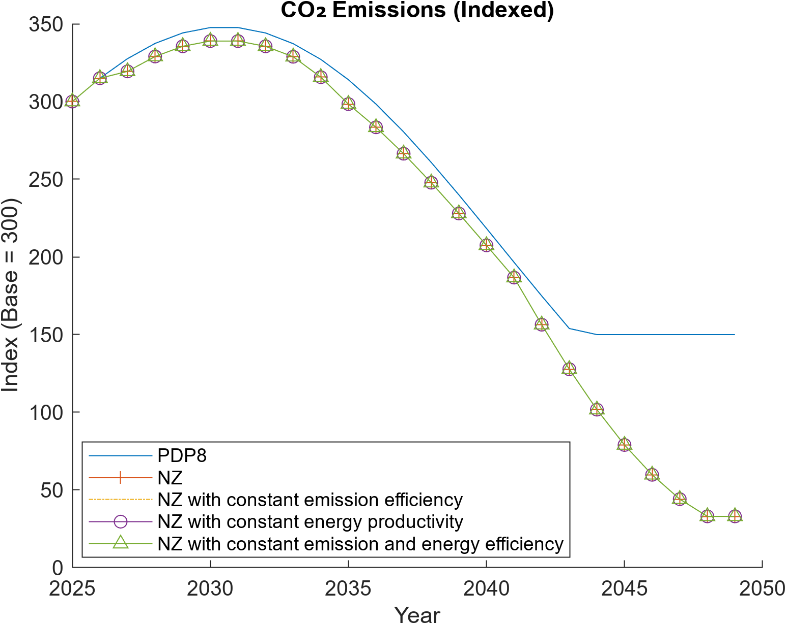
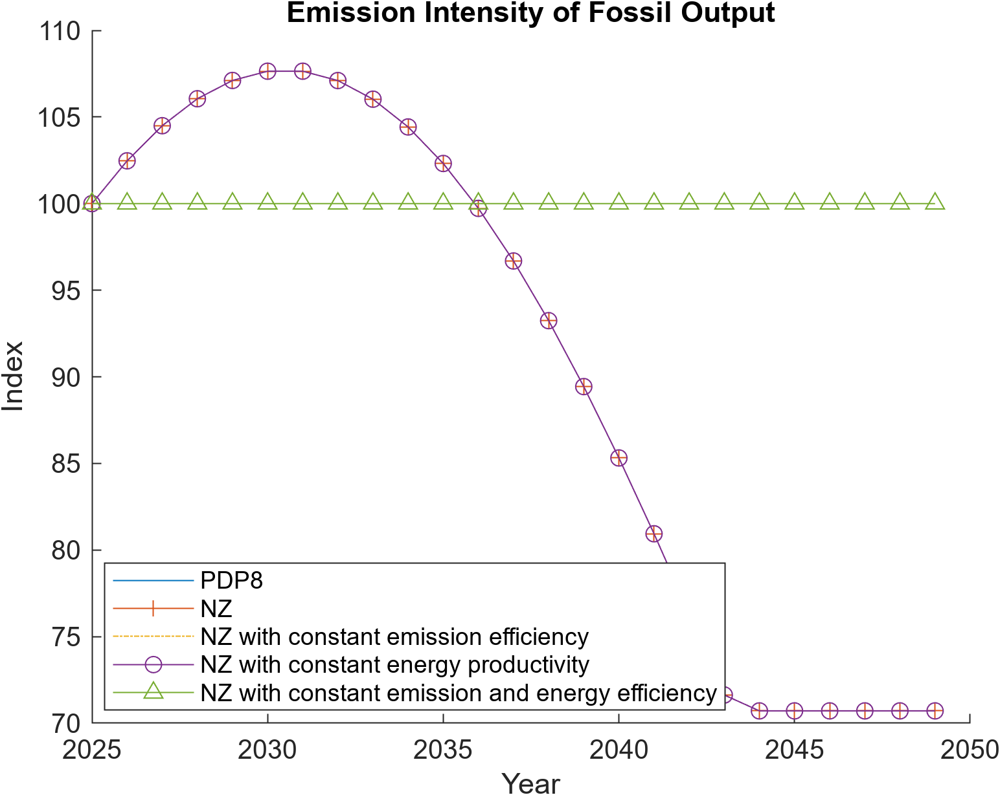
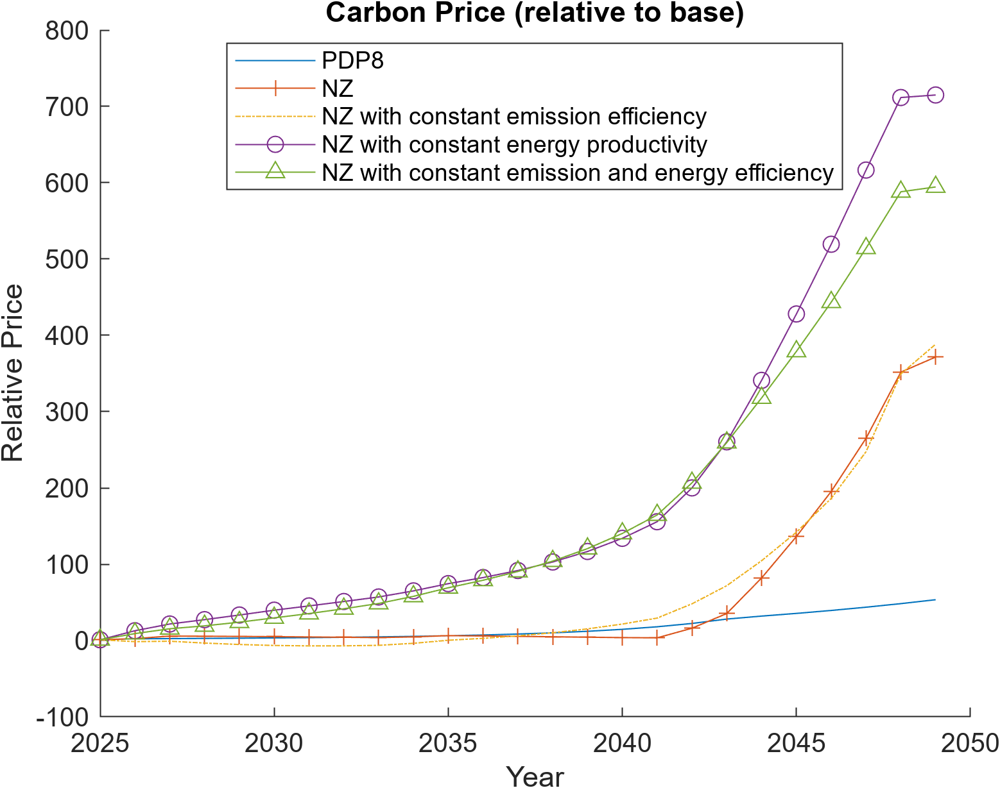
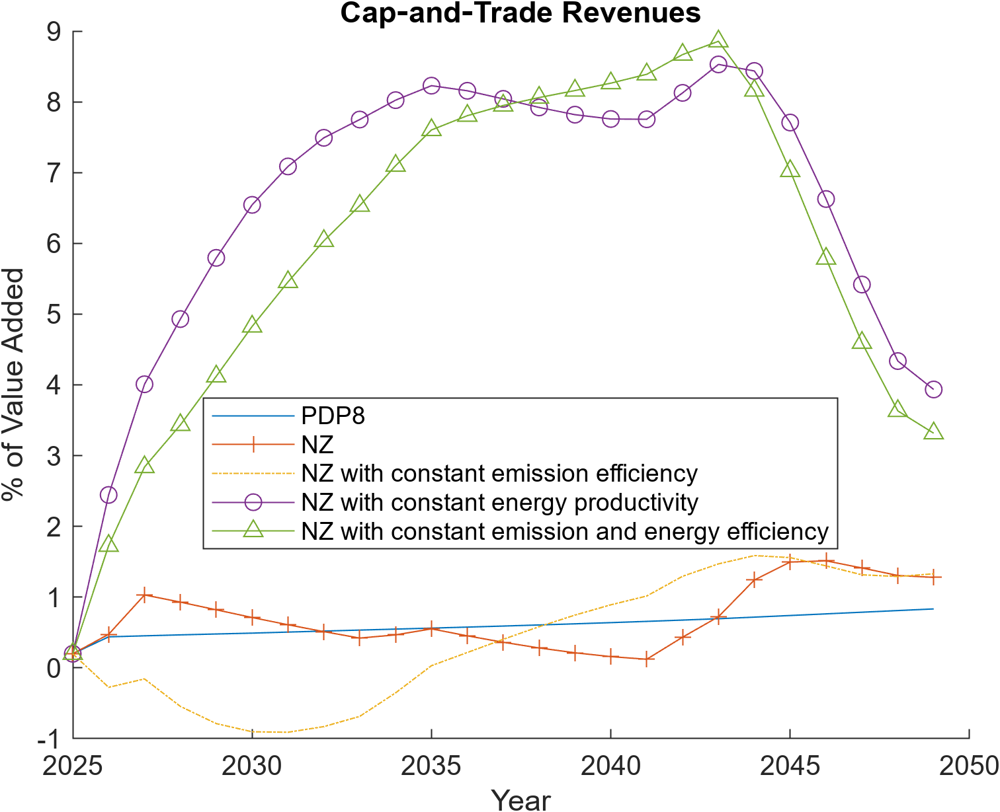

# Scenario Design and Implementation

This document describes the design, implementation, and interpretation of the policy scenarios simulated with the **DGE-METRIC / DGE-CRED** model. The scenarios are constructed to isolate the macroeconomic and sectoral roles of energy transition drivers such as carbon pricing, energy efficiency, and emission intensity improvements.

All scenarios are simulated over a medium-term horizon (25 years) and are solved as deterministic transition paths from a common baseline calibration.

---
## 📘 Documentation Overview

- **Project overview:** [Home](index.md)
- **Model structure & equations:** [Model documentation](model.md)
- **Scenario design & assumptions:** [Scenarios](scenario.md)
- **Calibration & data sources:** [Calibration](calibration.md)
- **How to run the model:** [Running the model](running.md)

## Overview of Scenario Logic

The scenario set follows a **nested counterfactual design**:

1. Start from a **policy-consistent baseline** aligned with current planning assumptions.
2. Introduce a **Net-Zero (NZ)** transition via carbon pricing and structural change.
3. Sequentially **shut down individual adjustment channels** (energy efficiency, emission intensity) to identify their contribution to aggregate outcomes.

This design allows a transparent decomposition of emissions reductions, investment dynamics, and macroeconomic adjustment mechanisms.

---

## Scenario Set

The following scenarios are implemented and compared:

### 1. Baseline (PDP8)

- Represents a continuation of current energy and climate policies.
- No binding net-zero constraint.
- Carbon prices remain low and do not induce strong structural change.
- Energy efficiency and emission intensity follow exogenous baseline trends.

This scenario serves as the reference path for all indexed comparisons.

---

### 2. Net-Zero (NZ)

- Imposes a binding long-run emissions reduction consistent with net-zero targets.
- Achieved through an **economy-wide emissions trading system (ETS)**.
- Endogenous carbon prices rise to ensure compliance with the emissions path.
- Firms and households adjust via:
  - reduced fossil energy use,
  - higher renewable investment,
  - improvements in energy efficiency,
  - changes in sectoral composition.

This scenario captures the full adjustment potential of the economy.

---

### 3. NZ with Constant Emission Efficiency (`NZ_constInt`)

- Identical to the NZ scenario, **except**:
  - emission intensity of fossil energy is held constant over time.
- No endogenous improvement in emission coefficients (e.g. fuel switching within fossil technologies).

Purpose:
- Isolate the role of **emission-intensity reductions** in achieving emissions targets.
- Forces stronger reliance on activity reduction, energy substitution, and carbon prices.

---

### 4. NZ with Constant Energy Productivity (`NZ_constEE`)

- Identical to the NZ scenario, **except**:
  - economy-wide energy efficiency is fixed at its base-year level.
- No endogenous reduction in energy demand per unit of output.

Purpose:
- Quantify the contribution of **energy efficiency gains** to macroeconomic adjustment.
- Leads to higher energy demand, stronger price responses, and higher transition costs.

---

### 5. NZ with Constant Energy and Emission Efficiency (`NZ_constEEInt`)

- Combines the restrictions of scenarios 3 and 4:
  - no improvement in energy efficiency,
  - no improvement in emission intensity.
- Emissions targets must be met almost exclusively via:
  - carbon pricing,
  - sectoral reallocation,
  - reduced fossil output,
  - accelerated renewable deployment.

Purpose:
- Represents a **worst-case transition** with limited technological learning.
- Provides an upper bound on carbon prices and adjustment costs.

---

## Implementation Details

### Scenario Switching

Scenarios are implemented by modifying:
- paths of exogenous efficiency parameters,
- constraints on emission coefficients,
- ETS policy rules.

Each scenario is solved from the same initial steady state to ensure comparability.

---

### Output Handling

- Model results are written to scenario-specific CSV files.
- A common plotting script reads these files and produces indexed or percentage-based comparisons.
- Key indicators include:
  - CO₂ emissions,
  - carbon prices and ETS revenues,
  - GDP growth,
  - energy productivity and efficiency,
  - investment and capital stocks by sector,
  - employment and value-added shares.

All figures shown in the *SimulationResults* document are generated from this common output structure.

---

## Interpretation Strategy

Comparisons across scenarios allow the following insights:

- Differences between **Baseline and NZ** quantify the overall cost and structure of the energy transition.
- Differences between **NZ and constrained NZ variants** isolate:
  - the role of energy efficiency,
  - the role of emission-intensity improvements.
- The most constrained scenario highlights risks associated with delayed innovation or policy bottlenecks.

This layered design supports policy-relevant statements on:
- investment needs,
- carbon price trajectories,
- sectoral employment shifts,
- fiscal implications via ETS revenues.

---

## Emissions and Carbon Markets

**Interpretation.**  
These figures illustrate how emissions decline under Net Zero scenarios, the implied carbon price trajectory, and the resulting ETS revenues as a share of value added.

---

## Reproducibility

To reproduce the scenarios:
1. Run the model for each scenario configuration.
2. Export results to CSV format.
3. Execute the scenario comparison script to generate plots.

All scenario assumptions are documented in the calibration and scenario input files.
